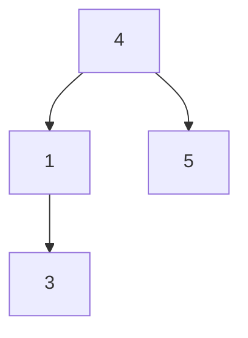
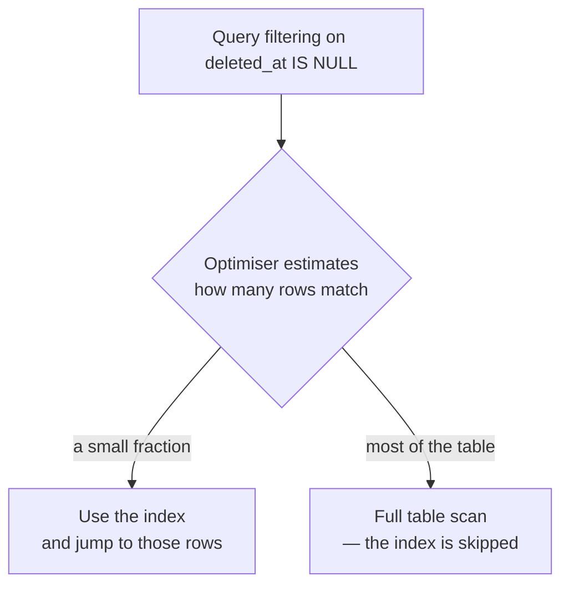

Soft delete works. Every read now carries `WHERE deleted_at IS NULL`, and that condition is on every query the application will ever run. This note is what that costs, and it ends somewhere unexpected.

# Every query grew a condition

Fetching available products is no longer a plain select:

```sql
1  SELECT * FROM products WHERE deleted_at IS NULL
```

And a query that already had conditions gains one more:

```sql
1  SELECT * FROM products
2  WHERE deleted_at IS NULL AND price > 10000
```

> [!important] **`deleted_at IS NULL` is attached to every read, forever.** Not most reads — all of them, on every soft-deleted table, for the life of the system.

Whether that is expensive depends on something that has not been examined yet: what a database actually does to answer a query.

# Searching, without help

Ask a database for rows matching a condition, and with nothing else in place it has exactly one strategy.

> [!important] A **full table scan**, also called a sequential scan, is the database reading **every single row** from beginning to end, testing each one against the condition, keeping the matches and discarding the rest.


That is linear search. The brute force approach — go to every record, ask whether it satisfies the condition, move on.

> [!important] A full table scan is **O(n)**: the work grows in direct proportion to the number of rows. A table with a million rows costs a million checks, every time the query runs.

# Buying speed with space

Searching an unordered collection is O(n) because there is no structure to exploit. The general fix is to build structure alongside it.

Take an array in no particular order:

```text
 5, 4, 1, 3
```

Searching it for an element means checking each in turn — O(n), because nothing about the arrangement helps.

Now build a **balanced binary search tree** from the same values and keep it up to date. Add 10 to the array, add 10 to the tree.



Searching the tree instead of the array is **O(log n)**, because every comparison discards half of what remains.

> [!important] This is the **space-time trade-off**: spend memory to save time, or spend time to save memory. The tree is pure duplication — every value is already in the array — and it exists solely so searches stop being linear.

## What log n actually buys

The trade sounds abstract until it is counted.

| Rows | O(n) checks | O(log n) checks |
|---|---|---|
| 10³ — a thousand | ~1,000 | **~10** |
| 10⁶ — a million | ~1,000,000 | **~20** |
| 10⁹ — a billion | ~1,000,000,000 | **~30** |

> [!important] Read the last row. A billion rows, and the difference is **a billion operations against thirty**. Not a percentage improvement — a different category of thing. And the cost of the improvement is that the extra structure must be stored and kept in step with every write.

> [!info] The structure is chosen for the query. A balanced binary search tree suits does-this-value-exist. A **segment tree** suits range queries. What you build depends on what you intend to ask.

# Which is what an index is

> [!important] An **index** is that extra data structure, inside the database. It holds the same data arranged for fast lookup, and the database consults it instead of scanning the table.

Nothing new is being introduced here. An index is the array-plus-tree idea, applied to a column.

> [!info] The usual structure is a **B+ tree** — a many-way tree designed for data on disk rather than in memory, giving logarithmic search like a balanced binary search tree. **Hash indexes** exist too, and suit exact-match lookups rather than ranges. Which kind a database builds depends on the query shapes it expects.

So the answer to a slow query is normally to index the column it filters on:

```sql
1  SELECT * FROM products WHERE price > 10000
```

Index `price`, and this stops being a full table scan.

**Which appears to solve the soft delete problem too.** Index `deleted_at` and every one of those appended conditions becomes cheap.

Not quite.

# Where nulls break it

The condition being added everywhere is not `deleted_at = something`. It is `deleted_at IS NULL` — and null has a difficult history in indexes.

## Some databases would not index them at all

> [!warning] **Older versions of Oracle did not store null values in indexes.** A query filtering on `IS NULL` could not use the index, because the rows it wanted were the ones the index had left out — so the database fell back to a full table scan regardless.

Newer PostgreSQL and MySQL do support index lookups involving nulls, so this specific failure is largely historical. The second problem is not.

## The optimiser may decline to use it

> [!important] A **query optimiser** is the part of a database that decides how to run a query — which index to use, or whether to use one at all. It estimates the cost of each plan and picks the cheapest.

Using an index is two steps: search the index, then jump to the actual rows it points at. Those jumps are not free.

**When few rows match, the index wins easily.** If 2% of rows have `deleted_at IS NULL`, the index finds those few and fetches them — far cheaper than reading everything.

**When most rows match, it loses.** If 80% of rows are null, the index returns 80% of the table, and the database then makes that many separate jumps to fetch them.

> [!important] At that point the optimiser concludes that **scanning the table straight through is cheaper than using the index**, and does exactly that. The index exists, is perfectly valid, and is ignored.



And a healthy soft-deleted table is exactly the bad case. **Most rows are live, so most rows are null**, which is the condition under which the index gets abandoned.

> [!important] So the shape of the problem is this. **A column that is null for almost every row is a poor thing to index**, and soft delete makes such a column mandatory on every query. The design that saved your history quietly made every read harder to optimise.

# What the fix looks like

The problem is not indexes. It is indexing the wrong thing.

> [!important] A **partial index**, also called a filtered index, is built over **only the rows matching a condition** rather than the whole table. Building one over just the live rows produces a much smaller index containing exactly the rows queries actually want — and the whole-table scan stops being the cheaper plan.

That mechanism is where this goes next, once there are indexes to create.

# What to take from this

Three things, and the third is the general one.

**Soft delete is still right.** Losing history is a worse problem than a slow query, and the slow query is fixable.

**A design decision in the schema became a performance decision in the query planner.** Adding `deleted_at` looked like a modelling choice. Its real consequence appeared two layers away, in how a database chooses to execute reads.

> [!important] **Knowing the mechanism is what makes the consequence predictable.** Nothing about `@SQLRestriction` hints that it interacts with index selectivity. You only see it coming if you know what an index is, and why an optimiser would decline to use one.
