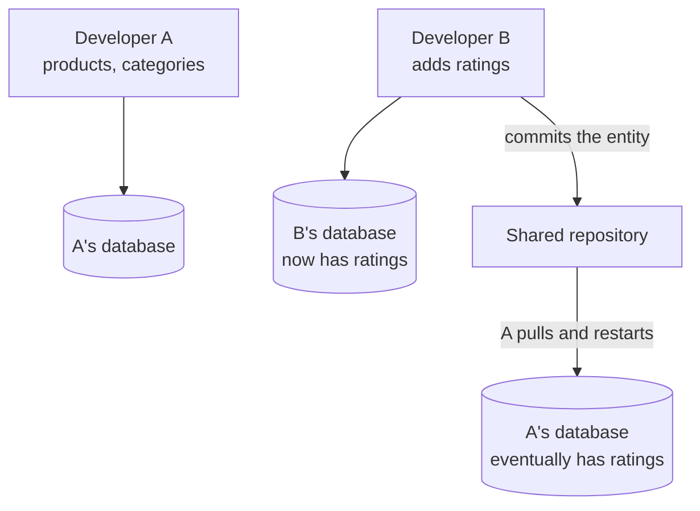
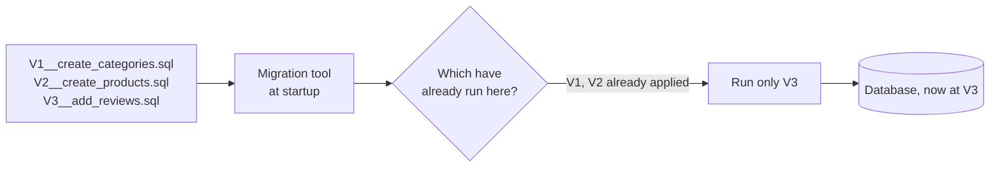

Twice now a schema change has been unresolvable by `ddl-auto`, and both times the escape was dropping the database. That is not a limitation to work around — it is a sign that the wrong thing is in charge of the schema.

# A strict schema is the starting point

A relational database will not accept a row that does not fit its table.

> [!important] In MySQL or PostgreSQL you **cannot** insert a record carrying a column the table does not have. This is unlike a document store, where a document can hold whatever fields it likes. The table's definition is enforced on every write.

Which means a schema change is a real event with a before and an after. Records written before the change follow the old shape; records written after it follow the new one. **Changing a schema is not like changing code** — the change has to be applied to something that already exists and already holds data.

# Where `ddl-auto` stops working

So far the schema has been a side effect. Edit an entity, restart, and Hibernate reconciles the database to match. On one machine, that is convenient. Add a second person and it stops being.

## Two people, two branches

You are working on a branch with `products` and `categories`. Someone else adds a `ratings` table on theirs, restarts, and `ddl-auto: update` creates it on their machine.

That does work. A pulls, restarts, and `ddl-auto` creates the table. The problems start when there are more than two of you.

## Nobody can tell what changed the database

> [!important] The schema change is **a side effect of a Java class edit**. Nothing records that the database changed, when, or why. Looking at a column and asking who added this has no answer except reading every commit that touched that entity.

Worse for a column that was added and later removed — the current entity shows no trace of it having existed at all.

## Some things cannot be expressed as entities

> [!warning] `ddl-auto` can only create what your classes describe. **Views, stored procedures, seed data, and tables deliberately outside the object model have no representation in an entity**, so there is no way for them to reach anyone else's database.

If one person creates a view by hand, everybody else has to be told, in words, to create it too.

## Deployment has no defined step

The same question at deployment time is worse. If the schema is whatever the application decides on startup, then **deploying is also a schema change**, performed automatically, against production, with no review and no record.

That is the arrangement that makes `create` catastrophic and `update` merely dangerous.

# Migrations

The fix is to stop deriving the schema and start stating it.

> [!important] A **migration script** is a file containing DDL — `CREATE TABLE`, `ALTER TABLE`, `DROP TABLE`. It lives in your repository beside the code, and is committed, reviewed and versioned like any other file.

The scripts are numbered, so they form an ordered sequence. A tool applies them in order and **records which have already run**, so on any database it applies exactly the ones missing and nothing else.

Clone the repository on a machine with an empty database and all three run. Pull one new migration onto a machine already at V2 and only that one runs. **Every database ends up at the same version by the same route.**

# What this buys

**The change becomes reviewable.** `ALTER TABLE categories ADD COLUMN description TEXT` is a line in a diff, discussed in a pull request like anything else. Compare against noticing that an entity gained a field.

**The history is explicit.** Adding a column and later removing it leaves two files, in order, each saying what it did. There is no reconstructing intent from a class that no longer mentions it.

**Anything expressible as SQL is now shareable.** Views, stored procedures, seed data, an index — none of these fit in an entity, and all of them fit in a migration.

**Deployment gets a defined step.** Migrations run as a known part of the pipeline, in a known order, rather than as a side effect of the application starting.

> [!important] **A migration is version control for schema.** The same reason code lives in a repository — knowing what changed, when, by whom, and being able to go back — applies to the database, and `ddl-auto` provides none of it.

## Rolling back

Because the steps are ordered and explicit, they can be reversed. A change that breaks production — a foreign key constraint that rejects existing rows, say — can be undone by applying the inverse, the way a bad commit is reverted.

> [!info] Rolling back a schema is genuinely harder than rolling back code, because data may have been written under the new shape in the meantime. Migrations do not make that problem disappear; they make it **addressable**, by giving you a known previous state to aim at.

# The idea is not Java-specific

Migrations appear anywhere a relational database meets a team.

| Ecosystem | |
|---|---|
| Ruby on Rails | Migrations, built into the framework |
| Node.js | Knex, Sequelize and others |
| Go | golang-migrate, goose |
| Java and Spring | **Flyway**, Liquibase |

The mechanism is the same everywhere: ordered scripts, a record of what has been applied, and the database's structure treated as something you write rather than something you infer.

# What it costs

Being honest about the trade, because it is not free.

> [!warning] **You now write the DDL yourself.** With `ddl-auto` the schema followed the classes automatically. With migrations, adding a field means editing the entity **and** writing the `ALTER TABLE`, and the two can disagree.

Which sounds like pure extra work until you notice it is the same trade as static typing: more to write, and a whole category of mistake becomes impossible to make silently. And the disagreement can be caught — which is what `ddl-auto: validate` is for.
