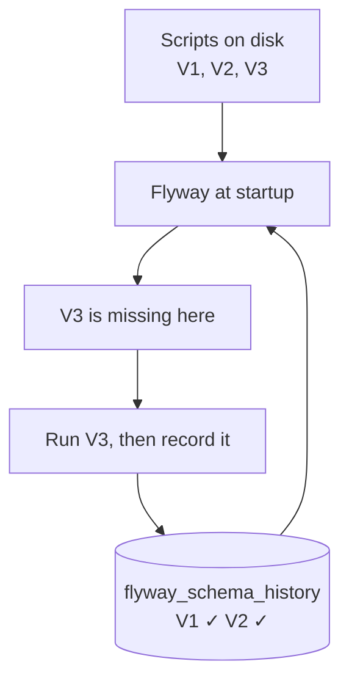

Migrations are ordered scripts plus a record of what has run. Flyway is the tool that provides both, and wiring it in is mostly a matter of handing over a responsibility Hibernate currently holds.

# The dependencies

```groovy
1  // build.gradle
2  dependencies {
3      implementation 'org.springframework.boot:spring-boot-starter-flyway'
4      implementation 'org.flywaydb:flyway-mysql'
5  }
```

**Line 4 is the database driver.** Flyway supports MySQL, PostgreSQL, SQLite and many others, and needs to know how to speak to yours. Whichever database you use, add its matching Flyway module.

**Line 3 is the one that will cost you an evening if you get it wrong.**

> [!warning] **On Spring Boot 4, `flyway-core` alone is silently ignored.** Add only `org.flywaydb:flyway-core` and the application starts, no error appears, no migration runs, and no table is created. Nothing announces that Flyway is not participating.
>
> Spring Boot 4 split the single auto-configuration jar into per-feature modules. Under Spring Boot 3, having the Flyway jar on the classpath was enough to trigger auto-configuration; under 4, **the auto-configuration lives in its own module that the starter brings in.** Without the starter, the jar is present and nothing wires it up.

That change is recent enough that most articles, tutorials and answers still say `flyway-core`. They were correct when written.

> [!info] The symptom is not an error but an absence — the application fails somewhere later, complaining about a missing table, and the real cause is that the tool responsible for creating it never ran. **If Flyway appears to do nothing at all, check the dependency before checking anything else.**

# Handing over the schema

```yaml
1  # src/main/resources/application.yml
2  spring:
3    datasource:
4      url: jdbc:mysql://localhost:3306/fakecommerce
5      username: root
6      password: ''
7      driver-class-name: com.mysql.cj.jdbc.Driver
8    jpa:
9      show-sql: true
10     hibernate:
11       ddl-auto: validate
12   flyway:
13     enabled: true
14     locations: classpath:db/migration
```

**Line 11 is the handover.** `ddl-auto` was `update`; now it is `validate`.

> [!important] **`validate` means Hibernate stops writing the schema and starts checking it.** It compares the entities against the tables at startup and refuses to start if they disagree — but it changes nothing. Editing an entity no longer alters the database. Structure is Flyway's job now.

**Lines 12 to 14 turn Flyway on** and say where the scripts live. `classpath:db/migration` resolves to `src/main/resources/db/migration`.

> [!warning] **The path is matched exactly.** A folder named `migrations` will not be found by a configuration pointing at `migration`, and the failure is silent in the same way as the wrong dependency — Flyway finds no scripts, runs nothing, and says nothing.

> [!info] Flyway reuses the `spring.datasource` settings to connect, so there is no second set of credentials to configure.

# Naming a migration

```text
V1__init_schema.sql
│ │  │
│ │  └── description, free text, underscores for spaces
│ └───── two underscores, mandatory
└─────── V for versioned, then the version number
```

> [!important] The structure is **prefix, version, separator, description, suffix**. `V` marks a versioned migration, the number sets the order, and **the separator is two underscores** — one will not do. The description is for humans and does not affect anything.

Versions sort numerically, so `V1`, `V2`, `V3` run in that order regardless of how the files are listed.

# The first migration

```sql
1  -- src/main/resources/db/migration/V1__init_schema.sql
2  CREATE TABLE IF NOT EXISTS categories (
3      id BIGINT NOT NULL AUTO_INCREMENT,
4      name VARCHAR(255) NOT NULL,
5      created_at DATETIME(6) NOT NULL,
6      updated_at DATETIME(6),
7      deleted_at DATETIME(6),
8      PRIMARY KEY (id)
9  );
10
11 CREATE TABLE IF NOT EXISTS products (
12     id BIGINT NOT NULL AUTO_INCREMENT,
13     title VARCHAR(255) NOT NULL,
14     description TEXT,
15     price DECIMAL(38, 2) NOT NULL,
16     category_id BIGINT NOT NULL,
17     image VARCHAR(255),
18     rating VARCHAR(255),
19     created_at DATETIME(6) NOT NULL,
20     updated_at DATETIME(6),
21     deleted_at DATETIME(6),
22     PRIMARY KEY (id),
23     CONSTRAINT fk_product_category FOREIGN KEY (category_id) REFERENCES categories (id)
24 );
25
26 CREATE TABLE IF NOT EXISTS orders (
27     id BIGINT NOT NULL AUTO_INCREMENT,
28     status SMALLINT,
29     created_at DATETIME(6) NOT NULL,
30     updated_at DATETIME(6),
31     deleted_at DATETIME(6),
32     PRIMARY KEY (id)
33 );
34
35 CREATE TABLE IF NOT EXISTS order_products (
36     id BIGINT NOT NULL AUTO_INCREMENT,
37     order_id BIGINT NOT NULL,
38     product_id BIGINT NOT NULL,
39     quantity INT NOT NULL,
40     created_at DATETIME(6) NOT NULL,
41     updated_at DATETIME(6),
42     deleted_at DATETIME(6),
43     PRIMARY KEY (id),
44     CONSTRAINT fk_order_product FOREIGN KEY (order_id) REFERENCES orders (id),
45     CONSTRAINT fk_product_order FOREIGN KEY (product_id) REFERENCES products (id)
46 );
```

Several things are worth reading here, because this is what was previously being generated for you.

**Order matters.** `categories` is created before `products`, because line 23 references it. A foreign key cannot point at a table that does not exist yet.

**`IF NOT EXISTS` on every statement.** A safety net, so a partially-applied state does not fail on the second run.

**The audit and soft-delete columns are written out.** `created_at`, `updated_at` and `deleted_at` appear on all four tables. Previously they arrived automatically from `BaseEntity`; now they are explicit, and forgetting one is possible.

**Foreign keys are named.** `fk_product_category` rather than the `FKog2rp4qthbtt2lfyhfo32lsw9` that Hibernate generated. A constraint violation now reports a name that means something.

> [!info] **One table per script is the usual convention**, so each version does one thing and can be reasoned about alone. Four tables in `V1` is a reasonable exception for an initial schema being brought under Flyway's control in one go.

# The schema history table

On its first run, Flyway creates a table of its own.

> [!important] **`flyway_schema_history` records every migration that has been applied** — its version, description, the script name, when it ran, how long it took, whether it succeeded, and **a checksum of the file's contents**.

That table is the whole mechanism. It is how Flyway knows, on any database, which scripts are already applied and which are outstanding.



## The checksum rule

> [!warning] **Editing a migration that has already been applied breaks the build.** The checksum recorded when it ran no longer matches the file, and Flyway refuses to continue.

That is deliberate, and it is the rule people fight before they understand it. If you could edit `V1` after it had run on ten machines, those ten databases would be in a state no file describes any more — and a fresh clone would build something different from all of them.

> [!important] **An applied migration is history. Change the schema by adding a migration, never by editing one.** The only exception is a script that has not yet run anywhere but your own machine.

# The change `ddl-auto` could not make

`V1` created `rating` as `VARCHAR(255)`, matching the entity, which held a `String`. A rating should be a number.

```sql
1  -- src/main/resources/db/migration/V2__update_rating_to_decimal.sql
2  ALTER TABLE products MODIFY COLUMN rating DECIMAL(3, 1) NOT NULL;
```

And the entity changes to match:

```java
1  // src/main/java/com/example/FakeCommerce/schema/Product.java
2  @Column(nullable = false)
3  private BigDecimal rating;
```

> [!important] **This is exactly the class of change that forced a database drop twice before.** `ddl-auto: update` only adds — it creates missing tables and missing columns. It will not change an existing column's type, because doing so safely means deciding what happens to the data already in it, and nothing about comparing classes to tables answers that.

One reviewed line does it, in order, once, recorded.

> [!info] `DECIMAL(3, 1)` is three significant digits with one after the point — `0.0` to `99.9`, which covers a five-point rating scale exactly. Picking the precision is a decision the migration lets you make and `ddl-auto` never would have asked about.

# What running it looks like

With an empty database and the configuration above:

```text
1  Flyway Community Edition by Redgate
2  Database: jdbc:mysql://localhost:3306/fakecommerce (MySQL 9.5)
3  Successfully validated 2 migrations
4  Creating Schema History table `fakecommerce`.`flyway_schema_history`
5  Current version of schema `fakecommerce`: << Empty Schema >>
6  Migrating schema `fakecommerce` to version "1 - init schema"
7  Migrating schema `fakecommerce` to version "2 - update rating to decimal"
8  Successfully applied 2 migrations
```

**Line 4** is the history table being created on first use. **Lines 6 and 7** apply the two scripts in version order. Restart with no new scripts and Flyway reports the schema is up to date and does nothing.

> [!info] **Verified** against MySQL 9.5 with `spring-boot-starter-flyway` on Spring Boot 4.
