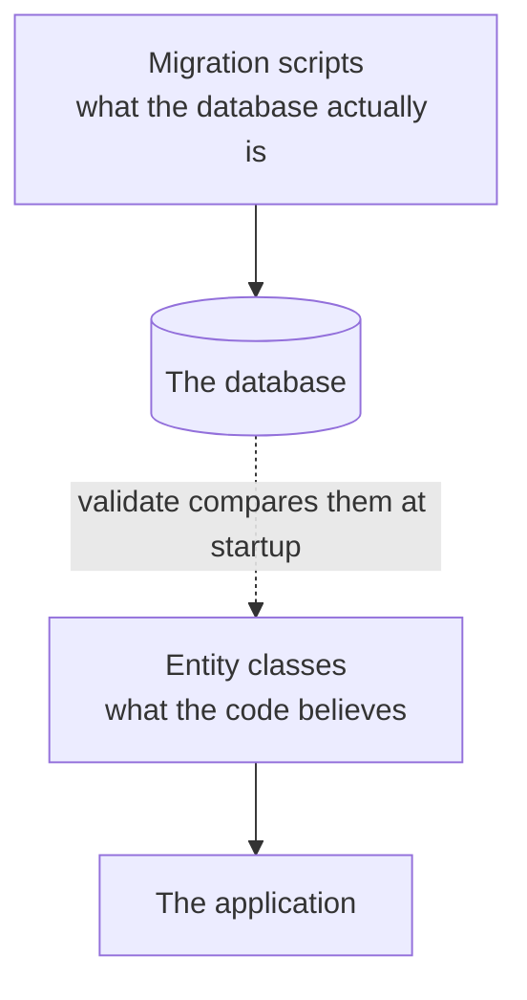
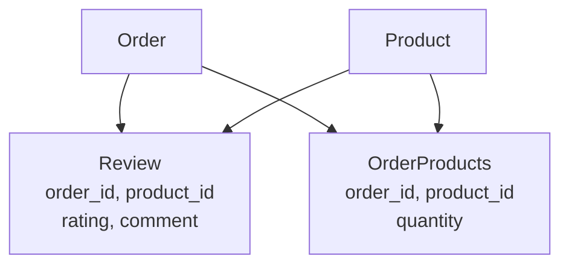

Flyway owns the schema and `ddl-auto` is set to `validate`. That setting has been described as the production-safe one for several notes now, without ever being seen doing anything. Handing the schema to Flyway is what finally makes it earn its place.

# The gap it exists to close

There are now two descriptions of the same tables.



**Nothing keeps those in step automatically.** Write a migration adding a column and forget the field, or add a field and forget the migration, and the two drift apart. Under `ddl-auto: update` this could not happen, because the classes were the only description and the database was derived from them. That safety came at the cost of everything in the previous two notes.

> [!important] **`validate` is what buys the safety back.** At startup it compares every entity against the real tables and **refuses to start** if they disagree. It changes nothing — it only reports.

# Two failures, immediately

Starting the application after the migrations ran did not work, twice, and both were real drift.

## The first

```text
1  Schema-validation: wrong column type encountered in column [name] in table [categories]
2      found [varchar (Types#VARCHAR)], but expecting [varchar (Types#VARCHAR)] to be not-null
```

The migration wrote:

```sql
1  name VARCHAR(255) NOT NULL
```

The entity said:

```java
1  private String name;
```

**A bare field is nullable.** The SQL says the column cannot be null; the entity does not say so, and the two descriptions disagree.

The fix is to make the entity tell the truth:

```java
1  // src/main/java/com/example/FakeCommerce/schema/Category.java
2  @Column(nullable = false)
3  private String name;
```

## The second

Same shape, different table:

```java
1  // src/main/java/com/example/FakeCommerce/schema/OrderProducts.java
2  @Column(nullable = false)
3  private Integer quantity;
```

`V1` declared `quantity INT NOT NULL`. The entity had a plain `Integer`.

> [!info] **Verified.** Both failures were genuine disagreements between the migration and the entity, and the application started only once both were corrected. Neither would have been noticed under `ddl-auto: update`, because the classes would simply have produced nullable columns and nothing would have objected.

# Why failing at startup is the point

Both of these are small. That is what makes them dangerous.

> [!important] A nullable field mapped to a `NOT NULL` column does not break at startup under a permissive setting — it breaks **on the first insert that omits it**, in production, as a constraint violation from the database. The disagreement is real from the moment it is introduced and stays invisible until data happens to expose it.

`validate` moves that discovery from an unpredictable moment under load to the same second every time.

> [!important] **A failure at startup is the cheapest possible failure.** Nothing has been served, no data has been written, and the deployment can be rolled back. The same defect discovered at 3am under traffic costs incomparably more.

# What each setting does now

| | Writes schema | Detects drift |
|---|---|---|
| `update` | Yes | **No** — it silently makes the database match |
| `none` | No | **No** — anything goes |
| **`validate`** | **No** | **Yes, at startup** |

> [!important] **`validate` plus migrations is the production arrangement**, and this is the note where it stops being an assertion. Migrations make the structural change deliberately and in a reviewable order; `validate` confirms the code and the database agree before a single request is served.

# A migration end to end

The reviews table is a complete example, and it shows the order the two files have to be written in.

## The migration first

```sql
1  -- src/main/resources/db/migration/V3__add_reviews_table.sql
2  CREATE TABLE IF NOT EXISTS reviews (
3      id BIGINT NOT NULL AUTO_INCREMENT,
4      product_id BIGINT NOT NULL,
5      order_id BIGINT NOT NULL,
6      rating DECIMAL(3, 1) NOT NULL,
7      comment TEXT,
8      created_at DATETIME(6) NOT NULL,
9      updated_at DATETIME(6),
10     deleted_at DATETIME(6),
11     PRIMARY KEY (id),
12     CONSTRAINT fk_review_product FOREIGN KEY (product_id) REFERENCES products (id),
13     CONSTRAINT fk_review_order FOREIGN KEY (order_id) REFERENCES orders (id)
14 );
```

**A review is tied to an order, not just a product.** Lines 4 and 5 are both `NOT NULL`, which encodes a business rule in the schema: you may only review a product you actually ordered. Without the order reference, anyone could review anything.

**`rating` is `DECIMAL(3, 1)`**, matching what `V2` changed products to. **`comment` is nullable**, because a rating on its own is a legitimate review.

## Then the entity

```java
1  // src/main/java/com/example/FakeCommerce/schema/Review.java
2  @Data
3  @AllArgsConstructor
4  @NoArgsConstructor
5  @Builder
6  @Entity
7  @Table(name = "reviews")
8  @SQLDelete(sql = "UPDATE reviews SET deleted_at = CURRENT_TIMESTAMP WHERE id = ?")
9  @SQLRestriction("deleted_at IS NULL")
10 public class Review extends BaseEntity {
11
12     private String comment;
13
14     @ManyToOne(fetch = FetchType.LAZY)
15     @JoinColumn(name = "order_id", nullable = false)
16     private Order order;
17
18     @ManyToOne(fetch = FetchType.LAZY)
19     @JoinColumn(name = "product_id", nullable = false)
20     private Product product;
21
22     @Column(nullable = false)
23     private BigDecimal rating;
24 }
```

Every part of this has appeared before. **Lines 8 and 9** are the soft-delete pair, repeated per entity as they must be. **Lines 14 to 20** are two lazy `@ManyToOne` mappings. **Line 22** declares the not-null that `validate` would otherwise reject.

> [!important] **The order is not optional. Migration first, entity second.** The migration is what actually changes the database; the entity is the code's description of the result. Writing the entity first and restarting achieves nothing under `validate` except a failure.

## Reviews is a through table

Worth noticing what this table actually is.



`Review` holds a foreign key to an order and a foreign key to a product, with columns of its own. **That is exactly the shape of `OrderProducts`** — a join table between the same two entities, carrying different facts about the pairing.

> [!important] Products and orders are already in a many-to-many relationship, and **a many-to-many can have more than one through table.** `OrderProducts` records what was bought and how many. `Review` records what the buyer thought of it. Both describe the same pairing and neither belongs on the other, because a line in an order and an opinion about it are different things with different lifetimes.

Which is why the two `@ManyToOne` mappings on `Review` are identical to the ones on `OrderProducts`. The relationship is the same; only the extra columns differ.

# Running it

```text
1  Migrating schema `fakecommerce` to version "3 - add reviews table"
2  Successfully applied 1 migration
```

```text
1  describe reviews;
2  Field       Type           Null  Key  Extra
3  id          bigint         NO    PRI  auto_increment
4  product_id  bigint         NO    MUL
5  order_id    bigint         NO    MUL
6  rating      decimal(3,1)   NO
7  comment     text           YES
8  created_at  datetime(6)    NO
9  updated_at  datetime(6)    YES
10 deleted_at  datetime(6)    YES
```

> [!info] **Verified.** One migration applied, the table matches the script exactly, and the application started — which under `validate` is itself the confirmation that the entity and the table agree.

The startup succeeding is the whole signal. **Under `validate`, a clean start is a proof**, not merely an absence of errors.
