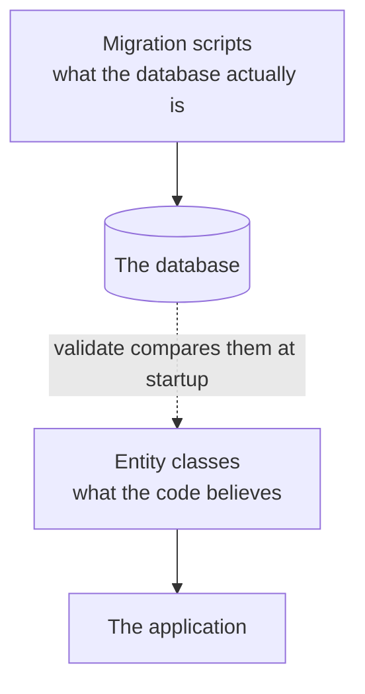
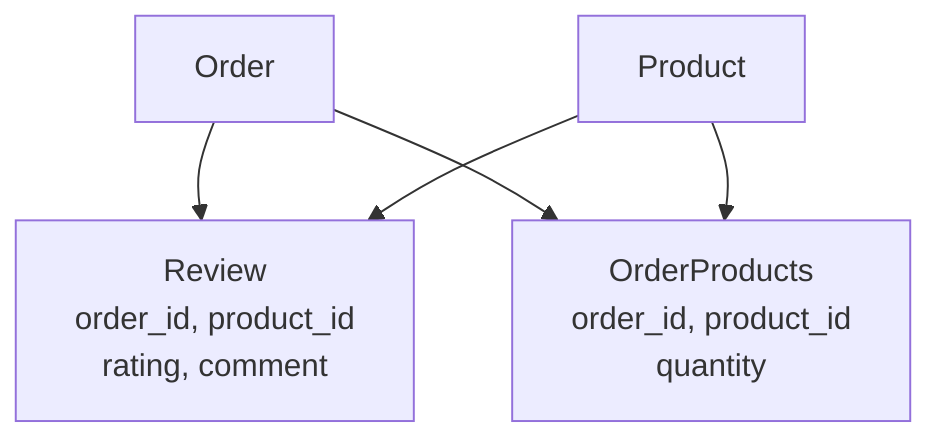
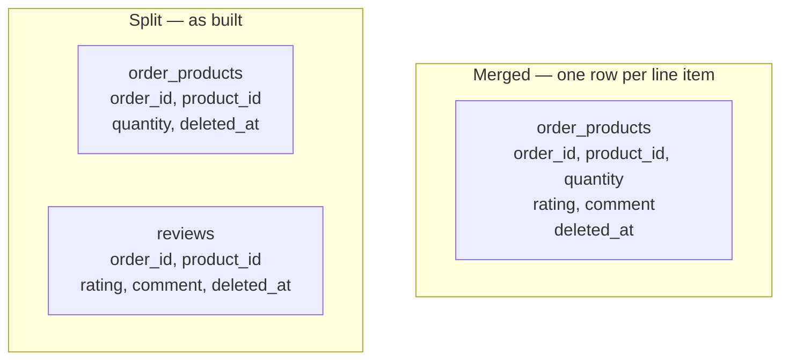
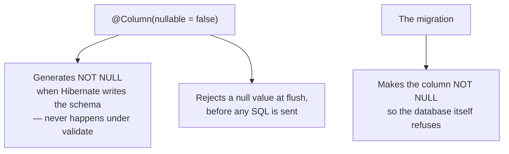

Flyway owns the schema and `ddl-auto` is set to `validate`. That setting has been described as the production-safe one for several notes now, without ever being seen doing anything. Handing the schema to Flyway is what finally makes it earn its place.

# The gap it exists to close

There are now two descriptions of the same tables.



**Nothing keeps those in step automatically.** Write a migration adding a column and forget the field, or add a field and forget the migration, and the two drift apart. Under `ddl-auto: update` this could not happen, **because the classes were the only description and the database was derived from them.** That safety came at the cost of everything in the previous two notes.

> [!important] **`validate` is what buys the safety back.** At startup it compares every entity against the real tables and **refuses to start** if they disagree. It changes nothing — it only reports.

# The order this happens in

Which raises a question the setting alone does not answer: if Flyway creates the tables and Hibernate checks them, what stops Hibernate checking before Flyway has built anything?

> [!important] **Flyway runs first, and finishes, before Hibernate starts.** Spring Boot makes the entity manager depend on the Flyway initializer, so the migrations are fully applied before a single entity is looked at.

The startup log shows it plainly:

```log
  12:28:25.397  o.f.core.internal.command.DbMigrate  : Current version of schema `lab`: << Empty Schema >>
  12:28:25.406  o.f.core.internal.command.DbMigrate  : Migrating schema `lab` to version "1 - create products table"
  12:28:25.442  o.f.core.internal.command.DbMigrate  : Successfully applied 1 migration to schema `lab`, now at version v1
  12:28:25.496  org.hibernate.orm.jpa                : HHH008540: Processing PersistenceUnitInfo [name: default]
```

Flyway finishes at `.442`; Hibernate begins at `.496`. **Schema first, then the check.**

> [!info] `<< Empty Schema >>` is Flyway naming the state it found — a database with no history table and nothing applied. It is what a genuinely fresh database looks like, and it appears exactly once in a project's life.

That ordering is what makes a particular failure readable:

> [!warning] **`Schema validation: missing table [products]` almost never means the entity is wrong.** Hibernate is the last thing in the chain, so it is the thing that complains — but it is reporting reality accurately. Something was supposed to create that table and did not.

> [!important] So the first thing to inspect is **`flyway_schema_history`**, not the entity. **Absent** means Flyway never ran at all — usually the dependency is missing from the build, or the migrations are in a folder Flyway does not look in. **Present but missing your version** means Flyway ran and found no file to apply — usually a filename that does not match `V<VERSION>__<NAME>.sql`. **Present with `success = 0`** is the failed-migration case, and that is [[04-When-A-Migration-Fails]].

# One word, two mechanisms

There is a trap in the log worth defusing before it costs an hour.

```log
  12:28:25.383  o.f.core.internal.command.DbValidate  : Successfully validated 1 migration
```

> [!warning] **That is not `ddl-auto: validate`.** It is Flyway validating its own work — comparing the migrations recorded as applied against the files now on disk, which is the checksum verification from [[02-Flyway]]. Two entirely different checks share one word, and both run in the same startup.

| | Compares | Fails when |
|---|---|---|
| **Flyway's validate** | Applied migrations against the files on disk | A migration file was edited after it ran |
| **Hibernate's `ddl-auto: validate`** | Entity classes against the real tables | The schema and the code disagree |

> [!important] Notice which one is silent. **Flyway announces its success; Hibernate says nothing when it passes.** So a startup log showing `Successfully validated 1 migration` proves the migration files are intact — and proves nothing whatsoever about whether your entities match the schema. **The only evidence for that is the application starting.**

# Two failures, immediately

Starting the application after the migrations ran did not work, twice, and both were real drift.

## The first

```text
1  Schema-validation: wrong column type encountered in column [name] in table [categories]

2      found [varchar (Types#VARCHAR)], but expecting [varchar (Types#VARCHAR)] to be not-null
```

The migration wrote:

```sql
1  name VARCHAR(255) NOT NULL
```

The entity said:

```java
1  private String name;
```

**A bare field is nullable.** The SQL says the column cannot be null; the entity does not say so, and the two descriptions disagree.

The fix is to make the entity tell the truth:

```java
1  // src/main/java/com/example/FakeCommerce/schema/Category.java
2  @Column(nullable = false)
3  private String name;
```

## The second

Same shape, different table:

```java
1  // src/main/java/com/example/FakeCommerce/schema/OrderProducts.java
2  @Column(nullable = false)
3  private Integer quantity;
```

`V1` declared `quantity INT NOT NULL`. The entity had a plain `Integer`.

# Why failing at startup is the point

Both of these are small. That is what makes them dangerous.

> [!important] A nullable field mapped to a `NOT NULL` column does not break at startup under a permissive setting — it breaks **on the first insert that omits it**, in production, as a constraint violation from the database. The disagreement is real from the moment it is introduced and stays invisible until data happens to expose it.

`validate` moves that discovery from an unpredictable moment under load to the same second every time.

> [!important] **A failure at startup is the cheapest possible failure.** Nothing has been served, no data has been written, and the deployment can be rolled back. The same defect discovered at 3am under traffic costs incomparably more.

# What each setting does now

| | Writes schema | Detects drift |
|---|---|---|
| `update` | Yes | **No** — it silently makes the database match |
| `none` | No | **No** — anything goes |
| **`validate`** | **No** | **Yes, at startup** |

> [!important] **`validate` plus migrations is the production arrangement**, and this is the note where it stops being an assertion. Migrations make the structural change deliberately and in a reviewable order; `validate` confirms the code and the database agree before a single request is served.

# A migration end to end

The reviews table is a complete example, and it shows the order the two files have to be written in.

## The migration first

```sql
1  -- src/main/resources/db/migration/V3__add_reviews_table.sql
2  CREATE TABLE IF NOT EXISTS reviews (
3      id BIGINT NOT NULL AUTO_INCREMENT,
4      product_id BIGINT NOT NULL,
5      order_id BIGINT NOT NULL,
6      rating DECIMAL(3, 1) NOT NULL,
7      comment TEXT,
8      created_at DATETIME(6) NOT NULL,
9      updated_at DATETIME(6),
10     deleted_at DATETIME(6),
11     PRIMARY KEY (id),
12     CONSTRAINT fk_review_product FOREIGN KEY (product_id) REFERENCES products (id),
13     CONSTRAINT fk_review_order FOREIGN KEY (order_id) REFERENCES orders (id)
14 );
```

**A review is tied to an order, not just a product.** Lines 4 and 5 are both `NOT NULL`, which is the schema reaching for a business rule: a review has to name a purchase, not merely a product. Without the order reference, anyone could review anything.

> [!warning] It reaches, and does not quite arrive. The two foreign keys **guarantee** that the order exists and that the product exists. They do **not guarantee that the product was in that order** — each key is checked against its own table, so a review of product 9 attached to an order containing only product 4 satisfies both. A single foreign key to `order_products` would enforce it, because a row there **is** a product-in-an-order. There is also no unique constraint on the pair, so one purchase can carry unlimited reviews.

**`rating` is `DECIMAL(3, 1)`**, matching what `V2` changed products to. **`comment` is nullable**, because a rating on its own is a legitimate review.

## Then the entity

```java
1  // src/main/java/com/example/FakeCommerce/schema/Review.java
2  @Data
3  @AllArgsConstructor
4  @NoArgsConstructor
5  @Builder
6  @Entity
7  @Table(name = "reviews")
8  @SQLDelete(sql = "UPDATE reviews SET deleted_at = CURRENT_TIMESTAMP WHERE id = ?")
9  @SQLRestriction("deleted_at IS NULL")
10 public class Review extends BaseEntity {
11
12     private String comment;
13
14     @ManyToOne(fetch = FetchType.LAZY)
15     @JoinColumn(name = "order_id", nullable = false)
16     private Order order;
17
18     @ManyToOne(fetch = FetchType.LAZY)
19     @JoinColumn(name = "product_id", nullable = false)
20     private Product product;
21
22     @Column(nullable = false)
23     private BigDecimal rating;
24 }
```

Every part of this has appeared before. **Lines 8 and 9** are the soft-delete pair, repeated per entity as they must be. **Lines 14 to 20** are two lazy `@ManyToOne` mappings. **Line 22** declares the not-null that `validate` would otherwise reject.

> [!important] **The order is not optional. Migration first, entity second.** The migration is what actually changes the database; the entity is the code's description of the result. Writing the entity first and restarting achieves nothing under `validate` except a failure.

## Reviews is a through table

Worth noticing what this table actually is.



`Review` holds a foreign key to an order and a foreign key to a product, with columns of its own. **That is exactly the shape of `OrderProducts`** — a join table between the same two entities, carrying different facts about the pairing.

> [!important] Products and orders are already in a many-to-many relationship, and **a many-to-many can have more than one through table.** 
> `OrderProducts` records what was bought and how many. `Review` records what the buyer thought of it. Both describe the same pairing and neither belongs on the other, because a line in an order and an opinion about it are different things with different lifetimes.

Which is why the two `@ManyToOne` mappings on `Review` are identical to the ones on `OrderProducts`. The relationship is the same; only the extra columns differ.

## Why the columns are not simply added to `order_products`

Which raises the obvious simplification. `order_products` already holds the order and the product, so add `rating` and `comment` to it and skip the second table entirely.



Two things break in the merged version, and both are consequences of decisions made earlier in this folder.

> [!important] **One `deleted_at` cannot carry two meanings.** Soft delete gave every table exactly one deleted-at column, so merging puts a single column in charge of two unrelated decisions. Removing an abusive review would also erase the record that the product was ever bought, and keeping the purchase record would mean keeping the review. **Two facts that must be deletable independently have to be rowed independently** — see [[05-Soft-Delete]].

> [!important] **Almost no line item is ever reviewed.** Review rates on shopping sites run to a few percent, so `rating` and `comment` would be null on the overwhelming majority of rows — precisely the column shape [[06-Indexes]] showed is a poor thing to index. Asking for every review of a product would then mean searching a table holding every line item ever sold, and discarding almost all of it. As its own table, `reviews` contains reviews and nothing else, and the same question is asked of a far smaller thing.

A third difference is smaller but points the same way: **a line item records what happened and never changes, while a review is written later, edited, and sometimes moderated.** Merging turns a settled row into a mutable one.

> [!important] The general rule underneath all three. **Columns written together, read together and deleted together belong in one row.** These are written apart, read apart and deleted apart, so they get two.

# Running it

```text
1  Migrating schema `fakecommerce` to version "3 - add reviews table"
2  Successfully applied 1 migration
```

```text
1  describe reviews;
2  Field       Type           Null  Key  Extra
3  id          bigint         NO    PRI  auto_increment
4  product_id  bigint         NO    MUL
5  order_id    bigint         NO    MUL
6  rating      decimal(3,1)   NO
7  comment     text           YES
8  created_at  datetime(6)    NO
9  updated_at  datetime(6)    YES
10 deleted_at  datetime(6)    YES
```

> [!info] **Verified.** One migration applied, the table matches the script exactly, and the application started — which under `validate` is itself the confirmation that the entity and the table agree.

The startup succeeding is the whole signal. **Under `validate`, a clean start is a proof**, not merely an absence of errors.

# The edge of that proof

A clean start proves a specific set of things, and it is worth knowing exactly which — because the gaps are where a false sense of safety comes from.

> [!important] **Guarantees:** every table an entity maps to exists, every mapped column exists on it, and the column types are compatible. **Does not guarantee:** that nullability agrees, that constraints match, that indexes exist, or that anything in the database which no entity maps to is correct.

Nullability is the one that surprises people, because it looks like it is being checked.

```java
1  @Column(nullable = false)
2  private Integer quantity;
```

Against a column that is still nullable:

```text
1  Field     Type  Null  Key  Extra
2  quantity  int   YES
```

**The application starts cleanly.** The column exists and its type is right, which is all `validate` compares. The disagreement about whether it may be empty goes unmentioned.

# Two enforcers, and only one of them is here

The reason that gap is easy to misread is that `nullable = false` sounds like a database instruction. It is really doing two unrelated jobs, and under `validate` only one of them is live.



**Hibernate rejects it first.** Saving an entity whose `quantity` is null throws before a statement reaches MySQL, so during ordinary application use the annotation alone does appear to work.

**The database rejects it only if the column says so**, and the column only says so because a migration made it. That is the difference between a rule your application happens to follow and a rule the data cannot break.

The distinction stops being academic the moment anything writes to that table other than the application — a backfill inside a migration, a script, an import job, a second service sharing the database, or somebody at a MySQL prompt. None of them go through Hibernate, so none of them see the annotation. A `NOT NULL` column is the only version of the rule they are subject to.

> [!warning] Change the entity and the schema together. An annotation without its migration is a constraint that exists only in Java, and a migration without its annotation is a constraint the application will trip over at runtime with no warning at startup. `validate` catches neither of these, because neither is a type or an existence problem. **Added beyond what was covered.**
