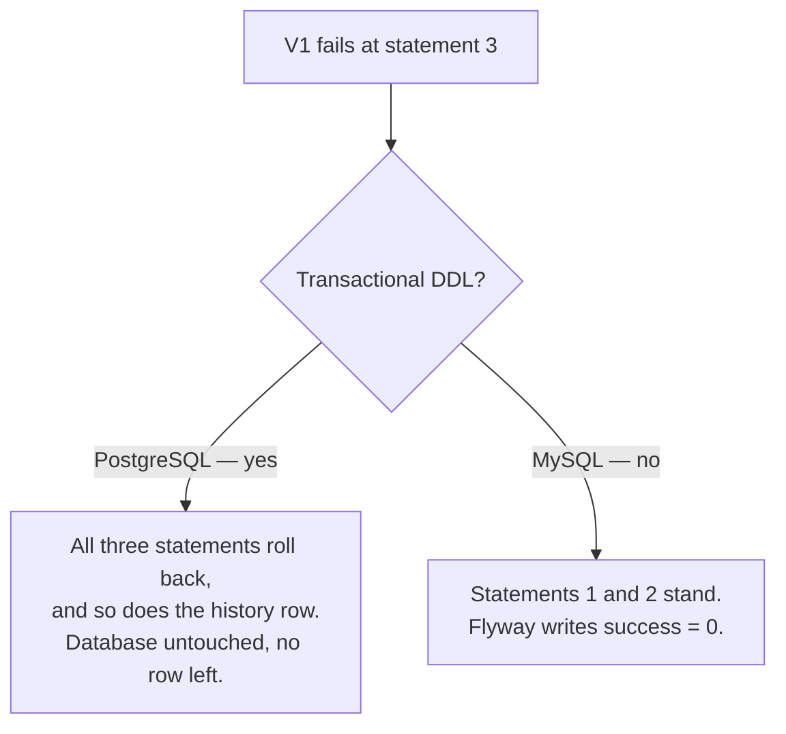
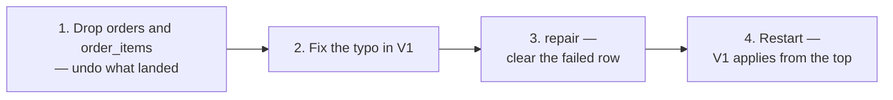

A clean start is a proof. This note is the other outcome — what the history table records when a migration does not finish, why the next startup refuses to do anything at all, and why the answer differs depending on which database you are on.

# The history table records outcomes, not just successes

Every row in `flyway_schema_history` carries a `success` column, and both values matter.

```text
  SELECT installed_rank, version, description, execution_time, success
  FROM flyway_schema_history;

  installed_rank | version | description           | execution_time | success
  1              | 1       | create products table | 63             | 0
```

| `success` | Meaning |
|---|---|
| **`1`** | This migration ran to completion. Never run it again. |
| **`0`** | This migration **started and did not finish.** What the database looks like now is unknown. |

> [!important] A failed row is not an error log. It is a **warning marker**: something touched this database and there is no record of how far it got. `execution_time` even tells you it ran for a while before dying.

On the next startup, Flyway reads that row and stops:

```text
  Validate failed: Migrations have failed validation
  Detected failed migration to version 1 (create products table).
  Please remove any half-completed changes then run repair to fix the schema history.
```

Nothing is applied. The application does not start.

# Why it will not simply try again

With a single-statement migration this looks like excessive caution. Make the migration three statements and the reason appears.

```sql
1  CREATE TABLE orders (...);
2  CREATE TABLE order_items (...);
3  ALTER TABLE order_items ADD CONSTRAINT fk_order
4      FOREIGN KEY (order_id) REFERENCES orders(id);
```

Suppose line 3 has a typo and fails.

> [!warning] **On MySQL, lines 1 and 2 have already committed.** MySQL commits DDL as it executes it — there is no enclosing transaction to abandon. The database now holds both tables and no constraint, a state matching neither before-V1 nor after-V1. **That is what half-completed means.**

Now imagine Flyway retried on the next startup:

```text
  CREATE TABLE orders (...);
  ERROR 1050: Table 'orders' already exists
```

It dies immediately, on a statement that succeeded last time.

> [!important] **Flyway never recorded which statements got through** — only that the file as a whole did not finish. It cannot resume from the middle, and it cannot start from the top. So it refuses, and asks for a human. **The only thing that knows the state of that database is somebody who looks at it.**

# Where the database engine decides everything



| | PostgreSQL | MySQL |
|---|---|---|
| DDL inside a transaction | **Yes** | No — each statement commits as it runs |
| After a failed migration | **Database unchanged** | Partially changed |
| History row left behind | **None** | `success = 0` |
| To retry | Fix the file, restart | **Undo by hand, then repair** |

> [!important] On PostgreSQL the history insert happens inside the same transaction as the DDL, so a failure rolls back the schema change **and** the record of it. There is nothing to clean up and nothing to learn. **MySQL makes you learn this**, and the mechanism is the same one behind `08-Hash-Indexes` in the indexing material: MySQL's DDL is not something you can wrap and abandon.

# What repair actually does

The error message says remove any half-completed changes **and then** run repair. That ordering is the entire point.

> [!warning] **`repair` deletes failed rows from `flyway_schema_history`. It does not touch your schema.** It fixes the bookkeeping, not the database.

So on the three-statement example the real work is yours:



> [!warning] **Repair on its own is not a fix.** Skip step 1 and repair still succeeds, Flyway happily retries V1, and it dies on `Table 'orders' already exists`. That misunderstanding is what puts people in a loop, running repair over and over on a database that never gets cleaned.

> [!info] Spring Boot does not expose `repair` — it only ever calls `migrate` at startup. Reaching it means the Flyway command line or build plugin, which is one of the few genuine reasons to configure Flyway outside the application.

# The single-statement case

Not every failure leaves a mess.

```sql
1  CREATE TABLE products (
2      ...
3  );
```

> [!important] **One statement either fully succeeds or fully fails.** There is no partial state to be in. If the table is absent, nothing landed, and the only thing wrong is the stale row.

Confirming that before touching anything is a two-second check:

```text
  SHOW TABLES;
  +-----------------------+
  | Tables_in_lab         |
  +-----------------------+
  | flyway_schema_history |
  +-----------------------+
```

Only the history table. Nothing was created, so step 1 is already done.

> [!warning] Dropping `flyway_schema_history` entirely is a reasonable shortcut **only while no migration has ever succeeded.** Once real migrations are recorded there, that table is the sole record of what has run — dropping it makes Flyway believe the database is empty and try to apply everything from V1 against tables that already exist.

# Writing migrations for a database that cannot roll back

Three habits follow from all of the above, and they are specific to MySQL and databases like it.

> [!important] **One logical change per migration.** The more statements in a file, the more distinct half-finished states it can leave, and the more there is to reconstruct by hand when one fails.

> [!important] **Run the SQL somewhere disposable first.** On a database with no rollback, a migration file is a one-shot. There is no safety net underneath it, so **the scratch database is the safety net** — the only place a mistake costs nothing.

It is four commands, and it turns a one-shot into something you can get wrong repeatedly:

```sql
1  CREATE DATABASE scratch;
2  USE scratch;
3  -- paste the migration exactly as written, and run it
4  DROP DATABASE scratch;
```

> [!important] The value is not only that syntax errors surface. **A migration that applies cleanly can still be wrong**, and the scratch copy is where you find out — check the result with `SHOW CREATE TABLE` and compare it against what the entity expects, before the real database ever sees the file.

> [!warning] **Create a separate database rather than testing in the real one.** A `CREATE TABLE` that half-works in the actual schema leaves exactly the mess this note is about, and now with no record in the history table that anything happened at all.

> [!warning] **Read the failure at the moment it happens.** `flyway_schema_history` records **that** a migration failed and never **why** — there is no error column. The actual message appears once, in the startup log, and is gone after that. A failed row found the next morning tells you nothing about its cause.

# Editing a migration that has not succeeded

One consequence that cuts the other way, and is useful.

> [!important] `02-Flyway` establishes that an applied migration is frozen — its checksum is recorded and verified on every startup, so editing it breaks validation. **A migration that failed was never applied**, so there is no successful checksum to violate. Fix the file in place, clear the failed row, and run it again.

The freeze begins the moment a migration succeeds, not the moment it is written.
