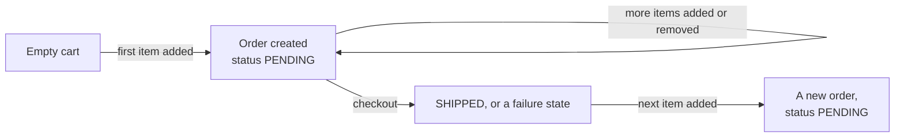

The order tables exist and the read endpoints work. Writing to them is where the design decisions are, and the first one is not technical at all — it is deciding what an order means before any item has been paid for.

# The cart is an order

An obvious design gives carts their own table. A cart holds items, becomes an order at checkout, and the two are separate things.

There is a simpler arrangement.

> [!important] **A cart is an order in the `PENDING` state.** Nothing else. The same table, the same rows, the same item lines — the status is what distinguishes a basket someone is filling from an order they have placed.

Which means no cart table, no code duplicating item handling in two places, and no conversion step at checkout that has to copy rows from one table to another and get it exactly right.

# The lifecycle



**Adding the first item creates the order.** There was no cart before, so one is made, in `PENDING`.

**Every subsequent change updates that same order.** Adding, removing, changing quantities — all of it is an update to the order that already exists.

**Checkout is a status change.** The order stops being `PENDING` and moves to whatever the payment produced. No rows move anywhere.

**The next item added starts a new order**, because the previous one is no longer pending.

> [!important] So there is exactly **one pending order per user at a time**, and that is the cart. Finding someone's cart is a query for their pending order.

That constraint is what makes the design work. Without it, several pending orders would exist and nothing would say which one is the current basket.

# What the create endpoint has to accept

The flow above puts an odd requirement on order creation.

> [!important] **Creating an order with no items has to be allowed.** The obvious validation — reject an order with an empty item list — would make it impossible to create the cart in the first place.

So the create request carries items **optionally**:

```java
1  // src/main/java/com/example/FakeCommerce/dtos/CreateOrderRequestDTO.java
2  @Data
3  @AllArgsConstructor
4  @NoArgsConstructor
5  @Builder
6  public class CreateOrderRequestDTO {
7
8      private List<OrderItemRequestDto> orderItems;
9  }
```

If items are present they are added. If not, an empty pending order is created and items arrive later through the update endpoint.

> [!info] It looks like a missing validation and it is a deliberate one. Rejecting empty orders would be correct for an API where creation means placing an order, and wrong here, where creation means starting a basket. **The rule follows from what the entity is being used for**, not from what seems sensible in isolation.

# What an item looks like on the way in

```java
1  // src/main/java/com/example/FakeCommerce/dtos/OrderItemRequestDto.java
2  @Data
3  @AllArgsConstructor
4  @NoArgsConstructor
5  @Builder
6  public class OrderItemRequestDto {
7
8      private Long productId;
9      private Integer quantity;
10 }
```

Two fields, and both choices matter.

**A product id, not a product.** The client sends the id of something that already exists; the server looks it up. A client cannot invent a product by describing one.

**`Integer`, not `int`.** Quantity is **optional** — a client saying add this product without saying how many means one. A primitive cannot express absent, so the wrapper type is required. This is the same `Long` versus `long` trap from the entity mapping, in a third place.

> [!info] Notice what the request does **not** carry: no price, no subtotal, no product name. All of those are read from the product at the point the order is assembled. A client that could send a price could send its own price.

# Where this is going

Two endpoints have to be built on this, and both have the same problem underneath.

**Create** takes a list of items and has to turn each product id into a real product, then write a row per item.

**Update** takes a list of changes and has to apply each one against what is already in the order.

> [!important] Both are **a loop over a list of items, where each item needs the database.** Written the obvious way, that is a query per item — the N+1 problem from [[05-The-N-Plus-1-Problem]], except on the write path, where each iteration can cost two queries rather than one.

The next two notes are those endpoints, written the obvious way first.
