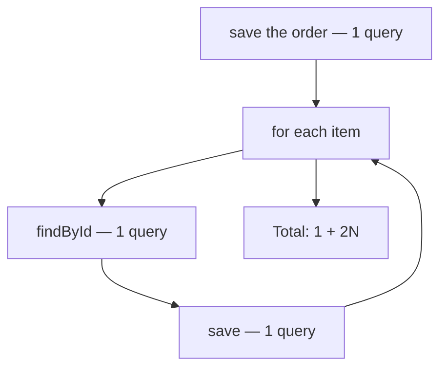
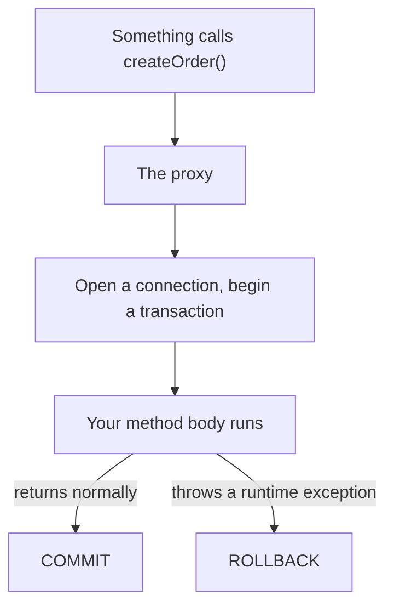

Creating an order means turning a list of product ids into a list of rows. Written the way it reads, that costs two database calls per item — and the fix is a pattern that applies far beyond this endpoint.

# The obvious version

```java
1  public GetOrderResponseDto createOrder(CreateOrderRequestDTO requestDto) {
2      Order order = Order.builder()
3                      .status(OrderStatus.PENDING)
4                      .build();
5
6      orderRespository.save(order);
7
8      if (requestDto.getOrderItems() != null) {
9          for (var itemDto : requestDto.getOrderItems()) {
10
11             Product product = productRepository.findById(itemDto.getProductId())
12                 .orElseThrow(() -> new ResourceNotFoundException("Product not found"));
13
14             OrderProducts orderProduct = OrderProducts.builder()
15                 .order(order)
16                 .product(product)
17                 .quantity(itemDto.getQuantity() != null ? itemDto.getQuantity() : 1)
18                 .build();
19
20             orderproductsRepository.save(orderProduct);
21         }
22     }
23
24     return orderAdapter.mapToGetOrderResponseDto(order);
25 }
```

It is correct. Every product is checked, every line is written, a missing product is reported properly.

# What it costs

Two statements inside the loop touch the database. **Line 11 reads a product. Line 20 writes a row.**



> [!important] **An order with 10 items costs 21 queries.** One to create the order, then ten reads and ten writes. This is the N+1 problem from [[05-The-N-Plus-1-Problem]], on the write path, where each iteration is worth two round trips rather than one.

A basket of 30 items is 61 queries for one button press.

# Fixing the reads

The loop asks for one product at a time because that is how the loop is shaped. All the ids are known before it starts.

## Collect the ids

```java
1  List<Long> productIds = requestDto.getOrderItems().stream()
2          .map(item -> item.getProductId())
3          .collect(Collectors.toList());
```

## Fetch them in one query

```java
1  List<Product> products = productRepository.findAllById(productIds);
```

`findAllById` is provided by `JpaRepository` and issues a single `WHERE id IN (...)`. Ten reads become one.

> [!warning] **`findAllById` silently omits ids it cannot find.** Pass three ids where only two exist and you get two products back, with no error and no indication which one was missing. The order of the results is not guaranteed either.

That warning is the whole reason for the next step.

## Build a lookup

```java
  Map<Long, Product> productMap = products.stream()
  .collect(Collectors.toMap(Product::getId, Function.identity()));
```

> [!important] `Collectors.toMap` takes two functions: **what to use as the key**, and **what to use as the value**. `Product::getId` makes the id the key. `Function.identity()` is a function returning its own argument, so the value is the product itself.

The result is an in-memory index of everything the database returned — a lookup that costs nothing to consult.

## Detect what is missing

```java
1  for (Long id : productIds) {
2      if (!productMap.containsKey(id)) {
3          throw new ResourceNotFoundException("Product not found with id: " + id);
4      }
5  }
```

Every id that was asked for is checked against what came back. **This is what recovers the error reporting that `findAllById` threw away**, and it names the specific id that failed rather than reporting that something went wrong.

> [!info] A `Set` of ids would be enough for this check alone. The map is built because the products themselves are needed a moment later — which is why one structure serves both purposes.

# Fixing the writes

The reads are down to one query. The writes are still one per item.

```java
1  List<OrderProducts> orderProducts = new ArrayList<>();
2
3  for (var itemDto : requestDto.getOrderItems()) {
4      Product product = productMap.get(itemDto.getProductId());
5
6      orderProducts.add(OrderProducts.builder()
7              .order(order)
8              .product(product)
9              .quantity(itemDto.getQuantity() != null ? itemDto.getQuantity() : 1)
10             .build());
11 }
12
13 orderproductsRepository.saveAll(orderProducts);
```

**Line 4 hits the map, not the database.** The lookup is a hash map access.

**The loop builds objects and nothing else.** Nothing inside it touches the database at all.

**Line 13 writes everything in one call.** `saveAll` batches the inserts rather than issuing them one at a time.

> [!important] The shape to remember: **gather the identifiers, fetch once, index in memory, build in a loop that touches nothing, write once.** The loop still exists — it just stopped being where the cost was.

# The finished method

```java
1  // src/main/java/com/example/FakeCommerce/services/OrderService.java
2  @Transactional
3  public GetOrderResponseDto createOrder(CreateOrderRequestDTO createOrderRequestDTO) {
4      Order order = Order.builder()
5                      .status(OrderStatus.PENDING)
6                      .build();
7
8      orderRespository.save(order);
9
10     if (createOrderRequestDTO.getOrderItems() != null) {
11         List<Long> productIds = createOrderRequestDTO.getOrderItems().stream()
12                 .map(item -> item.getProductId())
13                 .collect(Collectors.toList());
14
15         List<Product> products = productRepository.findAllById(productIds);
16
17         Map<Long, Product> productMap = products.stream()
18                 .collect(Collectors.toMap(Product::getId, Function.identity()));
19
20         for (Long id : productIds) {
21             if (!productMap.containsKey(id)) {
22                 throw new ResourceNotFoundException("Product not found with id: " + id);
23             }
24         }
25
26         List<OrderProducts> orderProducts = new ArrayList<>();
27
28         for (var itemDto : createOrderRequestDTO.getOrderItems()) {
29             Product product = productMap.get(itemDto.getProductId());
30
31             orderProducts.add(OrderProducts.builder()
32                     .order(order)
33                     .product(product)
34                     .quantity(itemDto.getQuantity() != null ? itemDto.getQuantity() : 1)
35                     .build());
36         }
37
38         orderproductsRepository.saveAll(orderProducts);
39     }
40
41     return orderAdapter.mapToGetOrderResponseDto(order);
42 }
```

| | Before | After |
|---|---|---|
| Create the order | 1 | 1 |
| Read the products | **N** | **1** |
| Write the lines | **N** | **1** |
| **10 items** | **21 queries** | **3 queries** |
| **30 items** | **61 queries** | **3 queries** |

> [!important] The second row is the one that matters. **The cost stopped depending on the number of items.** Three queries for ten items and three for a thousand — the query count is now a property of the method rather than of the request.

# Making it one transaction

Line 2 is the annotation, and the argument for it comes from what the method now does.

The order is saved. Then products are fetched. Then lines are written. **If the process dies between the first and the last, an order exists with no items in it** — a row that no valid sequence of user actions could have produced.

```java
1  @Transactional
2  public GetOrderResponseDto createOrder(CreateOrderRequestDTO createOrderRequestDTO) {
```

> [!important] **`@Transactional` makes the whole method one unit of work.** Either every write it performs takes effect, or none of them do.

## What Spring actually does

The annotation is not read by your code. Spring wraps the bean in a **proxy** — an object with the same interface that runs extra steps around the real method.



**Begin** before the body. **Commit** if it returns. **Roll back** if a runtime exception escapes.

Which is why the validation loop throwing `ResourceNotFoundException` is safe: the order saved on line 8 is discarded along with everything else, and the database is left as though the call never happened.

> [!info] Because the mechanism is a proxy, it only applies when the method is called **from outside the bean**. One method in a class calling another `@Transactional` method on the same instance bypasses the proxy entirely, and the annotation does nothing. That surprises people, and it follows directly from how the wrapping works rather than being a special rule.

> [!info] This import is `jakarta.transaction.Transactional`. Spring's own `org.springframework.transaction.annotation.Transactional` also exists and offers more configuration — isolation level, propagation, which exceptions trigger a rollback. Either works here.
