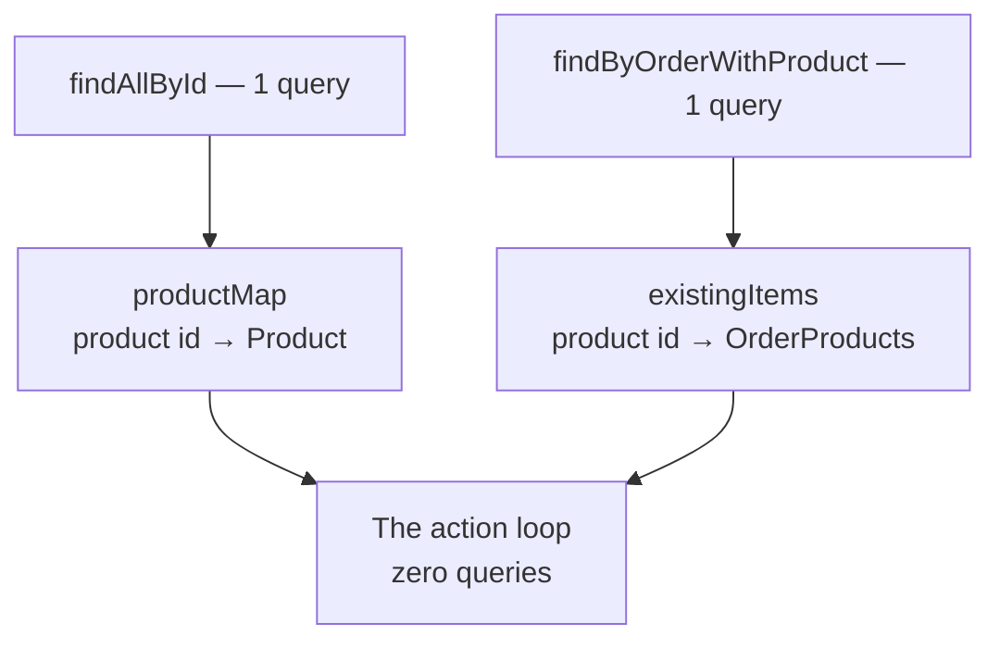
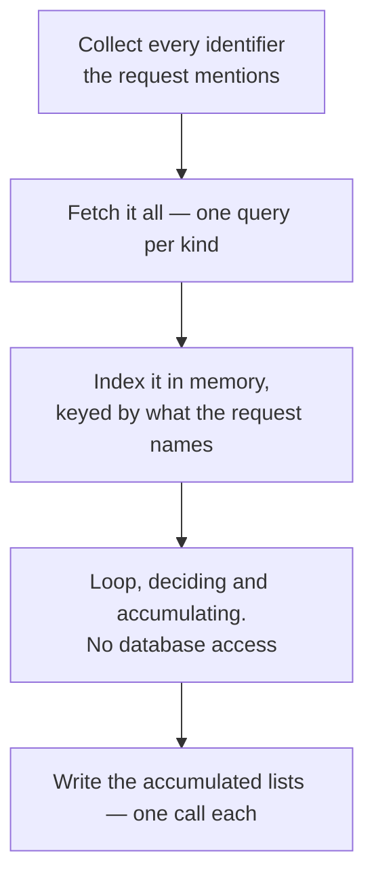

Creating an order writes rows that do not exist yet. Updating one has to reconcile a list of requested changes against rows that are already there — and each change might insert, update or delete. The same batching applies, with more to keep track of.

# Describing a change

Updating a cart is not sending a new list of items. It is sending what should happen to it.

```java
1  // src/main/java/com/example/FakeCommerce/dtos/OrderItemAction.java
2  public enum OrderItemAction {
3      ADD,
4      REMOVE,
5      INCREMENT,
6      DECREMENT
7  }
```

```java
1  // src/main/java/com/example/FakeCommerce/dtos/OrderItemActionDto.java
2  @Data
3  @AllArgsConstructor
4  @NoArgsConstructor
5  @Builder
6  public class OrderItemActionDto {
7
8      private Long productId;
9      private Integer quantity;
10     private OrderItemAction action;
11 }
```

> [!important] **Each item carries the operation it wants.** A product id, an optional quantity, and what to do. That is what makes one endpoint able to serve every button in a cart interface.

`ADD` and `INCREMENT` look redundant and are not. **`ADD` puts a product in the cart, or adds to it if already there. `INCREMENT` is the plus button next to something already in the cart** — and it should fail if the product is not there, because pressing plus on a row that does not exist is a bug, not a request.

```java
1  // src/main/java/com/example/FakeCommerce/dtos/UpdateOrderRequestDto.java
2  @Data
3  @AllArgsConstructor
4  @NoArgsConstructor
5  @Builder
6  public class UpdateOrderRequestDto {
7
8      private OrderStatus status;
9      private List<OrderItemActionDto> orderItems;
10 }
```

Both fields are optional and independent. Sending only a status is the checkout call. Sending only items changes the basket.

# What the loop needs

Applying one action requires two things the database holds.

**The product**, to attach to a new line. **The existing line, if there is one**, since `ADD` on something already present is an update rather than an insert.

Done naively that is two queries per action, and this time the pattern is already known: **fetch both up front, index both in memory.**

## The products

Identical to the create path:

```java
1  List<Long> productIds = updateOrderRequestDto.getOrderItems().stream()
2          .map(item -> item.getProductId())
3          .collect(Collectors.toList());
4
5  List<Product> products = productRepository.findAllById(productIds);
6
7  Map<Long, Product> productMap = products.stream()
8          .collect(Collectors.toMap(Product::getId, Function.identity()));
9
10 for (var pid : productIds) {
11     if (!productMap.containsKey(pid)) {
12         throw new ResourceNotFoundException("Product not found with id: " + pid);
13     }
14 }
```

## The existing lines

These need a query that does not exist yet:

```java
1  // src/main/java/com/example/FakeCommerce/repositories/OrderproductsRepository.java
2  @Query("SELECT op FROM OrderProducts op JOIN FETCH op.product WHERE op.order = :order")
3  List<OrderProducts> findByOrderWithProduct(Order order);
```

> [!important] **`JOIN FETCH` is doing real work here.** `OrderProducts.product` is a lazy `@ManyToOne`, so a plain query would return lines holding unloaded product references — and the loop calls `getProduct().getId()` on every one, triggering a query each time. `JOIN FETCH` loads the products in the same statement.

Without it, the N+1 removed from the reads reappears inside the indexing step. This is the same fix as in [[05-The-N-Plus-1-Problem]], now on a query written specifically to avoid it.

```java
1  Map<Long, OrderProducts> existingItems = orderproductsRepository.findByOrderWithProduct(order)
2          .stream()
3          .collect(Collectors.toMap(op -> op.getProduct().getId(), Function.identity()));
```

**Keyed by product id**, because that is what an incoming action names.



# The loop that touches nothing

```java
1  List<OrderProducts> toSave = new ArrayList<>();
2  List<OrderProducts> toDelete = new ArrayList<>();
3
4  for (OrderItemActionDto itemAction : updateOrderRequestDto.getOrderItems()) {
5      Product product = productMap.get(itemAction.getProductId());
6      OrderProducts existing = existingItems.get(product.getId());
7
8      switch (itemAction.getAction()) {
9          case ADD -> {
10             if (existing != null) {
11                 int addQty = (itemAction.getQuantity() != null ? itemAction.getQuantity() : 1);
12                 existing.setQuantity(existing.getQuantity() + addQty);
13                 toSave.add(existing);
14             } else {
15                 OrderProducts newItem = OrderProducts.builder()
16                         .order(order)
17                         .product(product)
18                         .quantity(itemAction.getQuantity() != null ? itemAction.getQuantity() : 1)
19                         .build();
20                 existingItems.put(product.getId(), newItem);
21                 toSave.add(newItem);
22             }
23         }
24         case REMOVE -> {
25             if (existing == null) {
26                 throw new ResourceNotFoundException("Product not found with id: " + product.getId());
27             }
28             toDelete.add(existing);
29             existingItems.remove(product.getId());
30         }
31         case INCREMENT -> {
32             if (existing == null) {
33                 throw new ResourceNotFoundException("Product not found with id: " + product.getId());
34             }
35             existing.setQuantity(existing.getQuantity() + 1);
36             toSave.add(existing);
37         }
38         case DECREMENT -> {
39             if (existing == null) {
40                 throw new ResourceNotFoundException("Product not found with id: " + product.getId());
41             }
42             if (existing.getQuantity() <= 1) {
43                 toDelete.add(existing);
44                 existingItems.remove(product.getId());
45             } else {
46                 existing.setQuantity(existing.getQuantity() - 1);
47                 toSave.add(existing);
48             }
49         }
50     }
51 }
```

> [!important] **Lines 5 and 6 are the only lookups, and both are map accesses.** Nothing in the entire switch touches the database. Every branch ends by putting an object into `toSave` or `toDelete` and moving on.

## The two accumulators

`toSave` collects rows to write — both brand new lines and existing ones whose quantity changed. `toDelete` collects rows to remove.

**Modified and new objects go in the same list**, because `saveAll` inserts what has no id and updates what does. The distinction is JPA's problem, not the loop's.

## Keeping the index truthful

Lines 20, 29 and 44 are the part that is easy to miss and wrong to omit.

> [!warning] When a branch adds or removes a line, **the map has to be updated to match**. Otherwise a later action in the same request sees a stale picture — `ADD` then `INCREMENT` on the same product would find nothing on the second action and throw, even though the first action just created it.

The map is not merely a cache of the database. **It is the current state of the order as the loop understands it**, and it has to stay accurate for as long as actions are being applied against it.

## `DECREMENT` at one

Line 42 encodes a product decision.

> [!important] Decrementing a quantity of 1 does not produce a quantity of 0. **It deletes the line.** A cart row saying zero apples is not a state anyone wants — pressing minus on the last one means remove it.

Worth noticing that this is a rule about what a cart means, expressed in three lines, and that a naive implementation would happily have stored a zero.

# Writing it all at the end

```java
1  if (!toSave.isEmpty()) {
2      orderproductsRepository.saveAll(toSave);
3  }
4  if (!toDelete.isEmpty()) {
5      orderproductsRepository.deleteAll(toDelete);
6  }
```

**Two statements, and each is skipped when it has nothing to do.** An update that only removes items issues no save at all.

# The count

| | Naive | Batched |
|---|---|---|
| Find the order | 1 | 1 |
| Read the products | N | **1** |
| Read the existing lines | N | **1** |
| Write the changes | up to N | **at most 2** |
| **10 actions** | **~31 queries** | **5 queries** |

> [!important] Same result as the create path, and the same reason. **The query count is a property of the method, not of the request.** Ten actions and a thousand actions both cost five queries.

# The shape underneath both

Two endpoints, two different jobs, one structure:



> [!important] **The loop is never the problem. Where the loop reaches is.** A loop over ten items is nothing; a loop over ten items that each open a round trip to another machine is thirty milliseconds you did not have to spend. Moving the database access outside the loop, on both ends, is the entire technique.

It generalises past JPA. The same rule applies to a loop calling an HTTP API, reading files, or invoking a model — **batch what crosses a boundary, and keep the loop on the near side of it.**
