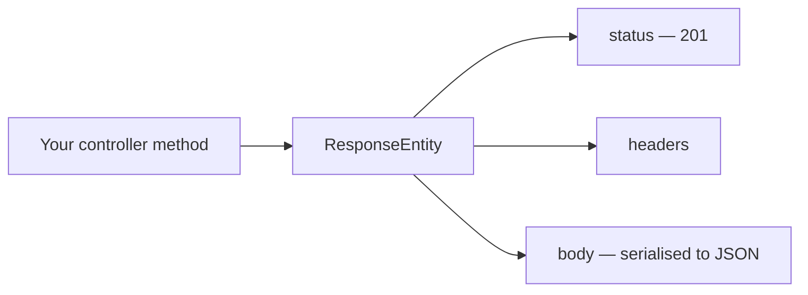

A controller method that returns an object works. The object is serialised to JSON, a status code is chosen for you, and the client gets a response. The problem is the phrase chosen for you — every part of the response except the body is out of your hands.

# What returning an object gives away

```java
  @PostMapping
  public Category createCategory(@RequestBody CreateCategoryRequestDto requestDto) {
      return categoryService.createCategory(requestDto);
  }
```

Call it and the response is correct:

**Request**
```json
  POST /api/v1/categories
  { "name": "electronics" }
```

**Response**
```json
  200 OK
  { "id": 1, "name": "electronics", "createdAt": "...", "updatedAt": "..." }
```

> [!info] The Java object did not travel. A **serialisation** library converted it to JSON on the way out, and does the reverse for incoming request bodies. That happens whether or not you think about it.

**But look at the status code.** A resource was created and the response says `200 OK`. It should say `201 Created`, and there is no way to say so from this method — the return type is `Category`, so the body is the only thing being described.

> [!important] An HTTP response is **a status code, a set of headers, and a body**. Returning a domain object describes the body and nothing else. Everything else is left to a default.

# `ResponseEntity`

```java
  @PostMapping
  public ResponseEntity<Category> createCategory(@RequestBody   
                  CreateCategoryRequestDto requestDto) {
      return ResponseEntity
              .status(HttpStatus.CREATED)
              .body(categoryService.createCategory(requestDto));
  }
```

> [!important] **`ResponseEntity` is an object representing the complete HTTP response** — body, status code and headers together. Returning one means the method describes the whole response rather than a fragment of it.

**The generic parameter is the body type.** `ResponseEntity<Category>` is a response whose body is a category. That is all `T` means here, and it is worth being firm about because the type gets more interesting later.

**It is built by chaining.** `.status()` sets the code and returns something you call `.body()` on. The value handed to `.body()` becomes the payload and is serialised exactly as before.



# Naming the status

Two types are available and either works.

| | |
|---|---|
| **`HttpStatus`** | An enum of named constants — `HttpStatus.CREATED`, `HttpStatus.NOT_FOUND`, `HttpStatus.OK` |
| **`HttpStatusCode`** | The more general interface, which can carry a numeric code that is not in the enum |

`HttpStatus` is what you want almost always. `HttpStatus.CREATED` says what it means; `201` requires the reader to know the number.

# What it produces

```json
  POST /api/v1/categories
  { "name": "kitchenware" }
```

```json
  201 Created
  { "id": 2, "name": "kitchenware", "createdAt": "...", "updatedAt": "..." }
```

> [!info] **Verified.** The body is unchanged. The status went from `200 OK` to `201 Created` because the method now describes it.

# Headers, and the shorthand

Headers work the same way, and are how you set anything the protocol carries outside the body — content type, cache directives, a `Location` pointing at the resource just created, or headers of your own.

```java
  HttpHeaders headers = new HttpHeaders();
  headers.add("X-Custom-Header", "some-value");

  return new ResponseEntity<>(body, headers, HttpStatus.CREATED);
```

For the ordinary case there is a shorter form:

```java
  return ResponseEntity.ok(categories);
```

> [!important] **`.ok(body)` is `.status(HttpStatus.OK).body(body)`.** Worth using where 200 is genuinely what you mean, and worth not using where the explicit status is the point — a `201` written out says something a bare `.ok()` cannot.

# What this has and has not solved

Every controller method can now state its own status code, and that is a real improvement.

> [!warning] It has done nothing about failures. **When something throws, none of this applies** — the exception escapes the method, no `ResponseEntity` is ever constructed, and the client gets whatever the framework produces by default. Which, as it turns out, is a stack trace.
