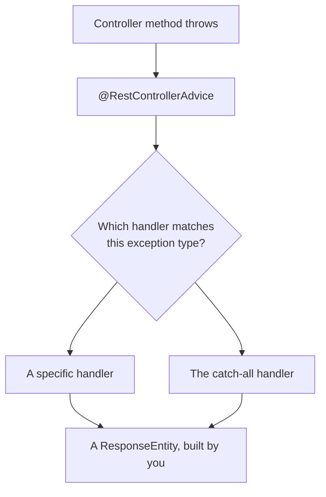

Success responses are under control. Failures are not — and a failing endpoint currently tells the client rather more than it should.

# What a failure looks like

Send a create request with the required field missing:

```text
1  POST /api/v1/categories
2  {}
```

What comes back is the framework's default: a long JSON error carrying a timestamp, the exception class name, and a stack trace running through the framework's internals.

> [!warning] **That response is unusable and it leaks.** A client cannot act on it — there is no field saying what went wrong in terms the caller understands. And it publishes your class names, package structure and framework internals to anyone who can reach the endpoint.

The obvious fix is a `try`/`catch` in every controller method, which means the same handling written everywhere and forgotten somewhere.

# One place for all of it

```java
1  // src/main/java/com/example/FakeCommerce/exceptions/GlobalExceptionHandler.java
2  @RestControllerAdvice
3  public class GlobalExceptionHandler {
4  }
```

> [!important] **`@RestControllerAdvice` marks a class that handles exceptions thrown anywhere in the application's controllers.** When a controller method throws instead of returning, the exception is matched against the handlers in this class, and the matching one produces the response.



Nothing in the controller changes. It throws; the advice answers.

# A handler

```java
1  @ExceptionHandler(Exception.class)
2  public ResponseEntity<String> handleAllGeneralExceptions(Exception ex) {
3      return ResponseEntity
4              .status(HttpStatus.INTERNAL_SERVER_ERROR)
5              .body("Something went wrong");
6  }
```

**`@ExceptionHandler` names the exception type this method deals with.** `Exception.class` is the root of the hierarchy, so this catches everything.

**The method receives the exception object**, so the response can use what it knows — its message, in particular.

**It returns a `ResponseEntity`**, which is why the previous note came first. Error responses are built exactly like success responses.

Now the same failing request:

```text
1  POST /api/v1/categories
2  {}
```

```text
1  500 Internal Server Error
2  Something went wrong
```

> [!info] **Verified.** No stack trace, no class names, no framework internals. A status code the client can branch on and a message a human can read.

# Exceptions worth naming

A catch-all is a floor, not a design. Every failure returning `500` is wrong — a request for a category that does not exist is not a server error, it is a `404`, and the client should be able to tell those apart.

Which requires an exception type that means the thing:

```java
1  // src/main/java/com/example/FakeCommerce/exceptions/ResourceNotFoundException.java
2  package com.example.FakeCommerce.exceptions;
3
4  public class ResourceNotFoundException extends RuntimeException {
5      public ResourceNotFoundException(String message) {
6          super(message);
7      }
8  }
```

Seven lines. Extend `RuntimeException`, take a message, pass it up.

> [!info] **There is no general-purpose `ResourceNotFoundException` in Spring Web to import.** Spring Data REST has one of its own, and Spring 6 has `NoResourceFoundException` for a missing static resource, but neither means a domain object was not found. **Writing your own is the normal practice**, not a workaround — the exception is part of your application's vocabulary, and naming it yourself is the point.

Then throw it where the failure actually happens:

```java
1  // src/main/java/com/example/FakeCommerce/services/CategoryService.java
2  public Category getCategoryById(Long id) {
3      return categoryRepository.findById(id)
4          .orElseThrow(() -> new ResourceNotFoundException("Category with id " + id + " not found"));
5  }
```

Previously this threw a bare `RuntimeException`, which the catch-all would have turned into a `500`. Now it throws something specific.

And a handler for it:

```java
1  @ExceptionHandler(ResourceNotFoundException.class)
2  public ResponseEntity<String> handleResourceNotFoundException(ResourceNotFoundException ex) {
3      return ResponseEntity
4              .status(HttpStatus.NOT_FOUND)
5              .body(ex.getMessage());
6  }
```

The message written at the throw site is what reaches the client, so the useful detail — which id was missing — survives the journey.

```text
1  GET /api/v1/categories/100
```

```text
1  404 Not Found
2  Category with id 100 not found
```

> [!info] **Verified** against a database holding two categories, neither with id 100.

# Which handler wins

With both a `ResourceNotFoundException` handler and an `Exception` handler present, both match — `ResourceNotFoundException` **is** an `Exception`.

> [!important] **Spring picks the most specific handler**, by walking up the thrown exception's type hierarchy and choosing the closest declared match. `ResourceNotFoundException` is an exact match, so it wins over `Exception`.

> [!warning] **The order the methods appear in the file is irrelevant.** It is tempting to read the class top to bottom and assume the first match wins, and that reading happens to give the right answer when the specific handler is written first. Move the catch-all to the top and nothing changes. **Selection is by type distance, not by position.**

Which means the catch-all is a genuine safety net rather than a trap: it catches only what nothing more specific claimed.

# The finished class

```java
1  // src/main/java/com/example/FakeCommerce/exceptions/GlobalExceptionHandler.java
2  @RestControllerAdvice
3  public class GlobalExceptionHandler {
4
5      @ExceptionHandler(ResourceNotFoundException.class)
6      public ResponseEntity<String> handleResourceNotFoundException(ResourceNotFoundException ex) {
7          return ResponseEntity.status(HttpStatus.NOT_FOUND).body(ex.getMessage());
8      }
9
10     @ExceptionHandler(ResourceDeletionException.class)
11     public ResponseEntity<String> handleResourceDeletionException(ResourceDeletionException ex) {
12         return ResponseEntity.status(HttpStatus.CONFLICT).body(ex.getMessage());
13     }
14
15     @ExceptionHandler(BadRequestException.class)
16     public ResponseEntity<String> handleBadRequestException(BadRequestException ex) {
17         return ResponseEntity.status(HttpStatus.BAD_REQUEST).body(ex.getMessage());
18     }
19
20     @ExceptionHandler(MethodArgumentTypeMismatchException.class)
21     public ResponseEntity<String> handleMethodArgumentTypeMismatch(MethodArgumentTypeMismatchException ex) {
22         String message = "Invalid value '" + ex.getValue() + "' for parameter '" + ex.getName()
23                 + "'. Expected type: " + ex.getRequiredType().getSimpleName();
24         return ResponseEntity.status(HttpStatus.BAD_REQUEST).body(message);
25     }
26
27     @ExceptionHandler(Exception.class)
28     public ResponseEntity<String> handleAllGeneralExceptions(Exception ex) {
29         return ResponseEntity.status(HttpStatus.INTERNAL_SERVER_ERROR).body("Something went wrong");
30     }
31 }
```

| Handler | Status | Fires when |
|---|---|---|
| `ResourceNotFoundException` | **404** Not Found | A requested thing does not exist |
| `ResourceDeletionException` | **409** Conflict | A delete is refused — typically a foreign key still referencing the row |
| `BadRequestException` | **400** Bad Request | The request itself is wrong |
| `MethodArgumentTypeMismatchException` | **400** Bad Request | A path variable or parameter will not convert — `/categories/abc` where a number was expected |
| `Exception` | **500** Internal Server Error | Anything unaccounted for |

`ResourceDeletionException` and `BadRequestException` are the same seven-line shape as `ResourceNotFoundException`.

> [!important] **`MethodArgumentTypeMismatchException` is different in kind from the other four.** The others are yours, thrown deliberately by your code. This one is Spring's, thrown before your controller method ever runs — the conversion from URL text to a `Long` failed, so there was nothing to call. Handling it is how you stop a framework failure from reaching the client as a stack trace.

Line 22 uses that: `ex.getValue()` is what arrived, `ex.getName()` the parameter it was for, `ex.getRequiredType()` what was expected. The client is told exactly which value was rejected and why.

# Narrowing an advice

By default an advice covers every controller. It can be scoped:

```java
1  @RestControllerAdvice(assignableTypes = { CategoryController.class })
```

```java
1  @RestControllerAdvice(basePackages = "com.example.FakeCommerce.controllers.admin")
```

`assignableTypes` limits it to named controllers; `basePackages` to everything in a package. Useful when one part of an API should fail differently from another — a public surface and an internal one, say.

> [!info] Several advices can coexist, each covering its own controllers. **One class covering everything is the right starting point**, and splitting is something to do when two parts of the application genuinely disagree about what a failure should look like.

# What is still wrong

Errors return a bare string; successes return an object. **A client parsing responses has to know which shape to expect before it knows whether the request succeeded**, which is exactly backwards.
