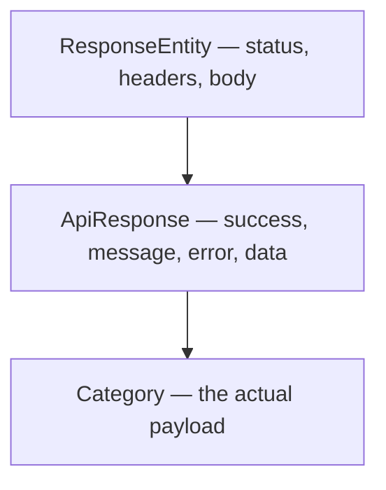

Successes return a domain object. Failures return a string. Both carry a correct status code, and that is where the consistency ends — which makes writing a client harder than it needs to be.

# The problem, from the client's side

```text
1  201  { "id": 1, "name": "electronics" }
2  404  Category with id 100 not found
3  500  Something went wrong
```

Three responses, three shapes. Code consuming this API has to branch on the status code before it can even parse the body, and every endpoint returning a different object means that logic is written again per endpoint.

> [!important] What is wanted is a **response envelope** — one outer structure every response uses, whatever happened. The payload varies; the wrapper never does.

```json
1  {
2    "success": true,
3    "message": "Category created successfully",
4    "data": { "id": 1, "name": "electronics" },
5    "error": null
6  }
```

| Field | | |
|---|---|---|
| `success` | boolean | Did the request do what was asked |
| `message` | string | Something a human can read — the text a UI shows in a notification |
| `data` | the payload | The actual result on success |
| `error` | string | Detail about what went wrong on failure |

**`success` is redundant with the status code, deliberately.** A client can check `response.success` without knowing which codes count as success, and reading one boolean is less error-prone than remembering that 200, 201 and 204 all mean it worked while 404 does not.

> [!important] **The status code does not go in the body.** The HTTP response already carries it — putting it in the JSON as well means two copies of the same fact that can disagree. `success` is not a duplicate status code; it is a simplification of it.

# The class

A JSON shape needs a class, and this one has to hold a different payload type per endpoint. That is what generics are for.

```java
1  // src/main/java/com/example/FakeCommerce/utils/ApiResponse.java
2  package com.example.FakeCommerce.utils;
3
4  import lombok.AllArgsConstructor;
5  import lombok.Builder;
6  import lombok.Data;
7  import lombok.NoArgsConstructor;
8
9  @Data
10 @AllArgsConstructor
11 @NoArgsConstructor
12 @Builder
13 public class ApiResponse<T> {
14
15     private boolean success;
16     private String message;
17     private String error;
18     private T data;
19
20     public static <T> ApiResponse<T> success(T data, String message) {
21         return ApiResponse.<T>builder()
22             .success(true)
23             .message(message)
24             .data(data)
25             .build();
26     }
27
28     public static <T> ApiResponse<T> error(String error, String message) {
29         return ApiResponse.<T>builder()
30             .success(false)
31             .error(error)
32             .message(message)
33             .build();
34     }
35 }
```

**Line 13 — `ApiResponse<T>`.** `T` is the payload type. `ApiResponse<Category>` wraps a category, `ApiResponse<List<Product>>` wraps a list of products.

**Lines 20 and 28 — two static factory methods.** Nothing forces you to use them; the builder is public. But they encode the rules, and that is their value.

> [!important] **The factories make the invariants impossible to break.** `success(...)` always sets `success` to true and leaves `error` null. `error(...)` always sets it false and leaves `data` null. Building by hand, you could produce a response claiming success while carrying an error — these two methods mean nobody has to remember not to.

> [!info] **On line 21, `ApiResponse.<T>builder()` needs the explicit `<T>`.** Called from a static method, there is nothing in the expression for the compiler to infer the type parameter from — no receiver object carrying it, and the argument alone is not enough. That syntax, a type witness, supplies it directly. Writing plain `ApiResponse.builder()` compiles to a raw type and loses the type safety the generic existed for.

# Wiring it in

The controller wraps its result:

```java
1  // src/main/java/com/example/FakeCommerce/controllers/CategoryController.java
2  @PostMapping
3  public ResponseEntity<ApiResponse<Category>> createCategory(@RequestBody CreateCategoryRequestDto requestDto) {
4      Category category = categoryService.createCategory(requestDto);
5      return ResponseEntity
6              .status(HttpStatus.CREATED)
7              .body(ApiResponse.success(category, "Category created successfully"));
8  }
```

**The return type is now two layers.** `ResponseEntity<ApiResponse<Category>>` — a full HTTP response, whose body is an envelope, whose payload is a category. It reads as a mouthful and it is exactly accurate.



# And the same in the handlers

This is the half that matters. An envelope only helps if failures use it too.

```java
1  @ExceptionHandler(ResourceNotFoundException.class)
2  public ResponseEntity<ApiResponse<Void>> handleResourceNotFoundException(ResourceNotFoundException ex) {
3      return ResponseEntity.status(HttpStatus.NOT_FOUND)
4              .body(ApiResponse.error(ex.getMessage(), "Resource not found"));
5  }
6
7  @ExceptionHandler(Exception.class)
8  public ResponseEntity<ApiResponse<Void>> handleAllGeneralExceptions(Exception ex) {
9      return ResponseEntity.status(HttpStatus.INTERNAL_SERVER_ERROR)
10             .body(ApiResponse.error("Something went wrong", "Internal server error"));
11 }
```

> [!important] **`ApiResponse<Void>` is the envelope with no payload.** `Void` is the type used when a generic parameter is required and there is nothing to put there — which is exactly a failure, where `data` is null by construction.

Note which argument goes where. `error` gets the specific detail — the exception's own message, naming the missing id. `message` gets the general category of failure. The client can show one and log the other.

# What comes out

**A success:**

```text
1  POST /api/v1/categories
2  { "name": "clothing" }
```

```text
1  201 Created
2  {
3    "success": true,
4    "message": "Category created successfully",
5    "error": null,
6    "data": { "id": 3, "name": "clothing", "createdAt": "...", "updatedAt": "..." }
7  }
```

**A failure:**

```text
1  POST /api/v1/categories
2  {}
```

```text
1  500 Internal Server Error
2  {
3    "success": false,
4    "message": "Internal server error",
5    "error": "Something went wrong",
6    "data": null
7  }
```

> [!info] **Verified.** The two bodies have identical structure. Only which fields are populated differs, and `success` says which to read without inspecting anything else.

# Across the rest of the API

Every method gets the same treatment:

```java
1  @GetMapping
2  public ResponseEntity<ApiResponse<List<Category>>> getAllCategories() {
3      List<Category> categories = categoryService.getAllCategories();
4      return ResponseEntity.ok(ApiResponse.success(categories, "Categories fetched successfully"));
5  }
6
7  @GetMapping("/{id}")
8  public ResponseEntity<ApiResponse<Category>> getCategoryById(@PathVariable Long id) {
9      Category category = categoryService.getCategoryById(id);
10     return ResponseEntity.ok(ApiResponse.success(category, "Category fetched successfully"));
11 }
12
13 @DeleteMapping("/{id}")
14 public ResponseEntity<ApiResponse<Void>> deleteCategory(@PathVariable Long id) {
15     categoryService.deleteCategory(id);
16     return ResponseEntity.ok(ApiResponse.success(null, "Category deleted successfully"));
17 }
```

**Line 14 uses `ApiResponse<Void>` for a success**, which is the other place it fits: a delete succeeded and there is nothing to return, but the caller still gets a message and a `success` flag.

> [!important] The whole point is the **uniformity**, so partial adoption is worse than none. An API where most endpoints use the envelope and some do not has all the client-side complexity of no envelope, plus a rule nobody can rely on.

# What it buys

**A client can be written once.** Parse the envelope, check `success`, read `data` or `error`. That logic is identical for every endpoint in the application, including ones added later.

**Messages reach the user for free.** The `message` field is the text a UI shows after an action, chosen by the code that knows what happened rather than assembled in the client from a status code.

**Failures stop being a special case.** They come back through the same shape, so client code has one path instead of two.
