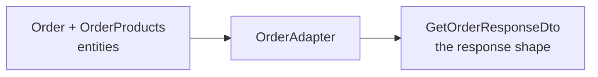
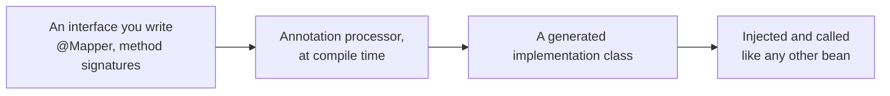

The envelope settles the outer shape of every response. What goes in `data` is still an open question, and for anything with relationships the answer is not the entity.

# Why an order cannot return itself

```java
1  public List<Order> getAllOrders() {
2      return orderRepository.findAll();
3  }
```

An `Order` holds a status and the fields inherited from `BaseEntity`. That is the entire class — the products in the order live in `OrderProducts`, which points at the order rather than the other way round.

So this returns a list of statuses and nothing a client could use. And returning entities has already been ruled out for other reasons: the association leaks, the internal shape becomes a public contract, and lazy loading fires wherever a serialiser touches it.

> [!important] The response needs a **shape of its own** — order details plus the items in it, assembled from more than one entity. That is a DTO, and here it takes two.

# The response DTOs

```java
1  // src/main/java/com/example/FakeCommerce/dtos/OrderItemResponseDto.java
2  @Data
3  @AllArgsConstructor
4  @NoArgsConstructor
5  @Builder
6  public class OrderItemResponseDto {
7
8      private Long productId;
9      private String productName;
10     private BigDecimal productPrice;
11     private String productImage;
12     private Integer quantity;
13     private BigDecimal subTotal;
14 }
```

One line of an order, flattened. The product's id, name, price and image sit alongside the quantity, so a client rendering a basket has everything in one object and never has to fetch a product separately.

> [!important] **`subTotal` exists in no table.** It is price multiplied by quantity, computed while building the response. A DTO is free to carry derived values — that is part of what makes it a different thing from the entity, which stores only facts.

```java
1  // src/main/java/com/example/FakeCommerce/dtos/GetOrderResponseDto.java
2  @Data
3  @AllArgsConstructor
4  @NoArgsConstructor
5  @Builder
6  public class GetOrderResponseDto {
7
8      private Long id;
9      private OrderStatus status;
10     private List<OrderItemResponseDto> items;
11     private LocalDateTime createdAt;
12     private LocalDateTime updatedAt;
13 }
```

The order, with its items nested inside it. The audit timestamps come through because a client showing an order usually wants to show when it was placed.

# The conversion has to live somewhere

Turning an `Order` plus its `OrderProducts` into a `GetOrderResponseDto` is real work, and it will be needed by every endpoint that returns an order — fetch all, fetch one, create, update.

Putting it in the service means writing it repeatedly, or writing a private method that grows until the service is mostly conversion code.

> [!important] The **adapter pattern**, also called the mapper pattern, gives the conversion its own class. One place holding the functions that turn type A into type B and back, so every caller shares one definition.



# The adapter

```java
1  // src/main/java/com/example/FakeCommerce/adapters/OrderAdapter.java
2  package com.example.FakeCommerce.adapters;
3
4  import java.math.BigDecimal;
5  import java.util.List;
6  import java.util.stream.Collectors;
7
8  import org.springframework.stereotype.Component;
9
10 import com.example.FakeCommerce.dtos.GetOrderResponseDto;
11 import com.example.FakeCommerce.dtos.OrderItemResponseDto;
12 import com.example.FakeCommerce.repositories.OrderproductsRepository;
13 import com.example.FakeCommerce.schema.Order;
14 import com.example.FakeCommerce.schema.OrderProducts;
15
16 import lombok.RequiredArgsConstructor;
17
18 @Component
19 @RequiredArgsConstructor
20 public class OrderAdapter {
21
22     private final OrderproductsRepository orderproductsRepository;
23
24     public List<GetOrderResponseDto> mapToGetOrderResponseDtoList(List<Order> orders) {
25         return orders.stream()
26                 .map(this::mapToGetOrderResponseDto)
27                 .collect(Collectors.toList());
28     }
29
30     public GetOrderResponseDto mapToGetOrderResponseDto(Order order) {
31
32         List<OrderProducts> orderProducts = orderproductsRepository.findByOrderId(order.getId());
33         List<OrderItemResponseDto> items = mapToOrderItemResponseDto(orderProducts);
34
35         return GetOrderResponseDto.builder()
36             .id(order.getId())
37             .status(order.getStatus())
38             .createdAt(order.getCreatedAt())
39             .updatedAt(order.getUpdatedAt())
40             .items(items)
41             .build();
42     }
43
44     public List<OrderItemResponseDto> mapToOrderItemResponseDto(List<OrderProducts> orderProducts) {
45         return orderProducts.stream()
46             .map(op -> OrderItemResponseDto.builder()
47                 .productId(op.getProduct().getId())
48                 .quantity(op.getQuantity())
49                 .productName(op.getProduct().getTitle())
50                 .productPrice(op.getProduct().getPrice())
51                 .productImage(op.getProduct().getImage())
52                 .subTotal(op.getProduct().getPrice().multiply(BigDecimal.valueOf(op.getQuantity())))
53                 .build())
54             .collect(Collectors.toList());
55     }
56 }
```

**Line 52 is where `subTotal` is computed.** `BigDecimal.multiply` takes a `BigDecimal`, and quantity is an `Integer`, so `BigDecimal.valueOf` converts it. Money stays in `BigDecimal` throughout — multiplying prices as doubles is how rounding errors get into invoices.

**Line 26 — `this::mapToGetOrderResponseDto`.** A method reference to the single-order function, so the list version is one line and there is one definition of the conversion.

## Why it is a bean

Line 32 is the interesting one. Getting the items means a query, because an `Order` has no reference to its `OrderProducts`.

> [!important] A repository is needed, so the adapter cannot be a class of static methods. **It becomes a `@Component` with the repository injected**, which is why lines 24, 30 and 44 are instance methods and why the service injects an `OrderAdapter` rather than calling a static utility.

That is a general point about this pattern. **An adapter that only rearranges fields can be static. One that has to fetch anything is a bean**, and the moment a conversion needs data the object does not already hold, it acquires dependencies like any other collaborator.

> [!info] The alternative was to give `Order` a lazily-loaded list of its `OrderProducts` and read it directly. That works, and it moves the query into the mapping rather than removing it.

## The service becomes trivial

```java
1  // src/main/java/com/example/FakeCommerce/services/OrderService.java
2  @Service
3  @RequiredArgsConstructor
4  public class OrderService {
5
6      private final OrderRespository orderRespository;
7      private final OrderAdapter orderAdapter;
8
9      public List<GetOrderResponseDto> getAllOrders() {
10         List<Order> orders = orderRespository.findAll();
11         return orderAdapter.mapToGetOrderResponseDtoList(orders);
12     }
13
14     public GetOrderResponseDto getOrderById(Long id) {
15         Order order = orderRespository.findById(id)
16             .orElseThrow(() -> new ResourceNotFoundException("Order not found with id: " + id));
17
18         return orderAdapter.mapToGetOrderResponseDto(order);
19     }
20 }
```

Fetch, convert, return. The service does not know how a DTO is assembled, and the adapter does not know why it was asked.

> [!warning] **This has an N+1 problem, and it is the one from the entity-relationships material.** Line 11 hands a list of orders to the adapter, which calls `mapToGetOrderResponseDto` per order, which runs `findByOrderId` per order. Fifty orders means one query for the orders and **fifty more** for their items. Worse, `op.getProduct()` on lines 47 to 52 touches a lazily-loaded product, so each item can trigger a query of its own. The fix is the familiar one — fetch the order products for all the orders in a single query and group them in memory, or use a `JOIN FETCH`. **Added beyond what was covered.**

# The controller

```java
1  @GetMapping
2  public ResponseEntity<ApiResponse<List<GetOrderResponseDto>>> getAllOrders() {
3      List<GetOrderResponseDto> orders = orderService.getAllOrders();
4      return ResponseEntity
5              .status(HttpStatus.OK)
6              .body(ApiResponse.success(orders, "Orders fetched successfully"));
7  }
```

Three layers of generics in the return type, and each one is doing a job: an HTTP response, wrapping an envelope, wrapping a list of order DTOs.

# MapStruct

Writing adapters by hand is repetitive. Most fields map by name, and the code says little beyond this field goes to that field.

> [!important] **MapStruct is a library that generates the mapping code.** You declare an interface describing what converts to what; an annotation processor writes the implementation at compile time.

```java
1  @Mapper
2  public interface CarMapper {
3
4      CarMapper INSTANCE = Mappers.getMapper(CarMapper.class);
5
6      @Mapping(source = "numberOfSeats", target = "seatCount")
7      CarDto carToCarDto(Car car);
8  }
```

**Line 1 — `@Mapper`** marks the interface for processing.

**Line 7 — a method signature and no body.** Input type in, output type out. Fields with matching names are mapped automatically, and simple conversions — an enum to a string, say — are handled without being asked.

**Line 6 — `@Mapping`** covers the fields that do not match. The car calls it `numberOfSeats` and the DTO calls it `seatCount`, so the correspondence is stated once.

> [!info] **Not run.** The example above is the library's own, kept as documentation rather than as something executed here. The adapter in this project is still hand-written.



Because it generates plain Java at compile time, there is no reflection at runtime and mapping mistakes surface as compilation errors rather than as nulls in a response.

> [!important] The trade is the usual one. **Hand-written adapters are explicit and obvious**, and get long. **MapStruct is concise** and puts a code generator between what you wrote and what runs, so debugging means reading generated source.

Either way the pattern is the same, and that is the part worth carrying: **conversion between an entity and a response shape is its own responsibility, and it belongs in its own place.**
