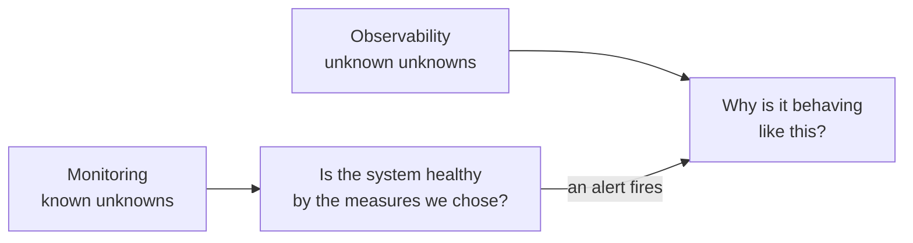
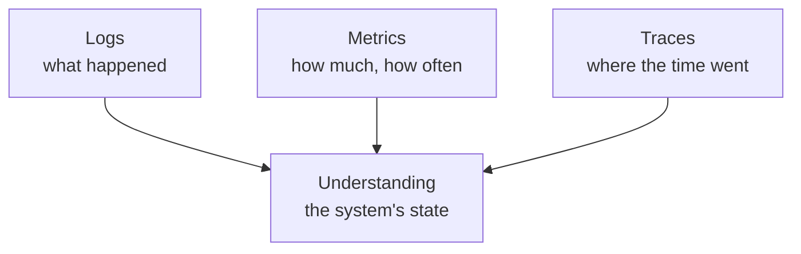

An application that works on your machine tells you everything by failing loudly in front of you. The same application on a server, serving strangers, tells you nothing at all unless it was built to. Closing that gap is a discipline with its own vocabulary, and two words in it are used interchangeably when they should not be.

# The dashboard in a car

You are driving. The engine is behind a closed bonnet and the fuel is in a sealed tank, and you cannot inspect either without stopping.

> [!important] So the car reports on itself. Fuel level, speed, engine temperature, revolutions, distance travelled, whether a seatbelt is unfastened — **a set of readings chosen in advance, taken by sensors installed for the purpose.**

The point is not the readings. It is that **your attention is on the road**, and the car interrupts you only when something needs it.

Every part of that maps onto a running system:

| In the car | In the system |
|---|---|
| Sensors on the fuel tank, the engine | Instrumentation in the code |
| The dashboard | A monitoring dashboard |
| The oil warning light | An alert |
| Driving, not watching gauges | Building features, not watching graphs |

# Monitoring

> [!important] **Monitoring is the process of collecting and analysing data about your application.** Latency per endpoint, error counts, CPU, memory, disk — measurements you decided in advance were worth taking.

The phrase that captures what it can do:

> [!important] Monitoring covers the **known unknowns**. You know which quantities matter; you do not know what they currently are. CPU usage is a known quantity with an unknown value, and monitoring is how the value becomes known.

That is genuinely useful and genuinely limited. Every metric on the dashboard is one somebody thought of beforehand.

# Observability

Now a different kind of question. Payments flowed through the system all month, and at month end the reconciled total is wrong by an amount nobody can explain.

No dashboard has a graph for that. Nobody anticipated it, so nobody instrumented for it.

> [!important] **Observability is how well you can understand the internal state of a system from the data it produces.** Not from the metrics you chose — from everything it emits, queried in ways you did not plan for.

> [!important] Observability covers the **unknown unknowns**. You do not yet know what is wrong, so you cannot know in advance which measurement would have revealed it.



**They are two halves of one loop.** Monitoring tells you something is wrong. Observability is what lets you find out why. An alert saying CPU is above threshold, with no way to investigate further, has told you almost nothing — you knew that already, and the useful question is what is consuming it.

# The three pillars

Observability is built out of three kinds of data, and each answers a different question.

## Logs

Records of what happened, written by the code as it runs.

> [!important] Logs are only as good as what you chose to write. A system that logs nothing is opaque no matter what tooling sits on top — **there has to be something to search.**

And they need to be **ingested** somewhere central and searchable. Logs sitting in a file on one server among fifty are technically present and practically unreachable.

## Metrics

Numbers over time. Request rate, error rate, queue depth, latency percentiles.

A good example that is not about CPU at all. A pipeline runs at each month end and takes about an hour to write a file:

```text
2026/
  April/
    data.txt
```

> [!important] The metric is: **by 23:30 on the last day of the month, `2026/April/data.txt` should exist and be larger than zero bytes.** Miss either condition and something upstream failed.

That is a metric about a business process, not a machine, and it demonstrates the general shape — **decide what true looks like, measure whether it is true, alert when it stops being true.**

## Traces

> [!important] A **trace** is the complete lifecycle of one request as it moves through the system — into a service, out to another service, into a database, back again — with timing at each step.

Metrics tell you the average request takes 400 ms. A trace tells you that for **this** request, 380 ms of it was one database call.



# A scenario worth remembering

This one comes up as an interview question and is a better teaching example than most.

**You are on call.** On call means a rotation where specific people handle production issues for a couple of weeks at a time, then hand over.

**An alert fires:** an API is returning multiple failures. You go to read the failure logs.

**There are no logs.** Not unhelpful logs — none at all, where there should be some.

> [!important] The instinct is to investigate the API. **The better first move is to ask why there are no logs**, because until that is answered you have no way to investigate anything else.

The usual answer: **the disk is full.** No space to append to the log file, so nothing was written. The API failures and the missing logs likely share that cause.

> [!important] And the second-order lesson is the real one. **A disk usage alert would have caught this before it became an outage.** The missing monitoring is itself the failure — you found out about a full disk by way of an unrelated API breaking and a debugging session.

# The tools

This is a solved problem, in the sense that you should not build it yourself.

| | |
|---|---|
| **SaaS** | Datadog, New Relic, Dynatrace |
| **Self-hosted** | Prometheus with Grafana, the ELK stack — Elasticsearch, Logstash, Kibana — Jaeger, SigNoz |

Two things worth knowing when choosing.

> [!info] **Most of these are language-agnostic.** The language you learn on is probably not the language you will be working in, so a tool that spans several is a better investment than one tied to a single ecosystem.

> [!important] **Self-hosted is not free, it is differently expensive.** The software costs nothing; the servers it runs on cost money, and so does the team maintaining it. Wanting an AI feature in your dashboard means somebody builds it. For a small company that is overhead with no relationship to the product.

Which is why hosted tools dominate at startups and large companies build their own — at sufficient scale, and under compliance rules about where data may be stored, the trade reverses.

# What to actually take from this

The tool matters far less than having done it once.

> [!important] **The hands-on experience transfers; the specific product does not.** Having instrumented one application, sent its data somewhere, built a dashboard and set an alert, you can do the same with any of them — the concepts are identical and only the buttons differ.
