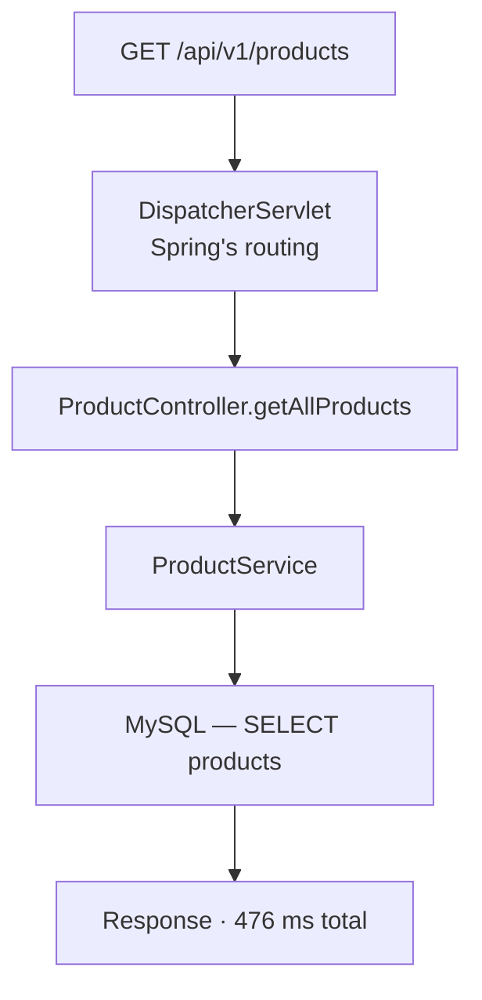

The agent is attached and data is arriving. What arrives is only useful if you know which numbers answer which question — and one of them routinely misleads people.

# The transaction trace

The most immediately useful view. One request, broken into segments, each timed.



> [!important] The value is not the total. It is **which segment holds it.** A 476 ms request tells you nothing actionable; a 476 ms request of which 400 ms is one query tells you exactly where to look.

This is the trace pillar doing its job — the path of one request through the layers, with the time attributed to each.

# Generating traffic to look at

One request produces one trace. Understanding behaviour under load needs load, and simulating it is a tool feature rather than something to build.

A load test defines **how many concurrent users**, **for how long**, and **with what shape** — a flat load, or a ramp up to a spike and back down.

> [!important] Shape matters. A steady load and a sudden spike expose different failures: **steady load finds throughput ceilings, spikes find cold starts, pool exhaustion and timeouts.**

A run against a single `GET` endpoint produced:

```text
1  Total requests      2,776
2  Requests per second 42
3  Average response    92 ms
4  Median              7 ms
5  p90                 106 ms
6  p95                 290 ms
7  p99                 2,000 ms
8  Error rate          0%
```

# Why the average is the wrong number

Read lines 3 and 4 together. **The average is 92 ms and the median is 7 ms.**

> [!important] Those cannot both describe a typical request. The median says half of all requests finished in **7 milliseconds**. The average is thirteen times higher, which means a minority of very slow requests is dragging it up.

The percentiles show where they are:

| | | |
|---|---|---|
| **Median** (p50) | 7 ms | Half of requests are at least this fast |
| **p90** | 106 ms | 90% are at least this fast |
| **p95** | 290 ms | |
| **p99** | **2,000 ms** | **1 in 100 requests took two seconds** |

> [!important] **The average hides the tail, and the tail is what users complain about.** At 42 requests per second, a p99 of 2 seconds means roughly one request every two and a half seconds takes two seconds. That is a steady trickle of people having a bad time, invisible in a number that reads as 92 ms.

Which is why service level objectives are written against percentiles rather than averages. **An average can be healthy while a meaningful fraction of traffic is failing to be.**

> [!info] **The reason for the tail is not in this data, and worth naming as an open question.** A p99 far above the median under a spike usually points at start-up effects — the connection pool growing to meet demand, the JIT compiler not yet having optimised the hot path, caches cold. Distinguishing those means running the test again against a warmed application and comparing. **Added beyond what was covered.**

# The rest of it

**Database view.** Slowest queries, throughput per query, time spent per operation. This is where an N+1 shows up as one query with an absurd call count rather than an absurd duration.

**Logs**, ingested and searchable, with a live tail. The value is not that logs exist — it is that they are searchable **across every server at once**, which is exactly what is impossible when they sit in files on individual machines.

**Errors inbox.** Exceptions grouped by type with full stack traces, so the same failure occurring a thousand times is one entry rather than a thousand.

# Trace IDs

Each request is assigned an identifier, and it appears on every log line that request produced.

> [!important] That identifier is what connects the pillars. **From a log line you can reach the trace it belongs to, and from a trace you can reach every log line it produced** — turning one error message into the full story of the request that caused it.

> [!warning] It does not always resolve. Traces are **sampled** — agents cap how many they store per interval, so a log line's trace may simply not have been kept. A log written outside a request has no trace to link to at all. **Failing to find a trace by id is not proof the request did not happen.**

# Alerts

A dashboard nobody is looking at is not monitoring. Alerts are the part that reaches you.

An alert condition needs three things:

**A query** — what to measure. **A threshold** — what value is unacceptable. **A destination** — email, Slack, a webhook, or an on-call system that phones someone.

> [!info] A well-built alert also carries a **runbook** — a document telling whoever is woken up what this alert means and what to do about it. An alert that fires at 3am with no runbook is a puzzle handed to someone half asleep.

**Alert on symptoms rather than causes** where you can. High CPU may be fine; a rising error rate never is.

# Retention

Data is stored, storage costs money, and the tool bills by volume.

> [!important] **Retention is a real decision, not a default to ignore.** Application logs are usually wanted for days or weeks — an on-call engineer investigating an incident wants this morning, not last year. Aggregated metrics are cheap and worth keeping far longer, because they show trends.

Free tiers are typically generous enough for learning — on the order of 100 GB a month — and the number matters the moment a real system starts logging.

# The habit worth forming

> [!important] All of this is only useful if you look at it **when nothing is wrong.** Knowing your endpoint normally runs at 7 ms median and 106 ms p90 is what makes an incident diagnosable — otherwise the first time you read the dashboard is during an outage, with no idea which numbers are abnormal.
