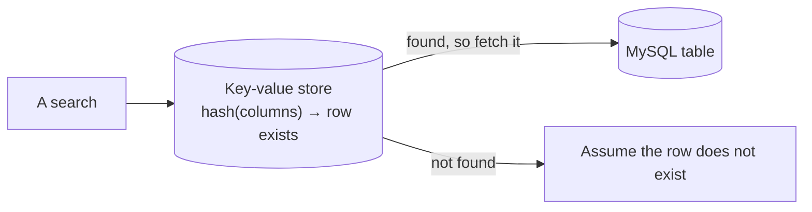

The failures worth studying are rarely the ones a framework catches. Two incidents below broke systems that had no bugs in the ordinary sense — the code did exactly what it said, and what it said was incomplete.

# Two stores, one truth

A table in MySQL, with an index of its own — not a database index, but **a separate key-value store** holding the lookup.

The key was computed: several columns from a row, passed through a hash function, producing the key under which that row could be found. A composite key, hashed into one value.



> [!important] **All searching went through the index.** Application code never queried the table to ask whether a row existed — it asked the index, and trusted the answer.

Deleting therefore meant two operations: remove from the index, remove from the table. A script did both, in that order.

## The failure

A new script deleted from the table and **not from the index**.

No error. Both stores accepted their instructions; only one was given any.

> [!warning] The index now claimed rows existed that did not. Every search found the key, concluded the row was present, and behaved accordingly — **the system was confidently wrong**, which is worse than being unable to find something.

And it could not be undone by re-inserting. Inserting went through the same path, the index reported the key already present, and the write was rejected as a duplicate. **The stale index blocked the repair.**

## Getting out

No delete API existed — deliberately, to stop exactly this. Direct access to either store was blocked by policy. Everything went through scripts using the ORM, and the ORM consulted the index first.

The route out was to bypass the abstraction entirely: **read the source of the hash function, work out which columns fed it, recompute the keys by hand**, and delete them from the key-value store directly.

> [!important] Two things made this survivable. It was a **test environment**, where the team had access they would not have in production. And the data was a replica, so the correct contents were recoverable from elsewhere.

> [!info] In production, permissions would have prevented it. **Delete rights on production tables are not granted to individual engineers** at most companies — which is not distrust, it is the recognition that a script with a missing line is an ordinary mistake with unbounded consequences.

## What it teaches

> [!important] **When two stores must agree, something has to guarantee they do.** Two writes with nothing binding them is a system that is correct only while every code path remembers both. It stays correct until the first script written by someone who did not know.

Fixes exist — a transaction spanning both, an outbox pattern, or making one store derived from the other so it cannot drift independently. What does not work is remembering.

> [!important] And the second lesson: **an abstraction that always goes through one path leaves no way around it when that path is wrong.** The ORM's consistency was a feature until the index was lying, at which point there was no supported way to repair the thing the index was lying about.

# A missing semicolon

A platform where SQL was written as raw strings in the code.

The query was tested by pasting it into a database client. It ran, returned the right rows, and was approved — with a screenshot of the client as the evidence, since a string cannot be unit tested.

**It had no semicolon.**

> [!important] Most database clients tolerate a missing terminator on a single statement. The production path did not — those queries were **concatenated and executed as a batch**, where the semicolon is what separates one statement from the next.

Without it, the batch was malformed. The job failed, and the service was down for a couple of hours.

## Why it got through

Nothing in the process was skipped. The query was tested, reviewed and approved.

> [!warning] **It was tested in an environment that behaved differently from production.** The client accepted what the batch executor would not, so the test could pass while the thing being tested was broken.

And the untestability was structural:

> [!important] **SQL held in a string is invisible to the compiler and to unit tests.** The code compiles regardless of what the string contains; a unit test can assert the string equals itself. The only way to know it works is to execute it — and it was executed somewhere with different rules.

Which is an argument, made concrete, for JPQL and derived queries. **A query the framework parses is a query something can be wrong about at build time.**

## And on blame

> [!important] The reviewer approved it too. A process that produces an outage is a process failure, not one person's — and companies that expect speed do not usually penalise mistakes of this size, because **people who ship a lot make more mistakes in absolute terms while making fewer per unit of work.**

Severity is judged by impact. Breaking a customer-facing homepage and breaking an internal reporting job that recovers in two hours are not the same event, whatever the code looked like.

# Logging so this is diagnosable

Both incidents ended with someone reconstructing what happened. What makes that possible is logs.

## `@Slf4j`

```java
1  // src/main/java/com/example/FakeCommerce/services/CategoryService.java
2  @Slf4j
3  @Service
4  @RequiredArgsConstructor
5  public class CategoryService {
6
7      public void deleteCategory(Long id) {
8          categoryRepository.deleteById(id);
9          log.info("Category with id {} deleted", id);
10     }
11 }
```

> [!important] **`@Slf4j` is a Lombok annotation that generates a `log` field** for the class. No injection, no declaration. SLF4J itself — Simple Logging Facade for Java — is an interface, so the implementation behind it can change without your code changing.

## Levels

| | |
|---|---|
| `error` | Something failed and needs attention |
| `warn` | Something unexpected that did not fail |
| `info` | Notable events in normal operation |
| `debug` | Detail for diagnosing, usually off in production |

> [!important] Levels are what makes logs filterable. **A production system logging everything at one level is as unsearchable as one logging nothing** — you cannot find the failures among the noise.

> [!info] Line 9 uses `{}` rather than string concatenation. The message is only assembled if that level is enabled, so a `debug` line costs nothing when debug is off.

## Why the stack trace is not enough

The instinct is that exceptions cover this. They do not.

> [!important] **A stack trace exists only when something throws.** Money debited from one account and never credited to the other produces no exception — every step succeeded, the flow completed, and the outcome is wrong. **There is nothing to catch.**

The only trace of that is what you logged deliberately: debit attempted, debit succeeded, credit attempted. Absence in that sequence is the evidence.

> [!important] So logging is a design activity, not a fallback. **Log the steps a future investigator will need to reconstruct what happened** — which is a different question from where the code might throw.

> [!info] Automatic logging via aspects can wrap methods and record entry, exit and exceptions. It gives structure for free and cannot know which business events matter, so it complements deliberate logging rather than replacing it. Not every ecosystem offers it.

## Getting them somewhere useful

Logs on a server are only useful if you can reach them, which is where this meets the previous folder — ingested centrally, searchable, and linked to traces by request id.

> [!info] Separate log files per module are configured through `logback-spring.xml` when you need them. Most ingestion services partition and index for you, which is usually the better answer than managing files.

# The through-line

> [!important] None of these were coding errors in the usual sense. A script that did half of a two-part operation. A string that was valid in one execution context and not another. **Both were correct in the small and wrong in the system**, and both were found by reading logs rather than by reading code.
