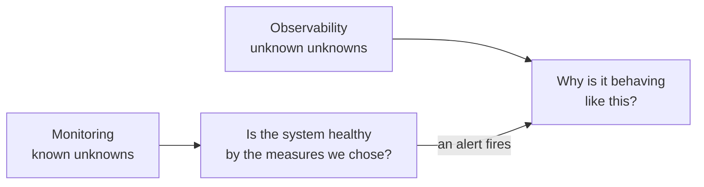
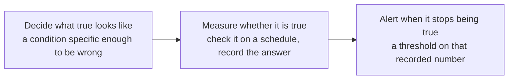
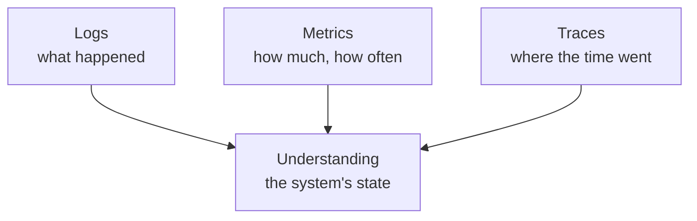

An application that works on your machine tells you everything by failing loudly in front of you. The same application on a server, serving strangers, tells you nothing at all unless it was built to. Closing that gap is a discipline with its own vocabulary, and two words in it are used interchangeably when they should not be.

# The dashboard in a car

You are driving. The engine is behind a closed bonnet and the fuel is in a sealed tank, and you cannot inspect either without stopping.

> [!important] So the car reports on itself. Fuel level, speed, engine temperature, revolutions, distance travelled, whether a seatbelt is unfastened — **a set of readings chosen in advance, taken by sensors installed for the purpose.**

The point is not the readings. It is that **your attention is on the road**, and the car interrupts you only when something needs it.

Every part of that maps onto a running system:

| In the car | In the system |
|---|---|
| Sensors on the fuel tank, the engine | Instrumentation in the code |
| The dashboard | A monitoring dashboard |
| The oil warning light | An alert |
| Driving, not watching gauges | Building features, not watching graphs |

# Monitoring

> [!important] **Monitoring is the process of collecting and analysing data about your application.** Latency per endpoint, error counts, CPU, memory, disk — measurements you decided in advance were worth taking.

The phrase that captures what it can do:

> [!important] Monitoring covers the **known unknowns**. You know which quantities matter; you do not know what they currently are. CPU usage is a known quantity with an unknown value, and monitoring is how the value becomes known.

That is genuinely useful and genuinely limited. Every metric on the dashboard is one somebody thought of beforehand.

# Observability

Now a different kind of question. Payments flowed through the system all month, and at month end the reconciled total is wrong by an amount nobody can explain.

No dashboard has a graph for that. Nobody anticipated it, so nobody instrumented for it.

> [!important] **Observability is how well you can understand the internal state of a system from the data it produces.** Not from the metrics you chose — from everything it emits, queried in ways you did not plan for.

> [!important] Observability covers the **unknown unknowns**. You do not yet know what is wrong, so you cannot know in advance which measurement would have revealed it.



They are two halves of one loop. 

> Monitoring tells you **something is wrong**. Observability is **what lets you find out why**. 
> An alert saying CPU is above threshold, **with no way to investigate further, has told you almost nothing** — you knew that already, and the useful question is what is consuming it.

# The three pillars

Observability is built out of three kinds of data, and each answers a different question.

## Logs

Records of what happened, written by the code as it runs.

> [!important] Logs are only as good as what you chose to write. A system that logs nothing is opaque no matter what tooling sits on top — **there has to be something to search.**

And they need to be **ingested** somewhere central and searchable. Logs sitting in a file on one server among fifty are technically present and practically unreachable.

## Metrics

Numbers over time. Request rate, error rate, queue depth, latency percentiles.

Those arrive for free. The machine is already counting requests and already knows how much memory it is holding, so nobody had to decide those numbers were worth having. That is also their limit: **every one of them can look perfect while the thing the business actually needs is broken.** Every server at twenty percent CPU, no errors anywhere, every health check green, and the report finance needs on the first of the month does not exist. No machine metric can see that, because nothing about it is a machine problem.

So here is a metric with no CPU in it anywhere. A pipeline runs at each month end, takes about an hour, and its entire purpose is to produce one file:

```text
2026/
  April/
    data.txt
```

Nobody cares what the job did while it ran. The only thing that matters is what is sitting on disk afterwards, which makes the success condition easy to write down:

> [!important] By 23:30 on the last day of the month, `2026/April/data.txt` exists and is larger than zero bytes. Miss either condition and something upstream failed.

Three deliberate choices are packed into that sentence.

**Exists** catches the job never starting, or dying before it wrote anything — a scheduler that did not fire, an expired credential, an upstream feed that never arrived.

**Larger than zero bytes** catches a failure the first check cannot see at all. Most programs create the output file up front and write into it as they go, so a job that opens the file and then dies leaves a real, present, entirely empty file behind. The existence check says yes. The data is still gone. Size is what separates started from finished.

**By 23:30** is what turns a wish into something checkable. The job takes an hour, so half past eleven leaves margin and still lands inside the month. Without a deadline there is no moment at which anyone is entitled to say it failed — the answer is always that it might still be coming.

Written down that way it stops being a one-off look at a folder and becomes a number over time, which is what a metric is. Sample the file size once a night and it reads zero for most of the month and jumps to a few million on the last day; the alert is then a threshold on that number, using exactly the same machinery that watches CPU.

That is the general shape, and it holds for anything worth watching.



The first step is the one that has to be done by hand. Request rate and memory exist whether anybody thinks about them or not; a metric about a business process exists only because somebody sat down and wrote the sentence.

> [!info] Notice what the check does not say. It reports that the outcome is wrong, not which of the stages upstream broke — the words are that something upstream failed, and no more than that. Which is monitoring doing its job, and exactly where logs and traces have to take over.

## Traces

> [!important] A **trace** is the complete lifecycle of one request as it moves through the system — into a service, out to another service, into a database, back again — with timing at each step.

Metrics tell you the average request takes 400 ms. A trace tells you that for **this** request, 380 ms of it was one database call.



# A scenario worth remembering

This one comes up as an interview question and is a better teaching example than most.

**You are on call.** On call means a rotation where specific people handle production issues for a couple of weeks at a time, then hand over.

**An alert fires:** an API is returning multiple failures. You go to read the failure logs.

**There are no logs.** Not unhelpful logs — none at all, where there should be some.

> [!important] The instinct is to investigate the API. **The better first move is to ask why there are no logs**, because until that is answered you have no way to investigate anything else.

The usual answer: **the disk is full.** No space to append to the log file, so nothing was written. The API failures and the missing logs likely share that cause.

> [!important] And the second-order lesson is the real one. **A disk usage alert would have caught this before it became an outage.** The missing monitoring is itself the failure — you found out about a full disk by way of an unrelated API breaking and a debugging session.

# The tools

This is a solved problem, in the sense that you should not build it yourself.

| | |
|---|---|
| **SaaS** | Datadog, New Relic, Dynatrace |
| **Self-hosted** | Prometheus with Grafana, the ELK stack — Elasticsearch, Logstash, Kibana — Jaeger, SigNoz |

Two things worth knowing when choosing.

> [!info] **Most of these are language-agnostic.** The language you learn on is probably not the language you will be working in, so a tool that spans several is a better investment than one tied to a single ecosystem.

> [!important] **Self-hosted is not free, it is differently expensive.** The software costs nothing; the servers it runs on cost money, and so does the team maintaining it. Wanting an AI feature in your dashboard means somebody builds it. For a small company that is overhead with no relationship to the product.

The paid tiers make the same point from the other end. A free allowance of **100 GB of data a month** is generous for learning and irrelevant to a company at the scale of Swiggy, which will exceed it and pay. Choose the open-source stack instead and the bill does not disappear — it moves to AWS, because that infrastructure has to run somewhere.

> [!important] **Nothing is free.** It is the same arithmetic as a video on YouTube: somebody spent their time making it, Google is paying to serve it, and the money comes out of you one way or another. Open-source observability is free to license and not free to operate.

And running it locally is not the same as running it. **A CTO at Zomato does not want each engineer starting Prometheus on their laptop** — there has to be one central deployment the whole company reads from, which is a system somebody owns, upgrades and is woken up by.

Which is why hosted tools dominate at startups and large companies build their own — at sufficient scale, and under compliance rules about where data may be stored, the trade reverses.

The comparison is sharper than the table suggests, because the two columns are not the same product with different price tags.

| | Prometheus with Grafana | A hosted platform |
|---|---|---|
| **Where it runs** | On servers you provision and maintain | On theirs |
| **Metrics** | Yes, and it is very good at them | Yes |
| **Dashboards** | Grafana, with many pre-built | Included, with many pre-built |
| **Notifications** | Not in Prometheus itself — a separate component | Built in, wired to email, Slack, on-call tools |
| **Getting started** | Config files and containers before the first chart | An account and an agent |

> [!important] **The notification gap is the one that decides it for a first attempt.** Prometheus collects and stores; it does not, on its own, wake anybody up. Getting from a threshold being crossed to a person being told requires assembling another piece — which is entirely doable, and is one more thing to install and understand before the exercise has taught you anything about observability itself.

A commercial platform ships that half already built. New Relic sends alerts into **Slack, Microsoft Teams and Telegram** out of the box, among others, so the path from a crossed threshold to a person reading a message is configuration rather than construction. That is a large part of what the bill buys: not better data, but fewer pieces to assemble before the data reaches somebody.

Which is the argument for learning on a hosted tool and not a statement about which is better. **The concepts are the same in both**, and the one that gets you to a working alert fastest is the one that teaches them soonest.

# What to actually take from this

The tool matters far less than having done it once.

> [!important] **The hands-on experience transfers; the specific product does not.** Having instrumented one application, sent its data somewhere, built a dashboard and set an alert, you can do the same with any of them — the concepts are identical and only the buttons differ.
