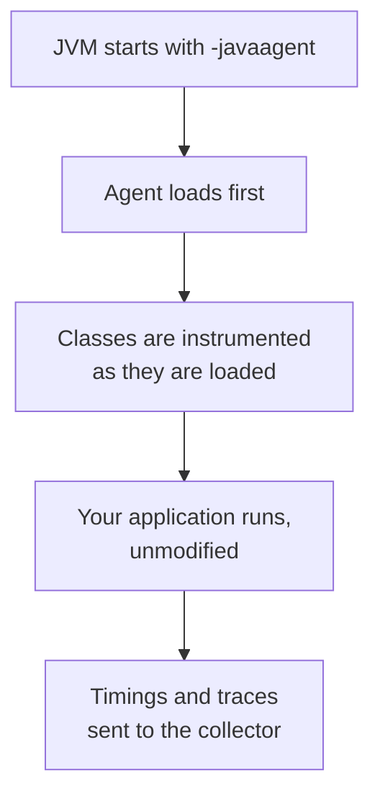

Logs, metrics and traces all require the application to emit them. The interesting part of instrumenting a Spring Boot application is how little of it involves changing the application.

# Two ways in

| Approach         | What it is                                                                           |
| ---------------- | ------------------------------------------------------------------------------------ |
| **A Java agent** | A jar attached to the JVM at startup, which instruments the application from outside |
| **Micrometer**   | A library added as a dependency, which the application uses to publish metrics       |

Micrometer is a metrics facade — you add it, and it collects and forwards. The agent approach is what vendors typically recommend, and it is the one worth understanding first because of what it demonstrates.

> [!important] **A Java agent requires no code changes at all.** No dependency in `build.gradle`, no imports, no annotations. The application is unaware it is being observed.

# What a Java agent is

A JVM feature, not a Spring one.

> [!important] The JVM accepts a `-javaagent` flag pointing at a jar. That jar is given the chance to **inspect and rewrite classes as they are loaded**, before the application runs.

Which is how a tool with no knowledge of your code can time your controller methods and your database calls: it recognises framework classes — Spring's dispatcher, the JDBC driver — and wraps them as they load.



That is also its limitation. **It can only instrument what it recognises.** Anything specific to your domain has to be instrumented deliberately.

# Setting it up

Four steps, and only one touches the project's build.

> [!warning] **The account is created in one of two regions, US or Europe, and the choice is made at signup.** Logging in afterwards redirects to whichever you picked — `one.eu.newrelic.com` rather than `one.newrelic.com` for a European account. Nothing is wrong when the URL does not match the one in the documentation, but it is worth recognising rather than assuming a redirect has gone astray.

## Get the agent

Download and unzip the vendor's agent archive. Two files matter:

| File | |
|---|---|
| `newrelic.jar` | The agent itself |
| `newrelic.yml` | Its configuration |

Both go in a folder beside `build.gradle`:

```text
project/
├── build.gradle
├── newrelic/
│   ├── newrelic.jar
│   └── newrelic.yml
└── src/
```

> [!info] The location is not arbitrary — the agent expects its jar and configuration to sit together. Some vendors also offer a Gradle task that downloads and unzips it as part of the build, which is worth preferring once you know what it produces.

## Configure it

Three fields in `newrelic.yml` matter; everything else has a working default.

| Field | |
|---|---|
| `app_name` | What this application is called in the dashboard |
| `license_key` | Authenticates to your account |
| `log_level` | How much the agent itself logs. `info` is the default |

## Keep the key out of the file

The obvious move is to paste the licence key into `newrelic.yml`. Do not.

> [!warning] **`newrelic.yml` lives in the project, and the project is in version control.** A licence key written into it is a credential committed to a repository — and it stays in the history even after you remove it.

The agent reads environment variables, which is the way around it:

```bash
  export NEW_RELIC_LICENSE_KEY=your-key-here
  export NEW_RELIC_APP_NAME=spring-boot-fakecommerce
```

> [!important] **Configuration that varies by environment or must stay secret does not belong in a file you commit.** The same reasoning applies to database passwords, API keys and anything else that differs between your machine and production.

> [!info] A key like this is normally shown once at creation and never again. Copy it when it is offered.

## Attach it at startup

The only change to the project. In `build.gradle`:

```groovy
  tasks.named('bootRun') {
      jvmArgs = ['-javaagent:newrelic/newrelic.jar']
  }
```

Now `./gradlew bootRun` starts the JVM with the agent attached.

> [!info] For a deployed application the same flag goes on the `java` command: `java -javaagent:/path/newrelic.jar -jar app.jar`. The Gradle task is the development equivalent.

# Verifying it worked

Start the application and watch for agent lines in the startup log, then check the dashboard. A newly connected application appears under APM and services by the name you configured.

> [!important] **The absence of an error does not mean it connected.** The application starts perfectly well with a misconfigured agent — a wrong key or an unreachable collector produces a running application that reports nothing. Confirm the application appears in the dashboard.

Data does not arrive instantly:

> [!info] The agent **buffers and sends in batches**, typically about every 60 seconds. An empty dashboard immediately after startup is expected. Send a few requests, wait a minute, then refresh.

# What you get without asking

This is the payoff for the agent approach, and it is a lot for four steps and no code changes:

- **Every HTTP endpoint** timed, with throughput and error rate
- **Every database query** timed and attributed to the request that issued it
- **A transaction trace** per request, broken down by segment
- **Application logs** forwarded and searchable
- **JVM metrics** — heap, threads, garbage collection

> [!important] None of that required an import. The agent recognised Spring's dispatcher, your controllers and the JDBC driver, and instrumented them as they loaded — which is the whole argument for doing it this way.

# Where it stops

The agent knows about frameworks. It does not know about your business.

> [!important] It can tell you `POST /api/v1/orders` took 400 ms. It cannot tell you **how many orders were placed**, what they were worth, or how many failed payment — because those are facts about your domain, and nothing in the bytecode identifies them as interesting.

Domain metrics need deliberate instrumentation: Micrometer counters, or the vendor's API called from your own code. Which is the natural division — **the agent handles the infrastructure layer for free, and you write the part only you could know.**

There are three routes across that boundary, and they are worth knowing before reaching for the first one.

| | |
|---|---|
| **Micrometer** | A dependency and a counter or timer in your code, published through a registry |
| **The vendor's API** | Their client library, called directly from your code |
| **Plain HTTP** | A `POST` of a metric payload to an ingest endpoint, authenticated with the same licence key |

> [!important] The third one matters more than it looks. **A metric endpoint that accepts an authenticated HTTP request can be called by anything** — a shell script, a cron job, a service written in a language the vendor has no agent for. The month-end pipeline check from the first note is exactly this shape: something that is not your application, reporting a number your application could never know.

Most of these platforms also expose REST and GraphQL APIs for reading back what they hold, which is what makes it possible to script a report or wire a metric into something else.

> [!info] The pattern generalises past this one vendor. **An observability tool that can only be fed by its own agent is a tool you will eventually fight**; one with an open ingest endpoint can be fed by whatever you already have.
