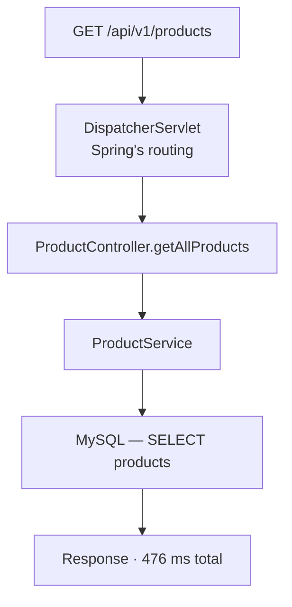
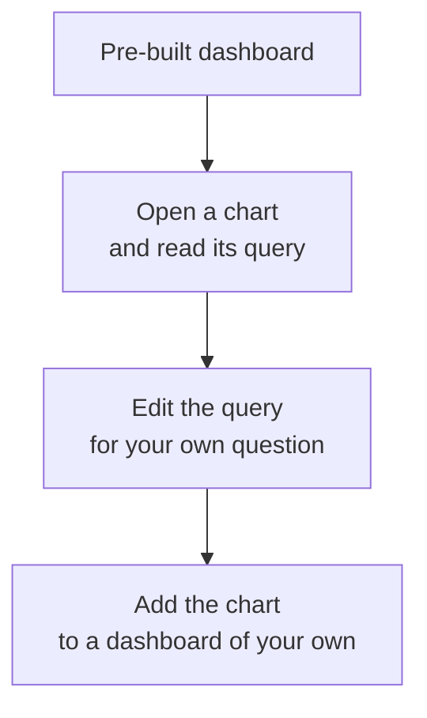
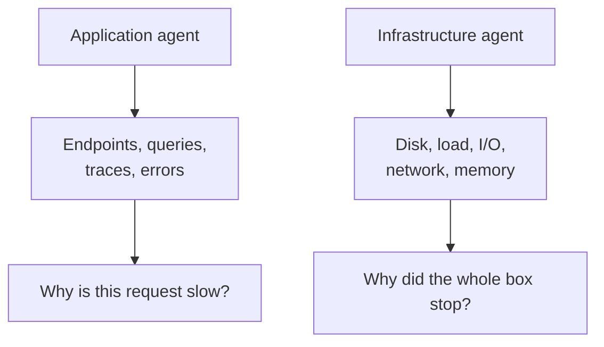

The agent is attached and data is arriving. What arrives is only useful if you know which numbers answer which question — and one of them routinely misleads people.

# The transaction trace

The most immediately useful view. One request, broken into segments, each timed.



> [!important] The value is not the total. It is **which segment holds it.** A 476 ms request tells you nothing actionable; a 476 ms request of which 400 ms is one query tells you exactly where to look.

This is the trace pillar doing its job — the path of one request through the layers, with the time attributed to each.

# Generating traffic to look at

One request produces one trace. Understanding behaviour under load needs load, and simulating it is a tool feature rather than something to build.

A load test defines **how many concurrent users**, **for how long**, and **with what shape** — a flat load, or a ramp up to a spike and back down.

> [!important] Shape matters. A steady load and a sudden spike expose different failures: **steady load finds throughput ceilings, spikes find cold starts, pool exhaustion and timeouts.**

A run against a single `GET` endpoint produced:

```text
1  Total requests      2,776
2  Requests per second 42
3  Average response    92 ms
4  Median              7 ms
5  p90                 106 ms
6  p95                 290 ms
7  p99                 2,000 ms
8  Error rate          0%
```

# Why the average is the wrong number

Read lines 3 and 4 together. **The average is 92 ms and the median is 7 ms.**

> [!important] Those cannot both describe a typical request. The median says half of all requests finished in **7 milliseconds**. The average is thirteen times higher, which means a minority of very slow requests is dragging it up.

The percentiles show where they are:

| | | |
|---|---|---|
| **Median** (p50) | 7 ms | Half of requests are at least this fast |
| **p90** | 106 ms | 90% are at least this fast |
| **p95** | 290 ms | |
| **p99** | **2,000 ms** | **1 in 100 requests took two seconds** |

> [!important] **The average hides the tail, and the tail is what users complain about.** At 42 requests per second, a p99 of 2 seconds means roughly one request every two and a half seconds takes two seconds. That is a steady trickle of people having a bad time, invisible in a number that reads as 92 ms.

Which is why service level objectives are written against percentiles rather than averages. **An average can be healthy while a meaningful fraction of traffic is failing to be.**

> [!info] **The reason for the tail is not in this data, and worth naming as an open question.** A p99 far above the median under a spike usually points at start-up effects — the connection pool growing to meet demand, the JIT compiler not yet having optimised the hot path, caches cold. Distinguishing those means running the test again against a warmed application and comparing. **Added beyond what was covered.**

# The rest of it

**Database view.** Slowest queries, throughput per query, time spent per operation. This is where an N+1 shows up as one query with an absurd call count rather than an absurd duration.

**Logs**, ingested and searchable, with a live tail. The value is not that logs exist — it is that they are searchable **across every server at once**, which is exactly what is impossible when they sit in files on individual machines.

**Errors inbox.** Exceptions grouped by type with full stack traces, so the same failure occurring a thousand times is one entry rather than a thousand.

**JVM internals**, including a breakdown of where threads spend their time. A thread state view answers a question the endpoint timings cannot: whether the application is slow because it is computing, or slow because it is waiting. Threads parked on a database call, on a lock, or on a full connection pool all look like a slow endpoint from outside and are three different problems.

> [!warning] **Timestamps default to UTC.** A dashboard showing 4:42 while your terminal shows 10:12 is not a delay in the pipeline, it is a time zone. This is worth fixing in the display settings early, because the alternative is comparing a dashboard against local log files and quietly concluding that events happened in an order they did not.

# Building a dashboard

The views above are supplied ready-made. They cover what is true of every web application — endpoints, queries, errors — which is exactly why they cannot cover what is true of yours.

> [!important] **A pre-built dashboard is a starting point, not a destination.** It knows your application serves HTTP and talks to a database. It does not know that the checkout endpoint matters more than the health check, or that one particular query is the one that wakes people up.

So dashboards can be assembled by hand. A dashboard is a collection of charts, and **a chart is a query** — written in the tool's own query language, which in this one is called NRQL and reads like SQL over event data rather than tables.



That loop is the useful one. **Starting from a blank query editor means learning a query language before asking a question**; starting from a working chart means changing one clause in something that already returns data. The pre-built dashboards are, among other things, a worked set of examples.

> [!info] Dashboard definitions are portable to a degree — this tool can import dashboards built for Grafana. The queries underneath are not portable, so what transfers is the layout and the intent rather than a working dashboard.

# Trace IDs

Each request is assigned an identifier, and it appears on every log line that request produced.

> [!important] That identifier is what connects the pillars. **From a log line you can reach the trace it belongs to, and from a trace you can reach every log line it produced** — turning one error message into the full story of the request that caused it.

> [!warning] It does not always resolve. Traces are **sampled** — agents cap how many they store per interval, so a log line's trace may simply not have been kept. A log written outside a request has no trace to link to at all. **Failing to find a trace by id is not proof the request did not happen.**

# Alerts

A dashboard nobody is looking at is not monitoring. Alerts are the part that reaches you.

An alert condition needs three things:

**A query** — what to measure. **A threshold** — what value is unacceptable. **A destination** — email, Slack, a webhook, or an on-call system that phones someone.

None of the three has to be written from nothing. The tool proposes a set of **recommended conditions** for an application it has been watching — error rate, response time, throughput dropping to zero — and each arrives as a pre-written query that can be edited rather than replaced.

> [!important] **Accepting the recommended set is a better first move than designing alerts from scratch.** They cover the failures common to every web application, they are live within a minute, and the exercise of reading their queries teaches more about the query language than a blank editor does. Domain-specific alerts come after, once the obvious ones are already firing correctly.

One setting is easy to skip past and matters at three in the morning: **how many issues a condition creates.** Grouping everything under one policy produces a single issue no matter how many endpoints break, which keeps a widespread outage from becoming two hundred separate pages. Grouping per condition and per signal produces one issue per broken thing, which is what you want when failures are independent and each needs its own owner.

> [!warning] The wrong choice is invisible until an incident. **Fine-grained grouping during a broad outage buries the on-call in duplicate alerts** for what is actually one cause; coarse grouping during unrelated failures hides the second problem behind the first.

> [!info] A well-built alert also carries a **runbook** — a document telling whoever is woken up what this alert means and what to do about it. An alert that fires at 3am with no runbook is a puzzle handed to someone half asleep.

**Alert on symptoms rather than causes** where you can. High CPU may be fine; a rising error rate never is.

# Monitoring the machine as well

Everything so far comes from the agent attached to the application, and it can only see what the application does. A separate agent installs on the host itself and reports on the machine.

| | |
|---|---|
| **Application agent** | Endpoints, queries, traces, errors, JVM internals |
| **Infrastructure agent** | Disk utilisation, system load, disk I/O, network packets, memory |

> [!important] These answer different questions, and **the second one is where the on-call scenario ends.** An API failing with no logs to explain it, because the disk was full, is invisible to the application agent — the application never saw a disk. The alert that would have caught it before it became an outage is a disk utilisation threshold on the host, and only the infrastructure agent can raise it.

Setting one at 80% is the standard move, and the reasoning is about lead time rather than danger: **a disk at 80% is not a problem, it is the last convenient moment to fix one.** Waiting until 100% means the alert arrives at the same time as the outage.



# Retention

Data is stored, storage costs money, and the tool bills by volume.

> [!important] **Retention is a real decision, not a default to ignore.** Application logs are usually wanted for days or weeks — an on-call engineer investigating an incident wants this morning, not last year. Aggregated metrics are cheap and worth keeping far longer, because they show trends.

Free tiers are typically generous enough for learning — on the order of 100 GB a month — and the number matters the moment a real system starts logging.

Two mechanisms turn that decision into something enforceable, and they act at different moments.

**Drop filters discard log events before they are stored.** A rule matches events — a noisy health check, a debug line from a chatty library — and they are thrown away on arrival. Nothing is billed and nothing is searchable, because nothing was kept.

**Data partitions route logs into separate namespaces**, each with its own retention period. Application logs can be kept for a week while audit logs are kept for a year, in the same account, without either policy compromising for the other.

> [!important] The distinction is worth holding on to. **A drop filter is a decision that data has no value; a partition is a decision about how long its value lasts.** Confusing them is how a team ends up dropping the one log line that would have explained an incident, in order to save storage on data they could have partitioned instead.

# The habit worth forming

> [!important] All of this is only useful if you look at it **when nothing is wrong.** Knowing your endpoint normally runs at 7 ms median and 106 ms p90 is what makes an incident diagnosable — otherwise the first time you read the dashboard is during an outage, with no idea which numbers are abnormal.
