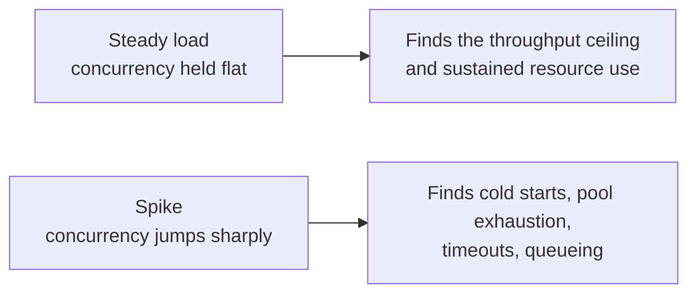
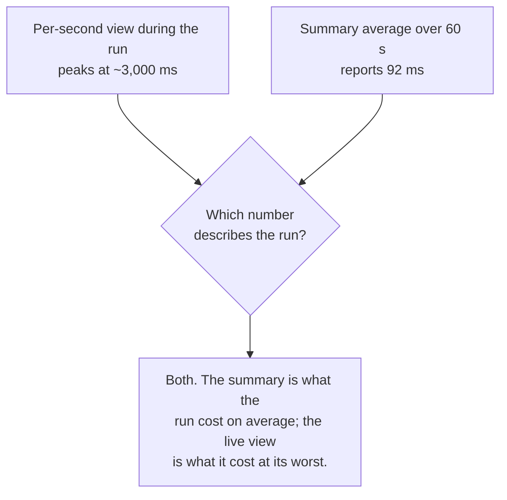
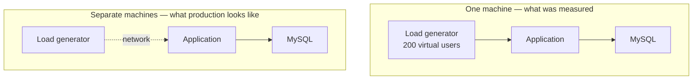

The percentiles in the previous note did not appear on their own. They came from a run that produced traffic deliberately, and producing that traffic is its own small subject — with its own tools, its own settings, and one caveat that changes how the resulting numbers should be read.

# One request is not a measurement

Hitting an endpoint by hand gives one trace and one duration. That is enough to see the shape of a request and to find an obviously slow segment, and it is not enough for anything else.

> [!important] **A percentile needs a population.** A p99 is the value that one request in a hundred exceeds, so it means nothing until at least a few hundred requests exist. Median, p90 and p99 are all statements about a distribution, and clicking Send a dozen times does not produce one.

Neither does it produce the conditions the numbers are supposed to describe. A single request arrives at an idle application with a free connection, an empty queue and no competition for CPU. Real traffic arrives while other traffic is still being served, and most of what goes wrong under load only exists because requests overlap.

So the traffic has to be generated — many requests, at a controlled rate, for a controlled length of time.

# What a load test defines

Three things, and the third is the one people skip.

| | |
|---|---|
| **Concurrency** | How many simulated users are sending requests at the same time |
| **Duration** | How long the run lasts |
| **Shape** | How concurrency changes over that duration |

A simulated user, usually called a virtual user, is one thread of activity — it sends a request, waits for the response, and sends the next. Fifty virtual users means fifty requests in flight at once, not fifty requests in total.

> [!important] **Shape is what separates two very different tests.** A flat load held steady finds the point where throughput stops rising — the ceiling. A sharp spike finds everything that is slow only when it is cold: a connection pool growing to meet demand, a JIT compiler that has not yet optimised the hot path, caches with nothing in them, timeouts that were generous enough until they weren't.



# The ramp that was run

The tool offers profiles rather than requiring the curve to be drawn by hand. A spike profile defaults to something like this:

```text
1  10 virtual users        held for 5 seconds
2  ramp 10 → 200           over the next 9 seconds
3  ramp 200 → 10           over the next 43 seconds
4  10 virtual users        held for the last 3 seconds
```

Every number there is editable. The run that produced the figures in the previous note started at **50** virtual users instead of 10, peaked at **200**, and lasted **one minute** — against a single `GET` endpoint chosen precisely because it does almost nothing interesting.

> [!info] Starting with one plain read endpoint is the right instinct. A load test against six endpoints at once tells you the system is slow; a load test against one tells you which thing is slow. Complexity is worth adding after the simple case has a number attached to it.

# Passing and failing

A load test that only produces numbers requires somebody to look at the numbers and form an opinion. The tool can be given the opinion in advance.

Thresholds are set as part of the run configuration:

| | |
|---|---|
| **p99 latency** | below some millisecond value |
| **Error rate** | below 1% |
| **Requests per second** | at least 100 |

The run then passes or fails against them.

> [!important] **This is a service level objective written as a test.** The same statement that would otherwise live in a document — our 99th percentile stays under half a second and our error rate under one percent — becomes something a machine checks on every run. Which is what makes it possible to put a load test in a build pipeline and have it block a release.

Note which number is being asserted. **A threshold on the average would pass almost anything**, for the reason the previous note set out at length. Thresholds belong on percentiles and on error rate.

# Driving requests that need a body

A `GET` needs nothing but a URL, so a load test against one is trivial to set up. A `POST` needs a body, and sending the identical body ten thousand times is usually the wrong test — it hits one row, one cache entry, one index page.

> [!important] A **data file** solves it. The tool accepts a CSV or JSON file of rows, and each virtual user takes the next row and substitutes its values into the request. One file of a thousand product records produces a thousand distinct creates.

Without it, a write test measures the database's ability to handle the same key repeatedly, which is a different and much easier question than the one being asked.

# Watching it run, and what the summary hides

The tool draws the run live — requests per second, error count, and average response time per second — while the summary is only computed at the end. The two do not say the same thing.

During the run described above, the per-second average response time peaked around **3,000 ms** at the top of the spike. The summary reported an average of **92 ms**.

> [!important] Both numbers are correct, and the second one is the one you would quote if you only read the summary. **The summary averages over the whole run, including the long tail where concurrency had dropped back to a handful of users and every request was fast.** The three seconds where the application was struggling are a rounding error in a sixty-second mean.

That is the same lesson as the average-versus-median argument, applied along the time axis rather than across requests. The live view is where a spike is visible at all.



# Where the load comes from

The most important caveat, and the easiest one to forget.

> [!warning] **The load generator and the application were running on the same laptop.** Every virtual user is a thread on the same machine that is trying to serve them, competing for the same CPU, the same memory and the same network stack.

So the numbers describe a pair, not a service. Some of the latency is the application being slow, and some of it is the generator being starved of CPU by the application it is measuring. There is no way to tell which from the result.



This does not make the exercise pointless. **Relative numbers survive it** — if a change halves the p95 on the same machine under the same profile, that is real. **Absolute numbers do not.** A p99 of 2 seconds measured this way is not a claim about what the endpoint would do on a server.

> [!info] The honest way to report a local load test is with the machine in the sentence: two thousand seven hundred requests at 42 per second on a laptop also running the application and its database. Anyone who reads that knows what to do with it.

# Two ways to generate the load

The run above used the API client's own runner, driving a saved collection. There is an open-source alternative that works differently.

| | Collection runner | K6 |
|---|---|---|
| **How the load is defined** | A form — profile, virtual users, duration, thresholds | A JavaScript file describing the same things in code |
| **What you point it at** | An existing saved collection of requests | The script, which contains the requests |
| **Output** | A dashboard, with runs saved so they can be compared | Results printed to the terminal |
| **Cost** | Free tier caps the load you can generate | Open source, no cap beyond your hardware |

> [!important] The trade is the familiar one between a form and a file. **The form is faster to start and keeps its own history**, which is what makes comparing this week's run against last week's easy. **The file is version-controlled, reviewable and runnable in a pipeline**, which is what makes the test part of the project rather than part of somebody's account.

Neither is the correct answer. The concepts — virtual users, duration, shape, thresholds — are identical in both, which is why learning either one transfers.

# What the run was actually for

Worth stating plainly, because it is easy to mistake this for performance work.

> [!important] **The load test was not run to make the application faster. It was run to make the observability data exist.** An empty dashboard proves nothing about whether the instrumentation works, and a percentile chart drawn from four requests is not a chart. Generating traffic is how you find out whether what you set up is actually collecting anything, and what its output looks like when it is.

The performance findings are a by-product, and a useful one. But the first question a load test answers, the first time you run it, is whether the pipeline from the application to the dashboard works end to end.
