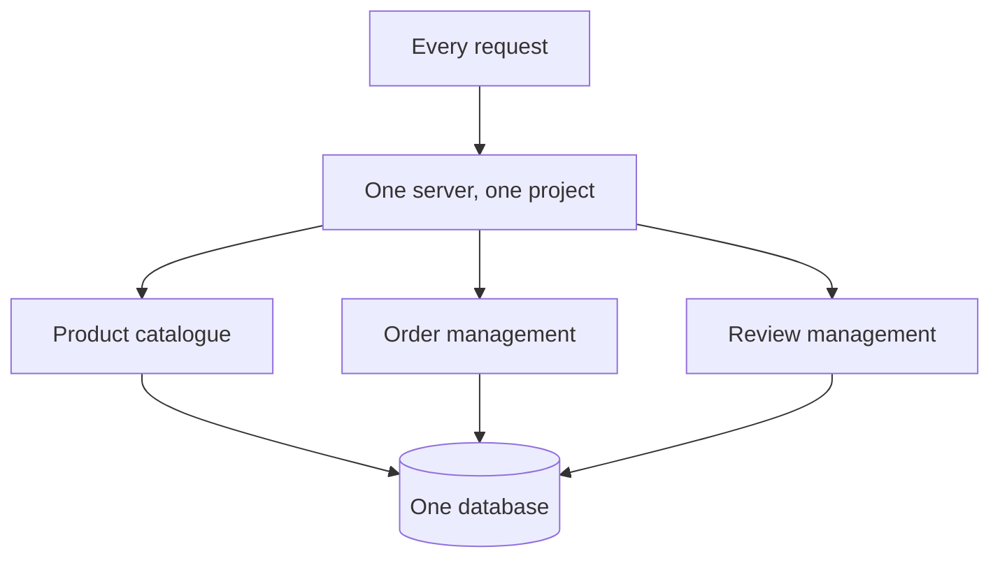
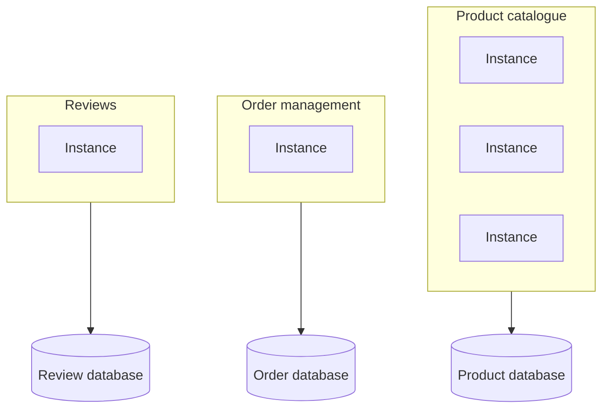

Everything built so far is one project: products, orders and reviews, served by one server. That arrangement has a name, and understanding what it costs is how you decide what to do when it stops being fast enough.

# What a monolith is

> [!important] A **monolith** is an application where all the business logic lives in one project and runs as **one unit**. Every request, whatever it concerns, arrives at the same server.

It is the traditional way to build software and it is still how most companies work. **Simple to develop, simple to test, simple to run.**

## What it gets right

**Code is shared for free.** The `ApiResponse` class was written once and used by every controller. No packaging, no publishing, no versioning — an import.

**One deployment.** One thing to build, one thing to start, one place to look when it breaks.

## What it costs

**Builds and tests get slow.** As the project grows, so does everything about it. A large monolith takes minutes to compile and longer to test, and every developer pays that on every change.

**One repository, everybody in it.** Every team contributing to the same codebase means constant coordination, and features nobody on your team uses still being compiled into your binary.

And then the one that matters here.

# Reads and writes do not arrive equally

A question worth answering about any system: **how many things do people look at, against how many they act on?**

In a shop, roughly ten products viewed per one bought. Possibly worse — window shopping is the normal behaviour.

> [!important] Viewing a product is a **read**. Placing an order is a **write**. So the traffic is somewhere around **ten reads for every write**, and the reads are not the smaller problem.

> [!info] The formal vocabulary: a **query** reads data, a **mutation** changes it — create, update, delete. Worth knowing because both words appear constantly in system design and in APIs like GraphQL.

Different systems sit differently on this. A chat application is **write-heavy** — every message is a write, read once. A scheduling application is **read-heavy**, because a scheduler re-reads upcoming events continuously to send reminders.

> [!important] And it is not the application that is read-heavy or write-heavy — it is **a part of it**. The messaging engine and the profile pages of the same application have opposite shapes.

# Two ways to scale, and what both get wrong

## Vertical

> [!important] **Vertical scaling** means making the machine bigger. More RAM, faster disk, more cores. The same one server, upgraded.

It works, for a long time, and it is by far the simplest thing to do. Two limits.

**There is a ceiling.** However much you are willing to spend, the largest machine that exists is the largest machine that exists.

**The cost is not linear near the top.** Checked against retail prices at the time of writing:

| | |
|---|---|
| 8 GB DDR4 stick | ~₹5,500 → **four of them, 32 GB, ≈ ₹21,000** |
| One 32 GB DDR4 stick | **≈ ₹30,500** |

Same total capacity, roughly 45% more for the single larger module.

> [!info] Honest caveat: this is not a universal law. The same comparison on SSDs came out closer to even, and prices move with supply and demand. **The reliable part is the ceiling, not the price curve** — at the extreme end of any component, cost does rise faster than capacity.

## Horizontal

> [!important] **Horizontal scaling** means more machines rather than a bigger one. Requests are distributed across them.

Cost grows roughly linearly, and there is no hard ceiling — add another machine.

> [!info] Real architectures mix the two. Some components are scaled up, others scaled out, depending on whether the work distributes.

## The problem neither solves

Here is the point the whole first half is building to.

> [!important] **In a monolith, both kinds of scaling scale everything.** A bigger machine serves reads faster and writes faster. More machines serve reads and writes alike. There is no way to scale only the part under pressure, because it is not a separate part.

Reads outnumber writes ten to one, you need read capacity, and you are obliged to buy write capacity you do not need alongside it.

# Microservices

> [!important] **Microservices** split the application into separate projects, each owning one area of the business, each deployed and scaled independently.

**Three instances of the catalogue and one of orders** — which is exactly the shape the read/write ratio asked for and the monolith could not provide.

## What it buys

**Independent scaling.** The catalogue is read-heavy, so scale it. Orders are not, so leave them.

**Independent technology.** Each service can be written in whatever suits it — a service doing machine learning work in Python, others in Java or Go.

**Fault isolation.** Reviews failing does not take the catalogue down. In a monolith, one module crashing the process takes everything with it.

**Smaller projects.** Each one holds one area's logic and nothing else.

## What it costs

**Code sharing becomes work.** A shared utility is no longer an import. It is a library that has to be published, versioned and upgraded in several places.

**Setup repeats.** Observability, logging, configuration, deployment — configured once per service. Companies solve this with scaffolding that generates a new service pre-wired, and **somebody still had to build the scaffolding.**

And the one that surprises people:

> [!warning] **You lose joins.** Once products live in one database and orders in another, on different machines, `JOIN` is not available between them. The database cannot join across a network to another database it knows nothing about.

That capability can be recovered — by duplicating data, by an API call per record, by keeping a read model in sync — and **every one of those trades something away**, usually freshness. Which is a real cost, and it is invisible until the day someone needs a query spanning both.

# The conclusion worth carrying

Reads are slow, and microservices allow independent scaling. It does not follow that splitting is the answer.

> [!important] **Splitting the application does not make any individual query faster.** Three instances of a slow catalogue service serve slow responses three times over. Horizontal scaling multiplies capacity; it does not improve the thing being multiplied.

The cheaper question first: **what is actually slow, and why?**

> [!important] Two techniques address read performance directly, inside whatever architecture you already have. **An index** makes an individual query faster. **A cache** avoids performing it at all. Both apply to a monolith and to a microservice, and both are dramatically less work than restructuring the application.

Which is the honest ordering. Optimise the reads; split the system when the reason to split is organisational or operational, not because a query is slow.
