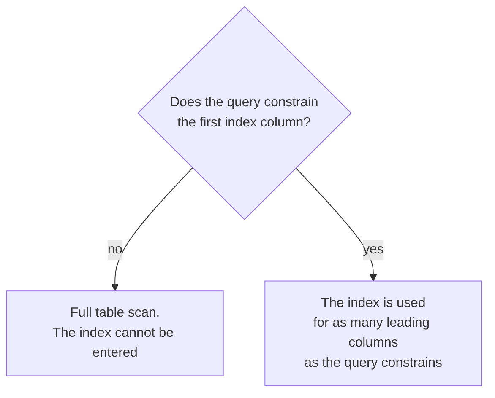
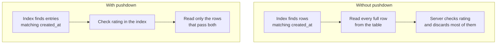

One index per column would be simple and is not what anybody does. Real queries filter on several columns at once, and an index spanning several columns behaves in a way that catches people out — including people who have been writing SQL for years.

# One index, several columns

```sql
1  CREATE INDEX idx_price_rating_category
2  ON products (created_at, price, rating, category_id);
```

> [!important] A **composite index** orders rows by several columns in sequence — by `created_at` first, then by `price` within each `created_at`, then by `rating`, then by `category_id`.

A phone book is the same structure: sorted by surname, then by first name within each surname. That ordering is what makes some lookups instant and others useless, and the rule follows directly from it.

# The leftmost prefix rule

> [!important] **A composite index can only be used for a query whose conditions form a leftmost prefix of the index columns.**

For `(created_at, price, rating, category_id)` the usable prefixes are:

```text
created_at
created_at, price
created_at, price, rating
created_at, price, rating, category_id
```

And nothing else.

## Why, from the phone book

You know a surname. **You can find it** — the book is sorted by surname.

You know a first name and nothing else. **The book is useless.** Every Sanjay in it is scattered across every surname, so finding them means reading the whole thing.

> [!important] The index is sorted by its first column. **Without a value for that column, there is nowhere to start**, and the ordering of every later column is meaningless because it only holds within a value of the one before it.



## Watching it happen

Same index throughout. Only the query changes.

```sql
1  EXPLAIN SELECT * FROM products WHERE created_at = NOW();
2  -- Index lookup
```

Leading column constrained. Works.

```sql
1  EXPLAIN SELECT * FROM products WHERE created_at = NOW() AND price > 80;
2  -- Index range scan
```

First two columns. Works.

```sql
1  EXPLAIN SELECT * FROM products WHERE rating = 3;
2  -- Table scan
```

**`rating` is the third column.** No `created_at`, no entry point, full scan — despite `rating` being right there in the index definition.

```sql
1  EXPLAIN SELECT * FROM products WHERE price = 80 AND rating = 3;
2  -- Table scan
```

Two indexed columns, neither of them the first. **Still a full scan.**

> [!important] This is the result that surprises people. **An index containing every column your query mentions is not enough.** It has to contain them starting from the left.

# Order does not have to match

One thing that is **not** required:

```sql
1  -- both use the index
2  SELECT * FROM products WHERE created_at = NOW() AND price > 80;
3  SELECT * FROM products WHERE price > 80 AND created_at = NOW();
```

> [!important] **The optimiser reorders conditions.** `WHERE` is a set of conditions, not a sequence, so writing them in a different order from the index makes no difference. What matters is **which columns** are constrained, not the order you typed them in.

> [!info] Worth confirming rather than assuming on a database you have not used. This is standard in current MySQL and PostgreSQL; older engines and other stores have been fussier, and it is one `EXPLAIN` to check.

# Index condition pushdown

There is one more behaviour, and it explains an output that otherwise looks like it breaks the rule.

```sql
1  EXPLAIN SELECT * FROM products
2  WHERE created_at >= '2026-08-28 10:00:00' AND rating > 3;
```

`created_at` and `rating` — the first and third columns, skipping `price`. That is **not** a valid prefix. Yet:

```text
1  -> Index range scan on products using idx_price_rating_category
2     over (created_at >= '2026-08-28 10:00:00'),
3     with index condition: (products.rating > 3.0)
```

It used the index. Two things are happening, and line 3 names the second.

**The valid prefix is `created_at` alone**, and that is what the range scan uses to enter the index.

**Then `rating` is checked without leaving the index.**

> [!important] **Index Condition Pushdown** means the storage engine evaluates the part of the `WHERE` clause it can answer from the index itself, before fetching the full row. An index entry failing that check is skipped — **the table row is never read at all.**



The saving is disk reads. Without pushdown, every row matching `created_at` is fetched and most are thrown away; with it, only survivors are fetched.

> [!info] `Using index condition` in a plan is the marker. It is distinct from `Using index`, which means the query was answered entirely from the index with no table access at all.

## What it does not do

> [!warning] **Pushdown still requires a valid leading prefix.** Remove `created_at` and there is no way into the index, so there is nothing to push a condition down onto:
>
> ```sql
> 1  SELECT * FROM products WHERE price = 80 AND rating = 3;
> 2  -- Table scan
> ```

It makes a partially-matching query cheaper. It does not make a non-matching query work.

# Designing the column order

Since order determines what the index can answer, it is the decision that matters.

> [!important] **Put the column your queries always filter on first.** A column present in every query belongs at the left; a column appearing occasionally belongs to the right of it.

Two supporting heuristics:

**Equality before range.** A column tested with `=` narrows to one point in the ordering, leaving the next column still usefully sorted. A range leaves you spread across many values, so columns after a range condition are much less useful.

**High selectivity early**, where the access pattern allows. A column that splits the data finely eliminates more rows per level.

> [!info] **One well-ordered composite index can replace several single-column ones**, because every prefix of it is itself usable. `(a, b, c)` serves queries on `a`, on `a, b`, and on `a, b, c` — three indexes' worth of coverage for one index's write cost.

Which is the design pressure, stated plainly: **each index makes reads faster and every write slower.** Fewer, better-ordered indexes beat one per column.

# What to do with this

> [!important] The rule is short enough to hold: **an index is entered from the left.** Everything else follows — why an index on the wrong column does nothing, why condition order in your `WHERE` clause is irrelevant, and why a query can use half an index and check the rest as it goes.

And the working habit is unchanged: write the query, run `EXPLAIN`, and read what the database actually decided.
