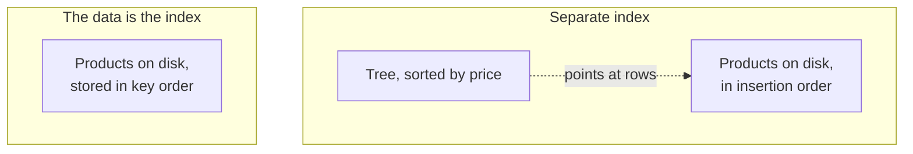

Every index so far has been the same kind of thing — a structure beside the table, pointing back at it. There is another kind, you already have one, and it is not an index of the table so much as the table itself.

# Two ways to arrange the data

Recall the array-plus-tree picture. An unsorted array of products, with a tree beside it holding the products in price order. The array is the data; the tree is a lookup into it.

Now a different arrangement: **sort the array itself.**



In the second, there is nothing to point at. **Finding the value and finding the row are the same operation.**

> [!important] A **clustered index** determines the **physical order of rows on disk.** The index is not a structure beside the table — the table is stored inside it.

Which is why it is fast in a way no other index can be. There is no second step.

# The primary key is that index

> [!important] In MySQL's InnoDB engine, **the primary key is the clustered index.** Rows are physically stored in primary-key order, in the leaf nodes of a single B+ tree. The table and its primary index are the same structure.

Three consequences follow, and they explain properties of primary keys that otherwise look arbitrary.

**One per table.** Data can only be stored in one order at a time. **Non-null.** Every row must have a position, so the value that determines the position cannot be missing. **Unique.** Two rows cannot occupy one position.

> [!important] None of those is a rule the standard imposed for tidiness. **They are consequences of the primary key being where the rows live.**

## If you do not define one

InnoDB does not give up:

1. It looks for the **first non-null unique index** and uses that as the clustered index
2. Failing that, it generates a **hidden 6-byte row id** and clusters on that

> [!warning] The hidden id works and you cannot use it. It is invisible to queries, so you get the storage cost of a clustered index with none of the benefit of being able to look rows up by it. **Define a primary key.**

# Secondary indexes

> [!important] A **secondary index** is any other index. It is a separate structure holding a copy of the indexed columns plus a pointer back to the row, exactly like the array-plus-tree picture.

Which means a lookup through one costs two steps:


> [!info] In InnoDB the pointer is **the primary key value**, not a physical address — which is why rows can be moved on disk without every secondary index needing rewriting, and why a large primary key makes every secondary index larger.

**That second hop is the cost the optimiser weighs.** It is why an index matching most rows loses to a table scan: many rows means many hops, and sequential reading avoids them.

| | Clustered | Secondary |
|---|---|---|
| Stores | **The rows themselves** | The indexed columns plus a pointer |
| How many | **One per table** | Many |
| Lookup | One step | Two — index, then row |
| In MySQL | The primary key | Everything you create |

# Indexes you did not create

Worth knowing, because your table has more indexes than you wrote.

```sql
1  SHOW INDEX FROM products;
```

On a table with no `CREATE INDEX` ever run against it:

```text
1  PRIMARY                  BTREE   -- the clustered index
2  FK_product_category      BTREE   -- from the foreign key
```

> [!important] Databases create indexes on their own behalf. A **primary key** creates the clustered index. A **unique constraint** creates a secondary index — it is how uniqueness is enforced without scanning. A **foreign key** creates one in InnoDB, because the constraint has to be checked on every write to the referencing table.

> [!info] `SHOW INDEX` also reports **cardinality** — the estimated number of distinct values, which is the raw material for the selectivity calculation. It is an estimate from sampled statistics, not an exact count.

Two practical consequences:

> [!warning] **A column may already be indexed.** Adding an index to a foreign key column can duplicate one InnoDB created, paying the write cost twice for one benefit.

**And index count grows without you.** A table with a primary key, two unique constraints and three foreign keys carries six indexes before anyone deliberately adds one.

# Other databases arrange this differently

This is InnoDB's design, not a universal truth.

> [!important] **PostgreSQL stores rows in an unordered heap.** The primary key is an ordinary secondary index pointing into it. There is no clustered index — every index lookup is two steps, including the primary key.

Neither approach is better outright:

**InnoDB's clustering** makes primary-key lookups and ranges over the primary key very fast, and makes every secondary index pay the size of the primary key.

**PostgreSQL's heap** makes all indexes uniform and inserts cheap — a new row goes wherever there is room, rather than into a specific position.

> [!important] Which is the general warning for everything in these notes. **Index behaviour is engine-specific.** MySQL, PostgreSQL, SQL Server and every NoSQL store make different choices, and the reasoning transfers while the specifics do not. Check the documentation for the database you are actually using.

# Designing the primary key

If the primary key determines physical order, choosing it is a storage decision.

> [!important] **A sequential primary key means new rows are appended in order** — each insert lands at the end of the B+ tree, which is cheap. An auto-increment id does this by construction.

> [!warning] **A random primary key scatters inserts throughout the tree**, forcing page splits and fragmentation. Clustering on a random UUID is a known cause of write degradation on large InnoDB tables, precisely because clustering means the row's position is dictated by that value.

> [!info] Keeping the primary key **small** matters for the same structural reason: every secondary index stores a copy of it, so a wide primary key inflates every other index on the table.

Which retroactively justifies something from much earlier. `@GeneratedValue(strategy = GenerationType.IDENTITY)` producing a `bigint auto_increment` is not merely a convention — **it is small, sequential, and therefore the right shape for the structure the rows are stored in.**
