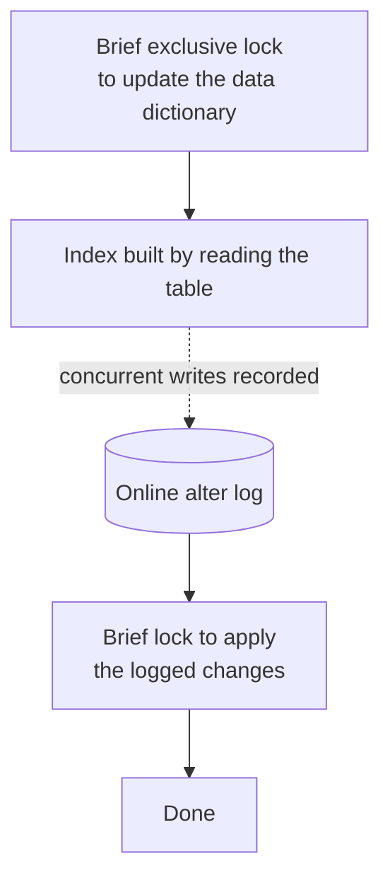

Everything so far assumed a B+ tree and an empty schedule. Neither holds in general: there is another index structure with different trade-offs, and creating an index on a live table is an operation that can take the system down.

# Hash indexes

> [!important] A **hash index** stores a hash of the indexed column, mapped to a pointer to the row. Looking up an exact value hashes it and jumps straight to the entry — **O(1)**, against a B+ tree's O(log n).

Faster for the one thing it does, and it does only that one thing.

## What it cannot do

**Ranges.** A hash is designed to scatter — 80 and 81 hash to unrelated locations. `WHERE price > 80` has nowhere to start and no direction to walk.

**Partial matching.** A composite B+ tree on `(a, b, c)` serves queries on `a` alone, because the ordering is by `a` first. A composite hash index hashes all three columns **together** into one value. Without all three, you cannot compute the hash, so **there is no leftmost prefix rule** — there is nothing to have a prefix of.

**Ordering.** `ORDER BY price` is free on a B+ tree, whose leaves are already in price order. A hash index contributes nothing; the rows must be sorted afterwards.

| | B+ tree | Hash |
|---|---|---|
| Exact match | O(log n) | **O(1)** |
| Range query | **Yes** | No |
| Partial / prefix match | **Yes** | No |
| `ORDER BY` | **Free** | No help |

> [!important] The trade is narrow speed against breadth. **A hash index is right when every query is an exact match on the whole key** — a session token, a shortened URL, a file fingerprint. Anything involving ranges or sorting wants a tree.

> [!info] The same reasoning explains Redis, which is a hash table in memory: extremely fast exact lookups, and range queries need a different data structure entirely.

## In MySQL specifically

> [!warning] **InnoDB does not support hash indexes.** `USING HASH` in a `CREATE INDEX` is accepted and silently gives you a B+ tree. Only the MEMORY engine builds real ones.

What InnoDB does instead is more interesting:

> [!important] The **adaptive hash index** is built automatically. InnoDB watches which B+ tree lookups repeat, and for hot ranges it builds a hash index **in memory** on top of the tree, converting repeated O(log n) lookups into O(1) ones.

Nothing to configure and nothing to maintain — it appears when the access pattern justifies it and disappears when it stops.

# Creating an index on a live table

Building an index means reading every row in the table. On a large table that takes a long time, and the obvious question is what happens to traffic meanwhile.

> [!warning] **Historically, creating an index locked the table.** No writes for the duration — which on a large production table is an outage with a `CREATE INDEX` at the top of it.

## What MySQL does now

Since 5.6, InnoDB builds indexes online:



**Reads and writes continue** while the build runs. Concurrent changes are recorded in an **online alter log** and applied at the end, under a second brief lock.

> [!warning] **It can still block, and the cause is usually elsewhere.** The initial lock has to wait for existing transactions on the table to finish. A `SELECT` that has been running for ten minutes will hold up your `CREATE INDEX` for ten minutes — and everything queueing behind it.

## Forcing the safe path

```sql
1  CREATE INDEX idx_product_price ON products (price)
2  ALGORITHM=INPLACE, LOCK=NONE;
```

| Clause | |
|---|---|
| `ALGORITHM=INPLACE` | Build within the existing table. The alternative, `COPY`, builds a whole new table and swaps — slower and needs double the space |
| `LOCK=NONE` | **Fail rather than lock.** If the operation would require blocking, error out instead |

> [!important] `LOCK=NONE` is the important half. Without it, an index creation that cannot proceed online **quietly falls back to locking** and takes the site down. With it, you get an error and can try again later. **Making the dangerous case loud rather than silent is the entire point.**

## PostgreSQL

> [!warning] **PostgreSQL locks the table by default** when creating an index — writes blocked for the duration.

```sql
1  CREATE INDEX CONCURRENTLY idx_product_price ON products (price);
```

`CONCURRENTLY` avoids the lock at a cost: it scans the table twice, waits for existing transactions, takes considerably longer, and **cannot run inside a transaction block.** It can also fail partway and leave an invalid index behind that must be dropped manually.

> [!important] Same problem, different trade-offs, different syntax. **The instinct to carry across databases is to check what the default does before running it on production** — not to assume it is safe because it was safe elsewhere.

# Where an index belongs in a Spring project

Two routes exist, and only one of them works here.

## The annotation, which does nothing

```java
1  @Table(name = "products", indexes = {
2      @Index(name = "idx_product_price", columnList = "price"),
3      @Index(name = "idx_product_price_rating", columnList = "price, rating")
4  })
```

Correct syntax, and after restarting:

```text
1  SHOW INDEX FROM products;
2  PRIMARY                BTREE
3  FK_product_category    BTREE
```

**Neither index exists.**

> [!important] `@Table(indexes = ...)` is instruction for **schema generation**, and schema generation is switched off. With `ddl-auto: validate`, Hibernate inspects the schema and changes nothing — which is exactly what was asked for when Flyway took ownership.

Not a bug. The annotation describes what the schema should look like; something else decides whether to act on it.

## The migration, which does

```sql
1  -- src/main/resources/db/migration/V4__add_product_price_index.sql
2  CREATE INDEX idx_product_price ON products (price);
```

Restart, and Flyway applies it:

```text
1  SELECT * FROM flyway_schema_history;
2  ... version 4, add product price index, success
```

```text
1  SHOW INDEX FROM products;
2  PRIMARY                BTREE
3  FK_product_category    BTREE
4  idx_product_price      BTREE
```

> [!info] **Verified.** The index the annotation could not create, created by a migration, and recorded in the history table.

> [!important] Which is the arrangement `08-Flyway.md` argued for, now paying off on something other than tables. **An index is a schema change**, so it belongs where schema changes live — reviewable in a diff, applied in order, recorded once per database.

And it is the only route that lets you write the SQL that matters:

> [!important] `ALGORITHM=INPLACE, LOCK=NONE` cannot be expressed in `@Index`. **The annotation can say which columns; only the migration can say how to build it safely.** On a production table that distinction is the difference between a deployment and an outage.

> [!info] Keeping the commented-out annotation beside the entity is a reasonable habit — it documents in the Java code which indexes the table is expected to have, while the migration remains what actually creates them.

# What to carry from all of this

> [!important] **Structure follows query shape.** B+ trees for ranges, sorting and prefixes; hash for exact matches on a whole key.

> [!important] **Creating an index is an operation with a blast radius.** On an empty table it is instantaneous. On a live table with millions of rows it is a change that needs the same care as any other production write.

> [!important] **Indexes are schema, and schema lives in migrations.** Not in an annotation, not typed into a database client — in a file, reviewed, versioned and applied the same way on every machine.
