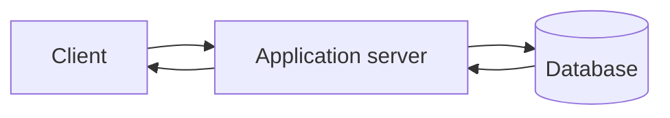
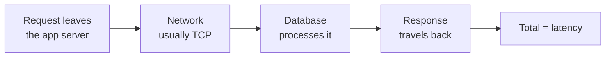
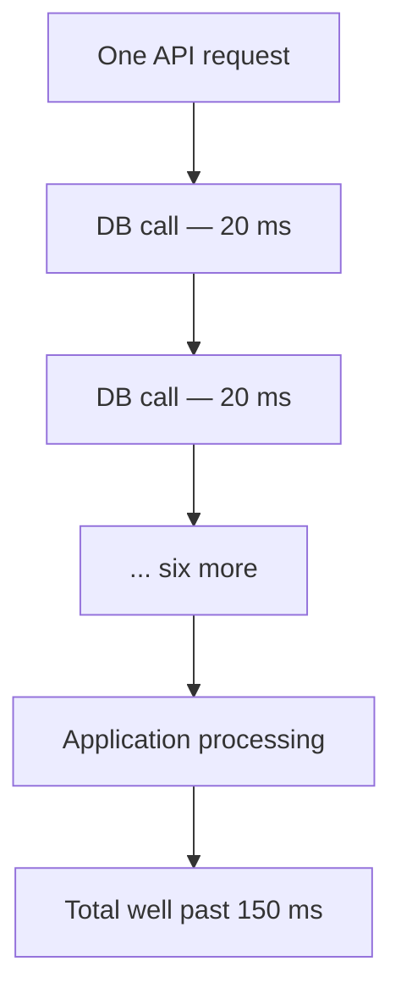
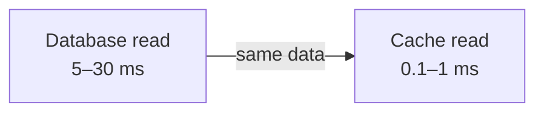

An index makes a query faster. It does not stop the query happening — the request still leaves the application, crosses a network, reaches a database process, reads pages from disk and comes back. This folder is the other technique: not making the trip faster, but not making it at all.

# The leg that matters

Strip a system down to three parts and one connection dominates everything.

A client asks the server for something. The server almost always needs data it does not have, so it asks the database. The database finds it, returns it, the server processes it and replies.

> [!important] **The server-to-database leg is the one worth optimising first.** The client-to-server hop is largely out of your hands — it is the public internet. The server-to-database hop is entirely yours, it happens on every request, and it is where engineering effort actually changes the number.

# What latency means

> [!important] **Latency is the total time for one request to complete, measured end to end.** Not the database's processing time alone — the whole round trip: establishing or reusing the connection, sending the query, the database doing the work, and the response travelling back.

Worth being clear about which machine is which. In this picture **the database is the server and your application is the client**, even though your application is called a server from the outside.

So if an application asks for a set of products and the whole round trip takes 3 ms, the latency of that request is 3 ms.

# What a database actually costs

Numbers need a machine to be attached to. Assume a single instance of MySQL or PostgreSQL, on a properly specified machine — not a laptop, something provisioned deliberately — with 50 to 64 TB of storage available, so storage is not the constraint.

| Operation | Typical latency |
|---|---|
| Read | **5 to 30 ms** |
| Write | **10 to 45 ms** |

Those are the headline ranges. The detail underneath them:

| Case | Latency |
|---|---|
| Indexed read | **under 2 ms** |
| Sequential scan, 100,000 rows | 5 to 15 ms |
| Sequential scan, 1,000,000 rows | **around 40 ms** |
| Small write, including the commit | 1 to 5 ms |
| Heavy write | 5 to 20 ms |

> [!info] A sequential scan of a million rows is a design problem in itself, not a target to plan around. It is listed to show what the top of the range is made of, which is a query that should have had an index on it.

> [!important] **These numbers are good.** For a great deal of real traffic, reads and writes at these latencies are simply not a problem, and reaching for anything more is premature.

# Why the disk is the floor

The reason those numbers cannot be pushed much lower is where the data physically is.

> [!important] A traditional database keeps its data on **persistent storage** — SSDs or hard drives. Answering a query means locating the right page, loading it, scanning it, and often repeating that. **Disk lookups are expensive**, and no amount of query tuning removes the disk from the path.

That single fact is what everything in this folder is arranged around.

# How a small number becomes a large one

The temptation is to look at 20 ms and see nothing worth fixing. The mistake is that 20 ms is the cost of **one** database call.

> [!warning] A single API call in a real system may hit the database **seven or eight times** — fetch the user, fetch their cart, fetch each product, check stock, read a setting. At 20 ms each that is 140 to 160 ms of database time in one request, before the application has done any work of its own.

And that is the good case. It assumes no network congestion, no lock contention, no slow query hiding in the set.

> [!important] There is a further consequence worth stating plainly. **If an endpoint has to answer within 100 ms, it cannot afford to spend 30 ms of that inside a database** — not once, let alone several times. The budget has to cover network time, application processing, serialisation and some slack for whatever goes wrong. A latency target sets the database budget, and often the database budget is smaller than what a database can deliver.

# The two conditions

A cache is not a general improvement. It becomes the right tool when two things are true at once.

> [!important] **One — you need reads faster than a database gives you.** Not 5 to 30 ms but single-digit milliseconds, or better.
>
> **Two — some of the data is read constantly and changes rarely.** Not never. Just not every second — a value that is stable for a minute, or five, is already a good candidate.

Neither alone is enough. Data that changes every second cannot be cached usefully, and data nobody reads twice gains nothing from being cached.

# An idea already familiar

Anyone who has written a dynamic programming solution has done this before.

> Those who cannot remember the past are condemned to repeat it.

> [!important] Memoisation and tabulation both work by building **an extra structure that holds results already computed**, so that the next time the same question is asked the answer is looked up instead of recomputed. Caching is that idea moved out of a function and into infrastructure.

The preconditions are identical, too. Memoisation pays off exactly when a subproblem is asked for repeatedly and its answer does not change.

> [!info] This is the same space-for-time trade that made an index worth building. An index duplicates data into a structure arranged for fast search; a cache duplicates data into storage that is fast to reach. Both cost memory to save time.

# What a cache costs instead

> [!important] A **cache** is a faster storage layer placed in front of a slower one, holding data that has already been fetched or computed so it does not have to be fetched or computed again.

The reason it is faster is that it lives in RAM rather than on disk. Managed as AWS ElastiCache, on a comparable instance:

| Operation | Latency |
|---|---|
| Basic get or set | **100 to 300 microseconds** |
| Same region and availability zone | **under 1 ms** |
| Same region, general expectation | under 5 ms |
| Cross-continent | 2.5 to 3 ms |

**Writes land in the same range as reads**, which is the part that has no equivalent on a database. Writing to disk is fundamentally slower than reading from it; writing to RAM is not.

## What a region is

> [!info] A cloud provider runs data centres in many places — Mumbai, London, Virginia, Dubai. A **region** is one such location. If your application server and your cache are in the same region, the request stays inside one data centre and takes well under a millisecond. If the cache is in Australia and the server is in London, the request physically crosses the planet, and no software can make that faster than the speed of light allows.

**Put the cache where the application is.** It sounds obvious and it is a real deployment mistake.

# The improvement

> [!important] A read that was averaging 20 ms, served instead in around 100 microseconds to 1 ms, is **a 20x improvement and often much more.** That is not a percentage gain to argue about in a review — it changes what the system is capable of promising.

# How much you can hold

The instinct is that faster memory means far less of it, so a cache must be tiny. For RAM in a laptop, yes. For a managed cache service, much less so.

| Instance | Memory |
|---|---|
| A small node such as `r7g.large` | **around 13 GB** |
| Commonly maintained in production | **500 GB** |
| Large instances, clustered | **several terabytes** |

> [!important] **A cache is not restricted to a handful of hot keys.** Hundreds of gigabytes is ordinary, and that is enough to hold the working set of a substantial application rather than a token fraction of it.

# What has and has not been bought

> [!important] **Guarantees:** reads and writes roughly an order of magnitude faster than a database, on data that is read often and changes rarely, at a scale that is not token.
>
> **Does not guarantee:** anything about correctness, durability, or the data being current. Everything above is a statement about speed and nothing else.

Those omissions are not small, and they are what the rest of this folder is about.
