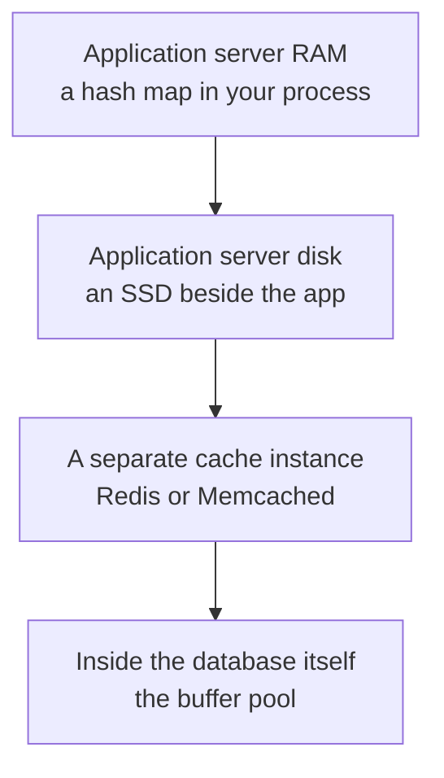
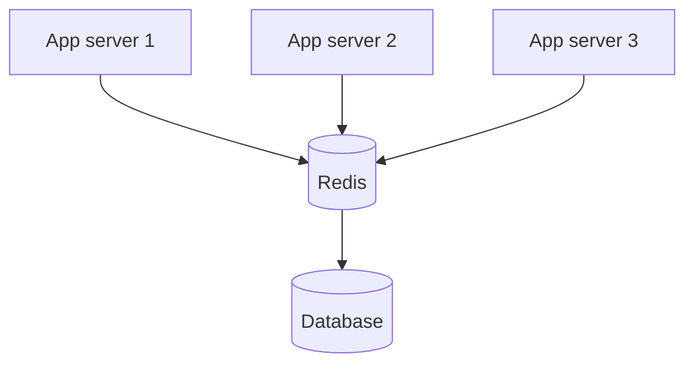
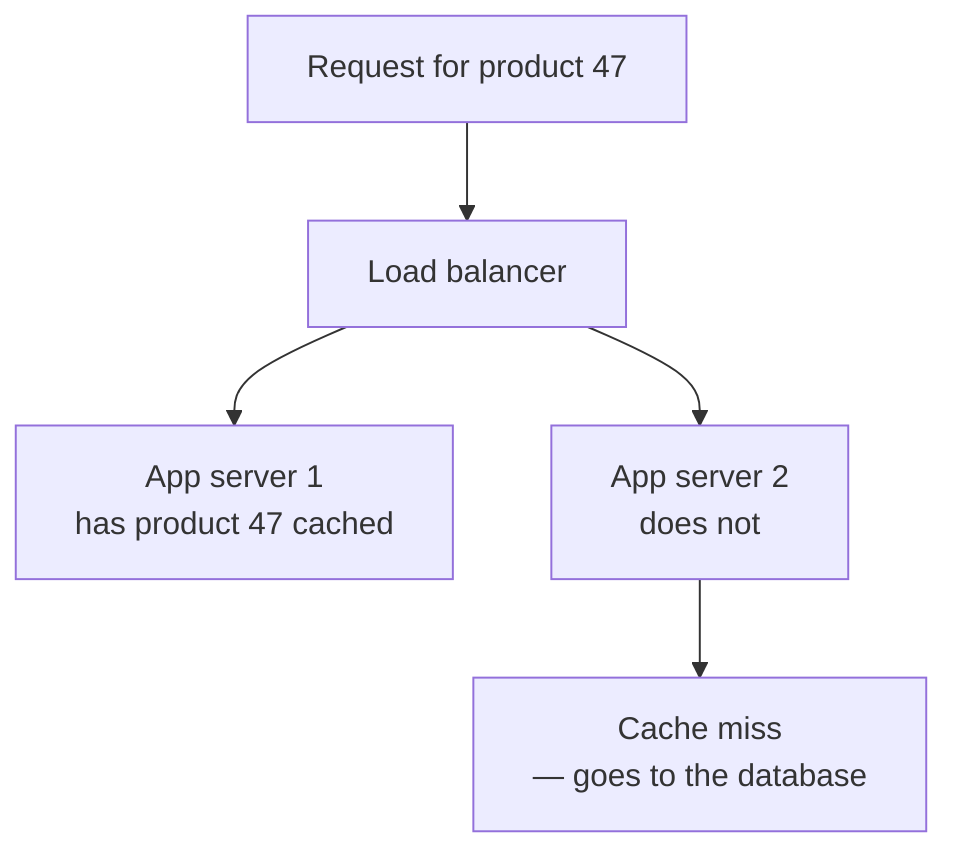

The previous note argued for a cache without saying where it goes. That turns out to be a real decision with four answers, three of which you may already be using without having chosen them.

# Caching happens at every level



Each is genuinely a cache. They differ in what they save you and what they cost.

## Inside the database

> [!important] **Databases cache on their own account.** MySQL's InnoDB keeps a **buffer pool** — a region of the database server's RAM holding table and index pages it has read recently. A query whose pages are already in the buffer pool never touches the disk at all.

This is worth knowing for two reasons. It explains why the same query is slow once and fast afterwards, and it means the database's quoted latencies already include some caching. **You are not starting from an uncached baseline.**

> [!info] The size of the buffer pool is configurable, and on a dedicated database machine it is normally set to most of the available RAM. It is the single most consequential MySQL setting for read performance.

## In the application's own memory

The cheapest possible cache is a hash map in the running process.

```java
1  private final Map<Long, Product> cache = new ConcurrentHashMap<>();
```

Data already in that map is read at memory speed with **no network hop at all** — faster than any external cache can be, because the fastest network request is still a network request.

## On the application's disk

Less obvious and still real. Writing fetched data to an SSD beside the application means later reads hit local disk instead of the database.

> [!important] This is slower than RAM and still worth something, because **the disk access is local**. You pay for a disk read but you save the network round trip, and on a cross-machine call the network is often the larger half.

## A separate cache instance

> [!important] The common arrangement in production is a **dedicated cache server** — its own machine, running caching software such as **Redis** or **Memcached**, that every application server talks to over the network.



It costs a network hop that the in-process map does not. The next section is why it wins anyway.

# Why in-process memory stops working

One application server is not the interesting case. Real systems run several behind a load balancer, and that is where a local cache falls apart.



> [!warning] **The load balancer decides which server answers, and it does not know what each one has cached.** A request routed to a server without the data misses, even though a sibling machine two racks away is holding exactly that value in memory. The cache is fragmented across servers, and each fragment is invisible to the others.

Three consequences follow.

**The hit rate collapses in proportion to the fleet.** With five servers caching independently, a given key has to be fetched and stored five separate times before all of them can serve it.

**Memory is wasted five times over.** The same data occupies RAM on every machine that has happened to see it.

**Nothing can be invalidated reliably.** When a value changes, every server holding a stale copy has to be told, and there is no single place to tell.

> [!important] A shared cache instance fixes all three at once. **One copy, visible to every server, invalidated in one place** — at the cost of a network hop measured in fractions of a millisecond.

# The ORM's cache

Object-relational mappers cache too, and this is the layer most likely to be running without a deliberate decision.

> [!important] Hibernate maintains caches of its own, holding entities it has loaded so that requesting the same one twice does not issue two queries. It is **RAM inside the application server**, which means it is exactly the local cache described above and inherits every one of its problems on a multi-server deployment.

Two further limits:

> [!warning] **The control is coarse.** The ORM decides what to keep and for how long, with a small set of knobs. A dedicated cache lets you choose per key what to store, in what shape, and with what lifetime.

> [!warning] **It is bounded by the application's heap.** Filling it competes directly with the memory your application needs to serve requests, and hundreds of gigabytes is not an option the way it is on a dedicated cache node.

> [!info] None of this makes it useless. Within a single request it prevents repeated identical queries, which is real. It is simply not the same tool as a shared cache, and reaching for it as one leads to the fragmentation problem above.

# Redis and Memcached

Two names appear wherever a dedicated cache does.

| | Redis | Memcached |
|---|---|---|
| Data model | Many structures — strings, hashes, lists, sets, sorted sets and more | Strings only |
| Persistence | **Optional** | None |
| Extra features | Queues, geospatial search, streams, vectors | None |

> [!important] **Memcached does one thing: a key to a string, in memory, quickly.** Redis does that and a great deal else, which is why it is the far more common choice and why the rest of this folder is about Redis specifically.

> [!info] AWS packages both under one service called **ElastiCache** — provisioning an instance and choosing which engine runs on it. Many organisations skip it and run Redis themselves on an ordinary EC2 machine, often in a container. Both are normal.

# Choosing

> [!important] **Reach for a shared cache instance by default.** It is the only option that survives more than one application server, and more than one application server is where every system that matters ends up.

The others still have their place — the buffer pool is already working for you, the ORM's cache prevents repeated queries inside one request, and a local map is defensible for something genuinely per-process and immutable such as configuration read at startup. **What none of them can be is the system's cache.**
