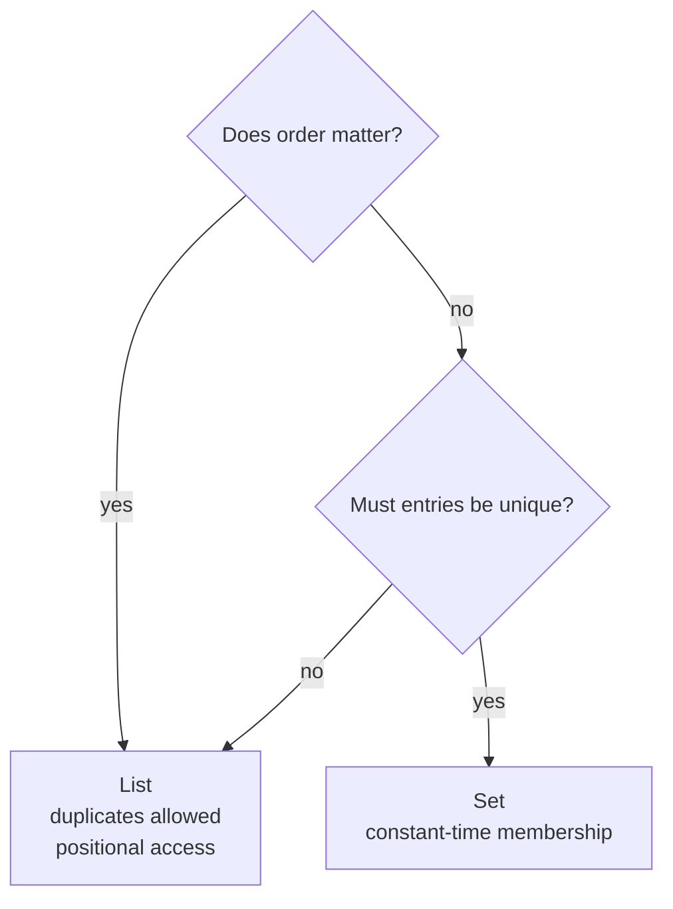

Strings and hashes hold one thing under one key. The remaining structures hold collections, and the two simplest differ in exactly one property: whether order matters or uniqueness does.

# Lists

> [!important] A **list** is an ordered sequence of strings under one key. Elements can be added and removed at **either end**, which is what makes it usable as a queue or a stack.

Four operations, named for the end they act on:

| | Left end | Right end |
|---|---|---|
| Add | `LPUSH` | `RPUSH` |
| Remove | `LPOP` | `RPOP` |

## Building one

```text
  127.0.0.1:6379> LPUSH user:queue 1
  (integer) 1
  127.0.0.1:6379> LPUSH user:queue 2
  (integer) 2
  127.0.0.1:6379> LPUSH user:queue 3
  (integer) 3
  127.0.0.1:6379> LRANGE user:queue 0 -1
  1) "3"
  2) "2"
  3) "1"
```

> [!info] **Verified** against Redis 8.2.3, as is every command in this note.

The return value of a push is the length after it. The ordering is the point: pushing 1, then 2, then 3 **from the left** puts 3 at the left end, so the list reads 3, 2, 1.

> [!info] The key did not have to be created first. Pushing to a key that does not exist creates the list, and popping the last element deletes the key — collections in Redis never exist empty.

## Taking things out

```text
  127.0.0.1:6379> LPOP user:queue
  "3"
  127.0.0.1:6379> RPOP user:queue
  "1"
  127.0.0.1:6379> LRANGE user:queue 0 -1
  1) "2"
```

`LPOP` takes from the left, where 3 was. `RPOP` takes from the right, where 1 had been sitting since it was pushed first.

> [!important] **Which end you push and pop decides the data structure.** Push left and pop right and you have a **queue** — first in, first out. Push and pop at the same end and you have a **stack**. The list itself has no opinion.

A pop on a key that does not exist is not an error:

```text
  127.0.0.1:6379> LPOP nosuchlist
  (nil)
```

## Reading without removing

```text
  127.0.0.1:6379> RPUSH user:queue 10
  (integer) 2
  127.0.0.1:6379> RPUSH user:queue 11
  (integer) 3
  127.0.0.1:6379> LLEN user:queue
  (integer) 3
  127.0.0.1:6379> LRANGE user:queue 0 1
  1) "2"
  2) "10"
  127.0.0.1:6379> LRANGE user:queue 0 -1
  1) "2"
  2) "10"
  3) "11"
```

> [!important] `LRANGE` takes a start and a stop index, **both inclusive**. Negative indices count from the end, so **`-1` is the last element** and `0 -1` is the whole list. That idiom appears constantly.

# Sets

> [!important] A **set** is an unordered collection of unique strings. Adding something already present does nothing, and there is no position to speak of.

```text
  127.0.0.1:6379> SADD unique:users user1
  (integer) 1
  127.0.0.1:6379> SADD unique:users user2
  (integer) 1
  127.0.0.1:6379> SADD unique:users user3
  (integer) 1
  127.0.0.1:6379> SADD unique:users user3
  (integer) 0
```

> [!important] **The return value is how many members were actually added.** The fourth call returns `0` because `user3` was already there. That number is the deduplication happening, reported back — and it is useful in itself, since `1` means this was the first time and `0` means it was not.

## The rest of the operations

```text
  127.0.0.1:6379> SMEMBERS unique:users
  1) "user1"
  2) "user2"
  3) "user3"
  127.0.0.1:6379> SCARD unique:users
  (integer) 3
  127.0.0.1:6379> SREM unique:users user3
  (integer) 1
  127.0.0.1:6379> SISMEMBER unique:users user2
  (integer) 1
  127.0.0.1:6379> SISMEMBER unique:users user3
  (integer) 0
```

`SCARD` is the size — cardinality. `SREM` removes. **`SISMEMBER` answers is this in the set**, returning 1 or 0.

> [!important] `SISMEMBER` is the operation that makes sets worth reaching for. It is a **constant-time membership test** against a collection of any size — the same question that costs a scan in a list and a query in a database.

Several members can be added at once, and the count still reports only what was new:

```text
  127.0.0.1:6379> SADD unique:users user4 user5 user1
  (integer) 2
```

`user4` and `user5` were new; `user1` was already present.

# Choosing between them



| | List | Set |
|---|---|---|
| Order | **Preserved** | None |
| Duplicates | Allowed | **Rejected** |
| Membership test | Scan | **Constant time** |
| Natural use | Queue, stack, recent items | Tags, unique visitors, who has seen this |

> [!warning] **A set gives up ordering entirely**, and `SMEMBERS` returning insertion order in a small example is not a guarantee. Anything that must come back in a defined order needs a list, or the structure in the next note.
