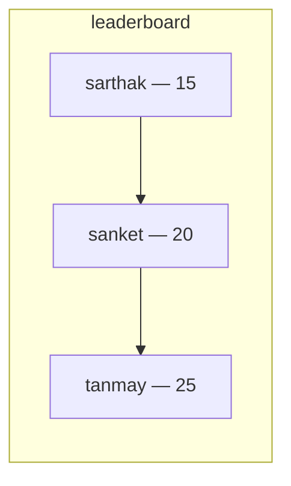
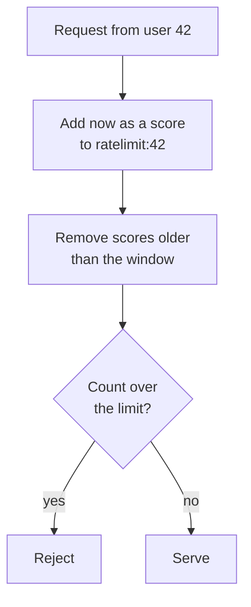

A set gives uniqueness and loses order. A list gives order and loses uniqueness. The sorted set gives both, and the ordering comes from a number you supply rather than from insertion.

# What it is

> [!important] A **sorted set** holds unique strings, each with an associated number called a **score**, and keeps them ordered by that score. Membership is unique like a set; position is meaningful like a list; and the position is derived rather than chosen.



# Building a leaderboard

```text
  127.0.0.1:6379> ZADD leaderboard 20 sanket
  (integer) 1
  127.0.0.1:6379> ZADD leaderboard 15 sarthak
  (integer) 1
  127.0.0.1:6379> ZADD leaderboard 25 tanmay
  (integer) 1
```

> [!info] **Verified** against Redis 8.2.3, as is every command in this note.

The score comes before the member. Adding a member that already exists updates its score and returns 0 rather than 1 — **the same call both inserts and re-ranks**, which is why maintaining a live leaderboard needs no special handling for players already on it.

# Ranks

```text
  127.0.0.1:6379> ZRANK leaderboard sarthak
  (integer) 0
  127.0.0.1:6379> ZRANK leaderboard sanket
  (integer) 1
  127.0.0.1:6379> ZRANK leaderboard tanmay
  (integer) 2
```

> [!warning] **`ZRANK` counts from the lowest score, starting at zero.** The lowest scorer is rank 0 and the highest is rank 2. That is the opposite of what a leaderboard means by rank, and it is the single most common mistake with this structure.

The one you usually want:

```text
  127.0.0.1:6379> ZREVRANK leaderboard sanket
  (integer) 1
```

`ZREVRANK` counts from the highest score down — still zero-based, so a displayed rank is this number plus one.

# Reading ranges

```text
  127.0.0.1:6379> ZRANGE leaderboard 0 -1
  1) "sarthak"
  2) "sanket"
  3) "tanmay"
  127.0.0.1:6379> ZRANGE leaderboard 0 -1 WITHSCORES
  1) "sarthak"
  2) "15"
  3) "sanket"
  4) "20"
  5) "tanmay"
  6) "25"
```

`0 -1` is the whole thing, the same idiom as a list. **`WITHSCORES` interleaves each score after its member** — a flat array again, read two at a time.

Descending, which is what a leaderboard displays:

```text
  127.0.0.1:6379> ZREVRANGE leaderboard 0 -1
  1) "tanmay"
  2) "sanket"
  3) "sarthak"
```

# The top N

The whole point of a leaderboard is usually the first page of it.

```text
  127.0.0.1:6379> ZREVRANGE leaderboard 0 1
  1) "tanmay"
  2) "sanket"
```

> [!important] **The top two, in order, in one operation.** No sort, no scan, no reading the collection into the application. The structure is already ordered, so this is reading the first two entries of it.

That is the argument for sorted sets in one line. Producing a top-ten from a relational table means ordering rows by score on every request, or maintaining an index and paying for it on every write.

# Updating a score

```text
  127.0.0.1:6379> ZSCORE leaderboard sanket
  "20"
  127.0.0.1:6379> ZINCRBY leaderboard 7 sanket
  "27"
  127.0.0.1:6379> ZREVRANGE leaderboard 0 -1 WITHSCORES
  1) "sanket"
  2) "27"
  3) "tanmay"
  4) "25"
  5) "sarthak"
  6) "15"
```

> [!important] **`ZINCRBY` adds to the existing score atomically** and returns the new value. The reordering is immediate — one player moved from second to first, and nothing had to be re-sorted, because the structure maintains its order as a property.

> [!info] Atomically matters here. Two concurrent increments through read-then-write would lose one; `ZINCRBY` cannot, because the read and the write are one operation inside Redis.

# By score rather than position

Ranges can also be taken over the scores themselves:

```text
  127.0.0.1:6379> ZRANGE leaderboard +inf -inf BYSCORE REV LIMIT 0 2
  1) "sanket"
  2) "tanmay"
```

`BYSCORE` switches the two arguments from positions to score bounds, `REV` reads downward, and `LIMIT offset count` takes a slice. `+inf` and `-inf` are the open ends.

> [!info] Older material uses `ZREVRANGEBYSCORE` for this. It still works and is deprecated in favour of the `ZRANGE ... BYSCORE REV` form, which absorbed all the range variants into one command.

Scores need not be points. **A timestamp as the score turns a sorted set into a time-ordered index**, and querying a score range then means querying a time window — which is the basis of the rate limiter below.

# Where these are actually used

Two applications come up constantly, and both are worth recognising.

## Leaderboards

Everything above. Unique players, a score each, ranked continuously, top N read cheaply, updates that re-rank in one atomic operation.

> [!important] This is not a toy example. **Large-scale systems genuinely run leaderboards on Redis sorted sets**, because the alternative — ordering a table by score on every page load — does not survive the read volume.

## Rate limiters

Less obvious and equally common.

> [!important] Limiting a caller to N requests per window means counting their recent requests. **Store each request's timestamp as the score in a sorted set keyed by the caller**, drop everything older than the window with a score-range removal, and count what is left. If the count exceeds the limit, reject.



The window slides continuously rather than resetting on a boundary, which is the behaviour a fixed counter cannot produce. **A caller cannot burst at the end of one window and again at the start of the next.**

# What it costs

> [!important] **Guarantees:** unique members, continuous ordering by score, cheap top-N and range reads, atomic score updates.
>
> **Does not guarantee:** anything about the members beyond their name and one number. There is one score per member, and **everything is stored as a string** — a score is a number, a member never is.

Which is the general shape of the trade. A sorted set answers ranked-by-one-number questions extremely well and cannot answer anything else at all.
