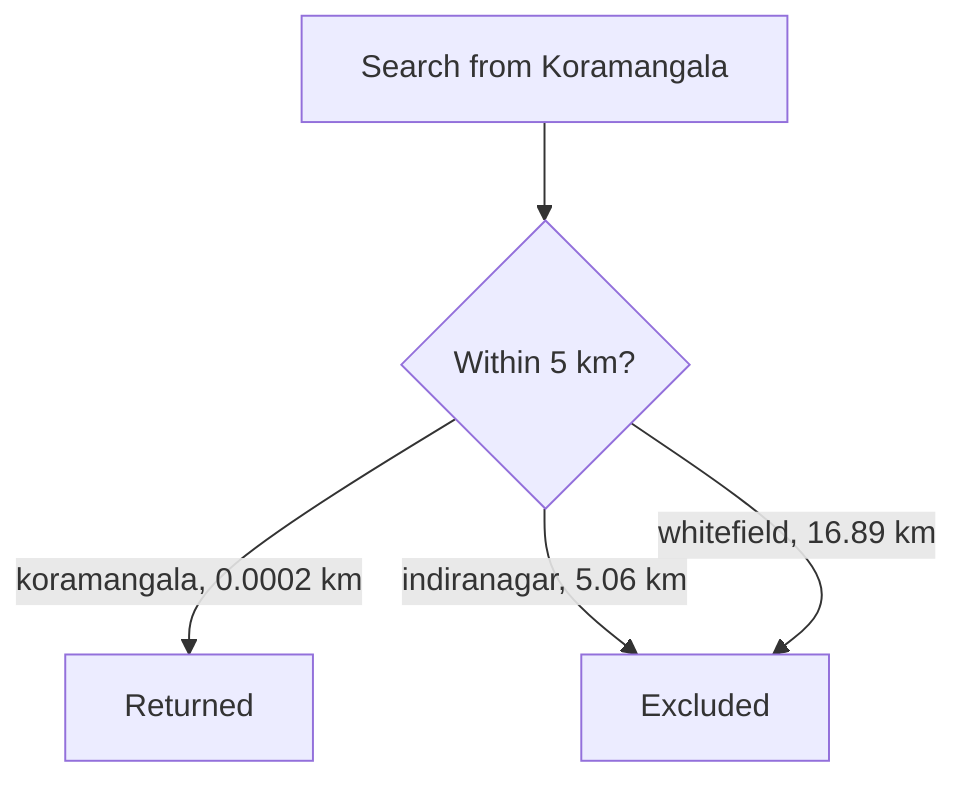
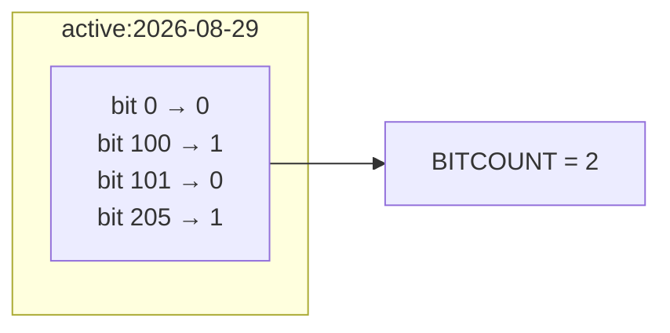
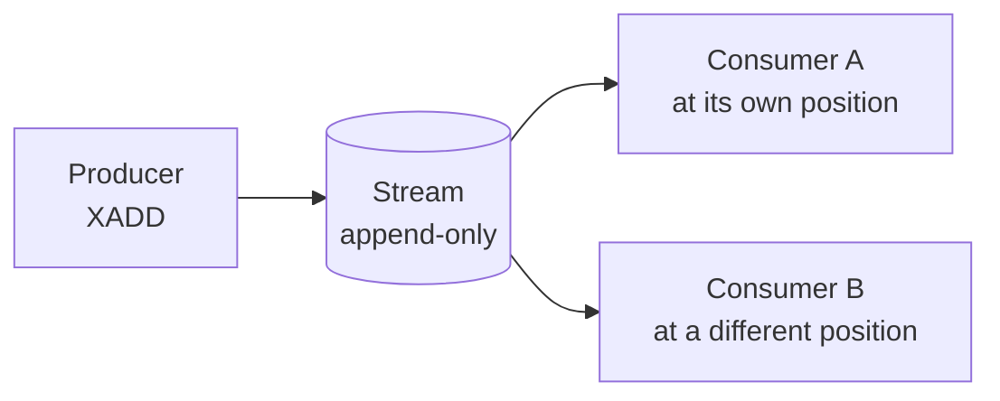
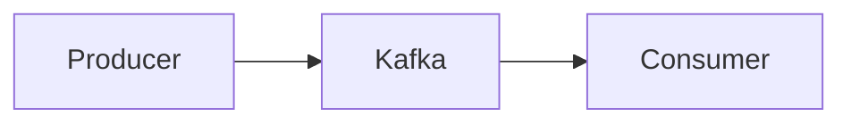

Five structures cover most caching work. Redis ships several more that exist for problems a key-value store has no business solving well, and knowing they are there is what stops you building them by hand.

# Geospatial indexes

> [!important] A **geospatial index** stores named points by longitude and latitude, and answers questions about what is near a given location — the operation behind finding nearby drivers, available bikes or restaurants that deliver.

```text
  127.0.0.1:6379> GEOADD bike:stations 77.5946 12.9716 koramangala 77.6408 12.9784 indiranagar 77.7500 12.9600 whitefield
  (integer) 3
```

> [!warning] **Longitude comes before latitude.** That is the reverse of how coordinates are usually written and spoken, and it is a very easy way to put your data in the wrong hemisphere.



Searching a radius:

```text
  127.0.0.1:6379> GEOSEARCH bike:stations FROMLONLAT 77.5946 12.9716 BYRADIUS 5 km ASC WITHDIST
  1) 1) "koramangala"
     2) "0.0002"

  127.0.0.1:6379> GEOSEARCH bike:stations FROMLONLAT 77.5946 12.9716 BYRADIUS 20 km ASC WITHDIST
  1) 1) "koramangala"
     2) "0.0002"
  2) 1) "indiranagar"
     2) "5.0645"
  3) 1) "whitefield"
     2) "16.8932"
```

> [!info] **Verified** against Redis 8.2.3, as is every command in this note. `WITHDIST` returns the distance to each result, `ASC` orders them nearest first, and the 5 km search correctly excludes the station 5.06 km away.

Distance between two stored points directly:

```text
  127.0.0.1:6379> GEODIST bike:stations koramangala indiranagar km
  "5.0647"
```

## It is a sorted set

```text
  127.0.0.1:6379> TYPE bike:stations
  zset
```

> [!important] **There is no geospatial type.** Redis encodes each coordinate pair as a single number — a geohash — and stores it as the score in an ordinary sorted set. Points near each other in space get numerically close scores, so a radius search becomes a score-range query on a structure that already exists.

> [!info] Which is worth pausing on as a piece of design. A hard problem was made easy by finding a way to express it in terms of a structure already available, rather than by building a new one.

# Bitmaps

> [!important] A **bitmap** is a string treated as a sequence of individual bits, addressed by position. It is the structure for recording a yes-or-no fact about a very large number of numbered things, using one bit each.

```text
  127.0.0.1:6379> SETBIT active:2026-08-29 100 1
  (integer) 0
  127.0.0.1:6379> SETBIT active:2026-08-29 205 1
  (integer) 0
  127.0.0.1:6379> GETBIT active:2026-08-29 100
  (integer) 1
  127.0.0.1:6379> GETBIT active:2026-08-29 101
  (integer) 0
  127.0.0.1:6379> BITCOUNT active:2026-08-29
  (integer) 2
```

The classic use is daily active users: bit position is the user id, one key per day, and `BITCOUNT` gives the total.



> [!important] **The appeal is density.** One million users tracked for one day costs one bit each — around 125 KB — where a set of user ids would cost several megabytes. `BITCOUNT` then answers how many were active without reading anything into the application.

> [!warning] It only works when the identifiers are **dense integers starting near zero.** Bit position 5,000,000 in a fresh key allocates everything below it, so sparse or random ids waste enormous space. Sequential user ids are the case this fits.

# Vector sets

> [!important] A **vector set** stores high-dimensional numeric vectors — embeddings produced by a machine learning model — and finds the ones most similar to a query vector. It is the retrieval step behind semantic search and recommendations.

```text
  127.0.0.1:6379> VADD emb:products VALUES 3 0.1 0.2 0.3 product:1
  (integer) 1
  127.0.0.1:6379> VADD emb:products VALUES 3 0.9 0.8 0.7 product:2
  (integer) 1
  127.0.0.1:6379> VCARD emb:products
  (integer) 2
  127.0.0.1:6379> VSIM emb:products VALUES 3 0.1 0.2 0.3
  1) "product:1"
  2) "product:2"
```

The `3` is the number of dimensions. `VSIM` returns members ordered by similarity to the supplied vector, nearest first.

> [!info] Three dimensions is a demonstration. Real embeddings run to hundreds or thousands, and the operation is the same.

# JSON

Redis can store and query JSON documents natively, addressing individual paths inside them rather than treating the document as an opaque string.

> [!warning] **This needs a build that includes the JSON module.** It is not part of a plain Redis server — on the installation used for these notes, `JSON.SET` returns `ERR unknown command`, while vector sets are available. **Check what your deployment actually has** before designing around it, because the commands either exist or do not depending on how the server was assembled.

# Time series

Redis supports time series data, and this is the one case where it is usually the wrong choice.

> [!warning] **Purpose-built time series databases are substantially better at this** — TimescaleDB, which extends PostgreSQL, among others. They handle compression, retention and time-bucketed aggregation as first-class concerns. Redis supporting time series does not make it the right home for it.

# Streams

> [!important] A **stream** is an append-only log of entries. Producers append; consumers read from a position and can pick up where they left off. Unlike a list, reading does not remove — many independent consumers can read the same stream at their own pace.

```text
  127.0.0.1:6379> XADD orders:stream * orderId 1 status PENDING
  "1787975303196-0"
  127.0.0.1:6379> XADD orders:stream * orderId 2 status PAID
  "1787975303202-0"
  127.0.0.1:6379> XLEN orders:stream
  (integer) 2
  127.0.0.1:6379> XRANGE orders:stream - +
  1) 1) "1787975303196-0"
     2) 1) "orderId"
        2) "1"
        3) "status"
        4) "PENDING"
  2) 1) "1787975303202-0"
     2) 1) "orderId"
        2) "2"
        3) "status"
        4) "PAID"
```

The `*` asks Redis to generate the entry id, which it does as a millisecond timestamp plus a sequence number — so ids are unique and time-ordered. `-` and `+` are the open ends of a range.



> [!important] **Reading does not consume.** A list hands an element to exactly one `LPOP` and it is gone; a stream lets every consumer read the same entries independently, each tracking where it has got to.

## How this compares to Kafka

Streams sit next to dedicated stream-processing systems, and the comparison matters.



| | Kafka | Redis streams |
|---|---|---|
| Durability | **Designed for it** | Follows Redis persistence |
| Partitioning | **Built in** | Manual and awkward |
| Scale | **Very large** | Considerably lower |
| Already present | Another system to run | **Already there** |

> [!warning] **Redis streams do not replace Kafka**, and using them as a general stream-processing backbone is not something that holds up in production. Kafka's durability guarantees and out-of-the-box partitioning are the reasons it exists.

> [!info] The comparable alternative to Kafka is a managed equivalent such as Amazon Kinesis, which offers the same capabilities as a service. Redis streams are not in that category.

## Where they do fit

> [!important] The honest use case is **when data is already going into Redis and something needs to react to it.** Rather than running a separate producer that reads Redis and writes to Kafka, the write can land in a stream directly and be consumed from there.

Which connects to a mechanism named here and covered properly later:

> [!important] **Change data capture, or CDC, is listening to changes in a datastore as they happen** rather than polling for them. The alternative is database triggers. A CDC pipeline can write changes into a Redis stream for a consumer to process.

# The point of the inventory

> [!important] Nobody remembers these command names, and nobody needs to — a search finds `ZRANGEBYSCORE` in seconds. **What cannot be looked up is the existence of a structure you have never heard of.** Not knowing sorted sets exist means building a leaderboard by sorting in the application; not knowing geospatial indexes exist means computing distances row by row.

The commands are reference material. The inventory is the thing worth carrying.
