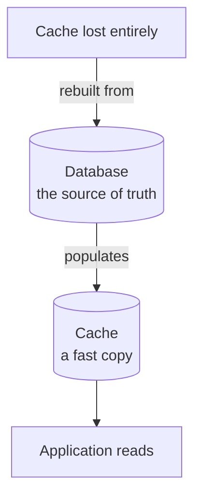
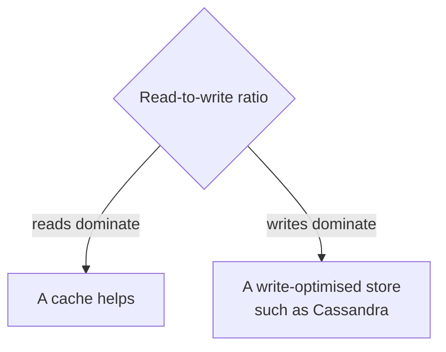
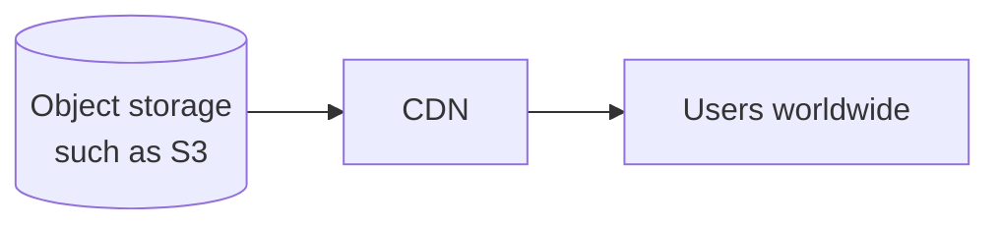

Everything so far has argued for caching. This note is the boundary, because a cache is a specific tool and there are several situations where reaching for one makes a system worse rather than faster.

# Never the source of truth

The most important rule, and the one with the most expensive failure.

> [!important] **The source of truth is the system that decides what is actually true.** For anything that matters, that must be the database. A cache holds a copy, and a copy that may be stale, evicted or lost.

> [!warning] **Data that exists only in the cache does not reliably exist.** Redis holds data in RAM; a restart without persistence loses it, an eviction policy may discard it under memory pressure, and a TTL removes it on schedule. Every one of those is normal operation, not a fault.

# Consistency-sensitive data

Some data cannot tolerate being slightly out of date, and the test is what a wrong answer costs.

> [!important] **Payments, bookings, bank balances, transactions, loans.** Serving a stale balance is not a slow page, it is a wrong number about someone's money. Serving a stale seat availability double-books a flight.

| Data | Stale by 30 seconds means |
|---|---|
| A product description | Slightly old copy — harmless |
| A homepage banner | Yesterday's promotion — mildly wrong |
| **An account balance** | **A wrong financial figure shown as fact** |
| **Seat availability** | **Two people sold the same seat** |

> [!info] The seat-locking example from `05-Expiry-And-Locks` is not a contradiction of this. Redis held **the lock** — a temporary claim on a seat — while the confirmed booking was written to the database. The transient coordination went in the cache; the record of what was sold did not.

That distinction is the general one. **Cache the fast-moving coordination, never the record.**

# Heavy writes with few reads

A cache is a read optimisation. Inverting the ratio removes the reason it exists.

> [!warning] **If data is written constantly and read rarely, a cache is pure cost.** Every write pays to update it, and the reads that would have repaid that never arrive. You have added a component, a failure mode and a consistency problem to make nothing faster.

> [!important] Write-heavy workloads have their own tools. **Cassandra** is built for exactly this shape — very high write throughput, spread across many machines, at the price of the query flexibility a relational database gives you. Reaching for a cache when the problem is write volume is reaching for the wrong category of thing entirely.

# Large blobs

Redis will store a large value. It should not be where you put one.

> [!important] The maximum size of a single Redis value is **512 MB** — confirmed on the server used for these notes, where `proto-max-bulk-len` reads `536870912` bytes. Technically an image or a PDF fits, as raw bytes or base64.

> [!warning] **Do not.** Base64 inflates the data by about a third before it is stored. Large values occupy RAM that fast lookups need, and moving hundreds of megabytes across the network per request removes the latency advantage that was the entire point.

The right shape for static files:

> [!important] **Object storage holds the file; a CDN serves it.** A CDN keeps copies at edge locations near users, so the file travels a short distance rather than from your origin every time. That is caching — for files, done by infrastructure designed for files.

# A summary of the boundary

| Do not use a cache for | Use instead |
|---|---|
| The system of record | The database |
| Consistency-sensitive values | The database, read directly |
| Write-heavy, read-light workloads | A write-optimised store such as Cassandra |
| Images, video, documents | Object storage plus a CDN |
| Time series | A purpose-built time series database |

> [!important] **Caching is not a general performance setting.** It has a shape: data read far more often than it is written, where a slightly old answer is acceptable, and where the authoritative copy lives somewhere else. Where that shape does not fit, adding a cache adds complexity and takes correctness away.

Which leaves the question the next two notes answer. Given data that genuinely fits, **when does it get written to the cache, and by whom?**
