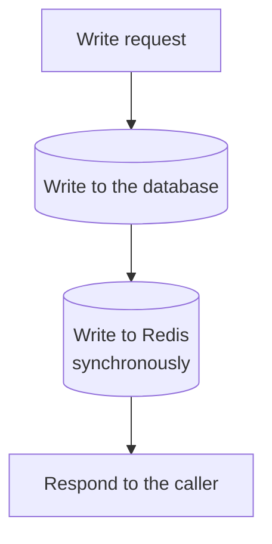
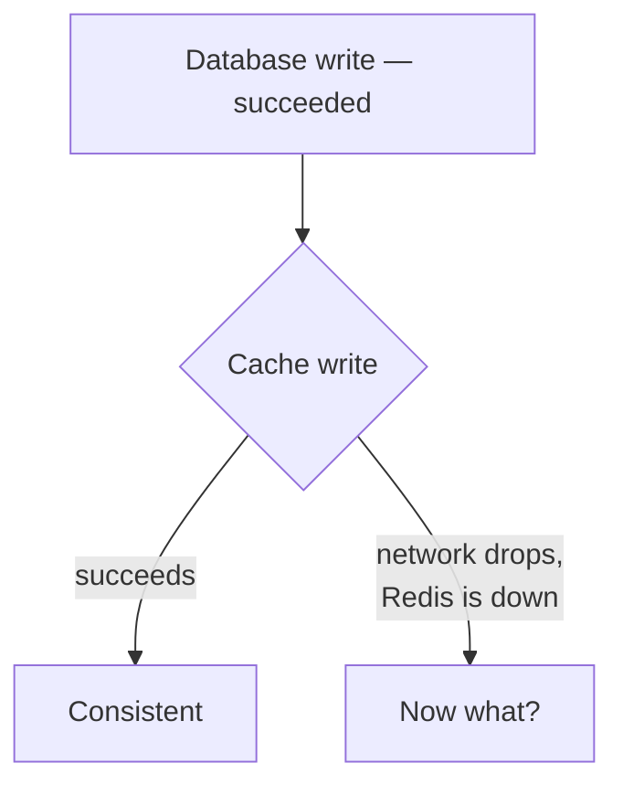
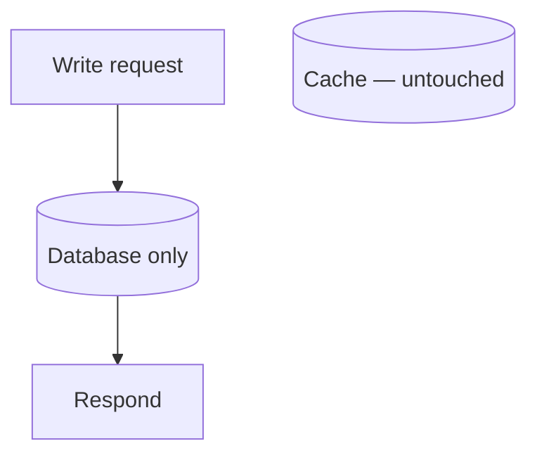
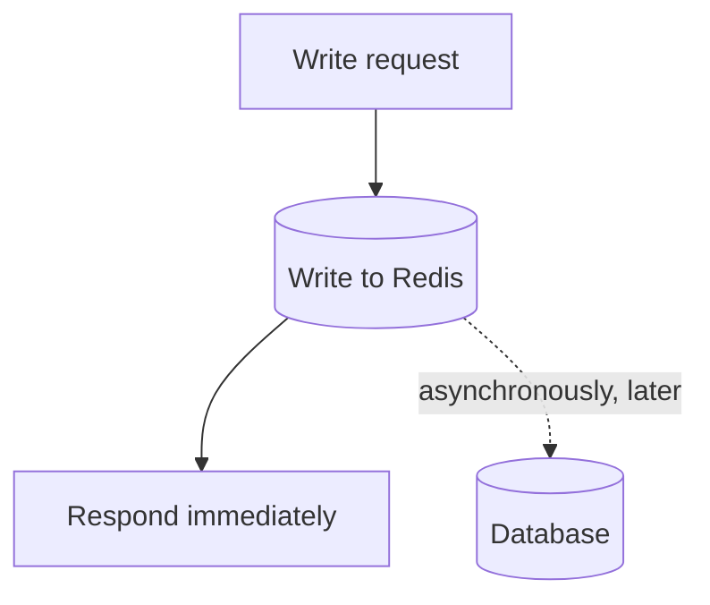
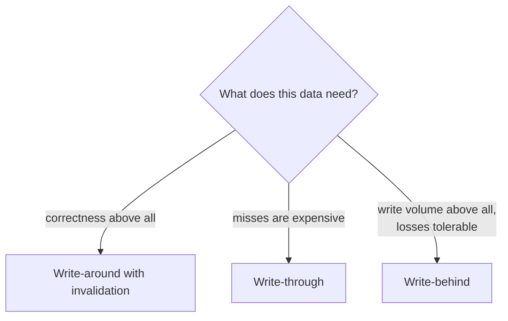

Cache-aside left one question open: when the underlying data changes, what happens to the copy in the cache? Three patterns answer it, and they differ in what they are prepared to lose.

# Write-through

The direct answer — update both, and do not report success until both are done.

> [!important] **Write-through writes to the database and the cache as part of the same request**, synchronously. The caller waits for both.

## What it buys

> [!important] **Very few cache misses**, because data is in the cache from the moment it first exists rather than after somebody happens to request it. And **no staleness from writes** — the cache is updated at the instant the database is.

Worth having where a miss is genuinely expensive: an expensive query, or a system whose latency requirement leaves no room for occasional slow requests.

## What it costs

> [!warning] **Every write gets slower.** The request now pays the database write plus the cache write. The read path was optimised at the expense of the write path.

> [!warning] **You are writing to two systems that cannot fail together**, and there is no transaction spanning both.

The partial failure is the real problem:

> [!warning] The database write has committed. The cache write has not. **Is that a successful request or a failed one?** Rolling back the database because a cache failed is absurd — the durable, authoritative write worked. Reporting success leaves the cache without data it was supposed to have.

> [!important] The workable answer is to **treat the database write as the one that decides**, and the cache write as best effort — log the failure, let the entry be absent, and let the read path handle the miss it already knows how to handle. Which means write-through in practice degrades into cache-aside when things go wrong, and it should be built expecting that.

# Write-around

The opposite decision, and often the right one.

> [!important] **Write-around sends writes to the database and does not touch the cache at all.** The cache is populated only by reads, on a miss, exactly as cache-aside describes.

> [!info] This is what plain cache-aside does about writes when nobody adds anything further. The name exists to describe the write behaviour specifically — the write goes **around** the cache rather than through it.

**The good case:** writes stay fast, and data that is written but never read never occupies memory. For a write-heavy table with a long tail nobody queries, that is exactly right.

> [!warning] **The bad case is the staleness window.** A value already cached is now wrong in the cache, and stays wrong until its TTL expires. The TTL is the only bound on it.

## Invalidation

Which is why the useful middle option exists:

> [!important] **On a write, delete the cached key.** The write goes to the database and the stale entry is removed rather than updated, so the next read misses and refetches the current value.

| | Update the cache on write | Delete the key on write |
|---|---|---|
| Next read | Hits immediately | Misses once, then hits |
| Write cost | Database plus cache write | Database plus a delete |
| Wrong data if the write fails halfway | **Possible** | **Not possible** — worst case is a miss |

> [!important] **Deleting is safer than updating**, and it is the common production choice. A failed delete leaves a stale entry, the same risk write-around already carries. A failed update can leave a **wrong** entry, which is worse, because a cache miss costs latency while a wrong value costs correctness.

> [!info] Where the database or the application notifies the cache — synchronously deleting, or asynchronously updating — this is still described as cache-aside. Write-around specifically means no communication happens at all.

# Write-behind

The aggressive one. Also called write-back.

> [!important] **The write goes to the cache, the cache acknowledges immediately, and the database is updated asynchronously afterwards.** The caller never waits for the database.

## What it buys

> [!important] **Writes at cache speed** — a fraction of a millisecond instead of tens. For a workload absorbing a very high write rate, this is the difference between coping and not. Writes can also be batched or coalesced before reaching the database, so a value updated fifty times might be written once.

## What it costs

> [!warning] **Redis becomes the source of truth**, for as long as the write has not reached the database. That is precisely what `09-When-Not-To-Cache` said never to allow, and here it is a designed-in property rather than an accident.

> [!warning] **A cache failure in that window loses data permanently.** The write was acknowledged, so the client believes it succeeded. It is not in the database. Reads now fall through to a database that has never heard of it — and there is no recovery path, because the only copy was in the process that died.

> [!info] Persistence narrows the window without closing it. An append-only file recovers writes up to the last flush; anything after it is still gone, and the data is unavailable for the whole outage regardless.

## Where it is legitimate

> [!important] Where **losing some writes is genuinely acceptable** and the volume justifies it. Metrics, logs, view counters, telemetry — data whose value is aggregate, where losing a few seconds of a stream changes no decision.

> [!important] The underlying idea is **eventual consistency**: the system does not promise the database is current right now, only that it will catch up. Fine for how much memory a machine was using. Not fine for a payment.

# Side by side

| | Write-through | Write-around | Write-behind |
|---|---|---|---|
| Cache updated on write | **Yes, synchronously** | No | **Yes, first** |
| Database updated | **Synchronously** | **Synchronously** | **Asynchronously** |
| Write latency | Slowest | **Normal** | **Fastest** |
| Cache misses | **Fewest** | Most | Few |
| Staleness risk | None from writes | **Until the TTL** | None in cache |
| Data loss risk | None | None | **Real** |
| Source of truth | Database | Database | **The cache, briefly** |

> [!important] **Write-around with invalidation on write is the sensible default.** It keeps the database authoritative, keeps writes fast, and bounds staleness by an explicit TTL. Write-through is the specialisation for when misses genuinely hurt; write-behind is for a narrow class of data where throughput matters more than any individual write does.

> [!important] And the choice is per kind of data, not per system. **One application will reasonably use write-around for a product catalogue and write-behind for view counters**, because those two things fail differently and are worth different amounts.
