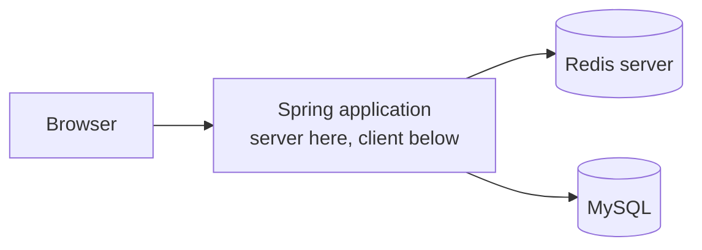
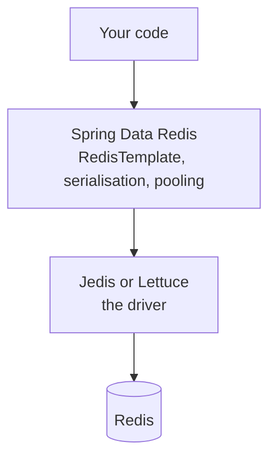

Everything so far has been Redis on its own terms — the structures it holds and the patterns for using them. None of it has touched an application. This note is the wiring, and it is genuinely the easy part.

# What is actually being connected

> [!important] **Redis is a server and your application is a client of it**, exactly as your application is a server to the browser and a client to MySQL. The application opens a connection, sends a request, receives a response.



For that to work the application needs code that knows how to speak Redis.

> [!important] A **client library** does three things: opens and manages the connection, packs a request into the wire format Redis understands, and parses the reply back into something the language can use. Without one you would be writing bytes onto a socket by hand.

# The libraries

| Library | Language | |
|---|---|---|
| **Jedis** | Java | The long-standing client, synchronous |
| **Lettuce** | Java | The other main client, non-blocking |
| node-redis, ioredis | JavaScript | The common two |

> [!info] Every widely used language has at least one mature client, which is what makes this a solved problem rather than a project.

# The layer above them

A raw client is a thin thing. Spring provides something on top:



> [!important] **`spring-boot-starter-data-redis` is a wrapper over a driver, not a replacement for one.** It exposes `RedisTemplate` instead of raw commands, handles serialisation, and manages connections — and underneath it, one of Jedis or Lettuce does the talking.

Which is a structure already seen:

| Driver | Abstraction above it |
|---|---|
| `mysql-connector-j` | Spring Data JPA |
| **Jedis or Lettuce** | **Spring Data Redis** |

> [!important] The parallel is exact and worth holding onto. **The driver knows the protocol; the Spring layer makes it convenient.** Neither replaces the other, and both end up on the classpath.

## What the wrapper adds

**Typed operations instead of command strings.** `opsForValue().get(key)` rather than assembling a `GET`.

**Serialisation handled.** Java objects converted on the way out and back, which is otherwise yours to write.

**Connection pooling and lifecycle**, configured rather than coded.

> [!info] Lettuce is non-blocking and is what Spring Boot uses by default; Jedis is synchronous, so each call occupies its thread until Redis replies. For ordinary request-response work either is fine — the difference matters under high concurrency or in reactive applications.

# The dependencies

```groovy
1  // build.gradle
2  implementation 'org.springframework.boot:spring-boot-starter-data-redis'
3  implementation 'redis.clients:jedis:7.2.0'
```

> [!info] The starter alone is enough, since it brings Lettuce. Adding Jedis explicitly selects it as the driver instead.

# The configuration

```yaml
1  # src/main/resources/application.yml
2  spring:
3    data:
4      redis:
5        host: localhost
6        port: 6379
```

`6379` is the Redis default port. A running server can be confirmed before the application ever starts:

```text
  redis-cli ping
  PONG
```

## The prefix that silently does nothing

There is an older form of this configuration, it appears widely in articles, and on a current Spring Boot it is inert.

```yaml
1  # WRONG on Spring Boot 3 and later
2  spring:
3    redis:
4      host: localhost
5      port: 6379
```

> [!warning] **`spring.redis.*` was replaced by `spring.data.redis.*` in Spring Boot 3.0**, and it is not merely discouraged — it is not read at all.

Reading the configuration metadata shipped inside `spring-boot-data-redis-4.0.2.jar`:

```json
1  "spring.redis.host" -> {
2      "level": "error",
3      "replacement": "spring.data.redis.host",
4      "since": "3.0.0"
5  }
```

> [!important] **Deprecation level `error` means the property is not bound.** Writing it has the same effect as writing nothing.

And here is why that is dangerous rather than merely wrong:

```json
1  "spring.data.redis.host" default: "localhost"
2  "spring.data.redis.port" default: 6379
```

> [!warning] **The defaults are exactly the values people write.** An application configured the old way connects to `localhost:6379` and works perfectly — not because the configuration was read, but because it was ignored in favour of defaults that happen to match. **Point Redis at another host or port and the setting is still ignored**, the application still connects to localhost, and the failure appears far from its cause.

> [!info] **Verified** by extracting `META-INF/spring-configuration-metadata.json` from the Spring Boot 4.0.2 artifact rather than from documentation. A configuration that works on a developer machine and fails in every other environment is the exact shape of bug this produces.

# What this is and is not

> [!important] Wiring a cache in is a **one-time setup**, largely identical across projects, thoroughly documented, and in most workplaces already done by whoever set the service up. It is not where the difficulty lives.

> [!important] **The difficulty is deciding what to cache, under what key, for how long, and what happens when it is wrong.** That is the material in `09` through `12`, and it is the part that does not transfer from a tutorial.
