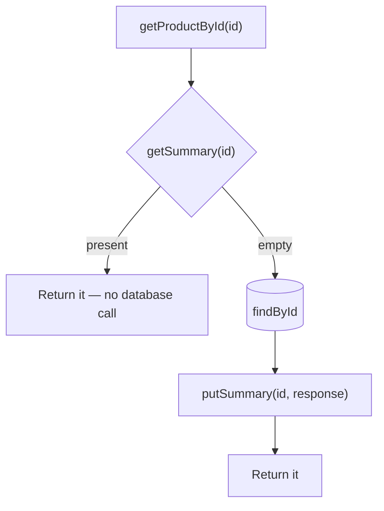
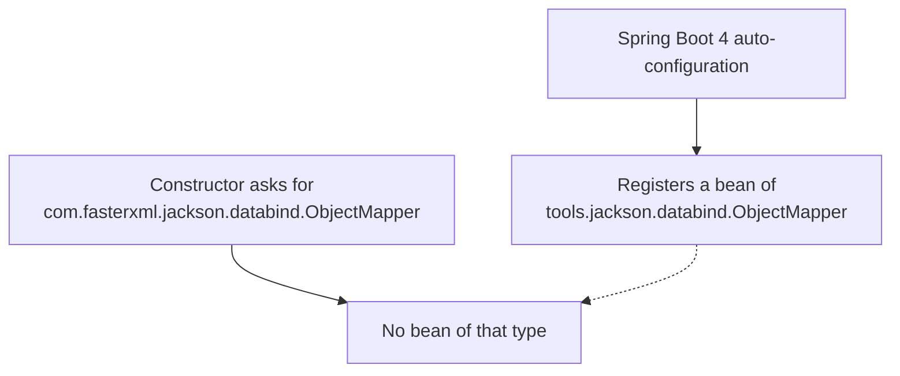

The cache class exists and nothing calls it. Connecting it to a service is four lines, and running it for the first time produces an error worth understanding properly.

# The service

```java
1  // src/main/java/com/example/FakeCommerce/services/ProductService.java
2  @Service
3  @RequiredArgsConstructor
4  public class ProductService {
5
6      private final ProductRepository productRepository;
7      private final CategoryService categoryService;
8      private final ProductRedisCache productRedisCache;
9
10     public GetProductResponseDto getProductById(Long id) {
11         Optional<GetProductResponseDto> cachedSummary = productRedisCache.getSummary(id);
12         if (cachedSummary.isPresent()) {
13             return cachedSummary.get();
14         }
15         GetProductResponseDto response = productRepository.findById(id)
16             .map(product -> GetProductResponseDto.builder()
17                 .id(product.getId())
18                 .title(product.getTitle())
19                 .description(product.getDescription())
20                 .price(product.getPrice())
21                 .image(product.getImage())
22                 .rating(product.getRating())
23                 .build())
24             .orElseThrow(() -> new ResourceNotFoundException("Product with id " + id + " not found"));
25         productRedisCache.putSummary(id, response);
26         return response;
27     }
28 }
```

**Line 8** injects the cache the same way the repository is injected — it is a `@Service`, so the container supplies it.

## This is cache-aside, exactly as described



> [!important] Lines 11 to 26 are the four steps from `10-Cache-Aside-And-Read-Through`, in order: **ask the cache, return on a hit, query the database on a miss, store the result before returning.** The pattern was described in the abstract there; this is it in code, and there is nothing more to it.

## What is cached is not the entity

> [!important] The cached value is `GetProductResponseDto` — id, title, description, price, image, rating — **not the `Product` entity.** It carries no category, no relationships and no JPA state.

That is deliberate:

**A DTO is already flat**, so it serialises to JSON without dragging associations behind it. Serialising an entity with lazy relationships either fails or silently triggers loads.

**Only what the endpoint returns is stored**, so the cache holds the smallest thing that answers the question.

> [!important] Which restates the boundary from `09-When-Not-To-Cache` in a concrete form. **Redis is not holding your data; it is holding one prepared answer.** The database keeps the product.

# It does not start

First run, and the application fails before serving anything:

```text
  Parameter 1 of constructor in ProductRedisCache required a bean of type
  'com.fasterxml.jackson.databind.ObjectMapper' that could not be found.

  Consider defining a bean of type 'com.fasterxml.jackson.databind.ObjectMapper'
  in your configuration.
```

The obvious reading is that Jackson is missing. It is not — and adding `com.fasterxml.jackson.core:jackson-databind` to the build does not fix it, which is the clue.

## What the message actually says

> [!important] The complaint is not that Jackson is absent. It is that **no bean of that exact type exists.** A class being on the classpath and a bean of it existing in the container are different things, and only the second satisfies constructor injection.

Spring Boot does auto-configure an `ObjectMapper`. It is not of that type.

## The cause

> [!important] **Jackson 3 renamed its root package from `com.fasterxml.jackson` to `tools.jackson`.** Spring Boot 4 ships Jackson 3 and auto-configures a `tools.jackson.databind.ObjectMapper`. An import of `com.fasterxml.jackson.databind.ObjectMapper` asks for a Jackson 2 type, and no bean of it is registered.

Both lines are managed, which is why the older class is still resolvable and still wrong:

```text
  jackson-2-bom.version   2.20.2     com.fasterxml.jackson
  jackson-bom.version     3.0.4      tools.jackson
```

> [!info] **Verified** by reading `spring-boot-dependencies-4.0.2.pom`. Jackson 2 remains available for compatibility; Jackson 3 is what the framework wires up.



## The fix

```java
1  import tools.jackson.databind.ObjectMapper;
```

One line. Nothing else changes.

> [!warning] **Adding a `jackson-databind` dependency does not help**, and reaching for one is the natural wrong move. It puts the Jackson 2 class on the classpath, where it was probably resolvable already, and **registers no bean** — so the same error appears after a rebuild, which is what makes this take longer than it should.

> [!important] The general lesson is worth more than the specific fix. **`required a bean of type X` is about the container, not the classpath.** The question it asks is which bean of that exact type exists, and when the answer is none while the class imports fine, suspect **two types with the same simple name** — which is precisely what a package rename produces.

# Watching it work

Once it starts, the same request twice:

```text
  GET /api/v1/products/1
```

```log
  Cache miss for product summary: 1
  Hibernate: select p1_0.id, p1_0.title, ... from products p1_0 where p1_0.id=?
```

```text
  GET /api/v1/products/1
```

```log
  Cache hit for product summary: 1
```

> [!important] **No Hibernate line on the second request.** The database was not consulted at all — which is the whole point, and the log lines from `14-The-Cache-Class` are what make it observable.

The measured difference on an ordinary development machine:

| | Latency |
|---|---|
| Cache miss — database round trip, then a cache write | **38 ms** |
| Cache hit | **8 ms** |

> [!info] Both numbers include the full HTTP round trip and application processing, so neither is the raw Redis figure of `01-Why-Cache`. **The ratio is the point**, and it holds on hardware that is not fast.

And after the TTL:

```log
  Cache miss for product summary: 1
  Hibernate: select p1_0.id, p1_0.title, ...
```

> [!important] One minute after it was written the entry expires, the next request misses, and the database is queried once more. **Staleness is bounded by exactly the TTL** — a product updated in the database is served from a stale cache for at most a minute, then corrects itself.

# What this generalises to

The same shape fits every read endpoint whose answer changes slowly — all products, all categories, products by category, an order summary.

> [!important] Each needs its own key prefix and its own TTL, and **the TTL is the decision that requires thought**, because it is the staleness the endpoint is allowed to have. A category list can tolerate an hour. A price probably cannot.

> [!warning] The repetition is the honest cost of this approach. **Every cached endpoint gets the same check-miss-fetch-store block written out by hand**, and each copy is somewhere the key convention or the TTL can be got wrong. That is the pressure that leads to Spring's caching abstraction, where the same behaviour is declared with an annotation instead.
