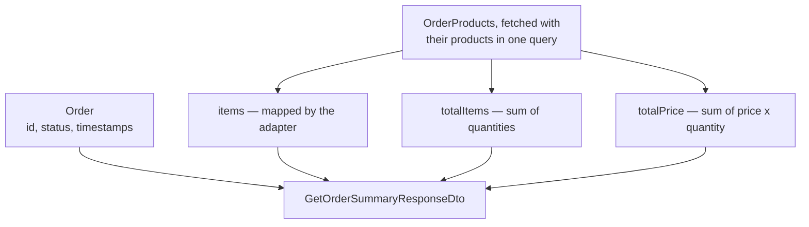

The order service has methods and the controller has stubs. Wiring them together is mostly mechanical — but two things in it are worth stopping on: a response that computes rather than reports, and an endpoint that gets abandoned halfway through writing it.

# The controller methods

Every one has the same shape by now.

```java
1  // src/main/java/com/example/FakeCommerce/controllers/OrderController.java
2  @PostMapping
3  public ResponseEntity<ApiResponse<GetOrderResponseDto>> createOrder(
4          @RequestBody CreateOrderRequestDTO createOrderRequestDTO) {
5
6      return ResponseEntity
7              .status(HttpStatus.CREATED)
8              .body(ApiResponse.success(
9                  orderService.createOrder(createOrderRequestDTO),
10                 "Order created successfully"));
11 }
12
13 @PutMapping("/{id}")
14 public ResponseEntity<ApiResponse<GetOrderResponseDto>> updateOrder(
15         @PathVariable Long id,
16         @RequestBody UpdateOrderRequestDto updateOrderRequestDto) {
17
18     return ResponseEntity
19             .ok(ApiResponse.success(
20                 orderService.updateOrder(id, updateOrderRequestDto),
21                 "Order updated successfully"));
22 }
```

`ResponseEntity` for the status, `ApiResponse` for the envelope, the service called inline. **The controller does no work** — it maps HTTP onto a service call and wraps the result.

> [!info] `PUT` for update, `POST` for create, the id as a path variable because it identifies a resource, and the changes in the body because they have structure. Every one of those follows the conventions rather than being decided again.

# A response that computes

`getOrderSummary` is the one that is not just plumbing. A summary should carry more than the order — the totals a client would otherwise have to calculate itself.

```java
1  // src/main/java/com/example/FakeCommerce/dtos/GetOrderSummaryResponseDto.java
2  @Data
3  @AllArgsConstructor
4  @NoArgsConstructor
5  @Builder
6  public class GetOrderSummaryResponseDto {
7
8      private Long id;
9      private OrderStatus status;
10     private List<OrderItemResponseDto> items;
11     private Integer totalItems;
12     private BigDecimal totalPrice;
13     private LocalDateTime createdAt;
14     private LocalDateTime updatedAt;
15 }
```

**Lines 11 and 12 exist in no table.** They are computed when the response is built, which is the same freedom a DTO gave `subTotal` in the adapter.

> [!info] Which fields belong here is a **business question, not a technical one.** Total items and total price are guesses at what a client needs; the real answer comes from whoever is building the screen. A response shape is a contract with another team.

## Building it

```java
1  // src/main/java/com/example/FakeCommerce/services/OrderService.java
2  public GetOrderSummaryResponseDto getOrderSummary(Long id) {
3
4      Order order = orderRespository.findById(id)
5          .orElseThrow(() -> new ResourceNotFoundException("Order not found with id: " + id));
6
7      List<OrderProducts> orderProducts = orderproductsRepository.findByOrderWithProduct(order);
8
9      List<OrderItemResponseDto> items = orderAdapter.mapToOrderItemResponseDto(orderProducts);
10
11     int totalItems = orderProducts.stream()
12             .mapToInt(OrderProducts::getQuantity)
13             .sum();
14
15     BigDecimal totalPrice = orderProducts.stream()
16             .map(op -> op.getProduct().getPrice().multiply(BigDecimal.valueOf(op.getQuantity())))
17             .reduce(BigDecimal.ZERO, BigDecimal::add);
18
19     return GetOrderSummaryResponseDto.builder()
20         .id(order.getId())
21         .status(order.getStatus())
22         .items(items)
23         .totalItems(totalItems)
24         .totalPrice(totalPrice)
25         .createdAt(order.getCreatedAt())
26         .updatedAt(order.getUpdatedAt())
27         .build();
28 }
```

**Line 7 reuses `findByOrderWithProduct`** — the `JOIN FETCH` query written for the update path. Both totals need the product's price, and without the fetch, line 16 would trigger a query per item.



Two queries in, one response out — and three of the response's fields exist nowhere in the database.

## Two different reductions

Lines 11 and 15 are summing, and they are written differently for a reason.

> [!important] **`mapToInt(...).sum()`** produces an `IntStream`, which has `sum()` built in. A plain `map` gives a `Stream<Integer>`, which does not — you would need `reduce(0, Integer::sum)` and a round of boxing per element.

`BigDecimal` has no such shortcut, so line 17 does it explicitly:

> [!important] **`reduce` takes a starting value and a way to combine.** `BigDecimal.ZERO` is the identity, `BigDecimal::add` is the operation. The result is every line's price times its quantity, added up.

> [!info] Money stays in `BigDecimal` throughout. `mapToInt` is fine for a count; there is no `mapToDecimal`, and there should not be — the whole reason for `BigDecimal` is that money must not go anywhere near a primitive with rounding error.

# The endpoint that got abandoned

`getOrdersByUserId` was next. It gets as far as a repository method:

```java
1  List<Order> findByUserId(Long userId);
```

And stops, because **there is no user.** `Order` has a status and the fields from `BaseEntity`. Nothing in the schema associates an order with a person.

> [!important] The endpoint was removed rather than faked. Adding a `userId` column to satisfy one method would create an identifier referencing a table that does not exist — **a foreign key to nothing**, which the database cannot enforce and no other code can use.

Users are their own piece of work: an entity, a table, a relationship from orders, and the authentication that makes a user id meaningful in a request. Half of it, added to unblock one endpoint, is worse than none.

> [!info] Worth noticing as a working pattern. **Discovering a missing dependency while writing the code is normal**, and the useful response is to stop and name it rather than build a stub that has to be unpicked later.

# Two annotations for writing queries

A question that comes up once a custom update is written.

`@Query` normally carries a `SELECT`, and Spring Data expects a result set — rows, mapped to entities or projections. An `UPDATE` or `DELETE` returns no rows. It returns **a count of how many were affected**.

```java
1  @Modifying
2  @Transactional
3  @Query("UPDATE Product p SET p.deletedAt = CURRENT_TIMESTAMP WHERE p.id = :id")
4  int softDeleteById(Long id);
```

> [!important] **`@Modifying` tells Spring Data this query changes data rather than returning it.** Without it, the framework tries to execute a statement expecting a result set and fails, because it was told the wrong kind of thing to expect.

> [!important] **`@Transactional` is required because a write needs a transaction.** A read can run without one; a modification must be committed or rolled back as a unit. On the repository method it applies to that method alone — more usually it belongs on the service, so the whole operation is one unit.

> [!info] The `int` return is that affected-row count, and it is worth using. Zero rows updated where you expected one means the row was not there — a fact you only learn if you check.

# On writing this by hand

Once the shape is familiar, the mechanical parts of this go quickly with a coding assistant. There is a real argument for that at some point and a stronger one against it now.

> [!important] **If a tool writes an N+1 query for you and you have never fixed one, you will not recognise it.** The whole value of the previous folder was seeing 21 queries become 3 — and that only registered because the naive version was written first, run, and measured.

Which is the honest rule: **write it manually while you are learning what can go wrong.** The productivity argument applies to work whose failure modes you can already spot.

Two practical points sit alongside that.

> [!important] **Plenty of interviews still forbid it.** Whatever the working world settles on, a large share of companies currently expect code written without assistance in front of them. Skill you only have with a tool in the room is skill you cannot demonstrate in a room that has banned the tool.

> [!info] Most assistants offer a mode that answers without editing files, as against one that goes ahead and changes them. **While learning, the answering mode is the better setting** — you read the explanation and then type the code, which is the part that puts it in your hands. The editing mode skips exactly the step you are there to practise.

Once the shape is genuinely familiar, the calculation flips, and the work that goes fastest is the work you could already have done: a fourth CRUD resource identical to the three you wrote by hand, a response DTO whose fields you can list, a mechanical refactor you can already picture. Being specific is what makes that work — naming the files to follow for conventions, listing the fields you want rather than leaving them to be invented, and reading the result as you would review a colleague's.
