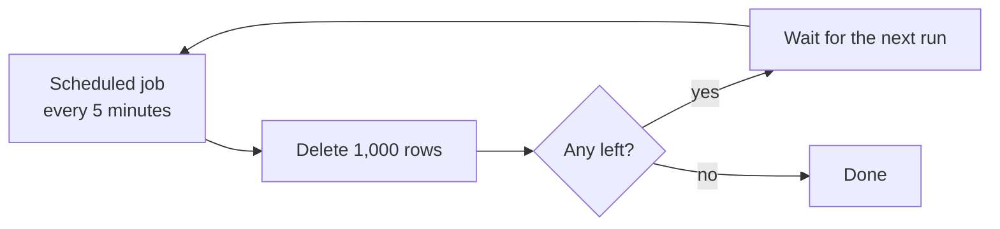
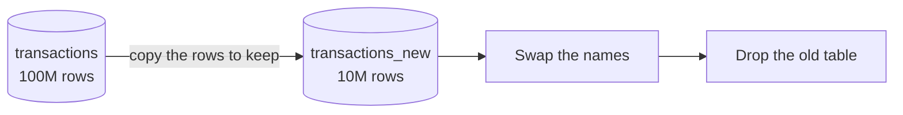

Deleting a row is one statement. Deleting a hundred million rows from a table that is serving live traffic is a different problem entirely, and the statement that works for one is the wrong answer for the other.

# Why the obvious version is dangerous

```sql
1  DELETE FROM transactions WHERE created_at < '2024-01-01';
```

Correct, and on a large table it can take a production system down. Three reasons, and they compound.

**It holds locks.** Rows being deleted are locked for the duration. Other queries touching them wait. A statement running for twenty minutes is twenty minutes of blocked traffic.

**It scans.** Without an index on the filtered column, finding the rows means a full table scan — reading every row to decide which to remove.

**The transaction grows.** The database keeps enough information to roll back the whole statement, so a huge delete builds a huge undo log, and rolling it back costs as much as the delete did.

> [!warning] The failure is not that the delete is slow. **It is that everything else becomes slow while it runs**, and a query that has already run for twenty minutes cannot be cancelled cheaply — cancelling it means rolling back everything it has done.

# Batch it

> [!important] Delete in **chunks**, on a schedule. A job runs every few minutes, removes a bounded number of rows, and stops. Repeat until done.



Each run is short, so locks are held briefly. **The gaps are the point** — between runs the database serves normal traffic at normal speed, and replicas get a chance to catch up.

> [!important] The whole operation takes longer in wall-clock time and **costs the live system almost nothing**, which is the trade being made deliberately. A delete that finishes in twenty minutes and degrades every request during them is worse than one that takes two days and nobody notices.

Chunk size and interval are tuned to your data and load. A thousand rows every five minutes is a starting point, not a rule.

# Why not just add an index

The natural response to the scan is to index the column being filtered on. It is usually the wrong move here.

> [!important] **An index is an extra data structure, which means extra memory and extra maintenance.** Building one on a very large table takes time and reads the whole table to do it — the expensive operation you were trying to avoid.

And it does not stop costing you once built:

> [!warning] **Every delete forces the index to restructure.** Removing rows means removing their entries and rebalancing. An index added to speed up a mass delete is itself repeatedly reorganised by that delete.

There is a design argument underneath the technical one:

> [!important] **If that index does not already exist, that may be because nothing needs it.** Indexes are provisioned against real memory budgets. Adding one permanently, for one operation you will run once, is paying forever for a one-off.

The reasoning changes if the column is one you query regularly — then the index was missing already and the delete merely revealed it.

# Other approaches

Batching is the safe default. Two alternatives are worth knowing, both trading memory for time.

## Table swap

Instead of deleting what you do not want, **copy what you do want** into a new table, then swap.



Dropping a table is fast — far faster than deleting its rows one at a time. But:

> [!warning] **Both tables exist at once**, so you need storage for the original plus the copy. On a table that is already large, that may simply not be available. And writes arriving during the copy have to be handled, or they are lost in the swap.

## Migrate to a new database

The same idea one level up, for when a database holds a single dominant table. Copy batch by batch into a new database, repoint the application, drop the old one.

## Range partitioning

Both of the above need a way to walk the data in pieces:

```sql
1  SELECT * FROM transactions ORDER BY id LIMIT 1000 OFFSET 0;
2  SELECT * FROM transactions ORDER BY id LIMIT 1000 OFFSET 1000;
```

> [!important] **Ranges over the primary key are what make batching possible without an index on the filter column.** You are not searching for rows matching a condition — you are walking the table in primary-key order and deciding about each batch in memory.

Which sidesteps the original problem. The scan was expensive because the filter had no index; the primary key always has one.

Worth making concrete, because the instinct is to write the filter into the query. Say the rows to remove are ids 5, 10, 15, 20 and so on, with scattered exceptions — 49 as well, for some reason the data has and you do not. The tempting version is to look each one up:

```sql
1  SELECT * FROM transactions WHERE id = 5;
2  SELECT * FROM transactions WHERE id = 10;
```

> [!warning] **That is the unindexed lookup you were trying to avoid, run once per row.** Nothing has improved; the same missing index costs the same full scan, now repeated a million times.

The batching version never asks for the rows it wants. It takes the next thousand in primary-key order, whatever they are, decides in application code which of those thousand match, and deletes those. **The filter moves out of the database and into memory** — which is affordable precisely because the batch is small and the walk is indexed.

> [!info] Large `OFFSET` values get slow, because the database still walks past the skipped rows. Remembering the last id seen and using `WHERE id > :lastId LIMIT 1000` is the version that stays fast to the end.

# How to choose

| | Use when | Cost |
|---|---|---|
| **Batch delete** | The default. Live system, constrained memory | Slow in wall-clock time |
| **Table swap** | Deleting most of the table, storage available | Double storage; writes during the copy |
| **New database** | One dominant table, the whole store is being replaced | The most disruptive |
| **Soft delete** | The rows must remain recoverable | They stay, and every query filters them |

> [!important] **Batch deletion is the safest because it needs no extra memory and no downtime.** It is the wrong choice only when the requirement is that everything disappear at once — and that requirement is worth questioning, because it is rarely real.

# Where the problem came from

Worth being honest about the situation.

> [!important] A table holding a hundred million rows, with no index on the column you now need to filter by, **is a design problem showing up late.** The deletion is not the failure; it is the first operation that made the missing index expensive enough to notice.

Which is the more general lesson, and the reason this belongs beside the indexes material.

> [!important] **Decisions that are free at small scale become constraints at large scale.** A table with ten thousand rows does not care about its indexes — every access pattern is cheap. The same table at a hundred million rows only permits the access patterns somebody planned for, and adding a new one retroactively is the expensive operation this note is about.
