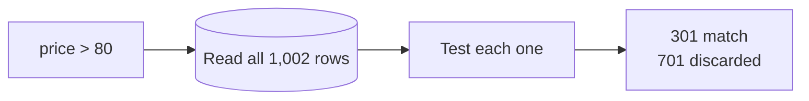
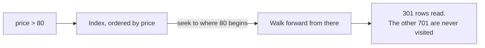

An index makes reads faster, which is easy to say and worth being able to prove. The database will tell you exactly what it did with a query, and reading that output is the skill this note is about.

# What an index is, in one paragraph

> [!important] An **index** is a separate data structure maintained alongside the table, holding the same data arranged for fast lookup. Searching the index instead of the table turns a linear scan into a logarithmic one.

Take an unsorted array. Searching it means checking every element — **O(n)**. Sorting it is not an option if data keeps arriving, because every insert would need a re-sort. So you build a balanced tree alongside it, add to both on every insert, and search the tree.

| Rows | Linear search | Tree search |
|---|---|---|
| 10³ | ~1,000 checks | **~10** |
| 10⁶ | ~1,000,000 | **~20** |
| 10⁹ | ~1,000,000,000 | **~30** |

An index is that idea, applied to a table.

## What it costs

Nothing about this is free, and both costs are worth stating plainly.

> [!warning] **Space.** The index duplicates the indexed columns. More indexes, more disk.

> [!warning] **Writes get slower.** Appending to a table is cheap. Appending to a table **and** inserting into a tree is `O(log n)`, and every index on the table pays that on every insert, update and delete.

> [!info] Which matters more than it sounds on a full disk. When a database's disk approaches capacity the whole machine degrades — the operating system loses room for virtual memory, files fragment, and the database has less space to work in. **Indexes consume the resource that everything else also needs.**

# `EXPLAIN`

The database will describe its plan for a query rather than running it.

```sql
  EXPLAIN SELECT * FROM products WHERE price > 80;
```

Two phrases in the output carry most of the meaning:

| | |
|---|---|
| **`Table scan`** | Every row is being read and tested. A linear search |
| **`Index range scan`** | The index is being used to find where the matching values start |

> [!important] **`Table scan` in a plan is the signal to stop and think.** It is not always wrong — on a small table, or when most rows match, it is the correct choice — but it always means the database is reading everything.

# The experiment

A `products` table loaded with **1,000 rows**, of which **301** have `price > 80`.

## Without an index

```sql
  EXPLAIN SELECT * FROM products WHERE price > 80;
```

```text
  -> Filter: (products.price > 80)  (cost=104 rows=334)
      -> Table scan on products  (cost=104 rows=1002)
```

**Read it bottom-up.** Line 2 is a table scan over **1,002 rows** — everything. Line 1 filters those down to an estimated 334.

> [!important] **1,002 rows read to return 301.** The database had no way to know which rows qualified without looking at all of them.



> [!info] `rows=334` against an actual 301 is an **estimate**, from statistics the database keeps about column distribution. It does not know the answer before running the query — it is guessing well enough to choose a plan.

## With an index

```sql
  CREATE INDEX idx_price ON products (price);
```

Same query, same result set, different plan:

```text
  -> Index range scan on products using idx_price  (cost=136 rows=301)
```

> [!important] **301 rows.** Not 1,002. Because the index is ordered by price, the database can find where values above 80 begin and read from there — it never touches the rows that do not qualify.



## The cost number went up

Notice cost went from **104 to 136** while rows read fell from 1,002 to 301. That looks backwards.

> [!warning] **At 1,000 rows, the cost metric is not measuring what you want it to.** A table this small is stored in a handful of contiguous pages, and reading contiguous pages sequentially is very cheap. Using an index means reading the index **and then** jumping to the rows it points at — random access, which the optimiser prices higher than a short sequential sweep.

> [!important] **Rows examined is the honest metric at small scale.** The cost model becomes meaningful when the table is large enough that reading all of it is genuinely expensive — and at that size the index wins on both numbers. Testing index strategy against a thousand rows can tell you the opposite of the truth.

Which is a practical warning for the lab: **generate enough data that the difference is real** before drawing conclusions.

# An index only helps its own columns

```sql
  EXPLAIN SELECT * FROM products WHERE rating > 3;
```

```text
  -> Table scan on products
```

The index on `price` is present and irrelevant. Nothing in it is ordered by rating.

> [!important] **Adding an index does not make the table fast. It makes queries on those columns fast.** Every other query is exactly as it was.

Which is the beginning of the real problem. A table has many columns and an application has many queries, so the question becomes **which indexes**, in what combination — and that is what composite indexes are for.

# What the structure actually is

Worth one paragraph, because the terminology appears in every plan above.

> [!important] The usual index structure is a **B+ tree** — a balanced tree where each node holds a range of values and many children, rather than the two of a binary tree. Fewer, wider levels means fewer disk reads to reach a value.

The `+` matters for the phrase you keep seeing:

> [!important] In a B+ tree, **all values live in the leaf nodes and the leaves are linked in order.** Having found where `price > 80` begins, the database walks the leaves sequentially. That is precisely what **range scan** means, and why range queries are fast on a B+ tree rather than merely possible.

> [!info] Other structures exist. **LSM trees** back many NoSQL stores and are optimised for write-heavy workloads. **Hash indexes** give constant-time exact lookups and cannot do ranges at all — a hash of 80 tells you nothing about where 81 is.

# The habit

> [!important] **Read the plan rather than assuming.** An index that exists may not be used; a query that looks indexed may scan. `EXPLAIN` is the only thing that settles it, and it costs nothing to run.
