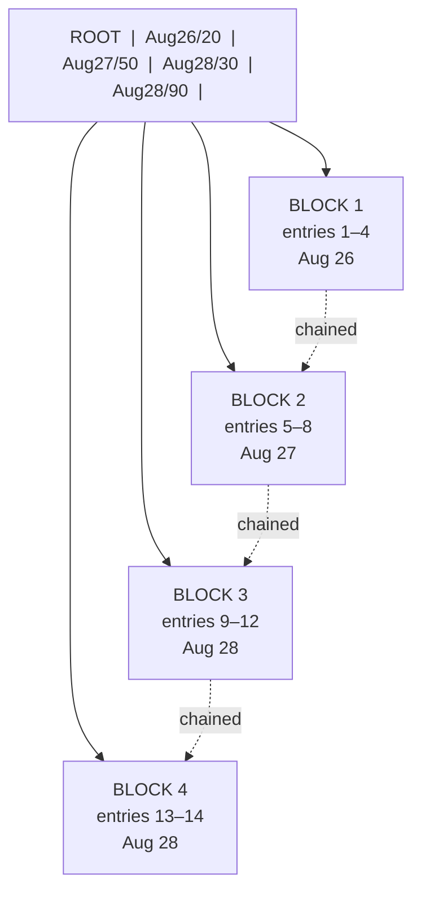
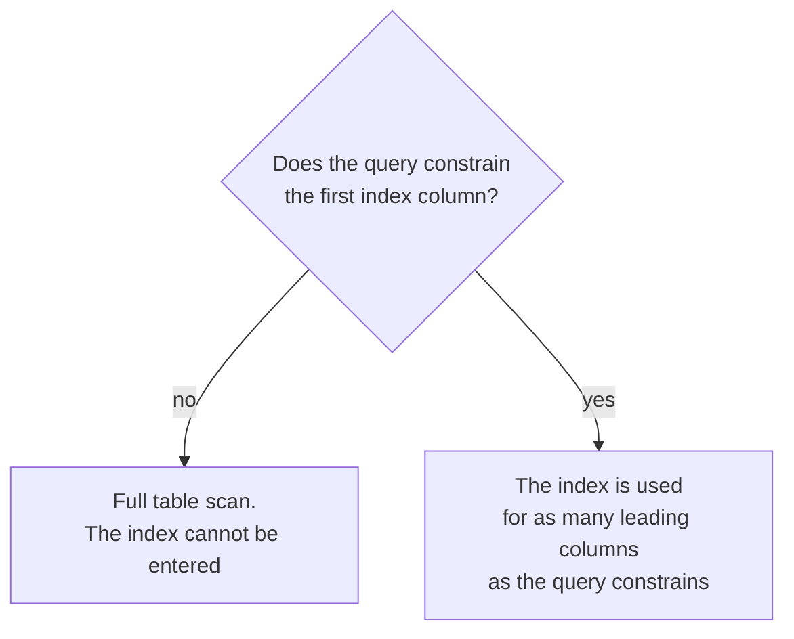
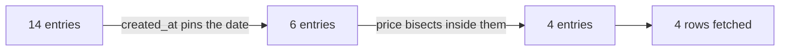
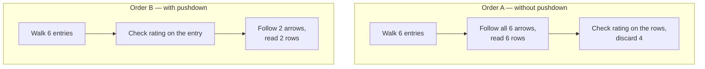

One index per column would be simple and is not what anybody does. Real queries filter on several columns at once, and an index spanning several columns behaves in a way that catches people out — including people who have been writing SQL for years.

# One index, several columns

```sql
  CREATE INDEX idx_price_rating_category
  ON products (created_at, price, rating, category_id);
```

> [!important] A **composite index** orders rows by several columns in sequence — by `created_at` first, then by `price` within each `created_at`, then by `rating`, then by `category_id`.

> [!info] The index name omits its own leading column. That is the name the plans below print, so it is kept as-is, but read the column list rather than the name: `created_at` is first, and everything in this note turns on that.

Everything that follows is a consequence of that ordering, so it is worth seeing the ordering literally rather than taking it on description.

## The table

Fourteen products, sitting in whatever order they were inserted:

```text
   id  title       created_at  price  rating  category_id
   --  ---------   ----------  -----  ------  -----------
    1  Mouse       Aug 26         20     4.5            1
    2  Keyboard    Aug 26         50     2.0            1
    3  Monitor     Aug 27        300     4.0            1
    4  Cable       Aug 27         50     1.5            2
    5  Desk        Aug 28         90     4.8            3
    6  Chair       Aug 28         90     2.5            3
    7  Lamp        Aug 28         30     3.5            3
    8  Stand       Aug 28         60     1.0            2
    9  Pad         Aug 26         20     1.2            2
   10  Hub         Aug 27         50     4.9            1
   11  Webcam      Aug 27         50     3.1            3
   12  Charger     Aug 28         30     0.8            2
   13  Case        Aug 26         75     3.9            1
   14  Speaker     Aug 28        120     2.2            1
```

## The index built from it

A **separate structure**, stored apart from the table, holding only the four indexed columns plus a pointer back to the row — and kept sorted:

```json
       created_at   price   rating   cat      → row
       ----------   -----   ------   ---      ----
    1  Aug 26          20      1.2     2      →  9   Pad   ┐ same date and price,
    2  Aug 26          20      4.5     1      →  1   Mouse ┘ so rating is sorted
    3  Aug 26          50      2.0     1      →  2   Keyboard
    4  Aug 26          75      3.9     1      → 13   Case
    5  Aug 27          50      1.5     2      →  4   Cable      ┐
    6  Aug 27          50      3.1     3      → 11   Webcam     │ rating sorted
    7  Aug 27          50      4.9     1      → 10   Hub        ┘
    8  Aug 27         300      4.0     1      →  3   Monitor
    9  Aug 28          30      0.8     2      → 12   Charger  ┐ rating sorted
   10  Aug 28          30      3.5     3      →  7   Lamp       ┘
   11  Aug 28          60      1.0     2      →  8   Stand
   12  Aug 28          90      2.5     3      →  6   Chair      ┐ rating sorted
   13  Aug 28          90      4.8     3      →  5   Desk       ┘
   14  Aug 28         120      2.2     1      → 14   Speaker
```

**Dates are grouped.** Entries 1 to 4 are Aug 26, 5 to 8 are Aug 27, 9 to 14 are Aug 28. Contiguous blocks.

**Inside each date, price climbs.** Aug 26 runs 20, 20, 50, 75. Aug 27 runs 50, 50, 50, 300. Aug 28 runs 30, 30, 60, 90, 90, 120.

**Inside each date-and-price tie, rating climbs.** Four such runs above: `1.2 → 4.5`, then `1.5 → 3.1 → 4.9`, then `0.8 → 3.5`, then `2.5 → 4.8`.

Now read the rating column straight down, ignoring the groups:

```text
   1.2  4.5  2.0  3.9  1.5  3.1  4.9  4.0  0.8  3.5  1.0  2.5  4.8  2.2
```

Scrambled — sorted in four pockets two or three entries long, and meaningless across the file as a whole.

> [!important] **Each column's ordering exists only inside a fixed value of the columns before it.** `created_at` is sorted across the whole index. `price` is sorted only within one `created_at`. `rating` is sorted only within one `created_at` and `price` together. Only the first column can be trusted globally.

A phone book is the same structure: sorted by surname, then by first name within each surname. That ordering is what makes some lookups instant and others useless, and the rule follows directly from it.

# What a jump actually is

The word **seek** appears in every query plan, and it is worth being precise about, because the whole subject rests on it. The claim to justify: finding every Aug 28 entry without reading entries 1 through 8.

## Why the table cannot do it

The table is in insertion order, so the Aug 28 rows land wherever:

```text
   position   1   2   3   4   5   6   7   8   9  10  11  12  13  14
   date      26  26  27  27  28  28  28  28  26  27  27  28  26  28
                             ^^  ^^  ^^  ^^          ^^      ^^
```

Positions 5, 6, 7, 8, 12 and 14 — and you only know that **after** looking. Nothing about position 4 says anything about position 12, so being certain you have found them all means checking all fourteen.

> [!important] **A full table scan is forced by the absence of order, not by the database being unclever.** With no ordering, there is no position you can rule out without reading it.

## The index changes both halves of the problem

```text
        1    2    3    4    5    6    7    8    9   10   11   12   13   14
       26   26   26   26   27   27   27   27   28   28   28   28   28   28
                                                  └────── Aug 28 ──────┘
```

**Knowing when to stop becomes free.** Walk forward from entry 9, and the moment `created_at` stops being Aug 28 you are done — sorted order guarantees one can never reappear later.

**Knowing where to start is the jump.**

## The jump, done by hand

You never read from the top. You bisect:

```text
   step 1   entry 7  → Aug 27   too early, discard 1 to 7
            1 2 3 4 5 6 7 [8 9 10 11 12 13 14]

   step 2   entry 11 → Aug 28   found one, but maybe not the first
                       [8 9 10] 11 12 13 14

   step 3   entry 9  → Aug 28   still might be an earlier one
                       [8] 9 10

   step 4   entry 8  → Aug 27   so entry 9 is the first
```

**Four reads instead of fourteen**, and the gap widens brutally with size: a million entries takes about twenty reads, not a million.

## What the database actually does

The bisection is not recomputed each time — it is pre-built into the structure. Entries live in blocks, and a level above holds the first key of each block:



Looking for Aug 28: read the root, compare against the separators, take the branch to **Block 3**. One read for the root, one for the block, and you are standing on entry 9 — the first Aug 28 — having never touched entries 1 through 8. Then you walk forward through Block 3, follow the chain into Block 4, and stop when the date changes.

> [!important] **That is the jump: not scanning quickly, but not scanning at all.** You navigate straight to a position because the sort order tells you where it has to be, then read forward.

And note what made it possible. **The separators in that root are `created_at` values.** The navigation is organised by the first column, which is the fact the next section rests on.

# The leftmost prefix rule

> [!important] **A composite index can only be used for a query whose conditions form a leftmost prefix of the index columns.**

For `(created_at, price, rating, category_id)` the usable prefixes are:

```text
created_at
created_at, price
created_at, price, rating
created_at, price, rating, category_id
```

And nothing else.

## Why, from the phone book

You know a surname. **You can find it** — the book is sorted by surname.

You know a first name and nothing else. **The book is useless.** Every Sanjay in it is scattered across every surname, so finding them means reading the whole thing.

> [!important] The index is sorted by its first column. **Without a value for that column, there is nowhere to start**, and the ordering of every later column is meaningless because it only holds within a value of the one before it.



## Why, from the index in front of you

The phone book makes the shape obvious. The index makes it exact.

Ask for Aug 27 and the root works, because the question and the signposts are in the same language:

```text
   ROOT   | Aug26/20 | Aug27/50 | Aug28/30 | Aug28/90 |
                          ^
                     take this branch
```

Now ask for `price = 50`:

```text
   ROOT   | Aug26/20 | Aug27/50 | Aug28/30 | Aug28/90 |
               ?          ?          ?          ?
```

**Which branch?** The signposts read Aug 26, Aug 27, Aug 28. The question reads 50. There is no branch meaning price 50, because the tree was never organised that way — and no branch can be ruled out either, because the 50s are genuinely spread across it:

```text
    1  Aug 26          20      1.2      →  Pad
    2  Aug 26          20      4.5      →  Mouse
    3  Aug 26          50      2.0      →  Keyboard      ← a 50, in block 1
    4  Aug 26          75      3.9      →  Case
   ---------------------------------------------------- block 2
    5  Aug 27          50      1.5      →  Cable         ← a 50
    6  Aug 27          50      3.1      →  Webcam        ← a 50
    7  Aug 27          50      4.9      →  Hub           ← a 50
    8  Aug 27         300      4.0      →  Monitor
   ---------------------------------------------------- block 3
    9  Aug 28          30      0.8      →  Charger
   10  Aug 28          30      3.5      →  Lamp
   11  Aug 28          60      1.0      →  Stand
   12  Aug 28          90      2.5      →  Chair
   ---------------------------------------------------- block 4
   13  Aug 28          90      4.8      →  Desk
   14  Aug 28         120      2.2      →  Speaker
```

Two separate blocks, with a 75 sitting between them.

The cause is the ordering from the first section. `price` is sorted **inside** each date, so there are three independent sorted runs rather than one:

```text
   Aug 26:    20   20   50   75
   Aug 27:    50   50   50  300
   Aug 28:    30   30   60   90   90  120
```

Each run is properly sorted. Nothing connects them — Aug 26 ends at 75 and Aug 27 restarts at 50. Read the price column straight down and it climbs, resets, climbs, resets.

> [!important] **A sorted run you cannot locate is not useful.** Finding every 50 means entering all three runs, which means visiting every block, which is reading the whole index.

And that is worse than ignoring the index. Reading it end to end yields entries and pointers; for `SELECT *` each surviving pointer then costs a separate random lookup into the table. **The choice is the whole index plus scattered row fetches, against one pass over the table** — and the table wins. Which is why the plan says table scan for a column that is plainly sitting inside the index.

## And why two columns do work

Take `created_at = 'Aug 28' AND price >= 50`. Columns one and two — a valid prefix. Worth following through, because it shows what a prefix actually buys.

**Step one, enter on `created_at`.** Exactly as before: root, take the Aug 28 branch, land on entry 9.

```text
    9  Aug 28          30      0.8      →  Charger      ← you are here
   10  Aug 28          30      3.5      →  Lamp
   11  Aug 28          60      1.0      →  Stand
   12  Aug 28          90      2.5      →  Chair
   13  Aug 28          90      4.8      →  Desk
   14  Aug 28         120      2.2      →  Speaker
```

Six entries, and this is where the previous section stopped.

**Step two, and here is what was impossible for `price` alone.** Read the price column inside this stretch:

```text
   30   30   60   90   90   120
```

**Sorted, with no resets.** A reset only happens when the date changes, and inside this stretch the date is fixed.

That is the whole difference. On its own, `price` was three disconnected runs with no way to tell which to enter. Here **you already know which run you are in**, because `created_at` selected it. So the jump happens again, one level down:

```text
    9  Aug 28          30      0.8      ← 30 < 50, never read
   10  Aug 28          30      3.5      ← 30 < 50, never read
   ──────────────────────────────────────  bisect lands here
   11  Aug 28          60      1.0      →  Stand      ✓
   12  Aug 28          90      2.5      →  Chair      ✓
   13  Aug 28          90      4.8      →  Desk       ✓
   14  Aug 28         120      2.2      →  Speaker    ✓
```

Entries 9 and 10 are not walked and rejected. They are bisected past, exactly as entries 1 to 8 were bisected past a moment ago.

**Step three, when to stop.** `price >= 50` is open-ended, so the walk runs to the end of the Aug 28 stretch and stops when `created_at` changes. Had it been `price BETWEEN 50 AND 90`, it would stop at entry 13 — within the stretch price ascends, so once past 90 nothing later can qualify.

What that cost:

```text
   entries examined                 11, 12, 13, 14                  4
   rows fetched                     Stand, Chair, Desk, Speaker     4
   entries skipped without reading   1 to 10                       10
```

> [!important] **Four entries examined, four rows fetched, nothing wasted.** Every entry the index handed over was an answer.



Each column narrows the range further, and each can only do so because the column before it was pinned.

> [!important] **That is what a prefix is** — not a rule the database imposes, but a description of how far down the nesting the jumping can continue before the sort order runs out.

The plan calls this an **index range scan**: seek to a position, then read a contiguous run.

## Watching it happen

Same index throughout. Only the query changes.

```sql
  EXPLAIN SELECT * FROM products WHERE created_at = NOW();
  -- Index lookup
```

Leading column constrained. Works.

```sql
  EXPLAIN SELECT * FROM products WHERE created_at = NOW() AND price > 80;
  -- Index range scan
```

First two columns. Works.

```sql
  EXPLAIN SELECT * FROM products WHERE rating = 3;
  -- Table scan
```

**`rating` is the third column.** No `created_at`, no entry point, full scan — despite `rating` being right there in the index definition.

```sql
1  EXPLAIN SELECT * FROM products WHERE price = 80 AND rating = 3;
2  -- Table scan
```

Two indexed columns, neither of them the first. **Still a full scan.**

> [!important] This is the result that surprises people. **An index containing every column your query mentions is not enough.** It has to contain them starting from the left.

# Order does not have to match

One thing that is **not** required:

```sql
  -- both use the index
  SELECT * FROM products WHERE created_at = NOW() AND price > 80;
  SELECT * FROM products WHERE price > 80 AND created_at = NOW();
```

> [!important] **The optimiser reorders conditions.** `WHERE` is a set of conditions, not a sequence, so writing them in a different order from the index makes no difference. What matters is **which columns** are constrained, not the order you typed them in.

> [!info] Worth confirming rather than assuming on a database you have not used. This is standard in current MySQL and PostgreSQL; older engines and other stores have been fussier, and it is one `EXPLAIN` to check.

# When the second column is skipped

Change one column and the whole picture changes. `created_at = 'Aug 28' AND rating > 3` — columns one and **three**, skipping price.

Step one is identical: enter on `created_at`, land on entry 9, six entries in the stretch.

```text
    9  Aug 28          30      0.8      →  Charger
   10  Aug 28          30      3.5      →  Lamp
   11  Aug 28          60      1.0      →  Stand
   12  Aug 28          90      2.5      →  Chair
   13  Aug 28          90      4.8      →  Desk
   14  Aug 28         120      2.2      →  Speaker
```

Step two is where it diverges. In the previous section the price column inside this stretch was cleanly sorted. Read the **rating** column of the same stretch:

```text
   0.8   3.5   1.0   2.5   4.8   2.2
```

**Not sorted** — because `rating` is only ordered within a fixed `created_at` and `price` together. The date is pinned; the price is not, running 30, 30, 60, 90, 90, 120. So rating is sorted only inside the two ties:

```text
   entries  9 and 10   price 30    ratings  0.8 → 3.5
   entries 12 and 13   price 90    ratings  2.5 → 4.8
```

Two runs of length two in a stretch of six. There is nowhere to bisect to.

> [!important] **No second jump. All six entries have to be walked.** Of them, only entries 10 and 13 satisfy `rating > 3`.

# An index entry is not a row

Before going further, be exact about what the walk actually produced. Entry 10 in full:

```text
   Aug 28    30    3.5    3    →  id 7
```

Four columns and a pointer. That is the entire contents of an index entry — and the query said `SELECT *`, which means title, description, image, none of which are in there.

```text
   THE INDEX                                    THE TABLE
   (sorted by created_at, price, ...)           (sorted by id)

    9  Aug 28   30   0.8   2  → id 12            id 1   Mouse      Aug 26   20   4.5  1
   10  Aug 28   30   3.5   3  → id 7  ─────┐     id 2   Keyboard   Aug 26   50   2.0  1
   11  Aug 28   60   1.0   2  → id 8       │     id 3   Monitor    Aug 27  300   4.0  1
   12  Aug 28   90   2.5   3  → id 6       │     id 4   Cable      Aug 27   50   1.5  2
   13  Aug 28   90   4.8   3  → id 5       │     id 5   Desk       Aug 28   90   4.8  3
   14  Aug 28  120   2.2   1  → id 14      │     id 6   Chair      Aug 28   90   2.5  3
                                           └───► id 7   Lamp       Aug 28   30   3.5  3
                                                 id 8   Stand      Aug 28   60   1.0  2
```

Answering `SELECT *` for entry 10 means following that arrow: a second lookup, into a different structure, in a different place on disk. That is a **row fetch**, and there is one per surviving entry.

> [!important] **The walk is cheap and the arrows are the bill.** Entries 9 to 14 sit next to each other — one disk block probably holds all six. The ids they point at are 12, 7, 8, 6, 5 and 14: six unrelated places, six separate random reads.

> [!info] Change nothing but the select list — `SELECT created_at, price, rating` — and every column asked for is already in the entry. No arrow is followed, the table is never touched, and the plan says `Using index`. That is a **covering index**: same walk, zero row fetches.

# Index condition pushdown

So: six entries walked, two of them answers, and each answer costs an arrow. There are exactly two orders in which the work can be done.

**Order A — follow the arrow first, check afterwards.**

```text
   entry  9   follow arrow → row id 12  →  Charger, rating 0.8   →  0.8 > 3 ?  no    discard
   entry 10   follow arrow → row id  7  →  Lamp,    rating 3.5   →  3.5 > 3 ?  yes   KEEP
   entry 11   follow arrow → row id  8  →  Stand,   rating 1.0   →  1.0 > 3 ?  no    discard
   entry 12   follow arrow → row id  6  →  Chair,   rating 2.5   →  2.5 > 3 ?  no    discard
   entry 13   follow arrow → row id  5  →  Desk,    rating 4.8   →  4.8 > 3 ?  yes   KEEP
   entry 14   follow arrow → row id 14  →  Speaker, rating 2.2   →  2.2 > 3 ?  no    discard

   arrows followed: 6        rows kept: 2
```

**Order B — check first, follow the arrow only if it passed.**

```text
   entry  9   rating in entry = 0.8   →  no    no arrow followed
   entry 10   rating in entry = 3.5   →  yes   follow arrow → read Lamp
   entry 11   rating in entry = 1.0   →  no    no arrow followed
   entry 12   rating in entry = 2.5   →  no    no arrow followed
   entry 13   rating in entry = 4.8   →  yes   follow arrow → read Desk
   entry 14   rating in entry = 2.2   →  no    no arrow followed

   arrows followed: 2        rows kept: 2
```

Same answer. Two arrows instead of six. Four expensive random reads that simply do not happen.

> [!important] **Index Condition Pushdown is the database doing Order B instead of Order A.** That is the whole of it.



**Order B is available only because `rating` is inside the entry.** The check reads the entry, never the row. Had the condition been on `title`, which is not an indexed column, there would be no way to test it before fetching — and Order A would be forced.

> [!important] So pushdown applies precisely to a column that is **in the index but not usable as a prefix.** A prefix column narrows the walk. A pushdown column narrows the fetches. Neither describes a column the index does not contain at all.

Both mechanisms print separately in the plan:

```text
  -> Index range scan on products using idx_price_rating_category
     over (created_at = 'Aug 28'),
     with index condition: (products.rating > 3.0)
```

**`over (...)`** is the seek — which entries get walked. **`with index condition: (...)`** is the pushdown — which walked entries earn a row fetch.

> [!info] `Using index condition` in a plan is the marker. It is distinct from `Using index`, which means the query was answered entirely from the index with no table access at all.

## What it does not do

> [!warning] **Pushdown still requires a valid leading prefix.** Remove `created_at` and there is no way into the index, so there is nothing to push a condition down onto:
>
> ```sql
> 1  SELECT * FROM products WHERE price = 80 AND rating = 3;
> 2  -- Table scan
> ```

It makes a partially-matching query cheaper. It does not make a non-matching query work.

# Designing the column order

Since order determines what the index can answer, it is the decision that matters.

> [!important] **Put the column your queries always filter on first.** A column present in every query belongs at the left; a column appearing occasionally belongs to the right of it.

Two supporting heuristics:

**Equality before range.** A column tested with `=` narrows to one point in the ordering, leaving the next column still usefully sorted. A range leaves you spread across many values, so columns after a range condition are much less useful.

**High selectivity early**, where the access pattern allows. A column that splits the data finely eliminates more rows per level.

> [!info] **One well-ordered composite index can replace several single-column ones**, because every prefix of it is itself usable. `(a, b, c)` serves queries on `a`, on `a, b`, and on `a, b, c` — three indexes' worth of coverage for one index's write cost.

Which is the design pressure, stated plainly: **each index makes reads faster and every write slower.** Fewer, better-ordered indexes beat one per column.

# What to do with this

> [!important] The rule is short enough to hold: **an index is entered from the left.** Everything else follows — why an index on the wrong column does nothing, why condition order in your `WHERE` clause is irrelevant, and why a query can use half an index and check the rest as it goes.

And the working habit is unchanged: write the query, run `EXPLAIN`, and read what the database actually decided.
