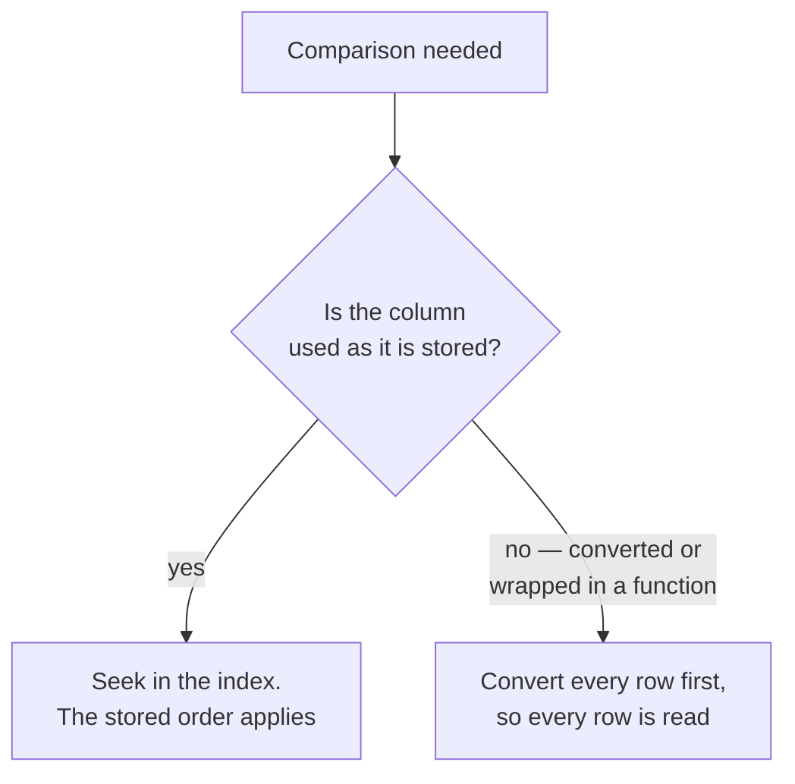
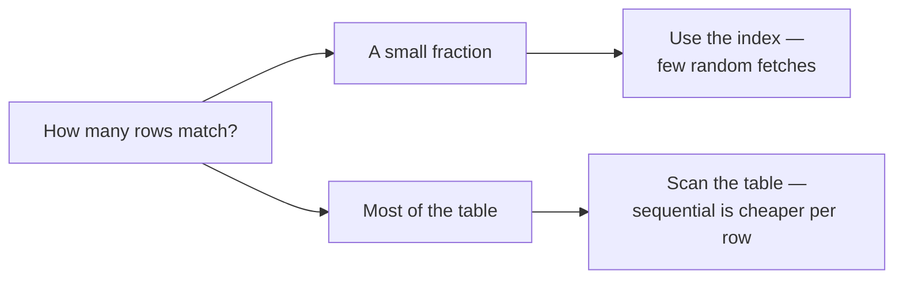

The index exists, the query filters on its leading column, and the plan still says `Table scan`. That happens for reasons that have nothing to do with prefixes, and each one is a mistake you can make without noticing.

# The type mismatch

The index is on `created_at`, a timestamp. The query looks correct:

```sql
  EXPLAIN SELECT * FROM products WHERE created_at >= '2026-08-28 10:00:00';
```

```text
  -> Table scan on products
```

The leading column is constrained. The index is ignored anyway.

> [!important] **`'2026-08-28 10:00:00'` is a string, and the column is a timestamp.** They cannot be compared until one is converted into the other, and the conversion happens **per row** — so the database must visit every row to perform it.

The index orders rows by timestamp. **The query is comparing against a string**, and there is no way to search a timestamp-ordered structure for a string value without converting first. The ordering is unusable.

Give it an actual timestamp and the index comes back:

```sql
  EXPLAIN SELECT * FROM products WHERE created_at = NOW();
  -- Index lookup
```

Or convert explicitly, so the conversion happens **once** rather than per row:

```sql
  EXPLAIN SELECT * FROM products
  WHERE created_at >= CONVERT_TZ('2026-08-28 10:00:00', '+00:00', '+05:30');
  -- Index range scan
```

> [!important] The general form is worth memorising: **an index on a column is unusable if the column has to be transformed before comparison.** Implicit type conversion is one case. So is wrapping the column in a function:
>
> ```sql
>   WHERE DATE(created_at) = '2026-08-28'   -- no index
>   WHERE created_at >= '2026-08-28 00:00:00'
>     AND created_at <  '2026-08-29 00:00:00'   -- index used
> ```
>
> **Transform the value you are comparing against, never the column.** The index holds raw column values; anything applied to the column has to be applied to every row to find out what it produces.

> [!warning] The failure is silent. The query returns correct results, no warning is issued, and the only symptom is that it is slower than it should be. **Only the plan reveals it.**



# Too many rows match

Second case, and this one is the optimiser being right.

```sql
  EXPLAIN SELECT * FROM products WHERE created_at <= NOW();
  -- Table scan
```

The column is indexed, the type is correct, the leading column is constrained. Still a full scan.

> [!important] **Every row was created at some point in the past, so every row matches.** Using the index would mean walking the entire index and then fetching all 1,000 rows individually — strictly more work than reading the table straight through.

Change the condition so it matches a small fraction and the choice flips:

```sql
  EXPLAIN SELECT * FROM products WHERE created_at = NOW();
  -- Index lookup
```

> [!important] **Selectivity is the fraction of rows a condition matches, and it is what the optimiser decides on.** Few rows: use the index, fetch them individually. Most rows: skip the index, read sequentially — sequential reads are far cheaper per row than random ones.

The crossover is somewhere in the region of 20–30% of the table, depending on row size and storage.



> [!important] This is the same behaviour `10-Many-To-Many-And-Soft-Delete/06-Indexes.md` predicted for `deleted_at IS NULL`. **Most rows in a healthy table are not deleted, so that condition matches nearly everything, and an index on `deleted_at` gets skipped for exactly the reason above.** The prediction is now something you can watch happen.

> [!info] The fix for that specific case is a **partial index** — one built over only the rows matching a condition. An index over just the live rows is small and highly selective, and the optimiser will use it. PostgreSQL supports these directly with `CREATE INDEX ... WHERE deleted_at IS NULL`; MySQL has no direct equivalent, and the usual workaround is an indexed generated column. **Added beyond what was covered.**

# No valid prefix

The third case, covered in the previous note and listed here for completeness:

```sql
  EXPLAIN SELECT * FROM products WHERE price = 80 AND rating = 3;
  -- Table scan
```

Both columns are in the index. Neither is the first. **There is no way to enter it.**

# The three, together

| Symptom | Cause | Fix |
|---|---|---|
| Indexed column, still scanning | **Type mismatch or a function on the column** | Convert the literal, not the column |
| Indexed column, still scanning | **Condition matches most rows** | Nothing — the optimiser is correct. Or a partial index |
| Indexed columns, still scanning | **No leftmost prefix** | Reorder the index, or add one that starts with what you filter on |

> [!important] Only the first is a bug in your query. The second is the database being smarter than the instinct that says an index should always be used. The third is a design mismatch between the index you built and the queries you write.

# How to actually work

Three habits, and they are the whole practice.

**Write the query, run `EXPLAIN`, read the plan.** Not once — every time you add an index, and again after the data grows.

> [!important] **Test against realistic data volumes.** At a thousand rows a table scan often wins, so an index strategy validated on a small table can be exactly backwards. The optimiser's decisions change with size, and its statistics are what drive them.

**Check the real query, not one like it.** The SQL your application issues comes from Hibernate, and it may differ from what you would have written. `show-sql` prints it; that is the string to explain.

> [!important] The through-line for all four notes: **an index is not a setting you turn on.** It is a structure with an order, usable only in ways that order permits, and only when the optimiser judges it cheaper than the alternative. Every part of that is visible in the plan, and invisible everywhere else.
