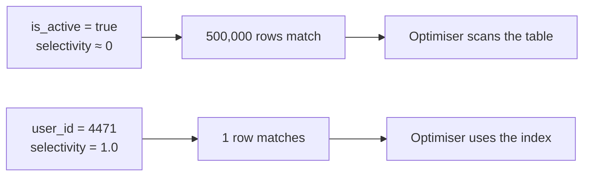

Reading a query plan tells you whether an index was used. It does not tell you which indexes to build in the first place, and that question has no formula — but it does have a number worth knowing and an argument for restraint.

# There is no rule

The honest starting position.

> [!important] **Which columns to index depends on your query patterns and your business.** There is no property of a column that makes it inherently worth indexing. The same column is essential in one application and pointless in another.

The order of work is:

**Find what is read-heavy.** Which parts of the system are queried most, and with what filters.

**Understand why those queries exist.** A filter that appears on every page load matters more than one behind a rarely-opened screen.

**Build, then measure.** Under realistic load, with realistic data volumes.

> [!important] **Deciding an index looks reasonable is not the same as testing it.** Plans change with data size, and the optimiser's choices depend on statistics it collects — so an index validated by reasoning alone has not been validated.

Two applications make the point. On a ticketing site the first filter is almost always **city**, so whatever entity holds it likely wants city leading its index — and then show date, because people browse by day. On a shopping site it is **price**, plus whichever filters that particular audience actually uses. Nothing about either conclusion transfers to the other.

> [!info] This is design work rather than a lookup. The same trade-off reasoning as any other architectural decision, applied to columns.

# Selectivity

One measurable property does give direction.

> [!important] **Selectivity is the number of distinct values in a column divided by the total number of rows.** It ranges from 0 to 1, and it measures **how precisely a column identifies individual rows.**

```text
selectivity = distinct values / total rows
```

Worked through on a `users` table with **1,000,000 rows**:

| Column | Distinct values | Selectivity | |
|---|---|---|---|
| `gender` | ~5 | 5 ÷ 10⁶ ≈ **0.000005** | Terrible |
| `is_active` | 2 | 2 ÷ 10⁶ ≈ **0.000002** | Terrible |
| `email` | 10⁶ | **1.0** | Ideal |
| `user_id` | 10⁶ | **1.0** | Ideal |

## Why low selectivity fails

`is_active` has two values, so the best possible split is half the table.

> [!important] Filtering a million rows down to five hundred thousand has achieved nothing useful. **O(n/2) is O(n)** — you still read a huge number of rows, and you paid for an index traversal first.

And the **optimiser** knows. It **has statistics on column distribution**, so it can see that using this index means walking most of the index and then fetching most of the table individually — more work than reading the table straight through.



## The threshold

> [!important] **Past roughly 15–20% of the table returned, the database abandons the index and scans.** Below that, the index wins. That range is the practical answer to when an index will actually be used.

Which is the same behaviour as `04-Why-An-Index-Gets-Ignored.md` and as `deleted_at IS NULL` in the soft-delete material — now with a number attached rather than described as most rows.

> [!info] The exact crossover varies with row size, storage and the database's cost model. **15–20% is the figure to reason with**, not one to rely on precisely.

## Where selectivity misleads

It measures the column, and the optimiser decides per query.

> [!warning] **A highly selective column can still produce an unused index**, if the specific query matches most rows. `created_at` is nearly unique, and `WHERE created_at <= NOW()` matches everything.

So selectivity is a filter on candidates — it rules out columns that can never help. **The query decides the rest.**

# Selectivity does not mean unused

A tempting conclusion from the table above is that `is_active` should never be indexed. Not quite.

> [!important] Low selectivity is disqualifying for a **leading** column. As a **later column in a composite index** it can still earn its place, narrowing what a more selective leading column already found.

`(user_id, is_active)` is a reasonable index. `(is_active, user_id)` is not — the first entry point splits the table in half and the ordering of `user_id` only holds within each half.

Which restates the design rule from `03-Composite-Indexes.md`: **the leading column is the one that has to be selective.**

# Why not index everything

The obvious response to uncertainty is to index every column and stop worrying. A counting argument shows why not.

> [!important] With **n** columns, the number of possible indexes — every non-empty subset, in every useful ordering — is on the order of **2ⁿ**. Three columns already give seven single-and-composite combinations before ordering is considered.

Nobody would build 2ⁿ indexes. But the same instinct at smaller scale — indexing each column just in case — has the same shape of cost:

> [!warning] **Every index consumes disk and slows every write.** An insert updates the table and every index on it. A table with eight indexes does nine write operations per row inserted.

> [!info] And they compete for the same memory. Databases cache index pages in RAM; more indexes means less of each one stays cached, so the ones that matter get evicted by ones that never get used.

> [!important] Which is why the composite point from the previous note matters commercially. **One well-ordered composite index covers every one of its prefixes**, so `(a, b, c)` serves three query shapes for one index's write cost. Fewer, better-ordered indexes beat one per column.

# The working method

**Start from the queries**, not the schema. List what the application actually asks for.

**Discount columns with near-zero selectivity** as leading columns. They cannot narrow anything.

**Prefer a composite index over several single ones** where the queries share a leading column.

**Build it, generate realistic data, and run `EXPLAIN`.** Then run it again once the table has grown, because the answer changes.

> [!important] The uncomfortable part is that this cannot be settled at design time. **An index is a hypothesis about how the data will be queried**, and the only way to test a hypothesis is to measure it against the real thing.
