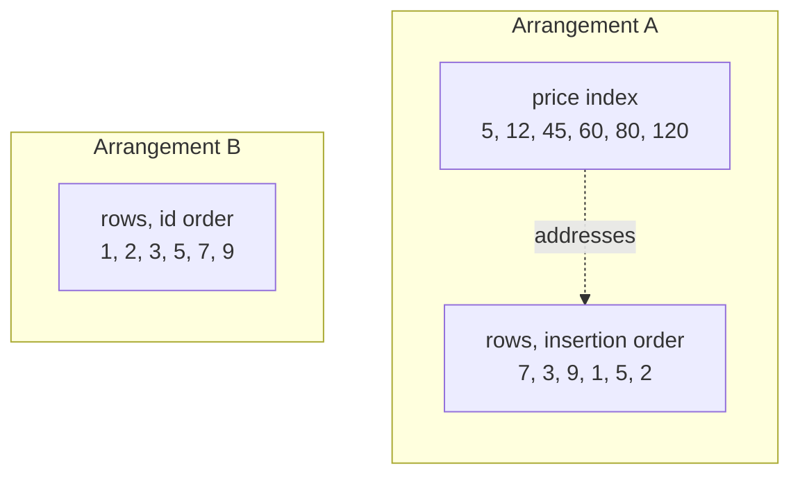
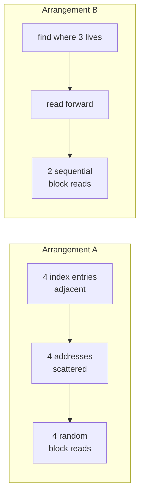
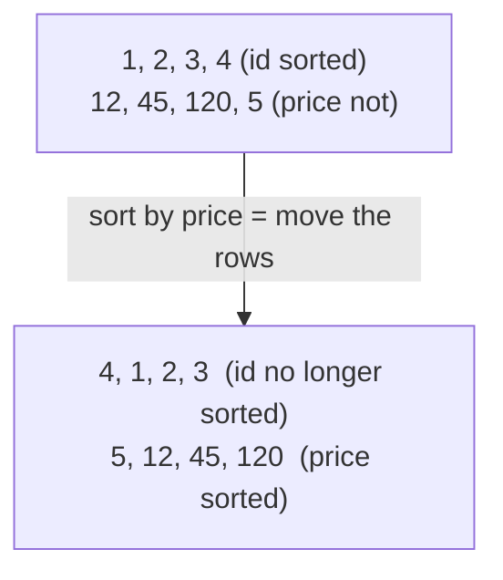
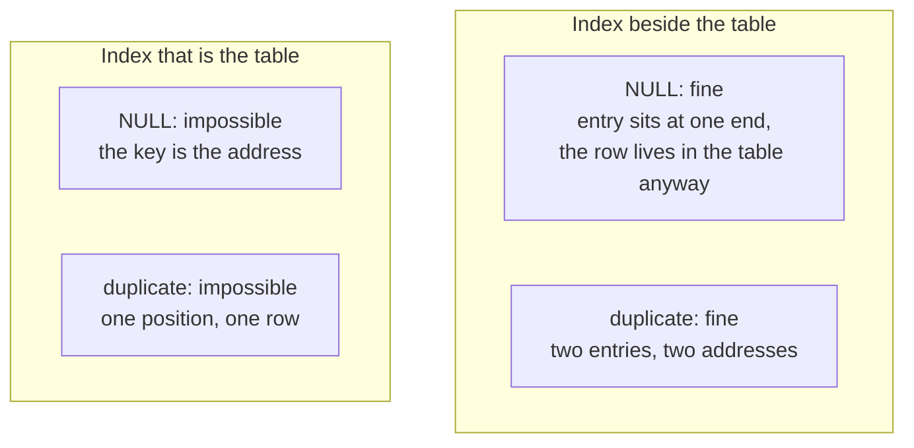
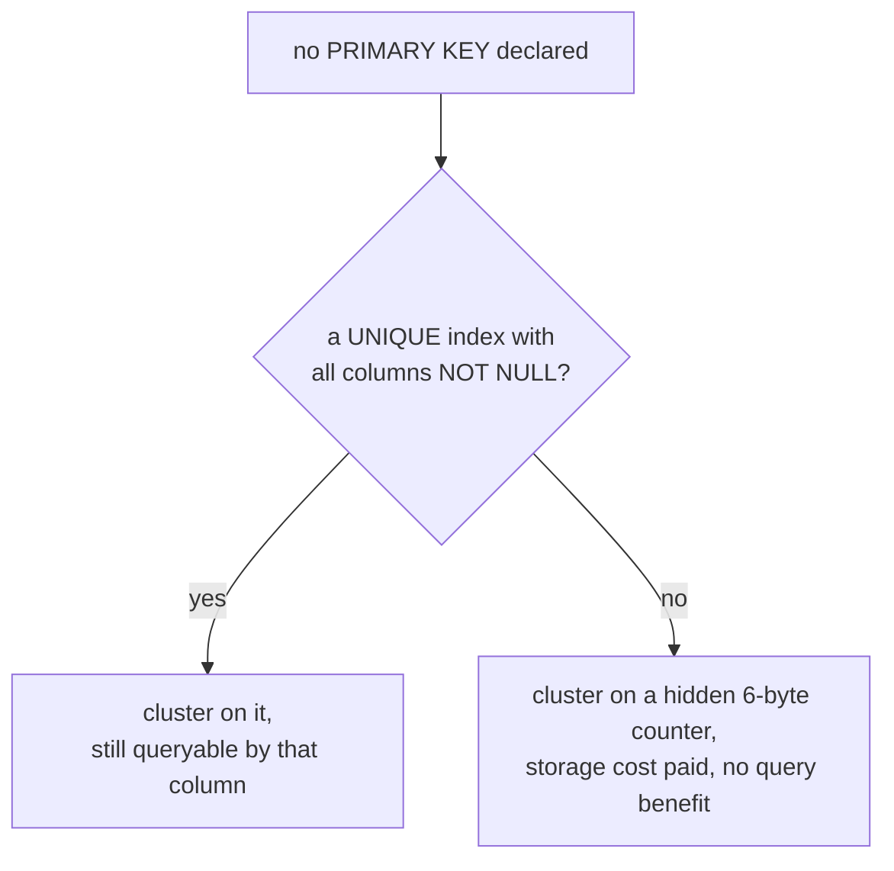

Every index so far has been the same kind of thing — a structure beside the table, pointing back at it. There is another kind, you already have one, and it is not an index of the table so much as the table itself.

# Two ways to arrange the data

Six products make the difference visible. Here they are in the order they were inserted, which is the order they were written to disk.

| inserted | id | name | price |
|---|---|---|---|
| 1st | 7 | Lamp | 45 |
| 2nd | 3 | Desk | 120 |
| 3rd | 9 | Chair | 80 |
| 4th | 1 | Mug | 12 |
| 5th | 5 | Shelf | 60 |
| 6th | 2 | Pen | 5 |

## Arrangement A: a separate index

Two things exist on disk. The rows sit where they were written and never move:

```text
block 1:  (7, Lamp, 45)   (3, Desk, 120)
block 2:  (9, Chair, 80)  (1, Mug, 12)
block 3:  (5, Shelf, 60)  (2, Pen, 5)
```

Beside them is a second structure, sorted by price, **holding a price and a pointer**:

| price | points at |
|---|---|
| 5 | block 3, row 2 |
| 12 | block 2, row 2 |
| 45 | block 1, row 1 |
| 60 | block 3, row 1 |
| 80 | block 2, row 1 |
| 120 | block 1, row 2 |

It is sorted, and it contains no product. Every entry is a price and an address.

## Arrangement B: sort the rows themselves

One thing exists on disk. The rows were physically placed in `id` order as they were written, and stay that way:

```text
block 1:  (1, Mug, 12)    (2, Pen, 5)
block 2:  (3, Desk, 120)  (5, Shelf, 60)
block 3:  (7, Lamp, 45)   (9, Chair, 80)
```

There is no second structure. Nothing points at anything.



In A, being sorted and holding the data are two different structures. In B they are one structure — the sorted thing is the table. **Finding the value and finding the row are the same operation.**

> [!important] A **clustered index** determines the **physical order of rows on disk.** The index is not a structure beside the table — the table is stored inside it.

Which is why it is fast in a way no other index can be. There is no second step.

# What the missing step is worth

To compare the two arrangements fairly, put an index on `id` in both. Arrangement A gets a separate `id` index beside its insertion-order rows; arrangement B has the rows themselves in `id` order.

## Fetching one row

`SELECT * FROM products WHERE id = 5;`

In arrangement A the `id` index is sorted, so bisect it:

| id | points at |
|---|---|
| 1 | block 2, row 2 |
| 2 | block 3, row 2 |
| 3 | block 1, row 2 |
| 5 | block 3, row 1 |
| 7 | block 1, row 1 |
| 9 | block 2, row 1 |

Read the index page, land on `id = 5`, take the address, then read block 3 to get `(5, Shelf, 60)`. **Two reads**, the second being the row fetch — the arrow at the end of every entry in a separate index.

In arrangement B, bisect the table:

```text
block 1:  (1, Mug, 12)    (2, Pen, 5)
block 2:  (3, Desk, 120)  (5, Shelf, 60)
block 3:  (7, Lamp, 45)   (9, Chair, 80)
```

Land on block 2, and `(5, Shelf, 60)` is already there. **One read.** There is no address to follow, because the search arrived at the row rather than at a note about the row.

## Fetching a range

`SELECT * FROM products WHERE id BETWEEN 3 AND 9;`

This is where the gap opens up.

In arrangement A the four matching index entries are adjacent — 3, 5, 7 and 9 sit next to each other. Their addresses are not:

| id | address | block read |
|---|---|---|
| 3 | block 1, row 2 | block 1 |
| 5 | block 3, row 1 | block 3 |
| 7 | block 1, row 1 | block 1 again |
| 9 | block 2, row 1 | block 2 |

Four random jumps across three blocks, one of them visited twice. The index was in order; the disk was not.

In arrangement B the four rows are physically next to one another:

```text
block 2:  (3, Desk, 120)  (5, Shelf, 60)     <- both match
block 3:  (7, Lamp, 45)   (9, Chair, 80)     <- both match
```

Find where 3 lives, then read forward. **Two sequential block reads**, and it would still be two blocks read in sequence if each block held a hundred rows.



> [!important] **Adjacent in a separate index does not mean adjacent on disk. In a clustered index it does.** Which is why a range scan on the clustering key is the cheapest scan a table has.

# The primary key is that index

> [!important] In MySQL's InnoDB engine, **the primary key is the clustered index.** Rows are physically stored in primary-key order, in the leaf nodes of a single B+ tree. The table and its primary index are the same structure.

Three consequences follow, and they explain properties of primary keys that otherwise look arbitrary.

## One order at a time

Four products, and on disk they are one line of rows, one after another. Clustered on `id`, that line looks like this:

```text
(1, Mug, 12)   (2, Lamp, 45)   (3, Desk, 120)   (4, Pen, 5)
```

Read the id column left to right: 1, 2, 3, 4. Sorted. That is all clustered on `id` means. Read the price column left to right: 12, 45, 120, 5. Not sorted.

So say you want price clustered as well. There is one way to get it: physically move the rows.

```text
(4, Pen, 5)   (1, Mug, 12)   (2, Lamp, 45)   (3, Desk, 120)
```

Read the price column now: 5, 12, 45, 120. Sorted, as asked. Read the id column: 4, 1, 2, 3.

The id ordering is gone. Not disabled, not slower — gone. Sorting by price is the same act as destroying the sort by id, because there is one line of rows, and moving them into price order moves them out of id order.



You can have one or the other, never both — the same way a shelf of books can stand in alphabetical order or in publication order, and standing in both would take two shelves and two copies of every book.

> [!important] **One clustered index per table.** Not a rule someone chose — the rows can only lie in one order at a time.

## No blanks, and no ties

The same line of rows answers the other two.

```text
(1, Mug, 12)   (2, Lamp, 45)   (3, Desk, 120)   (4, Pen, 5)
```

Try to insert a row with no id — `(NULL, Vase, 30)`. Where does it go? The position is decided by the id, and this row has no id. Not a small id, not a zero; no value at all. So ask the question the insert has to answer: does it go before `(2, Lamp, 45)` or after it? There is no answer, because NULL is not less than 2 and not greater than 2. It is unknown, and unknown has no place on a sorted line.

Compare that with a separate index on `price`. If a product had no price the index could still hold the entry — NULL entries sit together at one end of it — and the row itself would go on living in the table wherever it already was. A lookup structure with a blank in it is still a usable lookup structure. The clustering key does not get that option, because the key is the address. No key, no address, nowhere to put the row.

Now try to insert a duplicate — `(2, Clock, 20)`, when `(2, Lamp, 45)` is already there.

```text
(1, Mug, 12)   (2, Lamp, 45)   ???   (3, Desk, 120)   (4, Pen, 5)
                                ^ where does (2, Clock, 20) go?
```

Before the Lamp or after it? By id they are the same position — that is what holding the same key means. The damage then shows up on the read side. The payoff above was that you bisect to `id = 2` and the row is right there. With two rows holding id 2 you bisect to `id = 2`, find a row, and cannot stop: you have to check the neighbours in case more 2s are sitting beside it. Arriving at the position stops meaning arriving at the row.

A separate index on `price` has no such problem. Two products at 45 is two entries and two addresses, both returned. Duplicates are ordinary in a lookup structure.



> [!important] None of the three is a rule the standard imposed for tidiness. **They are what falls out of the primary key being the thing that decides where the row physically lives.**

## If you do not define one

```sql
1  CREATE TABLE products (
2      name  VARCHAR(50),
3      price DECIMAL(10,2)
4  );
```

No primary key anywhere. Everything above still holds, though: the rows have to be stored, and storing them in InnoDB means storing them inside a clustered structure, which needs a key. So InnoDB picks one, in two steps.

**Step 1: look for a column that could have been the primary key.** It scans the table's unique indexes and takes the first one whose columns are all `NOT NULL`. So this table:

```sql
1  CREATE TABLE products (
2      product_code VARCHAR(20) NOT NULL UNIQUE,
3      name         VARCHAR(50),
4      price        DECIMAL(10,2)
5  );
```

gets clustered on `product_code`. Nothing was declared a primary key, but `product_code` satisfies both requirements above — never blank, never tied — so it can serve as the address. The rows lie in `product_code` order, and `WHERE product_code = 'A-114'` still lands straight on the row.

**Step 2: if nothing qualifies, invent one.** Back to the first table, with no unique index at all. InnoDB adds a hidden 6-byte column of its own, an ever-increasing counter, and clusters on that:

```text
[1] (Mug, 12)   [2] (Lamp, 45)   [3] (Desk, 120)   [4] (Pen, 5)
 ^ hidden counter: not in the CREATE TABLE, not in SELECT *, not usable in WHERE
```

The rows are in a valid physical order, so the table works. And it buys nothing.

The win above was that you bisect to the key and arrive at the row in one read. That is only available if you can **name the key in a query.** This one cannot be named. It does not appear in `SELECT *`, and there is no way to write `WHERE <hidden counter> = 3`. Every lookup on this table is therefore either a full scan or a trip through some secondary index.



> [!warning] The hidden id works and you cannot use it. You pay the storage of a clustered index and get none of the benefit of looking rows up by it. **Define a primary key.**
