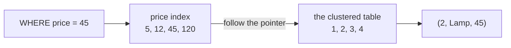
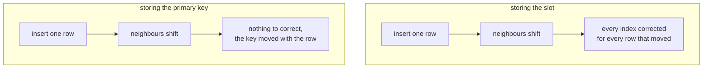

The primary key is one index and the table is stored inside it. Every other index on that table is a different kind of thing, and the difference costs one step on every lookup.

# What a secondary index holds

> [!important] A **secondary index** is any index that is not the clustered one. It is a separate structure holding a copy of the indexed columns plus a pointer back to the row.

Take the clustered table from before, four products in `id` order:

```
(1, Mug, 12)   (2, Lamp, 45)   (3, Desk, 120)   (4, Pen, 5)
```

and add an index on price:

```sql
CREATE INDEX idx_price ON products(price);
```

Here is the entire thing that gets built:

| price | goes to |
|---|---|
| 5 | `(4, Pen, 5)` |
| 12 | `(1, Mug, 12)` |
| 45 | `(2, Lamp, 45)` |
| 120 | `(3, Desk, 120)` |

Two things matter about it. **It is sorted by price**, which is the point of it and the reason you can bisect it. And **it does not contain the products.** There is no `name` anywhere in it. There is a price and a pointer. The right-hand column above shows where each pointer leads, so that the structure is visible; what is literally stored in that column is a separate question, taken up below.

# The lookup takes two steps

`SELECT * FROM products WHERE price = 45;`

**Step one.** Bisect the price index. Four entries, land on 45. You now know that a product costs 45, and you do not know its name, because the index holds no names.

**Step two.** Follow the pointer into the clustered table and read `(2, Lamp, 45)`.



Compare `SELECT * FROM products WHERE id = 2`, which is one step: bisect the table itself, and the row is there.

> [!important] **The clustered index ends at the row. Every other index ends at a signpost.**

There is one exception, already met under composite indexes. `SELECT price FROM products WHERE price = 45` asks for nothing the index does not already hold, so step two never happens and `EXPLAIN` reports `Using index`. A covering index is that case seen from the other side: covering means the signpost happened to have the answer written on it.

# Why the pointer cannot be a location

The obvious thing to store in that pointer column is a location — the slot the row occupies. It would make step two a direct jump. It also does not work, and one insert is enough to show why.

Give the four products ids with gaps, so there is room between them. The rows sit in a line in `id` order, because that is what clustered means:

```
slot 1          slot 2           slot 3            slot 4
(10, Mug, 12)   (20, Lamp, 45)   (30, Desk, 120)   (40, Pen, 5)
```

A price index storing slot numbers would say:

| price | points at |
|---|---|
| 5 | slot 4 |
| 12 | slot 1 |
| 45 | slot 2 |
| 120 | slot 3 |

All four correct. Now insert one product, `(25, Cup, 30)`. Where does it go? Between 20 and 30 — it has no choice, because the line is in id order and 25 belongs there.

```
slot 1          slot 2           slot 3          slot 4            slot 5
(10, Mug, 12)   (20, Lamp, 45)   (25, Cup, 30)   (30, Desk, 120)   (40, Pen, 5)
```

Look at the Desk. It was in slot 3 and is now in slot 4. Nobody updated it and nobody asked it to move; it was pushed along to make room. The Pen moved too, slot 4 to slot 5.

So read the price index again:

| price | points at | |
|---|---|---|
| 5 | slot 4 | wrong, the Pen is in slot 5 now |
| 12 | slot 1 | still correct |
| 45 | slot 2 | still correct |
| 120 | slot 3 | wrong, the Desk is in slot 4 now |

One insert, and two of the four entries are lies. They point at the wrong products.

> [!important] The location of a row in a clustered table is not a property of the row. **It is a property of whatever else is in the table**, and it changes when a neighbour arrives.

## How many entries go stale

One insert moved two rows, the Desk and the Pen. Now count the places that have to be corrected.

A real products table does not carry one index. Say it has three — on price, on name, and on `created_at`. Each of them holds an entry for every row, so each holds an entry for the Desk and one for the Pen:

| index | entries now wrong |
|---|---|
| price | Desk, Pen |
| name | Desk, Pen |
| created_at | Desk, Pen |

Six entries to go and fix, from inserting one cup. And that is four rows and three indexes. Insert into the middle of a million-row table and everything after the insertion point shifts, so every index has to be corrected for every row that moved. That is not a slow write, it is an unusable database.

## What gets stored instead

Something that does not change when the row slides. Look at the Desk before and after:

```
before:  slot 3   (30, Desk, 120)
after:   slot 4   (30, Desk, 120)
```

The slot changed. The `30` did not. The id is a property of the row itself, carried around with it, while the slot was only ever a description of where it happened to be standing.

So the index stores that:

| price | id |
|---|---|
| 5 | 40 |
| 12 | 10 |
| 30 | 25 |
| 45 | 20 |
| 120 | 30 |

Insert the Cup, push the Desk and the Pen along, then read this table again. `120` still goes to `30`, and `30` is still the Desk. `5` still goes to `40`, still the Pen. **Not one entry needs touching.** The Cup's own entry is added, which it would have been anyway, and nothing else in the index is disturbed.

> [!important] In InnoDB a secondary index stores **the primary key value**, not a location.



Which puts the uniqueness and non-null requirements in a second light. The primary key is not only the address inside the clustered table — **it is the name every other index on that table uses to refer to a row.**

# What the name costs on reads

Storing the key rather than the location buys the write path everything above. It is not free on the read path, and there are two separate charges.

## You cannot jump to a name

The table after the insert:

```
slot 1          slot 2           slot 3          slot 4            slot 5
(10, Mug, 12)   (20, Lamp, 45)   (25, Cup, 30)   (30, Desk, 120)   (40, Pen, 5)
```

Run `SELECT * FROM products WHERE price = 120;`

Step one bisects the price index and lands on `120` going to `30`.

Step two is where the charge falls. Had the index stored `slot 4`, step two would be a single move: go to slot 4. It stored `30` instead, which is the row's **name**, not its **whereabouts** — nothing in that index says the Desk is standing in slot 4. So the clustered table has to be searched for id 30: the middle of the line is slot 3 holding id 25, 30 is bigger so look right, and slot 4 holds id 30.

That is a second bisection. Not a fetch and not a jump — a full search of the second structure, using the id the first search handed over.

| query | searches |
|---|---|
| `WHERE id = 30` | bisect the clustered table. One. |
| `WHERE price = 120` | bisect the price index, then bisect the clustered table. Two. |

Which roughly doubles the work of a lookup by primary key, and the doubling is not the whole of it. **That second search happens once per matching row.** One row matches, one extra search. A thousand rows match, a thousand extra searches — each one an independent descent, because the ids handed over by the index are scattered and nothing puts them near each other.

Reading the whole table costs the same whatever the condition matches, so the two plans grow differently: the index plan's cost climbs with the number of matching rows, and the scan's does not. Which is the machinery under selectivity, and the reason a condition matching most of the table gets its index thrown away.

## The key is copied everywhere

Every entry of every secondary index holds a copy of the primary key — that is what the right-hand column of the index is. Four entries in the price index means four copies of a key. Scale it up:

| primary key | bytes each | 1M rows across 3 secondary indexes | copies of the key alone |
|---|---|---|---|
| `BIGINT` | 8 | 3,000,000 entries | ~24 MB |
| `CHAR(36)` UUID | 36 | 3,000,000 entries | ~108 MB |

Same rows and the same three indexes, with 84 MB between them — and that is the key copies alone, before the indexed column itself and the per-entry overhead.

The size is not only a disk figure. A bigger index is more of it to read through on every search of it, so **a wide primary key makes every other index on the table slower, not merely larger.**

## The two kinds, side by side

| | Clustered | Secondary |
|---|---|---|
| Stores | **The rows themselves** | The indexed columns plus the primary key |
| How many | **One per table** | Many |
| Lookup | One search | Two — the index, then the table |
| Cost of extra matching rows | none, the rows are adjacent | one more search each |
| In MySQL | The primary key | Everything you create |

# Indexes you did not create

Worth knowing, because your table has more indexes than you wrote.

```sql
  SHOW INDEX FROM products;
```

On a table with no `CREATE INDEX` ever run against it:

```text
1  PRIMARY                  BTREE   -- the clustered index
2  FK_product_category      BTREE   -- from the foreign key
```

> [!important] Databases create indexes on their own behalf. A **primary key** creates the clustered index. A **unique constraint** creates a secondary index — it is how uniqueness is enforced without scanning. A **foreign key** creates one in InnoDB, because the constraint has to be checked on every write to the referencing table.

> [!info] `SHOW INDEX` also reports **cardinality** — the estimated number of distinct values, which is the raw material for the selectivity calculation. It is an estimate from sampled statistics, not an exact count.

Two practical consequences:

> [!warning] **A column may already be indexed.** Adding an index to a foreign key column can duplicate one InnoDB created, paying the write cost twice for one benefit.

**And index count grows without you.** A table with a primary key, two unique constraints and three foreign keys carries six indexes before anyone deliberately adds one.

# Other databases arrange this differently

This is InnoDB's design, not a universal truth.

> [!important] **PostgreSQL stores rows in an unordered heap.** The primary key is an ordinary secondary index pointing into it. There is no clustered index — every index lookup is two steps, including the primary key.

Neither approach is better outright:

**InnoDB's clustering** makes primary-key lookups and ranges over the primary key very fast, and makes every secondary index pay the size of the primary key.

**PostgreSQL's heap** makes all indexes uniform and inserts cheap — a new row goes wherever there is room, rather than into a specific position.

> [!important] Which is the general warning for everything in these notes. **Index behaviour is engine-specific.** MySQL, PostgreSQL, SQL Server and every NoSQL store make different choices, and the reasoning transfers while the specifics do not. Check the documentation for the database you are actually using.

# Designing the primary key

If the primary key determines physical order, choosing it is a storage decision.

> [!important] **A sequential primary key means new rows are appended in order** — each insert lands at the end of the B+ tree, which is cheap. An auto-increment id does this by construction.

> [!warning] **A random primary key scatters inserts throughout the tree**, forcing page splits and fragmentation. Clustering on a random UUID is a known cause of write degradation on large InnoDB tables, precisely because clustering means the row's position is dictated by that value.

> [!info] Keeping the primary key **small** matters for the same structural reason: every secondary index stores a copy of it, so a wide primary key inflates every other index on the table.

Which retroactively justifies something from much earlier. `@GeneratedValue(strategy = GenerationType.IDENTITY)` producing a `bigint auto_increment` is not merely a convention — **it is small, sequential, and therefore the right shape for the structure the rows are stored in.**
