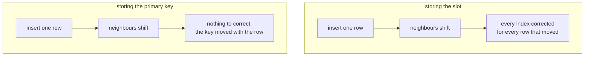
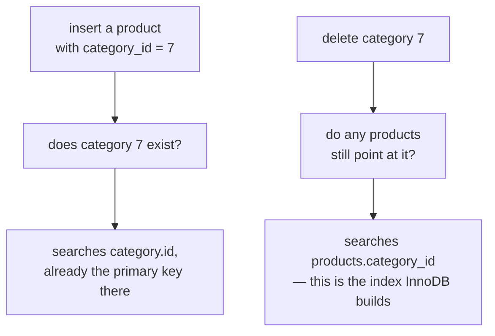
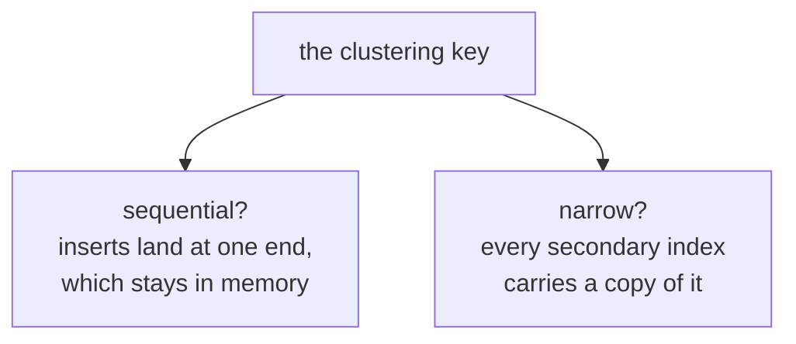

The primary key is one index and the table is stored inside it. Every other index on that table is a different kind of thing, and the difference costs one step on every lookup.

# What a secondary index holds

> [!important] A **secondary index** is any index that is not the clustered one. It is a separate structure holding a copy of the indexed columns plus a pointer back to the row.

Take the clustered table from before, four products in `id` order:

```text
(1, Mug, 12)   (2, Lamp, 45)   (3, Desk, 120)   (4, Pen, 5)
```

and add an index on price:

```sql
1  CREATE INDEX idx_price ON products(price);
```

Here is the entire thing that gets built:

| price | goes to |
|---|---|
| 5 | `(4, Pen, 5)` |
| 12 | `(1, Mug, 12)` |
| 45 | `(2, Lamp, 45)` |
| 120 | `(3, Desk, 120)` |

Two things matter about it. **It is sorted by price**, which is the point of it and the reason you can bisect it. And **it does not contain the products.** There is no `name` anywhere in it. There is a price and a pointer. The right-hand column above shows where each pointer leads, so that the structure is visible; what is literally stored in that column is a separate question, taken up below.

# The lookup takes two steps

`SELECT * FROM products WHERE price = 45;`

**Step one.** Bisect the price index. Four entries, land on 45. You now know that a product costs 45, and you do not know its name, because the index holds no names.

**Step two.** Follow the pointer into the clustered table and read `(2, Lamp, 45)`.


Compare `SELECT * FROM products WHERE id = 2`, which is one step: bisect the table itself, and the row is there.

> [!important] **The clustered index ends at the row. Every other index ends at a signpost.**

There is one exception, already met under composite indexes. `SELECT price FROM products WHERE price = 45` asks for nothing the index does not already hold, so step two never happens and `EXPLAIN` reports `Using index`. A covering index is that case seen from the other side: covering means the signpost happened to have the answer written on it.

# Why the pointer cannot be a location

The obvious thing to store in that pointer column is a location — the slot the row occupies. It would make step two a direct jump. It also does not work, and one insert is enough to show why.

Give the four products ids with gaps, so there is room between them. The rows sit in a line in `id` order, because that is what clustered means:

```text
slot 1          slot 2           slot 3            slot 4
(10, Mug, 12)   (20, Lamp, 45)   (30, Desk, 120)   (40, Pen, 5)
```

A price index storing slot numbers would say:

| price | points at |
|---|---|
| 5 | slot 4 |
| 12 | slot 1 |
| 45 | slot 2 |
| 120 | slot 3 |

All four correct. Now insert one product, `(25, Cup, 30)`. Where does it go? Between 20 and 30 — it has no choice, because the line is in id order and 25 belongs there.

```text
slot 1          slot 2           slot 3          slot 4            slot 5
(10, Mug, 12)   (20, Lamp, 45)   (25, Cup, 30)   (30, Desk, 120)   (40, Pen, 5)
```

Look at the Desk. It was in slot 3 and is now in slot 4. Nobody updated it and nobody asked it to move; it was pushed along to make room. The Pen moved too, slot 4 to slot 5.

So read the price index again:

| price | points at | |
|---|---|---|
| 5 | slot 4 | wrong, the Pen is in slot 5 now |
| 12 | slot 1 | still correct |
| 45 | slot 2 | still correct |
| 120 | slot 3 | wrong, the Desk is in slot 4 now |

One insert, and two of the four entries are lies. They point at the wrong products.

> [!important] The location of a row in a clustered table is not a property of the row. **It is a property of whatever else is in the table**, and it changes when a neighbour arrives.

## How many entries go stale

One insert moved two rows, the Desk and the Pen. Now count the places that have to be corrected.

A real products table does not carry one index. Say it has three — on price, on name, and on `created_at`. Each of them holds an entry for every row, so each holds an entry for the Desk and one for the Pen:

| index | entries now wrong |
|---|---|
| price | Desk, Pen |
| name | Desk, Pen |
| `created_at` | Desk, Pen |

Six entries to go and fix, from inserting one cup. And that is four rows and three indexes. Insert into the middle of a million-row table and everything after the insertion point shifts, so every index has to be corrected for every row that moved. That is not a slow write, it is an unusable database.

## What gets stored instead

Something that does not change when the row slides. Look at the Desk before and after:

```text
before:  slot 3   (30, Desk, 120)
after:   slot 4   (30, Desk, 120)
```

The slot changed. The `30` did not. The id is a property of the row itself, carried around with it, while the slot was only ever a description of where it happened to be standing.

So the index stores that:

| price | id |
|---|---|
| 5 | 40 |
| 12 | 10 |
| 30 | 25 |
| 45 | 20 |
| 120 | 30 |

Insert the Cup, push the Desk and the Pen along, then read this table again. `120` still goes to `30`, and `30` is still the Desk. `5` still goes to `40`, still the Pen. **Not one entry needs touching.** The Cup's own entry is added, which it would have been anyway, and nothing else in the index is disturbed.

> [!important] In InnoDB a secondary index stores **the primary key value**, not a location.



Which puts the uniqueness and non-null requirements in a second light. The primary key is not only the address inside the clustered table — **it is the name every other index on that table uses to refer to a row.**

# What the name costs on reads

Storing the key rather than the location buys the write path everything above. It is not free on the read path, and there are two separate charges.

## You cannot jump to a name

The table after the insert:

```text
slot 1          slot 2           slot 3          slot 4            slot 5
(10, Mug, 12)   (20, Lamp, 45)   (25, Cup, 30)   (30, Desk, 120)   (40, Pen, 5)
```

Run `SELECT * FROM products WHERE price = 120;`

Step one bisects the price index and lands on `120` going to `30`.

Step two is where the charge falls. Had the index stored `slot 4`, step two would be a single move: go to slot 4. It stored `30` instead, which is the row's **name**, not its **whereabouts** — nothing in that index says the Desk is standing in slot 4. So the clustered table has to be searched for id 30: the middle of the line is slot 3 holding id 25, 30 is bigger so look right, and slot 4 holds id 30.

That is a second bisection. Not a fetch and not a jump — a full search of the second structure, using the id the first search handed over.

| query | searches |
|---|---|
| `WHERE id = 30` | bisect the clustered table. One. |
| `WHERE price = 120` | bisect the price index, then bisect the clustered table. Two. |

Which roughly doubles the work of a lookup by primary key, and the doubling is not the whole of it. **That second search happens once per matching row.** One row matches, one extra search. A thousand rows match, a thousand extra searches — each one an independent descent, because the ids handed over by the index are scattered and nothing puts them near each other.

Reading the whole table costs the same whatever the condition matches, so the two plans grow differently: the index plan's cost climbs with the number of matching rows, and the scan's does not. Which is the machinery under selectivity, and the reason a condition matching most of the table gets its index thrown away.

## The key is copied everywhere

Every entry of every secondary index holds a copy of the primary key — that is what the right-hand column of the index is. Four entries in the price index means four copies of a key. Scale it up:

| primary key | bytes each | 1M rows across 3 secondary indexes | copies of the key alone |
|---|---|---|---|
| `BIGINT` | 8 | 3,000,000 entries | ~24 MB |
| `CHAR(36)` UUID | 36 | 3,000,000 entries | ~108 MB |

Same rows and the same three indexes, with 84 MB between them — and that is the key copies alone, before the indexed column itself and the per-entry overhead.

The size is not only a disk figure. A bigger index is more of it to read through on every search of it, so **a wide primary key makes every other index on the table slower, not merely larger.**

## The two kinds, side by side

| | Clustered | Secondary |
|---|---|---|
| Stores | **The rows themselves** | The indexed columns plus the primary key |
| How many | **One per table** | Many |
| Lookup | One search | Two — the index, then the table |
| Cost of extra matching rows | none, the rows are adjacent | one more search each |
| In MySQL | The primary key | Everything you create |

# Indexes you did not create

Take a table nobody has ever run `CREATE INDEX` against:

```sql
1  CREATE TABLE products (
2      id          BIGINT AUTO_INCREMENT PRIMARY KEY,
3      sku_code    VARCHAR(20) UNIQUE,
4      name        VARCHAR(50),
5      category_id BIGINT,
6      FOREIGN KEY (category_id) REFERENCES category(id)
7  );
```

Then ask what indexes it has:

```sql
1  SHOW INDEX FROM products;
```

Three come back, and none of them was asked for:

| declared as | index created | kind |
|---|---|---|
| `PRIMARY KEY` on `id` | `PRIMARY` | clustered |
| `UNIQUE` on `sku_code` | one on `sku_code` | secondary |
| `FOREIGN KEY` on `category_id` | one on `category_id` | secondary |

## The primary key

The clustered index, already covered — declaring a primary key is declaring where the rows live.

## The unique constraint

Ask how the database could enforce `UNIQUE` without an index. On every insert it has to answer whether this `sku_code` already exists. With nothing to search, that means reading every row in the table: on a million rows, one insert reads a million rows, and so does the next one. The constraint would make writes unusable.

With an index it is one search.

> [!important] The index is not an optimisation someone added alongside the constraint. **The index is how the constraint is enforced.** `UNIQUE` and build me an index are the same instruction.

## The foreign key

This one is worth slowing down on, because the obvious reason is the wrong one.

The obvious reason is that inserting a product has to check the category exists. That much is true — but the check searches `category` for a given `id`, which is already the primary key over there. It needs nothing on the products side.

The real reason runs in the opposite direction. Somebody deletes a category. Before that can go through, the database has to answer whether any products still point at it — which is find the rows in products where `category_id` is 7. Without an index on `products.category_id`, answering that means scanning the whole products table, every time anyone touches a category.



> [!important] InnoDB will not allow a foreign key without an index on the referencing column. **If you do not provide one, it creates one.**

## What follows from that

> [!warning] **The column may already be indexed.** Seeing that `category_id` is a foreign key and gets filtered on constantly, you add `CREATE INDEX idx_category ON products(category_id)`. The table now carries two indexes on one column, both updated on every insert, update and delete — double the write cost for no extra read benefit. Run `SHOW INDEX` before adding anything.

**And the count grows without you.** A table with a primary key, two unique constraints and three foreign keys carries six indexes before anyone deliberately adds one.

> [!info] `SHOW INDEX` also reports **cardinality** — the estimated number of distinct values in the index, which is the raw material for the selectivity calculation. It comes from sampled statistics rather than an exact count, so treat it as approximate.

# Other databases arrange this differently

Everything above is InnoDB's design, not a universal truth. **PostgreSQL stores rows in an unordered heap** — a new row goes wherever there is room. There is no clustered index at all, and the primary key is an ordinary secondary index pointing into the heap, so even a primary-key lookup is two steps there.

Neither is better outright:

| | InnoDB | PostgreSQL |
|---|---|---|
| Where rows live | inside the primary-key index | an unordered heap |
| Primary-key lookup | one search | two, like any other index |
| Secondary index holds | the primary key value | a location in the heap |
| Cost of a wide primary key | inflates every other index | none, indexes do not store it |
| Cost of an insert | must land in its sorted position | goes wherever there is room |

> [!important] **Index behaviour is engine-specific.** The reasoning transfers; the specifics do not. Advice written for PostgreSQL can be exactly wrong on MySQL, so check the documentation for the database you are actually using.

# Designing the primary key

The primary key decides where rows live, so choosing it is a storage decision rather than a naming one. Two properties matter, and both are visible on the line of rows.

## Does the next key land at the end, or in the middle?

With `AUTO_INCREMENT`, every new id is larger than every id already there. Take this line, with the next insert getting id 50:

```text
(10, Mug)   (20, Lamp)   (30, Desk)   (40, Pen)
```

50 is bigger than 40, so it goes on the end:

```text
(10, Mug)   (20, Lamp)   (30, Desk)   (40, Pen)   (50, Cup)
```

Nothing moved. No row was pushed along, and the insert touched exactly one place.

Now key the same table by a random value. The keys have no relationship to insertion time, so they sit in whatever order the random values sort into:

```text
(a1f9, Mug)   (c42b, Lamp)   (f20e, Desk)
```

The next insert generates `b7c3`, which sorts between `a1f9` and `c42b` — and that is where it has to go, because the line stays in key order:

```text
(a1f9, Mug)   (b7c3, Cup)   (c42b, Lamp)   (f20e, Desk)
```

Two rows pushed along. The next insert will land somewhere else entirely, and the one after that somewhere else again.

That has a consequence which bites hard at scale. With a sequential key, **every insert touches the same end of the table**, and that end stays in memory however large the table grows. With a random key, every insert touches a different part of the table, so once the table outgrows memory the database goes to disk for a different region on every single insert.

> [!warning] Clustering on a random value is a known cause of write performance collapsing on large InnoDB tables. It is not that the values are slow — **it is that clustering means the key dictates the row's position, and a random key dictates a random position.**

## How wide is it?

Every secondary index stores a copy of the primary key, as established above. So width is not a property of one column; it is a multiplier on every index the table carries. Eight bytes against thirty-six, three secondary indexes, a million rows: 24 MB against 108 MB in copies of the key alone.



## Judging the candidates

`AUTO_INCREMENT` meets both, which is why it is the default answer. It also needs a single writer — two database instances handing out ids independently will both issue 5. The moment more than one node generates ids, the counter has to go, and the two properties above become the criteria for what replaces it.

| key | generated where | sequential | width |
|---|---|---|---|
| `BIGINT AUTO_INCREMENT` | the database, single writer only | yes | 8 bytes |
| Snowflake id | any service, no coordination | yes, time-prefixed | 8 bytes |
| UUIDv7 | anywhere | yes, time-prefixed | 16 bytes |
| UUIDv4 | anywhere | no, fully random | 16 bytes |

**A Snowflake id meets both.** It is 64 bits split into a timestamp, a machine identifier and a per-millisecond counter, with the timestamp in the high bits — so ids generated on different nodes still sort roughly in time order, and the whole thing fits in the same eight bytes as a `BIGINT`. Distributed generation with no loss on either property. The cost is operational: every node needs a distinct machine identifier, and something has to assign them.

**UUIDv7 buys the first property and not the second.** Its time-ordered prefix stops inserts scattering, but it is sixteen bytes rather than eight, copied into every secondary index. Its advantage is that it is an ordinary UUID, so it works anywhere a UUID works, with no custom generator and no machine identifiers to hand out.

**UUIDv4 fails both**, which is the case broken above.

> [!warning] A UUID is sixteen bytes of data. Stored as `CHAR(36)` it occupies thirty-six — and that inflation is copied into every secondary index on the table. **Store it as `BINARY(16)`.**

## Where this shows up in the code

```java
1  // src/main/java/com/example/FakeCommerce/schema/Product.java
2  @Id
3  @GeneratedValue(strategy = GenerationType.IDENTITY)
4  private Long id;
```

That produces a `bigint auto_increment` column: small, and sequential. Not merely the conventional choice — **it is the right shape for the structure the rows are stored in.**

> [!important] The rule is not use auto-increment. It is that **the clustering key should be time-ordered and as narrow as you can make it.** Auto-increment is simply the cheapest way to get that when a single database is doing the writing.

And if a public identifier is what you actually need — an id safe to expose in a URL, or one generated before the row reaches the database — that is not a reason to give up the clustering key. Keep the narrow sequential key as the primary key and add the public identifier as a separate `UNIQUE` column. The clustering stays sequential, and the wide value is copied into one index rather than all of them.
