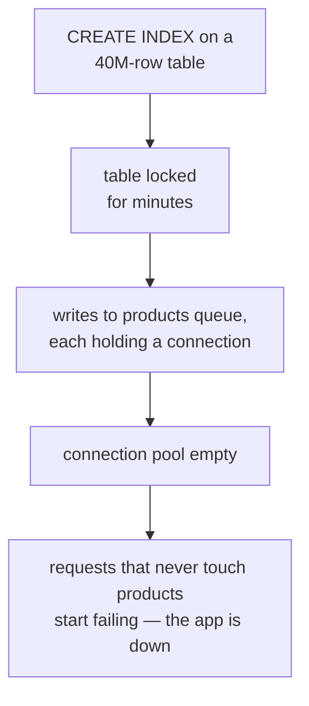
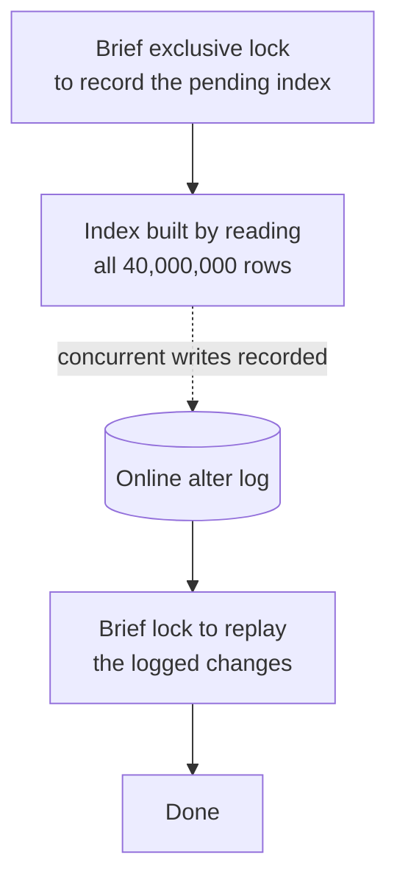

Everything so far assumed a B+ tree and an empty schedule. Neither holds in general: there is another index structure with different trade-offs, and creating an index on a live table is an operation that can take the system down.

# Hash indexes

> [!important] A **hash index** stores a hash of the indexed column, mapped to a pointer to the row. Looking up an exact value hashes it and jumps straight to the entry — **O(1)**, against a B+ tree's O(log n).

The difference is worth seeing on six products rather than taken from the notation.

## Narrowing down, against computing

A B+ tree index on price holds its entries in sorted order:

```text
5     12     30     45     80     120
```

Run `WHERE price = 80`. A tree cannot go straight there; it narrows. Look at the middle, 30 — 80 is bigger, so the left half is thrown away. What remains is `45  80  120`. Look at its middle, 80. Found.

Two comparisons here, and the count grows as the table does, because each comparison halves what is left. That is what O(log n) means, and on a million rows it is about twenty steps.

A hash index stores nothing in sorted order. It has numbered slots and a function that turns a value into a slot number:

| slot | holds |
|---|---|
| 0 | `12` goes to the Mug |
| 1 | empty |
| 2 | `120` goes to the Desk |
| 3 | `80` goes to the Chair |
| 4 | `5` goes to the Pen |
| 5 | `45` goes to the Lamp |
| 6 | empty |
| 7 | `30` goes to the Cup |

Run the same query. Feed 80 to the hash function, which returns 3. Go to slot 3.

That is the entire lookup. **No comparisons happened.** Nothing was halved, nothing was ruled out, nothing was searched — the address was computed from the value itself.

Which makes the size of the table irrelevant to the cost:

| rows in the table | B+ tree, comparisons | hash, steps |
|---|---|---|
| 6 | ~3 | 1 |
| 1,000 | ~10 | 1 |
| 1,000,000 | ~20 | 1 |
| 1,000,000,000 | ~30 | 1 |

That flat column is O(1). It is also the only thing a hash index is better at, and what it costs is not small.

## Why the slots have to be scattered

The O(1) above is not something hashing hands over for free, and seeing why explains everything the structure cannot do.

**Two values can land in the same slot.** With eight slots and a thousand prices, collisions are unavoidable. When 80 and 210 both hash to slot 3, both go in slot 3, as a small list:

```text
slot 3:   80 goes to the Chair,   210 goes to the Monitor
```

So a lookup is really two moves rather than one: jump to the slot, then walk the list inside it.

| list length in that slot | steps to find the value |
|---|---|
| 1 | 1 |
| 2 | 2 |
| 40,000 | 40,000 |

**O(1) holds only while those lists stay short**, and they stay short when the thousand prices are spread thinly across all the slots rather than piled into a few.

Now break it with a hash function that keeps neighbouring values together. Say the function is `price / 10`, so prices 50 to 59 land in slot 5, 60 to 69 in slot 6, and 4,000 to 4,009 in slot 400. It looks tidy, and on real data it collapses — prices are not spread evenly across all possible numbers. Most products cost between 10 and 200, and almost nothing costs 4,000:

```text
slots 0 to 20:     every product in the table
slots 21 to 400:   empty
```

Slot 5 now holds a list of 40,000 products. Look up `price = 55` and you jump to slot 5 in one move, then walk 40,000 entries. An index was built and a table scan was delivered.

> [!important] A good hash function makes its output look random, so that 50, 51 and 52 land in unrelated slots. The same clustered prices then spray evenly across every slot, every list stays a couple of entries long, and the lookup really is one jump and a glance. **Losing the relationship between neighbouring values is not a design choice — it is the price of the even spread, and the even spread is what buys the O(1).**

## What it cannot do

Three limitations follow, and all three are that same fact: a tree preserves the relationships between values, and a hash destroys them on purpose.

**Ranges.** `WHERE price > 80`. On a tree, find 80 and walk right — every larger price sits to the right of it, in order and contiguous. On a hash table, greater than 80 is not a question that can be asked: 81 is in slot 6, 82 in slot 0, 79 in slot 1. No starting point, no direction to walk in. The only way to answer is to visit every slot and test what is in it, which is a full scan wearing an index costume.

**Ordering.** `ORDER BY price` is free on a tree, whose entries are already in price order — reading them left to right hands back sorted rows at no cost. Read the hash table's slots in order and you get:

```text
12,  120,  80,  5,  45,  30
```

Slot order carries no information about value, so the rows have to be sorted afterwards from scratch, exactly as if no index existed.

**Partial matching.** A composite B+ tree on `(created_at, price, rating)` sorts by `created_at` first, so a query supplying only `created_at` still works — the leftmost prefix rule. A composite hash index does something different: it takes all three columns, joins them into one string, and hashes that single thing.

```text
hash("Aug 28 | 90 | 4.8")   =   slot 5
```

Now query on `created_at = 'Aug 28'` alone. What is there to hash? Computing the number needs the whole string, and only a third of it is in hand. There is no such thing as a partial hash — slot 5 is not derivable from `Aug 28`.

> [!important] There is no leftmost prefix rule for hash indexes, and not because the rule was left out. **There is nothing to be a prefix of** — the three columns stopped being three columns the moment they were hashed into one number.

| | B+ tree | Hash |
|---|---|---|
| Exact match | O(log n) | **O(1)** |
| Range query | **Yes** | No |
| Partial / prefix match | **Yes** | No |
| `ORDER BY` | **Free** | No help |

> [!important] The trade is narrow speed against breadth. **A hash index is right when every query is an exact match on the whole key** — a session token, a shortened URL, a file fingerprint, where you either hold the entire value or nothing and never ask for a range of them. Anything involving ranges or sorting wants a tree.

> [!info] The same reasoning explains Redis, which is a hash table in memory: extremely fast exact lookups, and range queries need a different data structure entirely.

## In MySQL specifically

Suppose a sessions table where every query is `WHERE token = '...'` — the whole key, an exact match, never a range. The textbook case. So ask for the structure that suits it:

```sql
1  CREATE INDEX idx_token ON sessions (token) USING HASH;
```

It succeeds. No error and no warning. Then look at what was built:

```sql
1  SHOW INDEX FROM sessions;
```

```text
1  Key_name     Index_type
2  idx_token    BTREE
```

> [!warning] **InnoDB does not support hash indexes.** `USING HASH` is accepted and ignored, and nothing says so. Only the MEMORY engine builds real ones, and it keeps its tables in RAM and loses them on restart — so for anything actually stored, hash indexes are not on the menu.

The failure being silent is what makes it worth knowing. The use case can be identified correctly and the syntax written correctly, and the other structure arrives with no indication that a substitution took place.

## The adaptive hash index

What InnoDB does instead is more interesting than refusing. Look up `abc123` in that B+ tree and the descent takes three steps:

```text
step 1   root page   ->  tokens starting a-f are on page 40
step 2   page 40     ->  tokens starting ab are on page 812
step 3   page 812    ->  here is abc123, and here is its row
```

Look up `abc123` again and it is the same three steps. And again — three steps. **The tree has no memory.** That the same token was requested ten thousand times already changes nothing; the walk starts at the top every time.

So InnoDB keeps a small side table in memory:

| token | the page it ended up on |
|---|---|
| `abc123` | 812 |
| `xy9f01` | 55 |

The next lookup for `abc123` checks that side table first, finds 812, and goes straight there. **One step instead of three** — the first two were skipped, because the answer to which page was already written down from last time.

And notice what kind of structure the side table is. It takes a whole exact value and returns a location, with no ranges and no ordering involved. It is a hash table: the thing InnoDB will not let you create, built by InnoDB for itself.

> [!important] The **adaptive hash index** is closer to a bookmark than to an index. You still own the book and its index — the pages you keep returning to simply get marked, so that looking them up can stop.

Three things follow from it being adaptive. **Nobody declares it** — InnoDB counts which parts of the tree keep being searched, and only the values looked up constantly earn a row. **It lives in memory only**, so a restart empties it and traffic fills it back up. And **it cannot be written, named, or put in a migration**, because there is nothing to write.

| | an index you build | the adaptive hash index |
|---|---|---|
| where it lives | on disk, part of the schema | in memory only |
| when it appears | when you run `CREATE INDEX` | when the access pattern justifies it |
| when it goes away | when you `DROP` it | when the pattern stops, or on restart |
| in a migration | yes | nothing to write |

So the practical answer to whether to use a hash index in MySQL is that you cannot, and do not need to. If the queries are the exact-match-on-a-whole-value kind, InnoDB spots that and provides the speedup unprompted.

# Creating an index on a live table

On a development machine this operation feels free. The `products` table has two hundred rows:

```sql
1  CREATE INDEX idx_price ON products (price);
2  -- 0.02 sec
```

Instant, and nothing to think about. Now run the same statement on production, where `products` has forty million rows.

**What the database is actually doing** is reading every row in the table, pulling out the price, sorting all forty million values, and writing them into a new structure. That is not a metadata change, it is a full pass over the table, and on forty million rows it takes minutes rather than seconds.

So the question is not how long it takes. It is what happens to everyone else during those minutes.

> [!warning] **Historically, creating an index locked the table for the whole build.** No writes to `products` until it finished.

And the blocked writes do not fail. They wait:

- someone adds a product, and the request hangs
- someone edits a price, and it hangs
- a checkout updates stock levels, and it hangs

Each of those is holding a database connection open while it waits. The application has a connection pool with, say, ten connections in it. Ten hanging requests and the pool is empty.

At which point the damage leaves the table entirely. The next request to arrive asks the pool for a connection — any connection, for a query with nothing to do with `products` — and there is not one. The login page fails. The health check fails. The whole application is down, and the cause is a single `CREATE INDEX` still healthily doing its job on one table.



> [!important] **A lock on one table becomes an outage across the whole application, through the connection pool.** The index build was never the failure — it was the thing holding the door shut while everything piled up behind it.

> [!warning] This is the case where a development database tells you nothing. Two hundred rows finish in 0.02 seconds, so the lock exists for twenty milliseconds and nobody notices. **The behaviour is identical and only the duration changed** — and the duration is the entire problem.

## What MySQL does now

Since 5.6, InnoDB builds indexes without holding the table, and there is a real problem in the way of that. The build takes eight minutes, and writes are meant to continue throughout — but then the finished index is wrong, because it was built from the table as it looked at the start and knows nothing about what changed since.

The solution is a side log. Follow the timeline:

```text
minute 0      brief lock. Record in the schema that an index is being built. Unlock.
minute 0-8    read all 40,000,000 rows into the new index.
              Meanwhile traffic continues normally:
                  someone inserts the Lamp  ->  written to the table AND to the log
                  someone changes a price   ->  written to the table AND to the log
minute 8      the read is done. The index is complete except for those two changes.
minute 8      brief lock. Replay the log's two entries into the index. Unlock. Done.
```

> [!important] That side log is the **online alter log**, and it exists for exactly this — holding the changes that happened behind the build's back, so they can be applied at the end.



So the table is locked twice, for a moment each, rather than once for eight minutes. Reads and writes run normally through the middle.

## Why it can still block

Look at minute 0 again. To take even that brief lock, MySQL has to wait for every transaction currently open on `products` to finish — which is not negotiable, since a table's structure cannot change underneath a query that is mid-flight.

So somebody runs an analytics `SELECT` over `products` that takes ten minutes. The `CREATE INDEX` arrives, needs the brief lock, and cannot have it. It waits.

That is not merely slow, because **the lock queue is first come, first served.** The waiting `CREATE INDEX` holds a place in that queue, and every query arriving after it queues up behind it — including ordinary writes that the long `SELECT` would never have blocked on its own:

```text
long SELECT, 10 minutes    <- running
   CREATE INDEX            <- waiting for it
      INSERT               <- waiting for the CREATE INDEX
      UPDATE               <- waiting
      INSERT               <- waiting
```

Ten minutes of that and the outage above arrives exactly as before: connections held, pool drained, application down. The online build did everything right and was defeated by one slow query that had nothing to do with it.

> [!warning] **The dangerous part of an online index build is not the build — it is whatever transaction is already open on that table.** Check for long-running queries before starting, not after.

## Forcing the safe path

There is a gap left by everything above. Knowing that MySQL builds indexes online, you run `CREATE INDEX` on production expecting no lock — but online is not guaranteed for every operation. Some schema changes genuinely cannot be done that way, and when one of those is asked for, **MySQL does not refuse.** It quietly falls back to the old locking method and does it anyway. You find out from the incident channel.

So stop relying on the default and state the requirement in the statement itself:

```sql
1  CREATE INDEX idx_product_price ON products (price)
2  ALGORITHM=INPLACE, LOCK=NONE;
```

| Clause              |                                                                                                                                                                                                                                                                    |
| ------------------- | ------------------------------------------------------------------------------------------------------------------------------------------------------------------------------------------------------------------------------------------------------------------ |
| `ALGORITHM=INPLACE` | Build the index inside the table that already exists. The alternative, `COPY`, creates an entire new table, copies all forty million rows into it, builds the index there and swaps the two — slower, and it needs enough free disk for a second copy of the table |
| `LOCK=NONE`         | A demand rather than a preference. If the operation would need to block writes, **do not do it — error out instead**                                                                                                                                               |

> [!important] `LOCK=NONE` **makes nothing safer.** The operation was going to lock or not lock regardless; what changes is what you get told. Without it, an index build that cannot go online silently takes the site down. With it, an error appears in the terminal and the site stays up. **It is an assertion, not an optimisation** — two possible outcomes, an index or an error, and the outage is no longer one of them.

## PostgreSQL

The clearest way to see the difference is to type the same statement on each database.

```sql
1  CREATE INDEX idx_price ON products (price);
```

On MySQL that builds online. Writes keep working, nothing special was typed, and the safe behaviour arrived by default.

On PostgreSQL the identical statement **locks the table until it finishes** — the outage described above, from a command that looks the same. Avoiding it takes one extra word:

```sql
1  CREATE INDEX CONCURRENTLY idx_price ON products (price);
```

| | MySQL | PostgreSQL |
|---|---|---|
| What typing nothing gives you | the safe build | the locking build |
| What the extra clause does | `LOCK=NONE` — be **told** if it is not safe | `CONCURRENTLY` — **make** it safe |

> [!important] On MySQL the extra clause is a smoke alarm. On PostgreSQL the extra word is the thing doing the work. **Forget it on MySQL and you might get unlucky. Forget it on PostgreSQL and the table is locked, guaranteed.**

And `CONCURRENTLY` is not free. Two costs are worth knowing before you need them.

**It can leave a mess behind.** If the build fails partway, PostgreSQL does not clean up — an index stays in the schema marked invalid, unused by any query, occupying space, and it sits there until somebody drops it by hand. A failed `CONCURRENTLY` needs a follow-up; a failed MySQL build leaves nothing.

**It cannot run inside a transaction.** Which matters because migration tools wrap each migration in one — that wrapping is exactly why a failed migration on PostgreSQL rolls back cleanly, as `11-Database-Migrations/04-When-A-Migration-Fails.md` describes. `CONCURRENTLY` refuses to run inside that wrapper, so a migration containing it has to be marked as one the tool must not wrap.

> [!important] The instinct to carry across databases is not the syntax. **Check what the default does before running it on production** — not that it was fine on the other database, and not that it was fine on staging where the table had two hundred rows.

# Where an index belongs in a Spring project

`products` needs an index on `price`. The obvious place to put it is the entity — that is where the table is described, so it ought to be where the table's indexes are described. JPA even has an annotation for exactly that.

## The annotation, which does nothing

```java
1  // src/main/java/com/example/FakeCommerce/schema/Product.java
2  @Table(name = "products", indexes = {
3      @Index(name = "idx_product_price", columnList = "price"),
4      @Index(name = "idx_product_price_rating", columnList = "price, rating")
5  })
```

Correct syntax, and it compiles. Restart the application, then look:

```text
1  SHOW INDEX FROM products;
2  PRIMARY                BTREE
3  FK_product_category    BTREE
```

**Neither index exists.** No error was raised, nothing was logged, and the annotation is sitting there in the file.

> [!important] `@Table(indexes = ...)` is an instruction for **schema generation** — it says what Hibernate should build, if Hibernate is the thing building the schema. With `ddl-auto: validate` it is not: Hibernate inspects the schema, checks it against the entities, and changes nothing. Which is exactly what was asked for when Flyway took ownership.

Not a bug. The annotation describes what the schema should look like; something else decides whether to act on it.

## The migration, which does

An index is a schema change, so it goes where schema changes go:

```sql
1  -- src/main/resources/db/migration/V4__add_product_price_index.sql
2  CREATE INDEX idx_product_price ON products (price);
```

Restart, and Flyway applies it:

```text
1  SELECT * FROM flyway_schema_history;
2  ... version 4, add product price index, success
```

```text
1  SHOW INDEX FROM products;
2  PRIMARY                BTREE
3  FK_product_category    BTREE
4  idx_product_price      BTREE
```

> [!info] **Verified.** The index the annotation could not create, created by a migration and recorded in the history table.

> [!important] Which is the arrangement `11-Database-Migrations/02-Flyway.md` argued for, now paying off on something other than tables. **An index is a schema change**, so it belongs where schema changes live — reviewable in a diff, applied in order, recorded once per database, identical on every machine that runs it.

## Why the annotation would still be the wrong place

Suppose it did work, and Hibernate happily created the index at startup. It would remain the wrong home for it, and the reason is visible in what the annotation is able to express:

```java
1  @Index(name = "idx_product_price", columnList = "price")
```

A name, and a list of columns. That is the entire vocabulary. There is nowhere to put `ALGORITHM=INPLACE`, and nowhere to put `LOCK=NONE`.

> [!important] **The annotation can say which columns. Only the migration can say how to build it.** On a two-hundred-row table that difference is invisible. On a forty-million-row production table it is the difference between a deployment and an outage.

> [!info] Keeping the annotation beside the entity, commented out, is a reasonable habit — it documents in the Java code which indexes the table is expected to have, while the migration remains what actually creates them.

# What to carry from all of this

> [!important] **Structure follows query shape.** B+ trees for ranges, sorting and prefixes; hash for exact matches on a whole key.

> [!important] **Creating an index is an operation with a blast radius.** On an empty table it is instantaneous. On a live table with millions of rows it is a change that needs the same care as any other production write.

> [!important] **Indexes are schema, and schema lives in migrations.** Not in an annotation, not typed into a database client — in a file, reviewed, versioned and applied the same way on every machine.

And the decisions those three reduce to, in one place:

| the question | the answer |
|---|---|
| Ranges, sorting, or a partial key? | B+ tree — and in MySQL that is the only thing you can build |
| Exact match on the whole value, always? | InnoDB will build the hash itself, unprompted |
| Running `CREATE INDEX` on a large live table? | Add `ALGORITHM=INPLACE, LOCK=NONE`, and check for long-running transactions first |
| Same, on PostgreSQL? | `CONCURRENTLY`, outside a wrapping transaction, and clean up an invalid index if it fails |
| Where does the statement live? | A migration file. Never `@Index`, never a database client |

