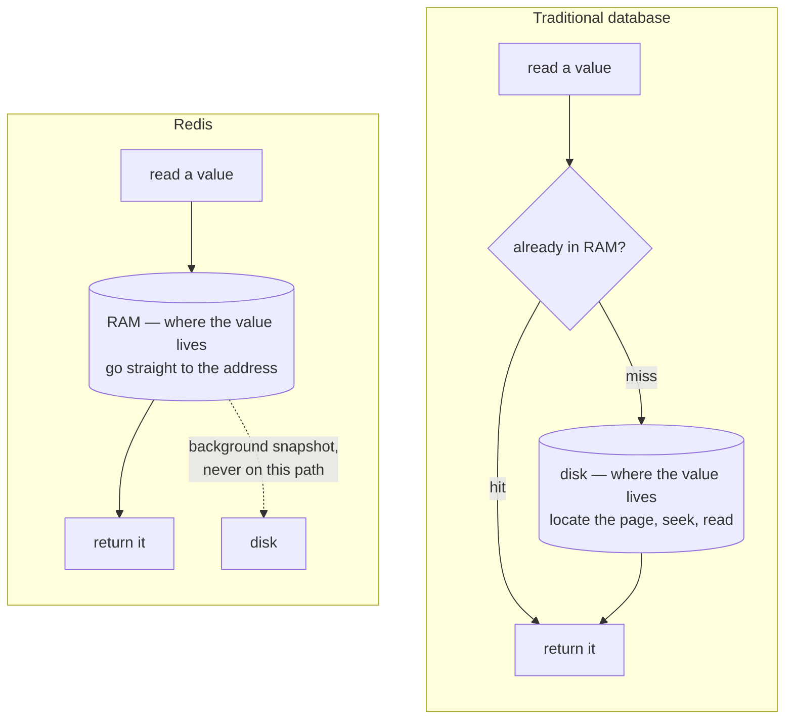
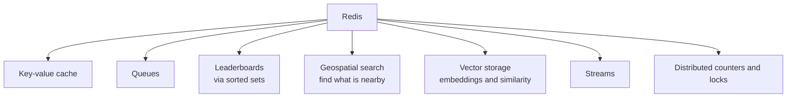

A shared cache instance is the arrangement worth having, and Redis is what almost everyone runs in it. Before any commands, it is worth being precise about what kind of thing it actually is — because several of its properties are surprising and all of them have consequences.

# In-memory means what it says

> [!important] **Redis keeps its data in RAM.** Not as an optimisation on top of disk storage, the way a database buffer pool works — RAM is the primary and normal location of every value Redis holds.



That inversion is the whole explanation for the latency numbers. There is no page to locate, no seek, no read from a storage device — the value is at an address in memory.

# A key-value store, and nothing more

> [!important] Redis is classified as a **NoSQL** database, and specifically a **key-value store**. There are **no tables, no schema, and no joins.** You store a value under a key and you get it back by that key.

What that rules out is substantial:

| | Relational database | Redis |
|---|---|---|
| Query by a non-key column | **Yes** | No |
| Join two collections | **Yes** | No |
| Enforce a schema | **Yes** | No |
| Constraints and foreign keys | **Yes** | No |
| Transactions across many rows | **Yes** | Limited |

> [!warning] **You cannot ask Redis a question you have not planned for.** A relational database will answer any query you can express, slowly if need be. Redis will answer the one question its key structure was designed around, and nothing else. The key design is the query design.

> [!important] This is why relational databases still run most of the internet, and it is a reasonable estimate that **60 to 70% of typical application data fits a relational model comfortably** while a much smaller fraction fits a key-value one. Redis is not a database replacement. It is a specific tool that is extraordinary within its shape.

# Persistence is available and is not the point

The obvious question, given data in RAM, is what happens when the process stops.

> [!important] Redis offers **persistence**: writing its data to durable storage so it survives a restart. Three options, and they can be combined.

| Option | What it does |
|---|---|
| **RDB** | Point-in-time snapshots of the whole dataset, written periodically |
| **AOF** | An append-only file recording every write command as it arrives |
| **Both** | Snapshots for fast reloading, the log for what happened since the last one |
| **Neither** | Everything lives in RAM. If the process dies, the data is gone |

> [!important] Persistence protects against a restart. **It does not turn Redis into a system of record**, because everything that made a relational database the right place for important data — schema, constraints, joins, transactional guarantees — is still absent. A durable key-value store is still a key-value store.

> [!info] There is a natural question here: with persistence enabled, why keep the relational database at all? Because durability was never the reason you wanted one. You wanted relationships, constraints and the ability to ask arbitrary questions, and an append-only log of key writes provides none of those.

# More than a cache

Caching is what Redis is usually introduced for, and it is a fraction of what ships in the box.



> [!important] It is better understood as **a piece of infrastructure with many data structures in it** than as a cache that grew features. Each structure exists because some common problem is trivial with it and awkward without it.

Those structures are the subject of the next several notes, and knowing they exist is more valuable than memorising their commands. **The failure mode in practice is not forgetting a command name — it is not knowing a structure exists and therefore never considering the solution that uses it.**

# Getting one running

Four routes, all normal:

**Install it directly.** Download from the Redis site and run it.

**Run it in a container.** One Docker image, no local installation.

**Provision a managed instance.** AWS ElastiCache creates and operates a Redis instance for you.

**Run it yourself on a cloud machine.** Plenty of organisations provision an ordinary server and install Redis on it, usually containerised, rather than paying for the managed service.

# First contact

Redis ships with a command-line client:

```text
  redis-cli
```

The one command worth knowing before any other:

```text
  127.0.0.1:6379> PING
  PONG
```

> [!info] **Verified** against Redis 8.2.3. `PING` answering `PONG` is the standard check that the server is up and reachable — the first thing to run when something is not working, before investigating anything in the application.

# Why the raw commands are worth learning

Every language has a Redis client library, so it is fair to ask why the command line matters when the application will never use it.

> [!important] Redis can execute **Lua scripts** — programs sent to the server and run inside it, against the data, without round trips. When several operations must happen together and atomically, a script is the mechanism, and a script is written in raw Redis commands. **A client library will not write it for you.**

Two smaller reasons that come up more often than the scripting does. Diagnosing a cache problem means connecting and looking at what is actually stored, which is the command line and nothing else. And understanding what a library call does — whether it is one operation or five — requires knowing the operations it is built from.
