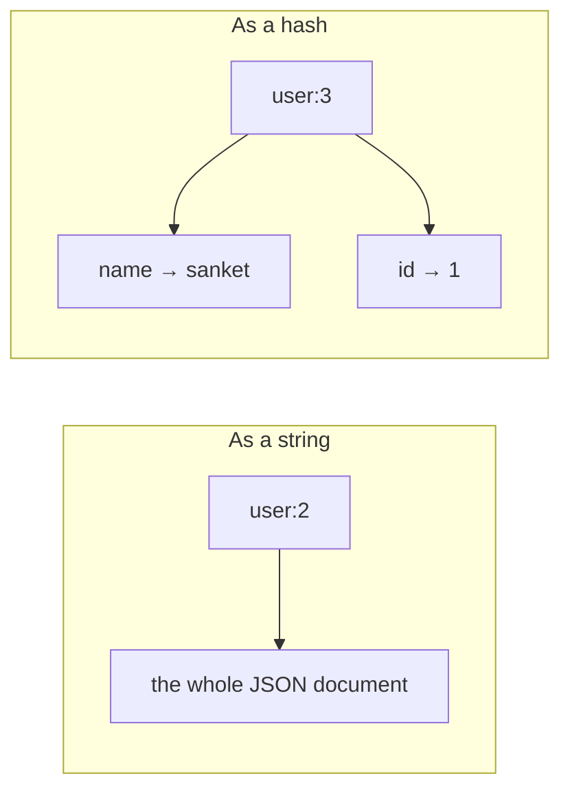
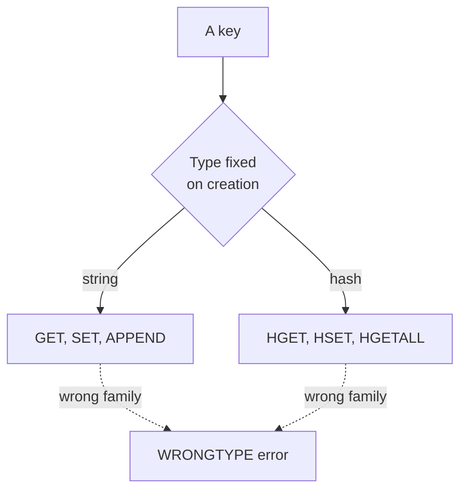

Redis is a key-value store with several kinds of value. The two simplest are a plain string and a field-value map, and between them they cover most of what a cache actually holds.

# Strings

The basic pair of operations.

```text
  127.0.0.1:6379> SET user:1 sanket
  OK
  
  127.0.0.1:6379> GET user:1
  "sanket"
```

> [!info] **Verified** against Redis 8.2.3, as is every command in this note.

`SET` stores, `GET` retrieves, and `OK` is the confirmation. There is nothing more to the basic case.

## The colon in the key

`user:1` is not syntax. Redis sees an opaque string and attaches no meaning to the colon at all.

> [!important] **It is a naming convention**, and a near-universal one: `object:id`, extended as needed to `user:1:sessions` or `product:47:reviews`. Because a key-value store has no tables, the key is the only place structure can live, and a consistent scheme is what stops a shared cache becoming unreadable.

> [!info] It also makes the keyspace browsable, since patterns like `user:*` can be scanned. Worth knowing that scanning a production keyspace is an operation to be careful with, not a routine query.

## Storing something structured

A single string is limiting when the thing being cached is an object. The direct answer is to serialise it.

```text
  127.0.0.1:6379> SET user:2 '{"id":1,"name":"sanket"}'
  OK
  127.0.0.1:6379> GET user:2
  "{\"id\":1,\"name\":\"sanket\"}"
```

**Redis stores the JSON as an ordinary string**, without parsing or understanding it. The application serialises on the way in and deserialises on the way out, into a Java object or whatever the language provides.

> [!important] **This is the most common way applications cache objects**, and it is entirely reasonable. The cost is that the value is opaque to Redis: reading one field means transferring the whole document and parsing it in the application, and changing one field means read, parse, modify, serialise, write.

# Hashes

The alternative is a value that Redis understands as a set of fields.

```text
  127.0.0.1:6379> HSET user:3 name sanket id 1
  (integer) 2
  127.0.0.1:6379> HGET user:3 name
  "sanket"
```

> [!important] A **hash** stores a map of field-value pairs under one key. The key is still `user:3`; the value is now a small dictionary rather than a flat string.



The `(integer) 2` returned by `HSET` is the number of **new** fields created. Setting a field that already exists returns 0, because it was updated rather than added.

## Updating the value

```text
127.0.0.1:6379> HSET user:3 id 5
(integer) 0
```
## Reading it back

One field at a time with `HGET`, or all of it:

```text
  127.0.0.1:6379> HGETALL user:3
  1) "name"
  2) "sanket"
  3) "id"
  4) "5"
```

> [!warning] **`HGETALL` returns a flat array, not pairs.** Field, value, field, value — the client library reassembles it into a map. Reading the raw output means reading it two entries at a time.

A field that does not exist returns nothing rather than an error:

```text
  127.0.0.1:6379> HGET user:3 email
  (nil)
```

# Which to use

| | String holding JSON | Hash |
|---|---|---|
| Read one field | Transfer and parse the whole object | **Just that field** |
| Update one field | Read, parse, modify, write back | **`HSET` on that field** |
| Read the whole object | **One `GET`, one parse** | `HGETALL`, then reassemble |
| Nested structures | **Any depth** | Flat only — no nesting |
| Expiry | Per key | Per key, **or per field** |

> [!important] **Hashes win when the object is flat and fields are read or written individually.** A user's profile where the display name changes independently of everything else is a good fit. **JSON strings win when the object is nested, or when it is always read whole** — which describes most cached API responses.

> [!warning] The expiry row is the one that catches people out, and it has two settings rather than one. A hash can expire **as a whole key**, taking every field with it, or **field by field**, so that a short-lived value sits beside permanent ones. Which to reach for, and the trap when both are set at once, is worked through in `05-Expiry-And-Locks.md`.

# Types are enforced

A key has one type, decided when it is created, and operations from the wrong family are refused.

```text
  127.0.0.1:6379> TYPE user:1
  string
  
  127.0.0.1:6379> TYPE user:3
  hash
  
  127.0.0.1:6379> GET user:3
  (error) WRONGTYPE Operation against a key holding the wrong kind of value
```



> [!important] **`WRONGTYPE` means the key exists and holds something else.** It is not a missing key and not a syntax problem. In an application it almost always means two pieces of code disagree about the shape of data under a shared key name — which is the failure a consistent key convention exists to prevent.
