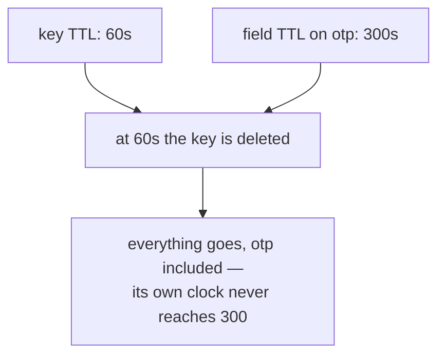
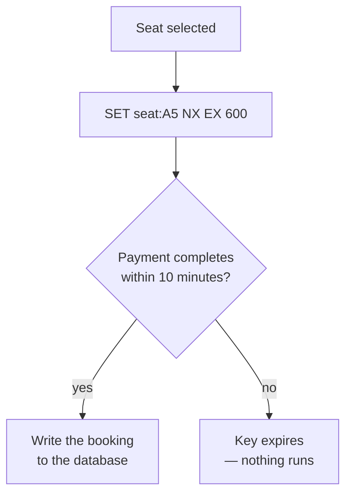

Every key written so far stays until something deletes it. One additional feature changes that, and it turns out to solve a problem that has nothing obvious to do with caching.

# Time to live

> [!important] **A time to live, or TTL, is an expiry attached to a key.** When the time is up, Redis removes the key. Nothing has to run, nothing has to be scheduled, and no application code is involved.

```text
  127.0.0.1:6379> SET user:4 sat EX 10
  OK
  
  127.0.0.1:6379> GET user:4
  "sat"
  
  127.0.0.1:6379> TTL user:4
  (integer) 10
```

`EX 10` means expire after ten seconds. There is a shorthand for the same thing:

```text
  127.0.0.1:6379> SETEX user:5 10 sat
  OK
```

> [!info] `SET key value EX seconds` and `SETEX key seconds value` are the same operation. Note the argument order differs — the seconds come before the value in `SETEX` and after it in `SET`.

Watching one actually expire:

```text
  127.0.0.1:6379> SET tmp:x hello EX 1
  OK
  
  127.0.0.1:6379> GET tmp:x
  "hello"
  
  ... one second later ...
  127.0.0.1:6379> GET tmp:x
  (nil)
  
  127.0.0.1:6379> EXISTS tmp:x
  (integer) 0
```

> [!info] **Verified** against Redis 8.2.3. The key is genuinely gone, not merely hidden — `EXISTS` reports 0.

## Reading a TTL

`TTL` returns the seconds remaining, and two negative values that are worth knowing:

| Returns | Meaning |
|---|---|
| A positive number | Seconds remaining |
| `0` | Under a second remaining — it is about to go |
| **`-1`** | The key exists and **has no expiry** |
| **`-2`** | The key does not exist |

> [!warning] Those two are easy to confuse and mean opposite things. `-1` is a key that will live forever; `-2` is a key that is already gone. Application code that treats any negative value as absent will leak keys that were meant to be permanent.

`0` is worth separating from `-1` for the same reason. It is a real duration — `TTL` reports whole seconds and rounds down, so anything under one second reads as zero. A key at `0` is alive and about to stop being so.

## How each command says nothing is there

`-2` belongs to `TTL` and nowhere else. Every command has its own way of reporting a missing key, because each returns a different kind of thing:

| Command | Key missing |
|---|---|
| `GET` | `(nil)` |
| `TTL` | `-2` |
| `EXISTS` | `0` |
| `TYPE` | `none` |

`GET` returns a value or nothing, so nothing is `(nil)`. `TTL` returns a number, and a number cannot be nil, so it needs a sentinel — hence `-2`.

> [!important] A key that expired and a key that never existed are **indistinguishable**. `GET` gives `(nil)` for both, `TTL` gives `-2` for both, `EXISTS` gives `0` for both. Redis keeps no record of a key it has removed, so if the fact that something was there and lapsed matters, it has to be written down somewhere else.


# Expiring the key, or expiring a field

`EXPIRE` does not care what a key holds:

```text
  127.0.0.1:6379> EXPIRE user:1 300      # a string
  (integer) 1

  127.0.0.1:6379> EXPIRE user:3 300      # a hash
  (integer) 1

  127.0.0.1:6379> EXPIRE mylist 300      # a list
  (integer) 1
```

It works on all three because it is not expiring the value at all. It is expiring the **key**, and the value goes because the key went.

> [!important] The distinction that matters is **granularity, not type.** `EXPIRE` removes a whole key whatever is inside it. `HEXPIRE` removes named fields from within one — and hashes are the only type that has fields, which is the only reason it is a hash command.

| | What it removes | Works on |
|---|---|---|
| `EXPIRE` | the whole key | any type |
| `HEXPIRE` | the fields you name | hashes only |

So a hash has both available, answering different questions. This whole session record should vanish in an hour is `EXPIRE`. The one-time code inside it should vanish in five minutes while the rest stays is `HEXPIRE`.

> [!info] `EXPIRE` has nothing to do with `SET` and `GET` in particular. `SET` merely has an `EX` shortcut so the value and the clock can be written atomically — a convenience `HSET` does not have, so a hash is always `HSET` followed by `EXPIRE`, with a brief window in between where the key exists unexpiring. `GET` never touches expiry; `GETEX` is the command that reads a value and resets its clock together.

## Expiring the whole hash

```text
  127.0.0.1:6379> HSET user:6 name "Laxit" email "l@example.com" otp "839201"
  (integer) 3

  127.0.0.1:6379> EXPIRE user:6 300
  (integer) 1
```

In five minutes `user:6` is deleted and all three fields go with it. Which is the wrong tool if the name and email were meant to outlive the code.

## Expiring one field

Since Redis 7.4, a field can carry its own clock:

```text
  127.0.0.1:6379> HEXPIRE user:6 300 FIELDS 1 otp
  1) (integer) 1

  127.0.0.1:6379> HTTL user:6 FIELDS 1 otp
  1) (integer) 300

  127.0.0.1:6379> HTTL user:6 FIELDS 1 name
  1) (integer) -1
```

`name` and `email` hold no TTL and survive. `otp` disappears on its own, and `HGETALL user:6` simply returns fewer fields from then on.

> [!warning] The `FIELDS 1` is where people trip. The syntax is `FIELDS <count> <field...>` and the count must match the number of fields listed — `HEXPIRE user:6 300 FIELDS 2 otp session_token` for two. Get the count wrong and the reply is an argument error rather than anything descriptive.

> [!important] The key is not immortal, it is **dependent**. Redis keeps `user:6` alive while at least one field remains, because an empty hash does not exist. Give every field a TTL and the key is deleted along with the last one to expire.

## Before field-level expiry existed

The long-standing answer was to stop mixing lifetimes under one key:

```text
  user:6        the durable fields, no TTL
  user:6:otp    its own key, SET user:6:otp 839201 EX 300
```

Since expiry is per key, giving each item its own key gives each item its own lifetime. The pattern is everywhere in Redis code, and this constraint is why.

> [!warning] Two things to confirm before relying on field-level expiry. **Managed Redis offerings lag the open-source releases**, so check the server version rather than assuming. And **the client library has to expose the commands** — Spring Data Redis only gained hash-field expiry in recent versions, so on an older one it means issuing the raw command.

## When both clocks are set

Nothing stops a key TTL and a field TTL existing together:

```text
  127.0.0.1:6379> EXPIRE  user:6 60
  127.0.0.1:6379> HEXPIRE user:6 300 FIELDS 1 otp
```



> [!important] **A key TTL always wins**, because deleting the key deletes everything inside it. The field clocks never get the chance to finish.

# What expiry is actually for

The obvious use is bounding how stale cached data can get. The more interesting one is locking, and the clearest example is booking a seat.

## The problem


The payment step takes real time. Card details get typed, a UPI request goes to a phone, a bank confirms, a reconciliation happens. Minutes, sometimes.

> [!warning] **Two people must not be able to pay for the same seat.** During those minutes the seats have to be held for whoever selected them first — which is exactly the timer a flight booking site shows when it says you have ten minutes to complete this booking.

And the hold has to be generous, because payments fail for reasons that are not the customer's fault. **They should get several attempts inside that window** rather than losing the seats on the first failure.

## Why the database is the wrong place

The direct approach is a `reserved_until` column on the seat, written when someone selects it.

> [!warning] **Two problems, and the second is worse.**
>
> **The writes are expensive.** Every seat selection becomes a database write at 10 to 45 ms, including from everyone who browses seats and never pays. That traffic is far larger than actual bookings.
>
> **Nothing releases them.** A database does not delete rows because a timestamp has passed. Freeing expired holds means a **scheduled job** that repeatedly scans for reservations older than ten minutes with no completed payment and clears them — a second moving part, with its own failure modes, its own scan cost, and a window during which expired seats are still shown as taken because the job has not run yet.

## What a TTL does instead

```text
  127.0.0.1:6379> SET seat:A5 order99 NX EX 600
  OK
  
  127.0.0.1:6379> SET seat:A5 other NX EX 600
  (nil)
  
  127.0.0.1:6379> TTL seat:A5
  (integer) 600
```

> [!important] **`NX` means set only if the key does not already exist.** The first request takes the lock and gets `OK`. The second gets `(nil)` — the seat is held, and that single reply is the entire concurrency check. `EX 600` gives the hold ten minutes.

And the release problem disappears:



> [!important] **The expiry is the release mechanism.** No scheduled job, no scan, no cleanup code, and no window where a stale hold blocks a seat. The behaviour that needed a second system in the database design is a single argument here.

The check on every incoming request becomes a cache lookup rather than a database query: is this seat locked in Redis? If it is, someone else is midway through paying. Only a completed payment writes to the database, so **the database sees writes for actual bookings and nothing else.**

# Three ways to prevent a double booking

This is the third mechanism for the same class of problem, and they are worth seeing together.

|                         | How it works                                                               | Suits                                                               |
| ----------------------- | -------------------------------------------------------------------------- | ------------------------------------------------------------------- |
| **Pessimistic lock**    | The database locks the row; **other transactions wait**                    | A row **one user** touches — the same person clicking twice         |
| **Optimistic lock**     | A version column, checked at write time; a mismatch means someone else won | A row **many users** contend for, where conflicts are real but rare |
| **TTL lock in a cache** | A key with an expiry, taken before the work begins                         | A hold that must **outlive the request** and release itself         |

> [!important] The distinction between the first two is contention. **A pessimistic lock makes everyone else wait**, which is fine when almost nobody else is coming and expensive when they are. **An optimistic lock lets everyone proceed and detects the collision at the end**, which is cheaper under contention and means losers must retry.

> [!important] The third is a different shape entirely. Both database locks live inside a transaction and end with it — **they cannot hold anything across the several minutes a human spends on a payment page.** A TTL lock is not tied to a transaction, so it can, and it expires on its own when the human walks away.

# A related idea, named and deferred

A neighbouring problem: preventing the same payment being processed twice when a client retries.

> [!important] **Idempotency** means an operation can be performed repeatedly with the same effect as performing it once. The usual mechanism is an **idempotency key** — a unique identifier the client attaches to a request, which the server records and refuses to act on twice.

Redis is a common place to keep those keys, since the record only needs to survive the retry window and a TTL disposes of it afterwards. The full treatment belongs with request handling rather than caching.
