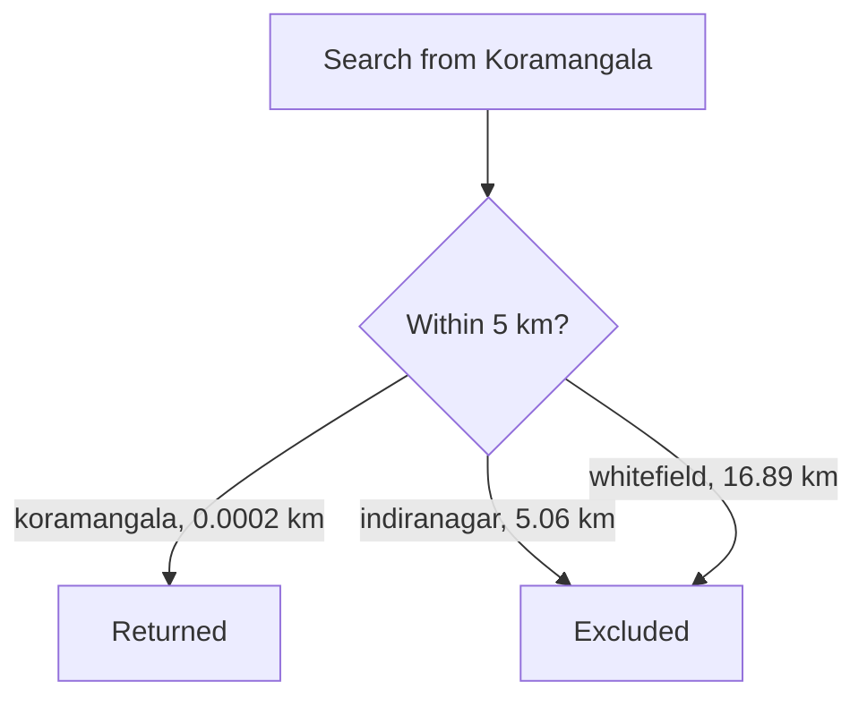
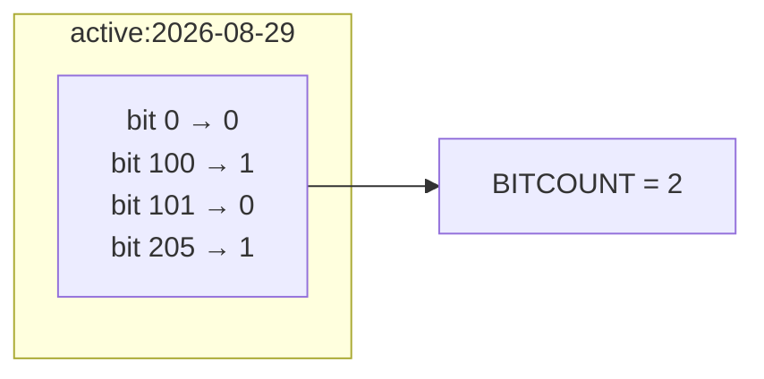
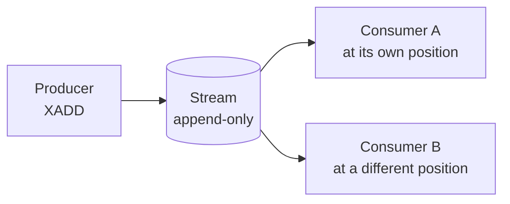
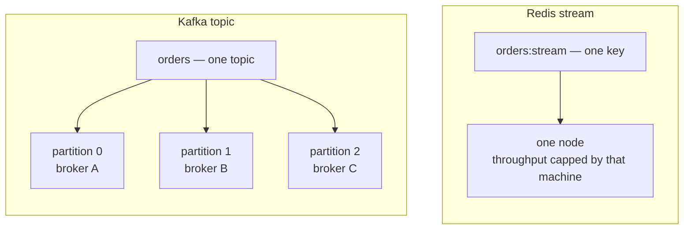

Five structures cover most caching work. Redis ships several more that exist for problems a key-value store has no business solving well, and knowing they are there is what stops you building them by hand.

# Geospatial indexes

> [!important] A **geospatial index** stores named points by longitude and latitude, and answers questions about what is near a given location — the operation behind finding nearby drivers, available bikes or restaurants that deliver.

```text
  127.0.0.1:6379> GEOADD bike:stations 77.5946 12.9716 koramangala 77.6408 12.9784 indiranagar 77.7500 12.9600 whitefield
  (integer) 3
```

> [!warning] **Longitude comes before latitude.** That is the reverse of how coordinates are usually written and spoken, and it is a very easy way to put your data in the wrong hemisphere.



Searching a radius:

```text
  127.0.0.1:6379> GEOSEARCH bike:stations FROMLONLAT 77.5946 12.9716 BYRADIUS 5 km ASC WITHDIST
  1) 1) "koramangala"
     2) "0.0002"

  127.0.0.1:6379> GEOSEARCH bike:stations FROMLONLAT 77.5946 12.9716 BYRADIUS 20 km ASC WITHDIST
  1) 1) "koramangala"
     2) "0.0002"
  2) 1) "indiranagar"
     2) "5.0645"
  3) 1) "whitefield"
     2) "16.8932"
```

Distance between two stored points directly:

```text
  127.0.0.1:6379> GEODIST bike:stations koramangala indiranagar km
  "5.0647"
```

## It is a sorted set

```text
  127.0.0.1:6379> TYPE bike:stations
  zset
```

> [!important] **There is no geospatial type.** Redis encodes each coordinate pair as a single number — a geohash — and stores it as the score in an ordinary sorted set. Points near each other in space get numerically close scores, so a radius search becomes a score-range query on a structure that already exists.

> [!info] Which is worth pausing on as a piece of design. A hard problem was made easy by finding a way to express it in terms of a structure already available, rather than by building a new one.

# Bitmaps

Record which users were active today, across ten million of them. The obvious tool is a set:

```text
  127.0.0.1:6379> SADD active:2026-08-29 100
  127.0.0.1:6379> SADD active:2026-08-29 205
  127.0.0.1:6379> SCARD active:2026-08-29
  (integer) 2
```

That works, and it reads better than what follows. The reason another structure exists is memory.

A set stores each member as a real value with real overhead — the id itself, plus the hash table entry pointing at it. Call it around fifty bytes per member once Redis's internals are counted. Ten million active users is then roughly **500 MB for a single day**, and a year of those is 180 GB held in RAM.

Storing one **bit** per user instead: ten million bits is 10,000,000 divided by 8, or **1.25 MB**. A year is 456 MB.

> [!important] Four hundred times smaller, for exactly the same fact. **That is the entire reason bitmaps exist.**

## What a bitmap is

> [!important] A **bitmap** is not a new type. It is a plain Redis string, with commands that address the individual **bits** inside it by position.

```text
  position:  0  1  2  3  4  5  6  7  8  9  ...
  bit:       0  0  0  0  0  0  0  0  0  0
```

And one convention makes it useful: **the position is the user id.** Bit 100 means user 100, setting it to 1 means that user was active, and leaving it 0 means they were not.

```text
  127.0.0.1:6379> SETBIT active:2026-08-29 100 1
  (integer) 0
  
  127.0.0.1:6379> SETBIT active:2026-08-29 205 1
  (integer) 0
  
  127.0.0.1:6379> GETBIT active:2026-08-29 100
  (integer) 1
  
  127.0.0.1:6379> GETBIT active:2026-08-29 101
  (integer) 0
  
  127.0.0.1:6379> BITCOUNT active:2026-08-29
  (integer) 2
```

> [!warning] The `(integer) 0` from `SETBIT` is not a success code. **It is the bit's previous value.** It was 0 and is now 1. Running the identical command a second time returns 1, because that is the value it overwrote.

`GETBIT` on position 101 returns a definite 0 rather than an error or a nil, even though that position was never touched. Every position not set reads as 0 — which is exactly right here, since not recorded as active and not active are the same statement.

`BITCOUNT` counts the bits set to 1, giving the daily active user total without materialising anything.



## The identifiers have to be dense

> [!warning] The string grows to fit **the highest position set**, not the number of positions set. `SETBIT key 100 1` on a fresh key allocates 13 bytes to reach bit 100, and positions 0 to 99 come along as zeros for free. But `SETBIT key 1000000 1` allocates 125 KB to record one user.

Which makes this a structure for **dense, sequential identifiers.** Auto-increment ids are the case it fits. Random ids or UUIDs are a disaster, because a single user with a high id allocates the entire range beneath them.

## Combining days

What lifts bitmaps above being a counter is that two of them can be combined:

```text
  127.0.0.1:6379> BITOP AND retained active:2026-08-29 active:2026-08-30
  127.0.0.1:6379> BITCOUNT retained
```

Users whose bit is 1 in **both** keys — everyone who came back the next day. `BITOP OR` gives anyone active on either. Redis does this a machine word at a time, so intersecting two ten-million-user days is fast, and the result is itself a bitmap that can be intersected again.

# Vector sets

> [!important] A **vector set** stores high-dimensional numeric vectors — embeddings produced by a machine learning model — and finds the ones most similar to a query vector. It is the retrieval step behind semantic search and recommendations.

```text
  127.0.0.1:6379> VADD emb:products VALUES 3 0.1 0.2 0.3 product:1
  (integer) 1
  
  127.0.0.1:6379> VADD emb:products VALUES 3 0.9 0.8 0.7 product:2
  (integer) 1
  
  127.0.0.1:6379> VCARD emb:products
  (integer) 2
  
  127.0.0.1:6379> VSIM emb:products VALUES 3 0.1 0.2 0.3
  1) "product:1"
  2) "product:2"
```

The `3` is the number of dimensions. `VSIM` returns members ordered by similarity to the supplied vector, nearest first.

> [!info] Three dimensions is a demonstration. Real embeddings run to hundreds or thousands, and the operation is the same.

# JSON

Redis can store and query JSON documents **natively**, addressing individual paths inside them rather than treating the document as an opaque string.

> [!warning] **This needs a build that includes the JSON module.** It is not part of a plain Redis server — on the installation used for these notes, `JSON.SET` returns `ERR unknown command`, while vector sets are available. **Check what your deployment actually has** before designing around it, because the commands either exist or do not depending on how the server was assembled.

# Time series

Redis supports time series data, and this is the one case where it is usually the wrong choice.

> [!warning] **Purpose-built time series databases are substantially better at this** — TimescaleDB, which extends PostgreSQL, among others. They handle compression, retention and time-bucketed aggregation as first-class concerns. Redis supporting time series does not make it the right home for it.

# Streams

An order is placed, and three separate services need to know: one sends the confirmation email, one updates the search index, one recalculates recommendations. Redis is already there, and a list looks like the tool.

```text
  127.0.0.1:6379> LPUSH orders "order:1"
  (integer) 1
```

The email service reads it:

```text
  127.0.0.1:6379> RPOP orders
  "order:1"
```

Then the search service reads:

```text
  127.0.0.1:6379> RPOP orders
  (nil)
```

The order is gone. `RPOP` did not copy the element out, it **removed** it — that is what popping means. The email service did not read the order, it consumed it, and the other two services will never see it.

That is a list working correctly. A list is a queue, and each item goes to exactly one reader, which is right for distributing work across five identical workers. It is wrong when three different services each need the same event.

## Why the obvious workaround rots

Push to three lists instead:

```text
  127.0.0.1:6379> LPUSH orders:email  "order:1"
  127.0.0.1:6379> LPUSH orders:search "order:1"
  127.0.0.1:6379> LPUSH orders:recs   "order:1"
```

It works, and then three things go wrong with it.

**A fourth service wants orders**, so the producer has to be edited and redeployed. The thing that knows about orders now also has to know who is interested in them.

**The producer crashes after the first push.** The email goes out; search and recommendations never hear about the order. Nothing can detect this, because nothing recorded that the order happened — only that three lists were supposed to be written.

**The search service goes down for an hour.** Its list grows, which is fine. But what did it miss, and can it replay from a point? Neither question has an answer, because the only record is a queue that empties as it is read.

> [!important] All three come from one root: **the data has no independent existence.** It exists only as pending items inside queues, so it disappears when read and was never in one place to begin with.

## What a stream changes

> [!important] A **stream** is an append-only log of entries. The event is written **once**, to one place, and it **stays there**. Consumers do not take entries — they read them and remember their own position, so three services, four services, or one added next year all read the same entries without the producer knowing any of them exist.

Which is what reading does not remove actually means. It is not a detail; it is the entire difference from a list.

## Appending to it

```text
  127.0.0.1:6379> XADD orders:stream * orderId 1 status PENDING
  "1787975303196-0"
  
  127.0.0.1:6379> XADD orders:stream * orderId 2 status PAID
  "1787975303202-0"
```

Read that left to right: append to `orders:stream`, generate the id yourself, and here are the fields.

> [!important] **An entry is not a string.** It is field-value pairs, the way a hash is — `orderId 1 status PENDING` is two fields. Which is why the output below is nested: every entry carries its own small map.

The `*` is what asks Redis to generate the id, and the id it returns is the interesting part.

```text
  "1787975303196-0"
   |___________| |_|
    milliseconds  sequence
    since epoch
```

That first number is a real timestamp, and it decodes:

| id | the moment it was appended |
|---|---|
| `1787975303196-0` | 2026-08-29 03:48:23.196 UTC |
| `1787975303202-0` | 2026-08-29 03:48:23.202 UTC |

Six milliseconds apart, which is how long it took to type the second command.

Milliseconds are not fine enough on their own, though. Two orders arriving within the same millisecond would collide, so the second part is a counter that increments inside a millisecond and resets when the clock ticks:

```text
  1787975303196-0     first entry that millisecond
  1787975303196-1     second entry, same millisecond
  1787975303196-2     third
  1787975303202-0     next millisecond, counter back to zero
```

> [!important] Ids are therefore **unique and always increasing**, which buys two things at once. The log is in time order by construction, and **the id doubles as a position** — remember an id and you know exactly where you got to.

## Reading it back

```text
  127.0.0.1:6379> XLEN orders:stream
  (integer) 2
  
  127.0.0.1:6379> XRANGE orders:stream - +
  1) 1) "1787975303196-0"
     2) 1) "orderId"
        2) "1"
        3) "status"
        4) "PENDING"
  2) 1) "1787975303202-0"
     2) 1) "orderId"
        2) "2"
        3) "status"
        4) "PAID"
```

`-` and `+` mean from the very beginning and to the very end, the same idea as `+inf` and `-inf` in a sorted set. So that call returns the whole log.

The reply is hard to read raw, so it is worth decoding once:

```text
  1) 1) "1787975303196-0"      <- entry 1, its id
     2) 1) "orderId"           <- entry 1, its fields as a flat array
        2) "1"
        3) "status"
        4) "PENDING"
  2) 1) "1787975303202-0"      <- entry 2, its id
     2) 1) "orderId"
        2) "2"
        3) "status"
        4) "PAID"
```

Each entry is two things: **the id, then the fields.** The fields arrive flat — field, value, field, value — exactly as `HGETALL` returns them, and the client library reassembles that into a map.

Real ids work in place of `-` and `+`:

```text
  127.0.0.1:6379> XRANGE orders:stream 1787975303202-0 +
```

Everything from the second order onward — a slice starting at a remembered position.



## Reading from a position

The email service starts for the first time. It has read nothing, so it asks for everything:

```text
  127.0.0.1:6379> XREAD COUNT 10 STREAMS orders:stream 0
```

Which reads as: up to ten entries, from `orders:stream`, with an id **greater than 0**. Every id is greater than 0, so that is the whole log, and both orders come back.

The last id it saw was `1787975303202-0`, and **the email service writes that down** — in its own memory, a row in its database, wherever it keeps such things.

A new order arrives:

```text
  127.0.0.1:6379> XADD orders:stream * orderId 3 status SHIPPED
  "1787975400000-0"
```

The email service asks again, from where it stopped:

```text
  127.0.0.1:6379> XREAD COUNT 10 STREAMS orders:stream 1787975303202-0
```

Only order 3 comes back. Orders 1 and 2 are still in the stream; the request simply asked for entries after that id.

Now the search service, which has read nothing at all:

```text
  127.0.0.1:6379> XREAD COUNT 10 STREAMS orders:stream 0
```

All three orders. Nothing the email service did removed or altered anything.

> [!important] **Reading does not consume.** A list hands an element to exactly one `LPOP` and it is gone. Two consumers here hold two positions over one copy of the data, and a third added next year starts from 0 and gets the entire history.

Two ids carry special meanings. `0` is from the beginning. `$` is only entries arriving from now on:

```text
  127.0.0.1:6379> XREAD BLOCK 0 STREAMS orders:stream $
```

`BLOCK 0` waits indefinitely until something appears, which is how a consumer stays idle without hammering Redis in a polling loop. The connection waits, and returns the moment a producer appends.

> [!warning] `STREAMS` comes last and takes **all the keys first, then all the ids** — `XREAD STREAMS orders:stream payments:stream 0 0`, not key, id, key, id.

## Who remembers the position

Look again at where that position lives. **The consumer is tracking it.** Redis is not remembering that the email service reached `1787975303202-0`.

> [!warning] If a consumer restarts having lost its id, it either re-reads from `0` and processes everything a second time, or reads from `$` and silently skips whatever arrived while it was down. **Plain `XREAD` puts that burden entirely on the consumer.**

> [!info] **Consumer groups** are the mechanism that closes this — Redis tracks each group's position on the server, and can report which entries were delivered but never acknowledged. Named here rather than covered, but worth knowing that the `XREAD` above is the manual version of it.

> [!warning] **A stream grows forever.** Nothing removes entries once they have been read, which is the whole point of the structure and also means the key expands without limit. `XADD orders:stream MAXLEN ~ 10000 * orderId 4 ...` caps it at roughly ten thousand entries, dropping the oldest. Without a cap, a busy stream will eventually exhaust the machine's memory.


## How this compares to Kafka

Streams sit next to dedicated stream-processing systems, and two rows of the comparison decide everything.

| | Kafka | Redis streams |
|---|---|---|
| Durability | **Designed for it** | Follows Redis persistence |
| Partitioning | **Built in** | Manual and awkward |
| Scale | **Very large** | Considerably lower |
| Already present | Another system to run | **Already there** |

### Durability

Redis is a memory-first store, so the stream lives in RAM. Persistence is a background snapshot taken periodically, or an append-only file flushed on a schedule — and either way there is **a window between Redis acknowledging the `XADD` and that entry existing on disk.** Kill the machine inside that window and the entry is gone, after Redis told the producer it succeeded.

Kafka inverts that. Writing to disk is the primary path rather than a background chore, and a write is replicated to other brokers before being acknowledged. When Kafka says yes, the entry is on disk on several machines.

> [!important] For a cache, losing entries is an inconvenience — the data is refilled from the database. For an order event, a lost entry is an order nobody ships, **and no record that anything went missing.**

### Partitioning

A Redis stream is one key, and one key lives on one node. The ceiling on a stream's throughput is therefore **one machine**, however large the cluster around it.

Kafka splits a topic into partitions spread across brokers, so throughput grows by adding machines.



Getting that in Redis means sharding by hand — `orders:stream:0`, `:1`, `:2` — and then owning the routing, the rebalancing when a shard is added, and the fact that ordering now holds only within a shard rather than across the whole topic. That is what manual and awkward compresses.

> [!warning] **Redis streams do not replace Kafka.** Using them as a general stream-processing backbone is not something that holds up in production, and the durability guarantee plus built-in partitioning are the reasons Kafka exists.

> [!info] The comparable alternative to Kafka is a managed equivalent such as Amazon Kinesis, offering the same capabilities as a service. Redis streams are not in that category.

## Where they do fit

> [!important] The honest use case is **when data is already going into Redis and something needs to react to it.** Without streams that means running a separate process which reads Redis and writes to Kafka — a process to deploy, monitor and keep alive. With them the write lands in a stream and a consumer picks it up, and an entire distributed log was not stood up for one internal reaction.

> [!important] The test is roughly this. **If losing an entry would be a bug you have to explain to a customer, the answer is Kafka. If losing an entry means a dashboard is briefly stale, a stream is fine.**

Which connects to a mechanism named here and covered properly later:

> [!important] **Change data capture, or CDC, is listening to changes in a datastore as they happen** rather than polling for them. The alternative is database triggers. A CDC pipeline can write changes into a Redis stream for a consumer to process — exactly the already going into Redis shape above.

# The point of the inventory

> [!important] Nobody remembers these command names, and nobody needs to — a search finds `ZRANGEBYSCORE` in seconds. **What cannot be looked up is the existence of a structure you have never heard of.** Not knowing sorted sets exist means building a leaderboard by sorting in the application; not knowing geospatial indexes exist means computing distances row by row.

The commands are reference material. The inventory is the thing worth carrying.
