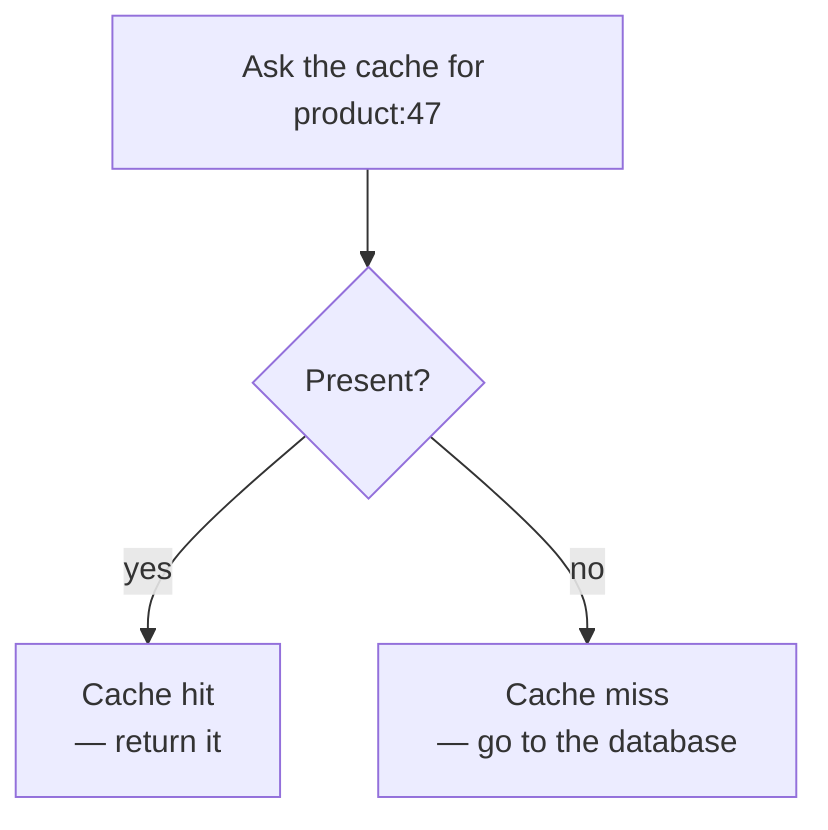
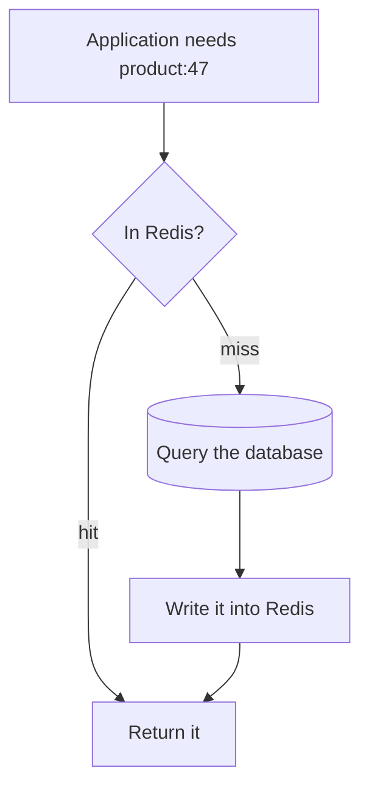
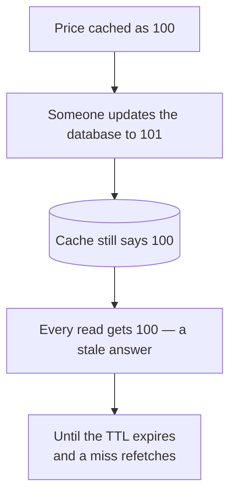
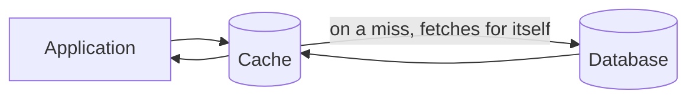

Given data that genuinely suits a cache, something still has to decide when it gets in there. The answers are a small set of named patterns, and the reading ones come first because they are where a cache earns its keep.

# Hit and miss

Two terms that the rest of this depends on.

> [!important] A **cache hit** is asking the cache for a key and finding it there. A **cache miss** is asking and finding nothing.

A miss is not a failure. It is the normal state for data that has not been requested yet, and every pattern below is a different answer to what should happen next.

> [!info] The **hit rate** — hits as a fraction of all lookups — is the number that says whether a cache is working. A cache with a 10% hit rate is adding a network call to 90% of requests to save one on the rest.

# Cache-aside

The most common pattern, and the default unless there is a reason for something else.

Four steps, all in the application:

**Ask the cache.** If it is there, return it and stop.

**On a miss,** query the database.

**Write what came back into the cache**, so the next request for it hits.

**Return the result.**

> [!important] It is also called **lazy loading**, and the name is the mechanism. **Nothing is cached until somebody asks for it.** There is no preloading, no warming, no attempt to guess. Data earns its place by being requested.

## What is good about it

> [!important] **Only requested data occupies memory.** 
> Cache a million products in advance and most of that memory holds things nobody wanted; with cache-aside, **the cache converges on whatever is actually popular** without anyone deciding what that is.

> [!important] **A cache failure is survivable.** If Redis is unreachable, every lookup is a miss, and a miss already has a defined path — go to the database. 
> The system gets slower and keeps working. That property is worth a great deal, and not every pattern has it.

## What is not

> [!warning] **Every piece of data is slow exactly once.** 
> The first request for any key pays the full database latency plus the cache write. On a cold cache after a restart, that is every request at once — and the database receives a burst of traffic precisely when it is least prepared for it.

> [!warning] **The application owns all of it.** 
> Every read path has to implement the check-miss-fetch-store sequence, and every one of them has to do it the same way. Inconsistent key naming or a forgotten store step degrades the hit rate silently.

## The staleness problem

The serious one, and it comes from what cache-aside does **not** say.

> [!important] Cache-aside describes reads. **It says nothing about writes**, so by default a write goes to the database and the cache is not told.

> [!warning] **The cache serves the old value and has no way to know it is wrong.** The database was updated; nothing informed Redis. Reads keep hitting a stale entry until its TTL runs out.

Which makes TTL the safety net rather than merely a cleanup mechanism:

> [!important] **The TTL is the maximum staleness you have agreed to.** 
> A five-minute TTL is a decision that a five-minute-old price is acceptable. That is a business judgement expressed as a configuration value, and it deserves to be made deliberately rather than copied from an example.

---

# Read-through

A variation that moves the same logic somewhere else.

> [!important] In **read-through**, the application only ever talks to the cache. **On a miss, the cache fetches from the database itself**, stores the result and returns it. The application never sees the miss.

| | Cache-aside | Read-through |
|---|---|---|
| Who handles a miss | **The application** | **The cache layer** |
| Application code | Check, fetch, store | **Just read** |
| Cache unreachable | Falls back to the database | **Needs handling** — the only path is broken |
| Control | Full | Whatever the layer offers |

> [!important] The appeal is that the caching logic exists once instead of at every call site. The cost is that **the cache is now on the critical path with no natural fallback**, because the application has no code that talks to the database.

> [!info] Redis does not do this by itself — it has no connection to your database. Read-through comes from a framework layer above it, which is what Spring's caching abstraction provides.

# Choosing

> [!important] **Start with cache-aside.** It is explicit, it degrades gracefully when the cache is unavailable, and its failure modes are visible in code you wrote. Read-through is worth it when the same fetch logic is being repeated across many call sites and a framework can absorb it.

Both leave the same question open, and it is the one that causes real incidents: **when the underlying data changes, what happens to the copy in the cache?**
