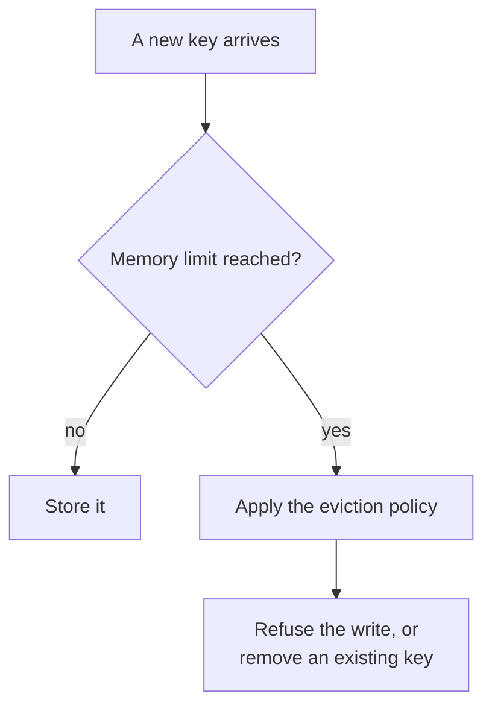
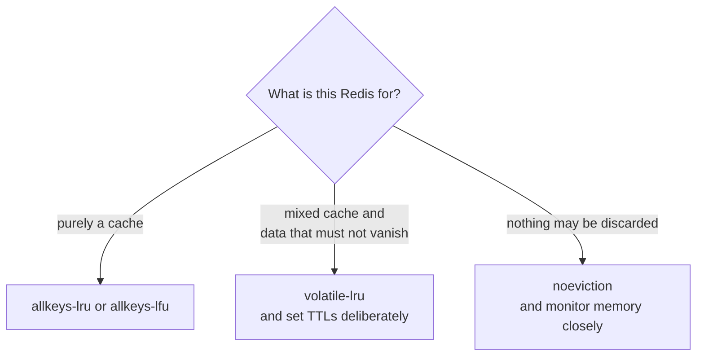

Every pattern so far has assumed the cache has room. It does not, permanently — memory is finite, and something has to decide what happens when it runs out.

# The situation

A TTL removes keys when their time is up. That is a statement about age, not about capacity, and the two are unrelated: a cache can fill up long before anything expires.

> [!important] **Eviction is what a cache does when it is out of memory and asked to store something new.** Either it refuses the write, or it removes something already there.



# Setting the limit

```text
  127.0.0.1:6379> CONFIG GET maxmemory
  1) "maxmemory"
  2) "0"
     
  127.0.0.1:6379> CONFIG GET maxmemory-policy
  3) "maxmemory-policy"
  4) "noeviction"
```

> [!warning] **`maxmemory` of 0 means no limit.** Redis will keep allocating until the operating system stops it, and what happens then is not a policy you chose — it is the kernel killing the process or the machine swapping to disk, which destroys the performance the cache existed to provide. **Set a limit on any Redis holding real data.**

Changing them:

```text
  127.0.0.1:6379> CONFIG SET maxmemory 2gb
  OK
  
  127.0.0.1:6379> CONFIG SET maxmemory-policy allkeys-lru
  OK
```

> [!warning] `CONFIG SET` changes the running server and **does not survive a restart**. The permanent home for both is the configuration file, and setting one without the other is a common way to have a carefully chosen policy vanish on the next deploy.

# The policies

Redis rejects an invalid value with the complete list, which is a convenient way to see all eight:

```
  127.0.0.1:6379> CONFIG SET maxmemory-policy bogus
  
  (error) ERR CONFIG SET failed - argument(s) must be one of the following:
  volatile-lru, volatile-lfu, volatile-random, volatile-ttl,
  allkeys-lru, allkeys-lfu, allkeys-random, noeviction
```

They are built from two independent choices.

## Which keys are candidates

| Prefix | Meaning |
|---|---|
| **`allkeys-`** | Anything in the cache may be evicted |
| **`volatile-`** | **Only keys with a TTL set** may be evicted |

> [!warning] **`volatile-` policies do nothing if no keys have a TTL.** With nothing eligible, Redis behaves as though eviction were disabled and starts refusing writes — a confusing failure, because a policy is configured and appears to be ignored.

## How a victim is chosen

| Suffix | Meaning |
|---|---|
| **`lru`** | **Least recently used** — evict what has gone longest without being touched |
| **`lfu`** | **Least frequently used** — evict what is accessed least often |
| **`random`** | Evict an arbitrary key |
| **`ttl`** | Evict whatever expires soonest — `volatile-` only |

Plus `noeviction`, which is neither: it evicts nothing and **fails writes** once the limit is reached, while continuing to serve reads.

## LRU against LFU

The distinction is age against popularity, and it matters more than it sounds.

> [!important] **LRU asks when was this last used. LFU asks how often is this used.** A key read constantly for months but not in the last minute is a strong LRU eviction candidate and a poor LFU one.

> [!warning] The case that separates them is a **scan** — a batch job or a crawler reading a large number of keys once. Under LRU, that recent access protects every one of them, and they evict the genuinely popular data that the job never touched. **LFU is not fooled**, because reading something once does not make it frequent.

| | Suits |
|---|---|
| **LRU** | Access patterns with real temporal locality — recent things are the popular things |
| **LFU** | A stable set of popular keys, especially where scans or batch jobs occur |

> [!info] LFU costs slightly more to maintain, since it tracks a frequency counter per key that decays over time. On modern Redis the overhead is small enough that it is not usually the deciding factor.

# Choosing



> [!important] **For something that is only a cache, `allkeys-lru` is the sensible default**, moving to `allkeys-lfu` where scans distort the picture. Everything in it can be refetched from the database, so losing any of it costs a miss and nothing more.

> [!important] **`volatile-` policies are for a Redis holding a mixture** — cached values alongside something that must not silently disappear, such as a lock or a session. Giving the disposable things a TTL and leaving the important things without one makes only the former eligible.

> [!warning] **`noeviction` is a decision to fail writes rather than lose data**, and it needs monitoring behind it. A Redis at its limit under `noeviction` starts rejecting every write while reads carry on working, which presents as a very confusing partial outage if nobody is watching the memory figure.

# What eviction means for the patterns

> [!important] Eviction can remove a key at any moment, for reasons unrelated to its TTL and invisible to the application. **Cache-aside handles this perfectly** — an evicted key is a miss, and a miss already has a defined path.

> [!warning] **Write-behind does not.** A write acknowledged by the cache but not yet persisted to the database can be evicted before it gets there, and it is gone. That is the same data-loss risk as before, now reachable through ordinary memory pressure rather than a crash — which is a far more common event.

Which closes the conceptual half of this folder. A cache is fast because it is in memory, and everything that follows — the staleness, the eviction, the refusal to be a source of truth — comes from that same fact. What remains is putting it in an application.
