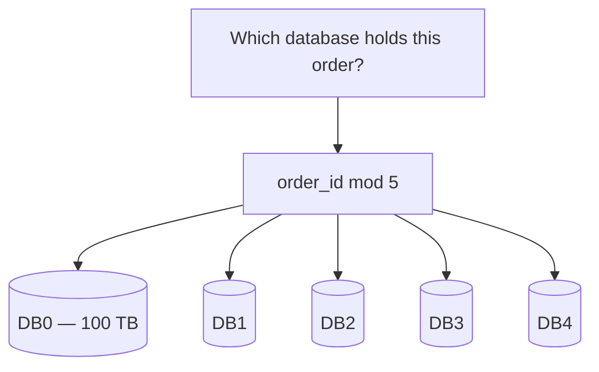
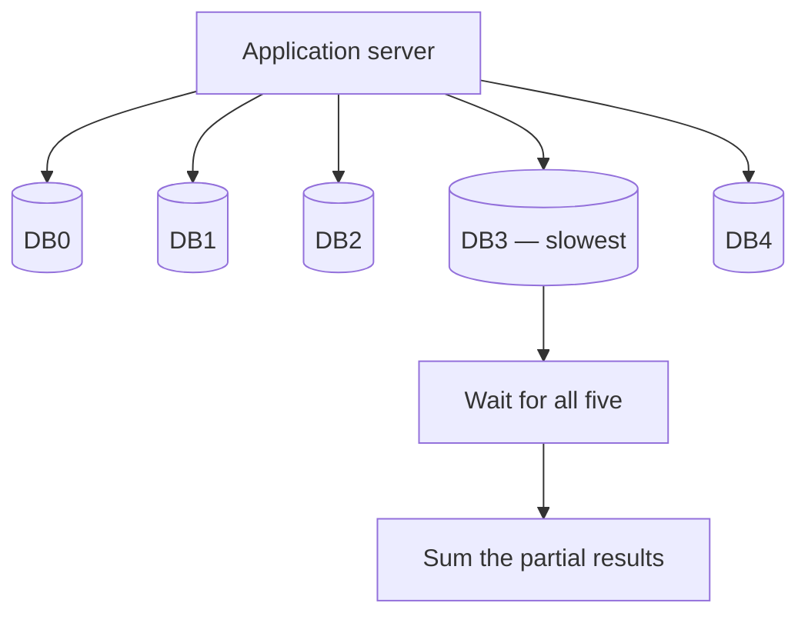
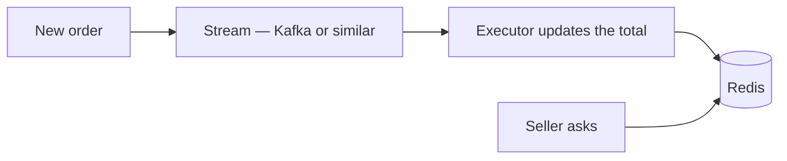
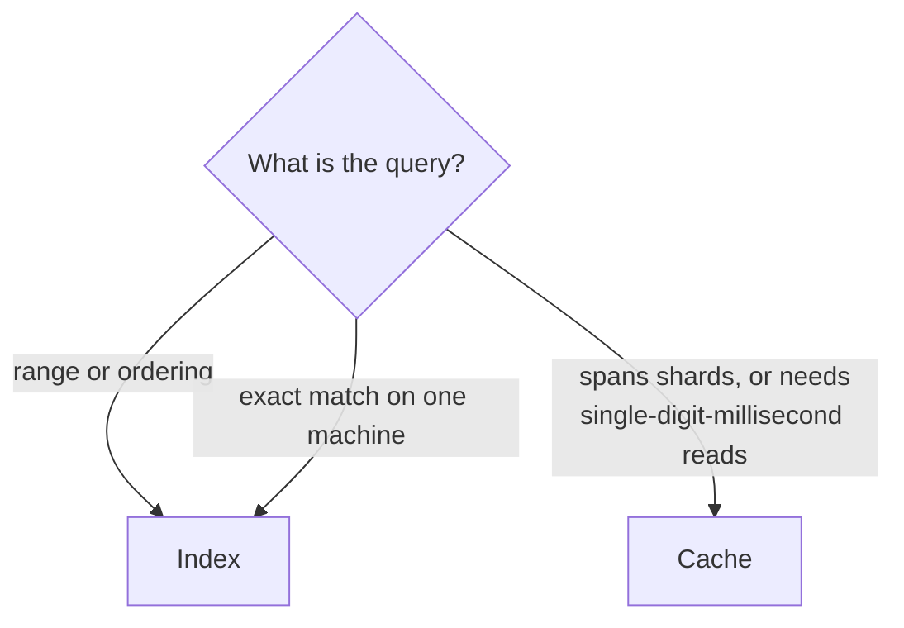

Two techniques now exist for the same complaint. **An index makes a query faster; a cache avoids running it.** They are not interchangeable, and the choice between them is decided by the shape of the query rather than by preference.

# The easy half

> [!important] **A B-tree index wins on ranges and ordering.** `WHERE price BETWEEN x AND y`, `WHERE rating > 4.5`, anything with `ORDER BY` — the index holds values in sorted order, so a range is a walk and a sort is free.

A cache cannot do this. A key-value store answers one key at a time; there is no range over keys, and `07-Sorted-Sets` is the narrow exception that proves it — one number, one ordering, decided in advance.

**Where the data is in one place and the query is a range, the answer is an index.** There is nothing more to decide.

# Where it stops being obvious

The interesting case starts when the data no longer fits on one machine.

## Why data gets split

> [!important] Consider order data accumulating for twenty years — say **500 TB**. Putting that on one disk is a problem before it is a capacity problem: **the index over 500 TB is itself enormous**, searching it is expensive, and every insert has to place a new entry inside it.

> [!info] The library analogy. Ten books, one shelf — adding an eleventh is trivial. A building of full shelves and the same task means finding the floor, the shelf, and then space on it. **Volume changes the cost of every operation, not only reads.**

So the data is divided across machines:



> [!important] A hash function decides placement. `order_id mod 5` yields 0 to 4, and that number is the machine. **Each database holds a fifth of the data and its own indexes over that fifth.**

## When an index still works

Fetch order 4471:

**Compute `4471 mod 5`** to learn which machine. **Query that machine**, where the primary-key index answers immediately.

> [!important] **One machine, one index lookup.** The sharding is invisible because the query includes the value the data was distributed by.

# Where an index cannot help

Now a different question, and it is the one that breaks the pattern.

**Show a seller their total sales so far today, no more than a minute stale.** With 50,000 such sellers querying concurrently.

> [!warning] **Orders were distributed by order id, not by seller.** So one seller's orders for today are scattered across every machine — 10,000 in DB0, 50,000 in DB3, some in each of the others — and nothing about the seller id says where to look.

## The obvious fix is not enough

Add a composite index on `(seller_id, created_at)` to every machine. Now each one can answer its own portion efficiently.



> [!warning] **Every query now hits every machine**, and the response time is the **slowest** of the five — not the average. Add connection failures, retries, and the aggregation step, and a one-minute freshness target is uncomfortable.

> [!warning] And this is read load **added to machines already absorbing the write traffic** of every order being placed. The reads make the writes slower and the writes make the reads slower.

> [!info] This shape — ask everyone, wait for everyone, combine — is called **scatter-gather**. It works, and its cost is bounded below by the worst participant.

## Why not just shard by seller instead

Because the requirement did not exist when the sharding was chosen.

> [!important] The platform started without seller subscriptions. **Nobody re-partitions 500 TB across five machines to serve one new feature** — that is a migration measured in weeks against a product decision measured in days. **The data layout is a constraint you inherit**, and new requirements are met around it.

# What the cache does instead

```text
  key:    seller:1042:2026-08-29
  value:  418750.00
```



> [!important] **One key, one lookup, roughly a millisecond.** No scatter, no gather, no waiting on the slowest machine, and no read load on the databases taking the writes.

Three details make it work:

**The key encodes the question.** Seller and date together — exactly what is being asked, precomputed.

**Writes reach it through a stream.** Each order goes onto a stream, and consumers update the running total. A well-scaled stream handles on the order of a million messages a second, so order volume is not the constraint.

> [!important] **The TTL is 26 hours, and the number is reasoned.** Tier-two sellers already get their daily figures from a nightly batch, so yesterday's cached value is worthless once that batch has run. Twenty-four hours plus two of margin lets the pipeline finish before the entry disappears.

And the capacity works out: 50,000 concurrent sellers against a store comfortably serving 100,000 to 200,000 reads a second.

# The decision

| | Index | Cache |
|---|---|---|
| Range queries, ordering | **Yes** | No |
| Single-key lookup | Yes | **Yes, faster** |
| Query spanning shards | **Scatter-gather** | **One key** |
| Latency floor | ~15 ms | **~1 ms** |
| Freshness | **Always current** | As fresh as the update path |
| Extra infrastructure | None | A cache, and something to fill it |



> [!important] **Two questions decide it.** Can one machine answer this — and is the latency requirement within what an index can deliver? An index bottoms out around 15 ms including the round trip; below that, no index is enough, whatever the data layout.

> [!important] The general principle, which outlives both tools. **An index optimises a query against data laid out for a different purpose. A cache stores the answer to the question you keep asking.** When the layout suits the question, index. When it does not, and re-laying it out is impossible, precompute the answer instead.

> [!info] The same reasoning reaches beyond Redis. Persistent key-value stores — RocksDB and things built on it — occupy the middle ground: slower than in-memory, far faster than a relational scan, and durable by default. Reaching for one to serve as an index over distributed data is an established pattern.
